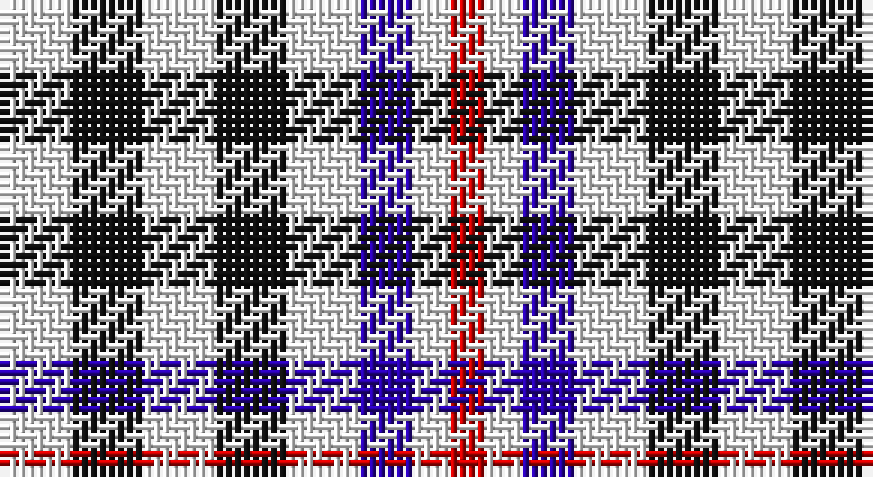

This page is one **sett** — a single exact thread-count. It belongs to the [tartan](/setts/w4k4w4k4w4db3w2r2/)
(the same proportion at any scale), whose colour order is pattern [RWBWKWKW](/stripes/rwbwkwkw/).

Part of the [Scott, Sir Walter](/tartans/scott-sir-walter/) tartan — the named design grouping this sett with its other cloths.

Sourced from tartans-authority.  It is a [8 stripe tartan](/stripes/stripes8/).

Original link http://www.tartansauthority.com/tartan-ferret/display/1240/

## Also known as

This cloth is also recorded under:

- Scott, Sir Walter #2

## Register references

External register numbers recorded for this tartan.

- Scottish Tartans Authority (ITI): 1240

## Thread count
W/8 K8 W8 K8 W8 DB6 W4 R/4

One full sett is **96 threads**.

## Palette

Palette: <strong>Tartan Register</strong> <small style="color:#888">(3 of 4 colours)</small>
<table><thead><tr><th>Colour</th><th>Threads</th><th>Shade</th><th>Base</th><th>OKLCh</th></tr></thead><tbody><tr><td>W/</td><td style="text-align:right;font-variant-numeric:tabular-nums">8</td><td><code style="background-color:#FCFCFC;">#FCFCFC</code> <small style="color:#888">#FCFCFC</small></td><td>W <code style="background-color:#F7F7F7;">#F7F7F7</code></td><td><small style="color:#888">oklch(99.1% 0.000 89.9)</small></td></tr><tr><td>K</td><td style="text-align:right;font-variant-numeric:tabular-nums">8</td><td><code style="background-color:#101010;">#101010</code> <small style="color:#888">#101010</small></td><td>K <code style="background-color:#000000;">#000000</code></td><td><small style="color:#888">oklch(17.3% 0.000 89.9)</small></td></tr><tr><td>W</td><td style="text-align:right;font-variant-numeric:tabular-nums">8</td><td><code style="background-color:#FCFCFC;">#FCFCFC</code> <small style="color:#888">#FCFCFC</small></td><td>W <code style="background-color:#F7F7F7;">#F7F7F7</code></td><td><small style="color:#888">oklch(99.1% 0.000 89.9)</small></td></tr><tr><td>K</td><td style="text-align:right;font-variant-numeric:tabular-nums">8</td><td><code style="background-color:#101010;">#101010</code> <small style="color:#888">#101010</small></td><td>K <code style="background-color:#000000;">#000000</code></td><td><small style="color:#888">oklch(17.3% 0.000 89.9)</small></td></tr><tr><td>W</td><td style="text-align:right;font-variant-numeric:tabular-nums">8</td><td><code style="background-color:#FCFCFC;">#FCFCFC</code> <small style="color:#888">#FCFCFC</small></td><td>W <code style="background-color:#F7F7F7;">#F7F7F7</code></td><td><small style="color:#888">oklch(99.1% 0.000 89.9)</small></td></tr><tr><td>DB</td><td style="text-align:right;font-variant-numeric:tabular-nums">6</td><td><code style="background-color:#2800A8;">#2800A8</code> <small style="color:#888">#2800A8</small></td><td>B <code style="background-color:#2A418A;">#2A418A</code></td><td><small style="color:#888">oklch(34.8% 0.220 274.3)</small></td></tr><tr><td>W</td><td style="text-align:right;font-variant-numeric:tabular-nums">4</td><td><code style="background-color:#FCFCFC;">#FCFCFC</code> <small style="color:#888">#FCFCFC</small></td><td>W <code style="background-color:#F7F7F7;">#F7F7F7</code></td><td><small style="color:#888">oklch(99.1% 0.000 89.9)</small></td></tr><tr><td>R/</td><td style="text-align:right;font-variant-numeric:tabular-nums">4</td><td><code style="background-color:#C80000;">#C80000</code> <small style="color:#888">#C80000</small></td><td>R <code style="background-color:#CC0000;">#CC0000</code></td><td><small style="color:#888">oklch(52.3% 0.215 29.2)</small></td></tr></tbody></table>

# Sample pattern

## Nearest tartans

The nearest existing variants by ΔTartan distance, with this tartan at the top so the swatches line up against it.

ΔTartan

Tartan

Sett

—

<a href="/ttd/edit/#slug=w4k4w4k4w4db3w2r2~x2">Scott, Sir Walter - 1971 (Fashion)</a> <a class="nn-out" href="/variants/s8/w4k4w4k4w4db3w2r2~x2/" title="open its dictionary page">↗</a>

1.01

<a href="/ttd/edit/#slug=k4w4k4w4k4w4db3w2r2&amp;base=w4k4w4k4w4db3w2r2~x2">Scott, Sir Walter #3</a> <a class="nn-out" href="/variants/s9/k4w4k4w4k4w4db3w2r2/" title="open its dictionary page">↗</a>

1.18

<a href="/variants/s14/w4k4w4k4w4db3w2r2~x2/">Scott, Sir Walter #2</a>

1.23

<a href="/ttd/edit/#slug=w2k2w2k2w2k2w1y1g1y1~x8&amp;base=w4k4w4k4w4db3w2r2~x2">Burns Check</a> <a class="nn-out" href="/variants/s10/w2k2w2k2w2k2w1y1g1y1~x8/" title="open its dictionary page">↗</a>

1.33

<a href="/ttd/edit/#slug=w6k6w6k6w6k6w4y3g2y2~x3&amp;base=w4k4w4k4w4db3w2r2~x2">Burns Check (District)</a> <a class="nn-out" href="/variants/s10/w6k6w6k6w6k6w4y3g2y2~x3/" title="open its dictionary page">↗</a>

1.48

<a href="/ttd/edit/#slug=w2k2w2k2w2k2w1dy1g1dy1~x2&amp;base=w4k4w4k4w4db3w2r2~x2">Burns Check Trade Tartan</a> <a class="nn-out" href="/variants/s10/w2k2w2k2w2k2w1dy1g1dy1~x2/" title="open its dictionary page">↗</a>

1.57

<a href="/ttd/edit/#slug=k3w6k4w6lo3~x2&amp;base=w4k4w4k4w4db3w2r2~x2">Daks (House Check)</a> <a class="nn-out" href="/variants/s5/k3w6k4w6lo3~x2/" title="open its dictionary page">↗</a>

1.58

<a href="/ttd/edit/#slug=o1w1o1w2k2w2k2w2k2w2g1w1g1~x4&amp;base=w4k4w4k4w4db3w2r2~x2">Glen Flesk</a> <a class="nn-out" href="/variants/s13/o1w1o1w2k2w2k2w2k2w2g1w1g1~x4/" title="open its dictionary page">↗</a>

1.60

<a href="/ttd/edit/#slug=dg1lb1dg1lb2k2lb2k2lb2k2lb2lo1lb1lo1~x4&amp;base=w4k4w4k4w4db3w2r2~x2">Glen Flesk</a> <a class="nn-out" href="/variants/s13/dg1lb1dg1lb2k2lb2k2lb2k2lb2lo1lb1lo1~x4/" title="open its dictionary page">↗</a>

1.64

<a href="/ttd/edit/#slug=r30w24dg15g15w24r30w24g15dg15w24r30w23~x2&amp;base=w4k4w4k4w4db3w2r2~x2">Unidentified Arisaid #2</a> <a class="nn-out" href="/variants/s12/r30w24dg15g15w24r30w24g15dg15w24r30w23~x2/" title="open its dictionary page">↗</a>

1.70

<a href="/ttd/edit/#slug=w2k2w2k2w2k2w1o1g1o1~x4&amp;base=w4k4w4k4w4db3w2r2~x2">Robert, Burns check</a> <a class="nn-out" href="/variants/s10/w2k2w2k2w2k2w1o1g1o1~x4/" title="open its dictionary page">↗</a>

## Neighbour map

Every grey dot is one of 14360 variants placed by the first two principal components of the ΔTartan feature space (44% of its variance). Red is this tartan; blue dots are its nearest — click one to open its page.

<svg viewBox="0 0 640 380" role="img" style="max-width:100%;height:auto;border:1px solid #e0e0e0;border-radius:4px;display:block" xmlns="http://www.w3.org/2000/svg"><image href="/nn/cloud.v1.png" width="640" height="380"/><a href="/variants/s9/k4w4k4w4k4w4db3w2r2/"><circle cx="62.5" cy="296.1" r="4" fill="#3465a4"><title>Scott, Sir Walter #3</title></circle></a><a href="/variants/s14/w4k4w4k4w4db3w2r2~x2/"><circle cx="64.7" cy="273.2" r="4" fill="#3465a4"><title>Scott, Sir Walter #2</title></circle></a><a href="/variants/s10/w2k2w2k2w2k2w1y1g1y1~x8/"><circle cx="54.9" cy="277.0" r="4" fill="#3465a4"><title>Burns Check</title></circle></a><a href="/variants/s10/w6k6w6k6w6k6w4y3g2y2~x3/"><circle cx="96.6" cy="254.6" r="4" fill="#3465a4"><title>Burns Check (District)</title></circle></a><a href="/variants/s10/w2k2w2k2w2k2w1dy1g1dy1~x2/"><circle cx="60.6" cy="282.5" r="4" fill="#3465a4"><title>Burns Check Trade Tartan</title></circle></a><a href="/variants/s5/k3w6k4w6lo3~x2/"><circle cx="141.8" cy="317.2" r="4" fill="#3465a4"><title>Daks (House Check)</title></circle></a><a href="/variants/s13/o1w1o1w2k2w2k2w2k2w2g1w1g1~x4/"><circle cx="73.9" cy="265.8" r="4" fill="#3465a4"><title>Glen Flesk</title></circle></a><a href="/variants/s13/dg1lb1dg1lb2k2lb2k2lb2k2lb2lo1lb1lo1~x4/"><circle cx="88.6" cy="272.4" r="4" fill="#3465a4"><title>Glen Flesk</title></circle></a><a href="/variants/s12/r30w24dg15g15w24r30w24g15dg15w24r30w23~x2/"><circle cx="55.1" cy="275.8" r="4" fill="#3465a4"><title>Unidentified Arisaid #2</title></circle></a><a href="/variants/s10/w2k2w2k2w2k2w1o1g1o1~x4/"><circle cx="56.2" cy="282.7" r="4" fill="#3465a4"><title>Robert, Burns check</title></circle></a><circle cx="83.2" cy="291.3" r="5" fill="#c00000"/></svg>

ID: /variants/s8/w4k4w4k4w4db3w2r2~x2/
