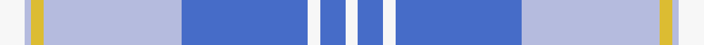
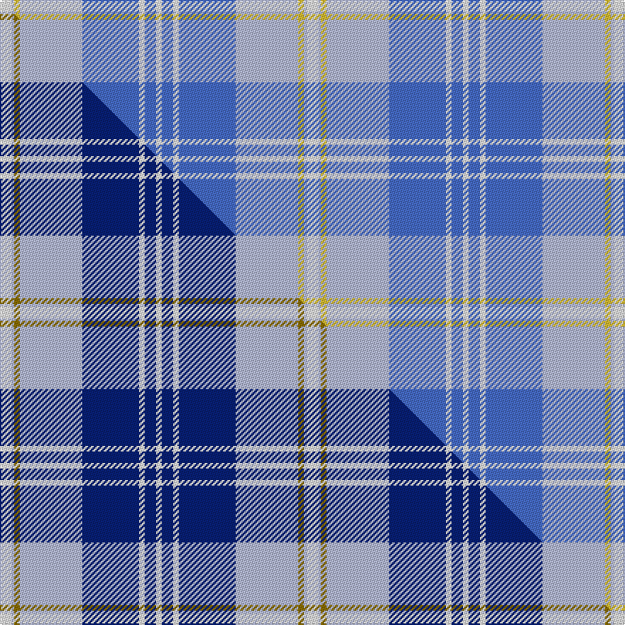

This page is one **sett** — a single exact thread-count. It belongs to the [tartan](/setts/w4lb1ly2lb22b20w2b4w2/)
(the same proportion at any scale), whose colour order is pattern [WBWBWYWW](/stripes/wbwbwyww/).

Part of the [Gorman](/tartans/gorman/) tartan — the named design grouping this sett with its other cloths.

Sourced from tartans-authority.  It is a [8 stripe tartan](/stripes/stripes8/).

Original link http://www.tartansauthority.com/tartan-ferret/display/10390/

## Register references

External register numbers recorded for this tartan.

- Scottish Register of Tartans: [10390](https://www.tartanregister.gov.uk/tartanDetails?ref=10390)
- Scottish Tartans Authority (ITI): 10390

## Thread count
W/8 LB2 LY4 LB44 B40 W4 B8 W/4

One full sett is **216 threads**.

## Palette
<table><thead><tr><th>Colour</th><th>Shade</th><th>OKLCh</th></tr></thead><tbody><tr><td>LB</td><td><code style="background-color:#B5BBDE;">#B5BBDE</code> <small style="color:#888">#B5BBDE</small></td><td><small style="color:#888">oklch(79.9% 0.050 277.6)</small></td></tr><tr><td>B</td><td><code style="background-color:#466CC8;">#466CC8</code> <small style="color:#888">#466CC8</small></td><td><small style="color:#888">oklch(55.1% 0.149 265.0)</small></td></tr><tr><td>LY</td><td><code style="background-color:#DCBC32;">#DCBC32</code> <small style="color:#888">#DCBC32</small></td><td><small style="color:#888">oklch(80.0% 0.150 95.2)</small></td></tr><tr><td>W</td><td><code style="background-color:#F7F7F7;">#F7F7F7</code> <small style="color:#888">#F7F7F7</small></td><td><small style="color:#888">oklch(97.6% 0.000 89.9)</small></td></tr></tbody></table>

# Sample pattern

## Compared to the master

This cloth is one sett of its design; the master sett (the exemplar the design is anchored on) is below for comparison.

Its **ΔTartan distance** from the master is **2.54** — the same measure the nearest-tartans table ranks by (0 is identical; a re-scale of the same cloth is near 0, a recolour or a different proportion further).

<figure class="master-compare" style="margin:0">

this sett
master sett ★

<figcaption style="color:#888;font-size:smaller">One weave of this sett against the <a href="/setts/w4lb1y2lb22db20w2db4w2/">master sett ★</a>, split on the diagonal: a shared proportion runs seamlessly across it with only the shades shifting; a different proportion breaks on it.</figcaption>
</figure>

## Nearest tartan variants

The nearest existing variants by ΔTartan distance, with this cloth at the top so the swatches line up against it.

ΔTartan

Threads

Variant

Sett

—

216

<a href="/variants/s8/w4lb1ly2lb22b20w2b4w2~x2/">Gorman Blue (Personal)</a>

<a href="/ttd/edit/#slug=w4lb1y2lb22db20w2db4w2~x2&amp;base=w4lb1ly2lb22b20w2b4w2~x2" title="compare in the TTD">0.00</a>

216

<a href="/variants/s8/w4lb1y2lb22db20w2db4w2~x2/">Gorman Blue (Personal)</a>

<a href="/ttd/edit/#slug=db7w3db2w6db16lb26dr4~x2&amp;base=w4lb1ly2lb22b20w2b4w2~x2" title="compare in the TTD">2.15</a>

234

<a href="/variants/s7/db7w3db2w6db16lb26dr4~x2/">Keela (Corporate)</a>

<a href="/ttd/edit/#slug=lb20lo2n5lb4db2n2db2n2dg1~x2&amp;base=w4lb1ly2lb22b20w2b4w2~x2" title="compare in the TTD">2.59</a>

118

<a href="/variants/s9/lb20lo2n5lb4db2n2db2n2dg1~x2/">Boucherville Dress</a>

<a href="/ttd/edit/#slug=db6lb2db2lb3db16t26dr2~x2&amp;base=w4lb1ly2lb22b20w2b4w2~x2" title="compare in the TTD">2.77</a>

212

<a href="/variants/s7/db6lb2db2lb3db16t26dr2~x2/">Federal Bureau of Investigation</a>

<a href="/ttd/edit/#slug=db30t2w2t2db4ti10w25db4~x2~t2405244-ti2503227&amp;base=w4lb1ly2lb22b20w2b4w2~x2" title="compare in the TTD">2.89</a>

248

<a href="/variants/s8/db30t2w2t2db4ti10w25db4~x2~t2405244-ti2503227/">Eildon/Longniddry Blue Dress Fashion Tartan</a>

## Neighbour map

Every grey dot is one of 13620 variants placed by the first two principal components of the ΔTartan feature space (42% of its variance). Red is this tartan; blue dots are its nearest — click one to open its page.

<svg viewBox="0 0 640 380" role="img" style="max-width:100%;height:auto;border:1px solid #e0e0e0;border-radius:4px;display:block" xmlns="http://www.w3.org/2000/svg"><image href="/nn/cloud.v1.png" width="640" height="380"/><a href="/variants/s8/w4lb1y2lb22db20w2db4w2~x2/"><circle cx="282.0" cy="166.6" r="4" fill="#3465a4"><title>Gorman Blue (Personal)</title></circle></a><a href="/variants/s7/db7w3db2w6db16lb26dr4~x2/"><circle cx="257.4" cy="217.7" r="4" fill="#3465a4"><title>Keela (Corporate)</title></circle></a><a href="/variants/s9/lb20lo2n5lb4db2n2db2n2dg1~x2/"><circle cx="378.4" cy="149.5" r="4" fill="#3465a4"><title>Boucherville Dress</title></circle></a><a href="/variants/s7/db6lb2db2lb3db16t26dr2~x2/"><circle cx="357.9" cy="225.8" r="4" fill="#3465a4"><title>Federal Bureau of Investigation</title></circle></a><a href="/variants/s8/db30t2w2t2db4ti10w25db4~x2~t2405244-ti2503227/"><circle cx="290.6" cy="190.7" r="4" fill="#3465a4"><title>Eildon/Longniddry Blue Dress Fashion Tartan</title></circle></a><circle cx="374.4" cy="205.7" r="5" fill="#c00000"/><text x="320" y="376" text-anchor="middle" font-size="11" fill="#999">ground</text><text x="11" y="190" text-anchor="middle" font-size="11" fill="#999" transform="rotate(-90 11 190)">complexity</text></svg>

ID: /variants/s8/w4lb1ly2lb22b20w2b4w2~x2/
