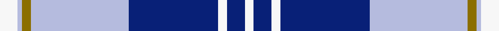

This page is one **sett** — a single exact thread-count. It belongs to the [tartan](/setts/w4lb1y2lb22db20w2db4w2/)
(the same proportion at any scale), whose colour order is pattern [WBWBWGWW](/stripes/wbwbwgww/).

Part of the [Gorman](/tartans/gorman/) tartan — the named design grouping this sett with its other cloths.

Sourced from register-of-tartans.  It is a [8 stripe tartan](/stripes/stripes8/).

Original link https://www.tartanregister.gov.uk/tartanDetails.aspx?ref=10390

## Register references

External register numbers recorded for this tartan.

- Scottish Register of Tartans: [10390](https://www.tartanregister.gov.uk/tartanDetails.aspx?ref=10390)

## Thread count
W/8 LB2 Y4 LB44 DB40 W4 DB8 W/4

One full sett is **216 threads**.

## Palette
<table><thead><tr><th>Colour</th><th>Shade</th><th>OKLCh</th></tr></thead><tbody><tr><td>DB</td><td><code style="background-color:#082077;">#082077</code> <small style="color:#888">#082077</small></td><td><small style="color:#888">oklch(30.0% 0.149 265.1)</small></td></tr><tr><td>LB</td><td><code style="background-color:#B5BBDE;">#B5BBDE</code> <small style="color:#888">#B5BBDE</small></td><td><small style="color:#888">oklch(79.9% 0.050 277.6)</small></td></tr><tr><td>Y</td><td><code style="background-color:#8B6E00;">#8B6E00</code> <small style="color:#888">#8B6E00</small></td><td><small style="color:#888">oklch(55.1% 0.113 90.4)</small></td></tr><tr><td>W</td><td><code style="background-color:#F7F7F7;">#F7F7F7</code> <small style="color:#888">#F7F7F7</small></td><td><small style="color:#888">oklch(97.6% 0.000 89.9)</small></td></tr></tbody></table>

# Sample pattern

## Nearest tartan variants

The nearest existing variants by ΔTartan distance, with this cloth at the top so the swatches line up against it.

ΔTartan

Threads

Variant

Sett

—

216

<a href="/variants/s8/w4lb1y2lb22db20w2db4w2~x2/">Gorman Blue (Personal)</a>

<a href="/ttd/edit/#slug=w9db3y3db24dbi24y2dbi2y2~x2~db1106275-dbi1404245&amp;base=w4lb1y2lb22db20w2db4w2~x2" title="compare in the TTD">1.07</a>

254

<a href="/variants/s8/w9db3y3db24dbi24y2dbi2y2~x2~db1106275-dbi1404245/">Halesowen #2</a>

<a href="/ttd/edit/#slug=w9t3y3t24db24y2db2y2~x2&amp;base=w4lb1y2lb22db20w2db4w2~x2" title="compare in the TTD">1.10</a>

254

<a href="/variants/s8/w9t3y3t24db24y2db2y2~x2/">Halesowen (District)</a>

<a href="/ttd/edit/#slug=w8db4y2db36lb48db2lb4r5~x2&amp;base=w4lb1y2lb22db20w2db4w2~x2" title="compare in the TTD">1.95</a>

410

<a href="/variants/s8/w8db4y2db36lb48db2lb4r5~x2/">MacRaes of America</a>

<a href="/ttd/edit/#slug=db7w3db2w6db16lb26dr4~x2&amp;base=w4lb1y2lb22db20w2db4w2~x2" title="compare in the TTD">2.15</a>

234

<a href="/variants/s7/db7w3db2w6db16lb26dr4~x2/">Keela (Corporate)</a>

<a href="/ttd/edit/#slug=g5db15lb11w2lb1w1dg4~x4&amp;base=w4lb1y2lb22db20w2db4w2~x2" title="compare in the TTD">2.42</a>

276

<a href="/variants/s7/g5db15lb11w2lb1w1dg4~x4/">Highlands Country Club</a>

<a href="/ttd/edit/#slug=y2w21db16lb8db30w8db1~x2&amp;base=w4lb1y2lb22db20w2db4w2~x2" title="compare in the TTD">2.53</a>

338

<a href="/variants/s7/y2w21db16lb8db30w8db1~x2/">Muir, John</a>

<a href="/ttd/edit/#slug=t20dr1w3db1w2db8g3w1~x4&amp;base=w4lb1y2lb22db20w2db4w2~x2" title="compare in the TTD">2.60</a>

228

<a href="/variants/s8/t20dr1w3db1w2db8g3w1~x4/">Kruenaegel and Schropp (Name)</a>

<a href="/ttd/edit/#slug=db20dr1w3dt1w2dt8g3w1~x4~db1804259-dt1302222&amp;base=w4lb1y2lb22db20w2db4w2~x2" title="compare in the TTD">2.60</a>

228

<a href="/variants/s8/db20dr1w3dt1w2dt8g3w1~x4~db1804259-dt1302222/">Kruenaegel and Schropp</a>

2.63

—

<a href="/variants/s5/db3dbi2lb31db34w2~x2~db1204274-dbi1406275/">Gilt Edge (Corporate)</a>

<a href="/ttd/edit/#slug=db4dpi2dp3db24lb24w3~x2~dpi1607327-dp1105325&amp;base=w4lb1y2lb22db20w2db4w2~x2" title="compare in the TTD">2.72</a>

226

<a href="/variants/s6/db4dpi2dp3db24lb24w3~x2~dpi1607327-dp1105325/">Aberdeen Academy of Performing Art</a>

## Neighbour map

Every grey dot is one of 13620 variants placed by the first two principal components of the ΔTartan feature space (42% of its variance). Red is this tartan; blue dots are its nearest — click one to open its page.

<svg viewBox="0 0 640 380" role="img" style="max-width:100%;height:auto;border:1px solid #e0e0e0;border-radius:4px;display:block" xmlns="http://www.w3.org/2000/svg"><image href="/nn/cloud.v1.png" width="640" height="380"/><a href="/variants/s8/w9db3y3db24dbi24y2dbi2y2~x2~db1106275-dbi1404245/"><circle cx="249.1" cy="195.0" r="4" fill="#3465a4"><title>Halesowen #2</title></circle></a><a href="/variants/s8/w9t3y3t24db24y2db2y2~x2/"><circle cx="248.9" cy="199.1" r="4" fill="#3465a4"><title>Halesowen (District)</title></circle></a><a href="/variants/s8/w8db4y2db36lb48db2lb4r5~x2/"><circle cx="281.8" cy="129.6" r="4" fill="#3465a4"><title>MacRaes of America</title></circle></a><a href="/variants/s7/db7w3db2w6db16lb26dr4~x2/"><circle cx="257.4" cy="217.7" r="4" fill="#3465a4"><title>Keela (Corporate)</title></circle></a><a href="/variants/s7/g5db15lb11w2lb1w1dg4~x4/"><circle cx="195.4" cy="186.3" r="4" fill="#3465a4"><title>Highlands Country Club</title></circle></a><a href="/variants/s7/y2w21db16lb8db30w8db1~x2/"><circle cx="314.6" cy="175.3" r="4" fill="#3465a4"><title>Muir, John</title></circle></a><a href="/variants/s8/t20dr1w3db1w2db8g3w1~x4/"><circle cx="305.5" cy="156.0" r="4" fill="#3465a4"><title>Kruenaegel and Schropp (Name)</title></circle></a><a href="/variants/s8/db20dr1w3dt1w2dt8g3w1~x4~db1804259-dt1302222/"><circle cx="314.6" cy="156.3" r="4" fill="#3465a4"><title>Kruenaegel and Schropp</title></circle></a><a href="/variants/s5/db3dbi2lb31db34w2~x2~db1204274-dbi1406275/"><circle cx="359.0" cy="208.2" r="4" fill="#3465a4"><title>Gilt Edge (Corporate)</title></circle></a><a href="/variants/s6/db4dpi2dp3db24lb24w3~x2~dpi1607327-dp1105325/"><circle cx="286.1" cy="203.8" r="4" fill="#3465a4"><title>Aberdeen Academy of Performing Art</title></circle></a><circle cx="282.0" cy="166.6" r="5" fill="#c00000"/><text x="320" y="376" text-anchor="middle" font-size="11" fill="#999">ground</text><text x="11" y="190" text-anchor="middle" font-size="11" fill="#999" transform="rotate(-90 11 190)">complexity</text></svg>

ID: /variants/s8/w4lb1y2lb22db20w2db4w2~x2/
