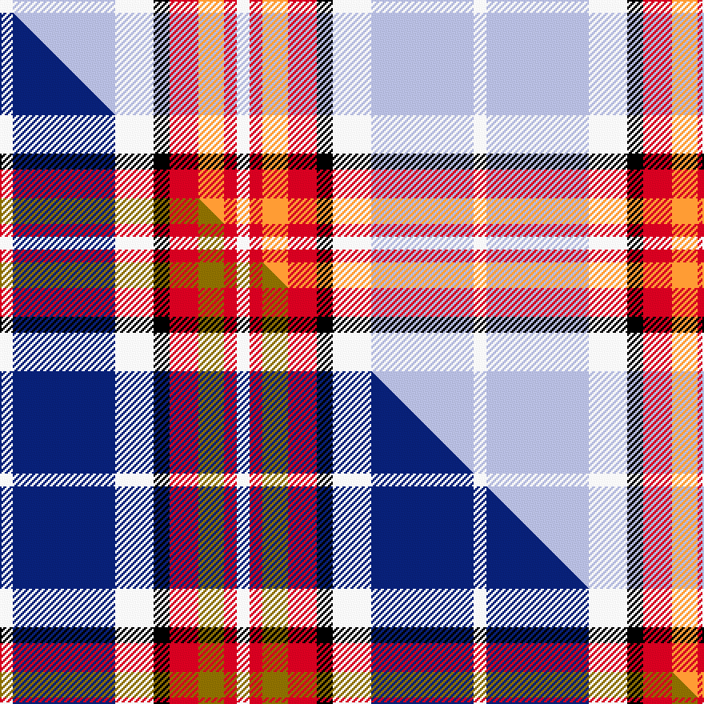

This is one **variant** — a specific cloth: this exact thread count and colourway, with its own
provenance below. It is one weaving of the [sett](/tartans/b/br/brunnbauer/) (the scale-free proportion — the
same cloth at any scale or shade), whose colour order is pattern [WRYRKWWW](/stripes/wryrkwww/).

Part of the [Brunnbauer](/tartans/b/br/brunnbauer/) tartan — the named design grouping this sett with its other cloths.

Sourced from tartans-authority.  It is a [8 stripe tartan](/stripes/stripes8/).

Original link <code>http://www.tartansauthority.com/tartan-ferret/display/11253/</code> — retired · [Internet Archive copy](https://web.archive.org/web/*/http://www.tartansauthority.com/tartan-ferret/display/11253/*)

Dataset <small>— provenance for this record, inherited from the source manifest</small>

<dl class="dataset-prov">
<dt>source</dt><dd><a href="/sources/tartans-authority/">Scottish Tartans Authority</a></dd>
<dt>data captured from</dt><dd><a href="https://github.com/thetartan/tartan-database/blob/master/data/tartans-authority/data.csv">https://github.com/thetartan/tartan-database/blob/master/data/tartans-authority/data.csv</a></dd>
<dt>data date</dt><dd>2015 <small>(this record)</small></dd>
<dt>licence</dt><dd><a href="https://creativecommons.org/licenses/by-nc-nd/4.0/">CC BY-NC-ND 4.0</a></dd>
</dl>

Capture chain <small>— the hands this data passed through, oldest first; each capture carries its own licence</small>

<ol class="capture-chain">
<li><a href="https://www.tartansauthority.com/">Scottish Tartans Authority</a> <small>the heritage body’s archive — its tartan-ferret record browser is retired; dead record links are shown unlinked, with an Internet Archive copy (ITI numbers are not SRT references)</small></li>
<li><a href="https://github.com/thetartan/tartan-database">thetartan/tartan-database</a> <small>2016-2017</small> · <a href="https://creativecommons.org/licenses/by-nc-nd/4.0/">CC BY-NC-ND 4.0</a> <small>Levko Kravets's frozen compilation — the capture we vendored, and where its CC licence text came from</small></li>
<li>this dictionary <small>captured 2026-06-10 · commit 5bf86c7566</small> <small>each re-capture is a git commit to data/sources</small></li>
</ol>

## Register references

External register numbers recorded for this tartan.

- Scottish Register of Tartans: [11253](https://www.tartanregister.gov.uk/tartanDetails?ref=11253)
- Scottish Tartans Authority (ITI): 11253

## Thread count
W/8 LB64 W24 K10 R18 LO16 R8 W/8

One full sett is **296 threads**.

## Palette
<table><thead><tr><th>Colour</th><th>Shade</th><th>OKLCh</th></tr></thead><tbody><tr><td>LB</td><td><code style="background-color:#B5BBDE;">#B5BBDE</code> <small style="color:#888">#B5BBDE</small></td><td><small style="color:#888">oklch(79.9% 0.050 277.6)</small></td></tr><tr><td>LO</td><td><code style="background-color:#FF9C34;">#FF9C34</code> <small style="color:#888">#FF9C34</small></td><td><small style="color:#888">oklch(77.9% 0.161 61.8)</small></td></tr><tr><td>K</td><td><code style="background-color:#000000;">#000000</code> <small style="color:#888">#000000</small></td><td><small style="color:#888">oklch(0.0% 0.000 0.0)</small></td></tr><tr><td>R</td><td><code style="background-color:#D60020;">#D60020</code> <small style="color:#888">#D60020</small></td><td><small style="color:#888">oklch(55.2% 0.224 25.5)</small></td></tr><tr><td>W</td><td><code style="background-color:#F7F7F7;">#F7F7F7</code> <small style="color:#888">#F7F7F7</small></td><td><small style="color:#888">oklch(97.6% 0.000 89.9)</small></td></tr></tbody></table>

# Sample pattern

## Compared to the master

This cloth is one sett of its design; the master sett (the exemplar the design is anchored on) is below for comparison.

Its **ΔTartan distance** from the master is **0.46** — the same measure the nearest-tartans table ranks by (0 is identical; a re-scale of the same cloth is near 0, a recolour or a different proportion further).

<figure class="master-compare" style="margin:0">

this sett
master sett ★

<figcaption style="color:#888;font-size:smaller">One weave of this sett against the <a href="/setts/w4db32w12k5r9y8r4w4/">master sett ★</a>, split on the diagonal: a shared proportion runs seamlessly across it with only the shades shifting; a different proportion breaks on it.</figcaption>
</figure>

## Nearest tartan variants

The nearest existing variants by ΔTartan distance, with this cloth at the top so the swatches line up against it.

ΔTartan

Threads

Variant

Sett

—

296

<a href="/variants/s8/w4lb32w12k5r9lo8r4w4~x2/">Brunnbauer (2015)</a>

<a href="/ttd/edit/#slug=w4db32w12k5r9y8r4w4~x2&amp;base=w4lb32w12k5r9lo8r4w4~x2" title="compare in the TTD">0.46</a>

296

<a href="/variants/s8/w4db32w12k5r9y8r4w4~x2/">Brunnbauer (2015)</a>

<a href="/ttd/edit/#slug=w5g3r3g3r3lb20r16w21k3~x2&amp;base=w4lb32w12k5r9lo8r4w4~x2" title="compare in the TTD">2.16</a>

292

<a href="/variants/s9/w5g3r3g3r3lb20r16w21k3~x2/">Oliver Dress, Pink (Dance?)</a>

<a href="/ttd/edit/#slug=k2lb10r5w2db2w2r2~x6&amp;base=w4lb32w12k5r9lo8r4w4~x2" title="compare in the TTD">2.83</a>

276

<a href="/variants/s7/k2lb10r5w2db2w2r2~x6/">U.S. Postal Service (Corporate)</a>

<a href="/ttd/edit/#slug=ly6k2r12dg4r8k10w24lb2w3lb2~x2&amp;base=w4lb32w12k5r9lo8r4w4~x2" title="compare in the TTD">3.06</a>

276

<a href="/variants/s10/ly6k2r12dg4r8k10w24lb2w3lb2~x2/">Gillies Red Dress</a>

<a href="/ttd/edit/#slug=y6k2r15g5r8k12w24lb2w4lb2~x2&amp;base=w4lb32w12k5r9lo8r4w4~x2" title="compare in the TTD">3.18</a>

304

<a href="/variants/s10/y6k2r15g5r8k12w24lb2w4lb2~x2/">Gillies Dress Red Clan Tartan</a>

<a href="/ttd/edit/#slug=k4lb28r6w12r12w3~x2&amp;base=w4lb32w12k5r9lo8r4w4~x2" title="compare in the TTD">3.18</a>

246

<a href="/variants/s6/k4lb28r6w12r12w3~x2/">Thompson, D.C. (Personal)</a>

<a href="/ttd/edit/#slug=r6n2r2n23k2r4k2lb21r2lb2w6~x2&amp;base=w4lb32w12k5r9lo8r4w4~x2" title="compare in the TTD">3.31</a>

264

<a href="/variants/s11/r6n2r2n23k2r4k2lb21r2lb2w6~x2/">IRPA (Corporate)</a>

<a href="/ttd/edit/#slug=lb8w28ly3g3lb8k9lb4~x2&amp;base=w4lb32w12k5r9lo8r4w4~x2" title="compare in the TTD">3.38</a>

228

<a href="/variants/s7/lb8w28ly3g3lb8k9lb4~x2/">MacTavish of Dunardry Dress</a>

<a href="/ttd/edit/#slug=r34w3dg4g23w24k3dg4~x2&amp;base=w4lb32w12k5r9lo8r4w4~x2" title="compare in the TTD">3.41</a>

304

<a href="/variants/s7/r34w3dg4g23w24k3dg4~x2/">MacLachlan Dress Clan Tartan</a>

<a href="/ttd/edit/#slug=r5w2lb20dy2k16w18k2w5~x2&amp;base=w4lb32w12k5r9lo8r4w4~x2" title="compare in the TTD">3.49</a>

260

<a href="/variants/s8/r5w2lb20dy2k16w18k2w5~x2/">Ailsa Craig (District)</a>

## Neighbour map

Every grey dot is one of 13656 variants placed by the first two principal components of the ΔTartan feature space (42% of its variance). Red is this tartan; blue dots are its nearest — click one to open its page. The map is a flat projection of a many-dimensional space — [how to read it](/posts/neighbourhood-maps/).

<svg viewBox="0 0 640 380" role="img" style="max-width:100%;height:auto;border:1px solid #e0e0e0;border-radius:4px;display:block" xmlns="http://www.w3.org/2000/svg"><image href="/nn/cloud.v1.png" width="640" height="380"/><a href="/variants/s8/w4db32w12k5r9y8r4w4~x2/"><circle cx="124.7" cy="161.9" r="4" fill="#3465a4"><title>Brunnbauer (2015)</title></circle></a><a href="/variants/s9/w5g3r3g3r3lb20r16w21k3~x2/"><circle cx="128.7" cy="182.3" r="4" fill="#3465a4"><title>Oliver Dress, Pink (Dance?)</title></circle></a><a href="/variants/s7/k2lb10r5w2db2w2r2~x6/"><circle cx="116.6" cy="197.2" r="4" fill="#3465a4"><title>U.S. Postal Service (Corporate)</title></circle></a><a href="/variants/s10/ly6k2r12dg4r8k10w24lb2w3lb2~x2/"><circle cx="89.9" cy="123.9" r="4" fill="#3465a4"><title>Gillies Red Dress</title></circle></a><a href="/variants/s10/y6k2r15g5r8k12w24lb2w4lb2~x2/"><circle cx="80.4" cy="128.4" r="4" fill="#3465a4"><title>Gillies Dress Red Clan Tartan</title></circle></a><a href="/variants/s6/k4lb28r6w12r12w3~x2/"><circle cx="201.5" cy="205.9" r="4" fill="#3465a4"><title>Thompson, D.C. (Personal)</title></circle></a><a href="/variants/s11/r6n2r2n23k2r4k2lb21r2lb2w6~x2/"><circle cx="153.5" cy="131.5" r="4" fill="#3465a4"><title>IRPA (Corporate)</title></circle></a><a href="/variants/s7/lb8w28ly3g3lb8k9lb4~x2/"><circle cx="170.7" cy="176.5" r="4" fill="#3465a4"><title>MacTavish of Dunardry Dress</title></circle></a><a href="/variants/s7/r34w3dg4g23w24k3dg4~x2/"><circle cx="136.1" cy="162.6" r="4" fill="#3465a4"><title>MacLachlan Dress Clan Tartan</title></circle></a><a href="/variants/s8/r5w2lb20dy2k16w18k2w5~x2/"><circle cx="107.7" cy="163.5" r="4" fill="#3465a4"><title>Ailsa Craig (District)</title></circle></a><circle cx="152.3" cy="172.1" r="5" fill="#c00000"/><text x="320" y="376" text-anchor="middle" font-size="11" fill="#999">ground</text><text x="11" y="190" text-anchor="middle" font-size="11" fill="#999" transform="rotate(-90 11 190)">complexity</text></svg>

ID: /variants/s8/w4lb32w12k5r9lo8r4w4~x2/
