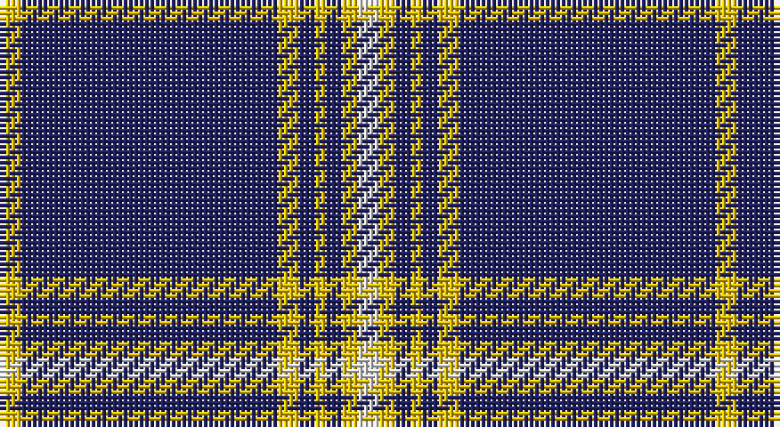

This page is one **sett** — a single exact thread-count. It belongs to the [tartan](/setts/w4ly3db3ly2db3ly4db48ly4/)
(the same proportion at any scale), whose colour order is pattern [WYBYBYBY](/stripes/wybybyby/).

Sourced from register-of-tartans.  It is a [8 stripe tartan](/stripes/stripes8/).

Original link https://www.tartanregister.gov.uk/tartanDetails.aspx?ref=3018

## Register references

External register numbers recorded for this tartan.

- Scottish Register of Tartans: [3018](https://www.tartanregister.gov.uk/tartanDetails.aspx?ref=3018)
- Scottish Tartans Authority (ITI): 5749

## Thread count
Y/4 DB48 Y4 DB3 Y2 DB3 Y3 LN/4

One full sett is **134 threads**.

## Palette

Palette: <strong>Tartan Register</strong>
<table><thead><tr><th>Colour</th><th>Threads</th><th>Shade</th><th>Base</th><th>OKLCh</th></tr></thead><tbody><tr><td>Y/</td><td style="text-align:right;font-variant-numeric:tabular-nums">4</td><td><code style="background-color:#E8C000;">#E8C000</code> <small style="color:#888">#E8C000</small></td><td>Y <code style="background-color:#F2BF00;">#F2BF00</code></td><td><small style="color:#888">oklch(81.9% 0.168 93.7)</small></td></tr><tr><td>DB</td><td style="text-align:right;font-variant-numeric:tabular-nums">48</td><td><code style="background-color:#202060;">#202060</code> <small style="color:#888">#202060</small></td><td>B <code style="background-color:#2A418A;">#2A418A</code></td><td><small style="color:#888">oklch(28.9% 0.111 276.9)</small></td></tr><tr><td>Y</td><td style="text-align:right;font-variant-numeric:tabular-nums">4</td><td><code style="background-color:#E8C000;">#E8C000</code> <small style="color:#888">#E8C000</small></td><td>Y <code style="background-color:#F2BF00;">#F2BF00</code></td><td><small style="color:#888">oklch(81.9% 0.168 93.7)</small></td></tr><tr><td>DB</td><td style="text-align:right;font-variant-numeric:tabular-nums">3</td><td><code style="background-color:#202060;">#202060</code> <small style="color:#888">#202060</small></td><td>B <code style="background-color:#2A418A;">#2A418A</code></td><td><small style="color:#888">oklch(28.9% 0.111 276.9)</small></td></tr><tr><td>Y</td><td style="text-align:right;font-variant-numeric:tabular-nums">2</td><td><code style="background-color:#E8C000;">#E8C000</code> <small style="color:#888">#E8C000</small></td><td>Y <code style="background-color:#F2BF00;">#F2BF00</code></td><td><small style="color:#888">oklch(81.9% 0.168 93.7)</small></td></tr><tr><td>DB</td><td style="text-align:right;font-variant-numeric:tabular-nums">3</td><td><code style="background-color:#202060;">#202060</code> <small style="color:#888">#202060</small></td><td>B <code style="background-color:#2A418A;">#2A418A</code></td><td><small style="color:#888">oklch(28.9% 0.111 276.9)</small></td></tr><tr><td>Y</td><td style="text-align:right;font-variant-numeric:tabular-nums">3</td><td><code style="background-color:#E8C000;">#E8C000</code> <small style="color:#888">#E8C000</small></td><td>Y <code style="background-color:#F2BF00;">#F2BF00</code></td><td><small style="color:#888">oklch(81.9% 0.168 93.7)</small></td></tr><tr><td>LN/</td><td style="text-align:right;font-variant-numeric:tabular-nums">4</td><td><code style="background-color:#E0E0E0;">#E0E0E0</code> <small style="color:#888">#E0E0E0</small></td><td>W <code style="background-color:#F7F7F7;">#F7F7F7</code></td><td><small style="color:#888">oklch(90.7% 0.000 89.9)</small></td></tr></tbody></table>

# Sample pattern

## Nearest tartans

The nearest existing variants by ΔTartan distance, with this tartan at the top so the swatches line up against it.

ΔTartan

Tartan

Sett

—

<a href="/ttd/edit/#slug=w4ly3db3ly2db3ly4db48ly4">Morris of Wales</a> <a class="nn-out" href="/variants/s8/w4ly3db3ly2db3ly4db48ly4/" title="open its dictionary page">↗</a>

0.36

<a href="/ttd/edit/#slug=w6ly3db3ly2db3ly4db48ly4&amp;base=w4ly3db3ly2db3ly4db48ly4">Morris Welsh Name Tartan</a> <a class="nn-out" href="/variants/s8/w6ly3db3ly2db3ly4db48ly4/" title="open its dictionary page">↗</a>

1.09

<a href="/ttd/edit/#slug=db62w2db4w5db6ly2r8ly3w4~x2&amp;base=w4ly3db3ly2db3ly4db48ly4">George, Stuart (Personal)</a> <a class="nn-out" href="/variants/s9/db62w2db4w5db6ly2r8ly3w4~x2/" title="open its dictionary page">↗</a>

1.11

<a href="/ttd/edit/#slug=db62w2db4w5db6lo2r8lo3w4~x2&amp;base=w4ly3db3ly2db3ly4db48ly4">George, Stuart (Personal)</a> <a class="nn-out" href="/variants/s9/db62w2db4w5db6lo2r8lo3w4~x2/" title="open its dictionary page">↗</a>

1.30

<a href="/ttd/edit/#slug=w6r13dt80w4dt2w4&amp;base=w4ly3db3ly2db3ly4db48ly4">Montrose Football Club</a> <a class="nn-out" href="/variants/s6/w6r13dt80w4dt2w4/" title="open its dictionary page">↗</a>

1.37

<a href="/ttd/edit/#slug=db96ly11db8ly11db16ly6w4ly16w8&amp;base=w4ly3db3ly2db3ly4db48ly4">University of North Carolina at Greensboro, The</a> <a class="nn-out" href="/variants/s9/db96ly11db8ly11db16ly6w4ly16w8/" title="open its dictionary page">↗</a>

1.40

<a href="/ttd/edit/#slug=db6w4db3w6db8lo3db52lo3db8r4&amp;base=w4ly3db3ly2db3ly4db48ly4">Dundee F.C. Corporate Tartan</a> <a class="nn-out" href="/variants/s10/db6w4db3w6db8lo3db52lo3db8r4/" title="open its dictionary page">↗</a>

1.46

<a href="/ttd/edit/#slug=db43ly5db1ly4db1ly2db7w1db2~x2&amp;base=w4ly3db3ly2db3ly4db48ly4">University of Delaware (Corporate)</a> <a class="nn-out" href="/variants/s9/db43ly5db1ly4db1ly2db7w1db2~x2/" title="open its dictionary page">↗</a>

1.48

<a href="/ttd/edit/#slug=b7db5w6db5r7db2b2db70w2&amp;base=w4ly3db3ly2db3ly4db48ly4">United States (Corporate)</a> <a class="nn-out" href="/variants/s9/b7db5w6db5r7db2b2db70w2/" title="open its dictionary page">↗</a>

1.50

<a href="/ttd/edit/#slug=db63lo3w3db8lo3db3w3db3r14db9lo3~x2&amp;base=w4ly3db3ly2db3ly4db48ly4">Ottawa Fire Service (Corporate)</a> <a class="nn-out" href="/variants/s11/db63lo3w3db8lo3db3w3db3r14db9lo3~x2/" title="open its dictionary page">↗</a>

1.51

<a href="/variants/s7/db16wi4db1wi2db24w1lo4~x2/">Talisker</a>

## Neighbour map

Every grey dot is one of 14360 variants placed by the first two principal components of the ΔTartan feature space (44% of its variance). Red is this tartan; blue dots are its nearest — click one to open its page.

<svg viewBox="0 0 640 380" role="img" style="max-width:100%;height:auto;border:1px solid #e0e0e0;border-radius:4px;display:block" xmlns="http://www.w3.org/2000/svg"><image href="/nn/cloud.v1.png" width="640" height="380"/><a href="/variants/s8/w6ly3db3ly2db3ly4db48ly4/"><circle cx="479.4" cy="132.6" r="4" fill="#3465a4"><title>Morris Welsh Name Tartan</title></circle></a><a href="/variants/s9/db62w2db4w5db6ly2r8ly3w4~x2/"><circle cx="481.5" cy="101.2" r="4" fill="#3465a4"><title>George, Stuart (Personal)</title></circle></a><a href="/variants/s9/db62w2db4w5db6lo2r8lo3w4~x2/"><circle cx="483.1" cy="102.7" r="4" fill="#3465a4"><title>George, Stuart (Personal)</title></circle></a><a href="/variants/s6/w6r13dt80w4dt2w4/"><circle cx="523.0" cy="137.3" r="4" fill="#3465a4"><title>Montrose Football Club</title></circle></a><a href="/variants/s9/db96ly11db8ly11db16ly6w4ly16w8/"><circle cx="424.4" cy="130.2" r="4" fill="#3465a4"><title>University of North Carolina at Greensboro, The</title></circle></a><a href="/variants/s10/db6w4db3w6db8lo3db52lo3db8r4/"><circle cx="496.3" cy="136.4" r="4" fill="#3465a4"><title>Dundee F.C. Corporate Tartan</title></circle></a><a href="/variants/s9/db43ly5db1ly4db1ly2db7w1db2~x2/"><circle cx="579.9" cy="110.7" r="4" fill="#3465a4"><title>University of Delaware (Corporate)</title></circle></a><a href="/variants/s9/b7db5w6db5r7db2b2db70w2/"><circle cx="524.5" cy="107.9" r="4" fill="#3465a4"><title>United States (Corporate)</title></circle></a><a href="/variants/s11/db63lo3w3db8lo3db3w3db3r14db9lo3~x2/"><circle cx="481.7" cy="119.6" r="4" fill="#3465a4"><title>Ottawa Fire Service (Corporate)</title></circle></a><a href="/variants/s7/db16wi4db1wi2db24w1lo4~x2/"><circle cx="481.3" cy="155.7" r="4" fill="#3465a4"><title>Talisker</title></circle></a><circle cx="501.9" cy="133.3" r="5" fill="#c00000"/></svg>

ID: /variants/s8/w4ly3db3ly2db3ly4db48ly4/
