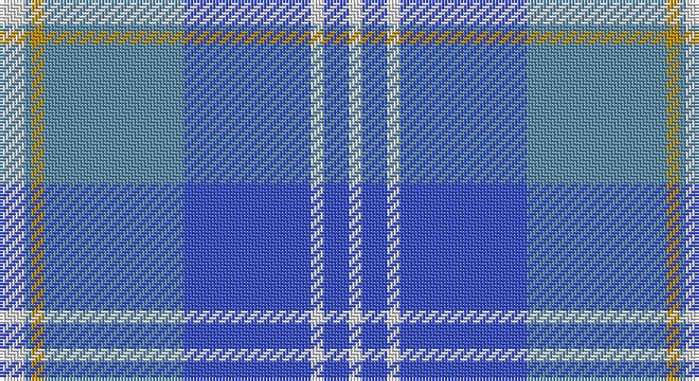

This page is one **sett** — a single exact thread-count. It belongs to the [tartan](/setts/w4t1lo2t22b20w2b4w2/)
(the same proportion at any scale), whose colour order is pattern [WBWBBYBW](/stripes/wbwbbybw/).

Part of the [Gorman](/tartans/gorman/) tartan — the named design grouping this sett with its other cloths.

Sourced from tartans-authority.  It is a [8 stripe tartan](/stripes/stripes8/).

Original link http://www.tartansauthority.com/tartan-ferret/display/10390/

## Also known as

This cloth is also recorded under:

- Gorman Blue
- Gorman Family

## Register references

External register numbers recorded for this tartan.

- Scottish Register of Tartans: [10390](https://www.tartanregister.gov.uk/tartanDetails?ref=10390)
- Scottish Tartans Authority (ITI): 10390

## Thread count
LN/8 B2 DY4 B44 Ba40 LN4 Ba8 LN/4

One full sett is **216 threads**.

## Palette

Palette: <strong>Tartan Register</strong>
<table><thead><tr><th>Colour</th><th>Threads</th><th>Shade</th><th>Base</th><th>OKLCh</th></tr></thead><tbody><tr><td>LN/</td><td style="text-align:right;font-variant-numeric:tabular-nums">8</td><td><code style="background-color:#E0E0E0;">#E0E0E0</code> <small style="color:#888">#E0E0E0</small></td><td>W <code style="background-color:#F7F7F7;">#F7F7F7</code></td><td><small style="color:#888">oklch(90.7% 0.000 89.9)</small></td></tr><tr><td>B</td><td style="text-align:right;font-variant-numeric:tabular-nums">2</td><td><code style="background-color:#5C8CA8;">#5C8CA8</code> <small style="color:#888">#5C8CA8</small></td><td>B <code style="background-color:#2A418A;">#2A418A</code></td><td><small style="color:#888">oklch(61.7% 0.067 235.0)</small></td></tr><tr><td>DY</td><td style="text-align:right;font-variant-numeric:tabular-nums">4</td><td><code style="background-color:#BC8C00;">#BC8C00</code> <small style="color:#888">#BC8C00</small></td><td>Y <code style="background-color:#F2BF00;">#F2BF00</code></td><td><small style="color:#888">oklch(66.8% 0.137 84.1)</small></td></tr><tr><td>B</td><td style="text-align:right;font-variant-numeric:tabular-nums">44</td><td><code style="background-color:#5C8CA8;">#5C8CA8</code> <small style="color:#888">#5C8CA8</small></td><td>B <code style="background-color:#2A418A;">#2A418A</code></td><td><small style="color:#888">oklch(61.7% 0.067 235.0)</small></td></tr><tr><td>Ba</td><td style="text-align:right;font-variant-numeric:tabular-nums">40</td><td><code style="background-color:#3850C8;">#3850C8</code> <small style="color:#888">#3850C8</small></td><td>B <code style="background-color:#2A418A;">#2A418A</code></td><td><small style="color:#888">oklch(48.8% 0.188 269.4)</small></td></tr><tr><td>LN</td><td style="text-align:right;font-variant-numeric:tabular-nums">4</td><td><code style="background-color:#E0E0E0;">#E0E0E0</code> <small style="color:#888">#E0E0E0</small></td><td>W <code style="background-color:#F7F7F7;">#F7F7F7</code></td><td><small style="color:#888">oklch(90.7% 0.000 89.9)</small></td></tr><tr><td>Ba</td><td style="text-align:right;font-variant-numeric:tabular-nums">8</td><td><code style="background-color:#3850C8;">#3850C8</code> <small style="color:#888">#3850C8</small></td><td>B <code style="background-color:#2A418A;">#2A418A</code></td><td><small style="color:#888">oklch(48.8% 0.188 269.4)</small></td></tr><tr><td>LN/</td><td style="text-align:right;font-variant-numeric:tabular-nums">4</td><td><code style="background-color:#E0E0E0;">#E0E0E0</code> <small style="color:#888">#E0E0E0</small></td><td>W <code style="background-color:#F7F7F7;">#F7F7F7</code></td><td><small style="color:#888">oklch(90.7% 0.000 89.9)</small></td></tr></tbody></table>

# Sample pattern

## Compared to the master

This cloth is one sett of its design; the master sett (the exemplar the design is anchored on) is below for comparison.

<figure style="margin:0"><figcaption style="color:#888;font-size:smaller">this sett</figcaption></figure>
<figure style="margin:0"><figcaption style="color:#888;font-size:smaller"><a href="/setts/w4n1ly2n22dt20w2dt4w2/">master sett →</a></figcaption></figure>

## Nearest tartans

The nearest existing variants by ΔTartan distance, with this tartan at the top so the swatches line up against it.

ΔTartan

Tartan

Sett

—

<a href="/ttd/edit/#slug=w4t1lo2t22b20w2b4w2~x2">Gorman Blue (Personal)</a> <a class="nn-out" href="/variants/s8/w4t1lo2t22b20w2b4w2~x2/" title="open its dictionary page">↗</a>

1.28

<a href="/ttd/edit/#slug=bi3b2bi30b1w18lb14b2lb3~x2&amp;base=w4t1lo2t22b20w2b4w2~x2">Bannockbane Blue #3</a> <a class="nn-out" href="/variants/s8/bi3b2bi30b1w18lb14b2lb3~x2/" title="open its dictionary page">↗</a>

1.33

<a href="/ttd/edit/#slug=t14w1t3ly2t3w1t4db24r3~x2&amp;base=w4t1lo2t22b20w2b4w2~x2">Musselburgh</a> <a class="nn-out" href="/variants/s9/t14w1t3ly2t3w1t4db24r3~x2/" title="open its dictionary page">↗</a>

1.36

<a href="/ttd/edit/#slug=db6w2db2w2db4w6db28b4db4b45r4&amp;base=w4t1lo2t22b20w2b4w2~x2">Edinburgh '86</a> <a class="nn-out" href="/variants/s11/db6w2db2w2db4w6db28b4db4b45r4/" title="open its dictionary page">↗</a>

1.43

<a href="/ttd/edit/#slug=dt10w3dt3w3dt5w8dt38t8dt8t61r6&amp;base=w4t1lo2t22b20w2b4w2~x2">Caleys Windsor (Corporate)</a> <a class="nn-out" href="/variants/s11/dt10w3dt3w3dt5w8dt38t8dt8t61r6/" title="open its dictionary page">↗</a>

1.48

<a href="/ttd/edit/#slug=db10b6lb6w4lb3b6db20b46db2lb2~x2&amp;base=w4t1lo2t22b20w2b4w2~x2">Saltire (Fashion)</a> <a class="nn-out" href="/variants/s10/db10b6lb6w4lb3b6db20b46db2lb2~x2/" title="open its dictionary page">↗</a>

1.59

<a href="/ttd/edit/#slug=db3w1db1w1db2w3db15t2db2t22r2~x2&amp;base=w4t1lo2t22b20w2b4w2~x2">Commonwealth Games 1986 (Corp)</a> <a class="nn-out" href="/variants/s11/db3w1db1w1db2w3db15t2db2t22r2~x2/" title="open its dictionary page">↗</a>

1.61

<a href="/ttd/edit/#slug=db2b2db15b1w10b15db2b2~x2&amp;base=w4t1lo2t22b20w2b4w2~x2">Bannockbane</a> <a class="nn-out" href="/variants/s8/db2b2db15b1w10b15db2b2~x2/" title="open its dictionary page">↗</a>

1.64

<a href="/ttd/edit/#slug=o37lo2r6lo2o8db49o3~x2&amp;base=w4t1lo2t22b20w2b4w2~x2">U.S. Merchant Marine Academy (Corpo</a> <a class="nn-out" href="/variants/s7/o37lo2r6lo2o8db49o3~x2/" title="open its dictionary page">↗</a>

1.71

<a href="/ttd/edit/#slug=w3t38db38w1ti3w1r2~x2&amp;base=w4t1lo2t22b20w2b4w2~x2">Bousie (Personal)</a> <a class="nn-out" href="/variants/s7/w3t38db38w1ti3w1r2~x2/" title="open its dictionary page">↗</a>

1.72

<a href="/ttd/edit/#slug=g5b14bi10w2bi1w1g4~x4&amp;base=w4t1lo2t22b20w2b4w2~x2">Earl of St. Andrews (Fashion)</a> <a class="nn-out" href="/variants/s7/g5b14bi10w2bi1w1g4~x4/" title="open its dictionary page">↗</a>

## Neighbour map

Every grey dot is one of 14360 variants placed by the first two principal components of the ΔTartan feature space (44% of its variance). Red is this tartan; blue dots are its nearest — click one to open its page.

<svg viewBox="0 0 640 380" role="img" style="max-width:100%;height:auto;border:1px solid #e0e0e0;border-radius:4px;display:block" xmlns="http://www.w3.org/2000/svg"><image href="/nn/cloud.v1.png" width="640" height="380"/><a href="/variants/s8/bi3b2bi30b1w18lb14b2lb3~x2/"><circle cx="276.6" cy="135.2" r="4" fill="#3465a4"><title>Bannockbane Blue #3</title></circle></a><a href="/variants/s9/t14w1t3ly2t3w1t4db24r3~x2/"><circle cx="311.2" cy="140.8" r="4" fill="#3465a4"><title>Musselburgh</title></circle></a><a href="/variants/s11/db6w2db2w2db4w6db28b4db4b45r4/"><circle cx="305.1" cy="128.3" r="4" fill="#3465a4"><title>Edinburgh '86</title></circle></a><a href="/variants/s11/dt10w3dt3w3dt5w8dt38t8dt8t61r6/"><circle cx="297.3" cy="140.5" r="4" fill="#3465a4"><title>Caleys Windsor (Corporate)</title></circle></a><a href="/variants/s10/db10b6lb6w4lb3b6db20b46db2lb2~x2/"><circle cx="355.8" cy="150.9" r="4" fill="#3465a4"><title>Saltire (Fashion)</title></circle></a><a href="/variants/s11/db3w1db1w1db2w3db15t2db2t22r2~x2/"><circle cx="292.6" cy="125.3" r="4" fill="#3465a4"><title>Commonwealth Games 1986 (Corp)</title></circle></a><a href="/variants/s8/db2b2db15b1w10b15db2b2~x2/"><circle cx="260.2" cy="186.2" r="4" fill="#3465a4"><title>Bannockbane</title></circle></a><a href="/variants/s7/o37lo2r6lo2o8db49o3~x2/"><circle cx="346.0" cy="162.2" r="4" fill="#3465a4"><title>U.S. Merchant Marine Academy (Corpo</title></circle></a><a href="/variants/s7/w3t38db38w1ti3w1r2~x2/"><circle cx="319.2" cy="119.9" r="4" fill="#3465a4"><title>Bousie (Personal)</title></circle></a><a href="/variants/s7/g5b14bi10w2bi1w1g4~x4/"><circle cx="211.3" cy="200.2" r="4" fill="#3465a4"><title>Earl of St. Andrews (Fashion)</title></circle></a><circle cx="297.7" cy="161.6" r="5" fill="#c00000"/></svg>

ID: /variants/s8/w4t1lo2t22b20w2b4w2~x2/
