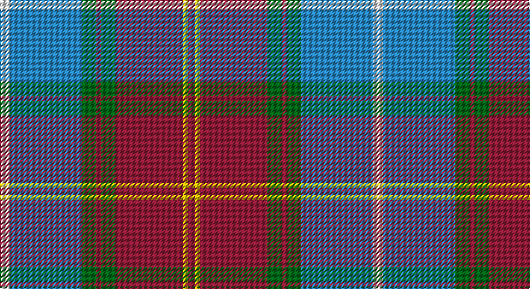

This page is one **sett** — a single exact thread-count. It belongs to the [tartan](/setts/w4t30g6r2g6r28ly2r3/)
(the same proportion at any scale), whose colour order is pattern [RYRGRGBW](/stripes/ryrgrgbw/).

Sourced from house-of-tartan.  It is a [8 stripe tartan](/stripes/stripes8/).

Original link http://www.house-of-tartan.scotland.net/house/TartanViewjs.asp?colr=Def&tnam=2514

## Provenance

Earliest known date: 1999 Strathmore Woollen Mills Millenium tartan designed by Arthur Mackie of Strathmore Woollen Co., Forfar

## Thread count
LN/8 B60 G12 DR4 G12 DR56 Y4 DR/6

One full sett is **310 threads**.

## Palette

Palette: <strong>Tartan Register</strong>
<table><thead><tr><th>Colour</th><th>Threads</th><th>Shade</th><th>Base</th><th>OKLCh</th></tr></thead><tbody><tr><td>LN/</td><td style="text-align:right;font-variant-numeric:tabular-nums">8</td><td><code style="background-color:#E0E0E0;">#E0E0E0</code> <small style="color:#888">#E0E0E0</small></td><td>W <code style="background-color:#F7F7F7;">#F7F7F7</code></td><td><small style="color:#888">oklch(90.7% 0.000 89.9)</small></td></tr><tr><td>B</td><td style="text-align:right;font-variant-numeric:tabular-nums">60</td><td><code style="background-color:#2888C4;">#2888C4</code> <small style="color:#888">#2888C4</small></td><td>B <code style="background-color:#2A418A;">#2A418A</code></td><td><small style="color:#888">oklch(60.1% 0.125 241.5)</small></td></tr><tr><td>G</td><td style="text-align:right;font-variant-numeric:tabular-nums">12</td><td><code style="background-color:#006818;">#006818</code> <small style="color:#888">#006818</small></td><td>G <code style="background-color:#006100;">#006100</code></td><td><small style="color:#888">oklch(45.0% 0.142 145.0)</small></td></tr><tr><td>DR</td><td style="text-align:right;font-variant-numeric:tabular-nums">4</td><td><code style="background-color:#901C38;">#901C38</code> <small style="color:#888">#901C38</small></td><td>R <code style="background-color:#CC0000;">#CC0000</code></td><td><small style="color:#888">oklch(43.2% 0.150 13.1)</small></td></tr><tr><td>G</td><td style="text-align:right;font-variant-numeric:tabular-nums">12</td><td><code style="background-color:#006818;">#006818</code> <small style="color:#888">#006818</small></td><td>G <code style="background-color:#006100;">#006100</code></td><td><small style="color:#888">oklch(45.0% 0.142 145.0)</small></td></tr><tr><td>DR</td><td style="text-align:right;font-variant-numeric:tabular-nums">56</td><td><code style="background-color:#901C38;">#901C38</code> <small style="color:#888">#901C38</small></td><td>R <code style="background-color:#CC0000;">#CC0000</code></td><td><small style="color:#888">oklch(43.2% 0.150 13.1)</small></td></tr><tr><td>Y</td><td style="text-align:right;font-variant-numeric:tabular-nums">4</td><td><code style="background-color:#E8C000;">#E8C000</code> <small style="color:#888">#E8C000</small></td><td>Y <code style="background-color:#F2BF00;">#F2BF00</code></td><td><small style="color:#888">oklch(81.9% 0.168 93.7)</small></td></tr><tr><td>DR/</td><td style="text-align:right;font-variant-numeric:tabular-nums">6</td><td><code style="background-color:#901C38;">#901C38</code> <small style="color:#888">#901C38</small></td><td>R <code style="background-color:#CC0000;">#CC0000</code></td><td><small style="color:#888">oklch(43.2% 0.150 13.1)</small></td></tr></tbody></table>

# Sample pattern

## Nearest tartans

The nearest existing variants by ΔTartan distance, with this tartan at the top so the swatches line up against it.

ΔTartan

Tartan

Sett

—

<a href="/ttd/edit/#slug=w4t30g6r2g6r28ly2r3~x2">Scotland 2000 Commemorative Tartan</a> <a class="nn-out" href="/variants/s8/w4t30g6r2g6r28ly2r3~x2/" title="open its dictionary page">↗</a>

0.94

<a href="/ttd/edit/#slug=o38k4w4k4n10k4n10k4w2dp3~x2&amp;base=w4t30g6r2g6r28ly2r3~x2">Penman Grey (Personal)</a> <a class="nn-out" href="/variants/s10/o38k4w4k4n10k4n10k4w2dp3~x2/" title="open its dictionary page">↗</a>

1.08

<a href="/ttd/edit/#slug=db30ly3dy11ly3o33r6~x2&amp;base=w4t30g6r2g6r28ly2r3~x2">Balfour Family Tartan</a> <a class="nn-out" href="/variants/s6/db30ly3dy11ly3o33r6~x2/" title="open its dictionary page">↗</a>

1.13

<a href="/ttd/edit/#slug=m5ly2m35g6m2g6db38w4~x2&amp;base=w4t30g6r2g6r28ly2r3~x2">Scotland 2000</a> <a class="nn-out" href="/variants/s8/m5ly2m35g6m2g6db38w4~x2/" title="open its dictionary page">↗</a>

1.14

<a href="/ttd/edit/#slug=r16ly2dy7ly2b24k2g2~x2&amp;base=w4t30g6r2g6r28ly2r3~x2">Traill Clan/Family Weavers Tartan</a> <a class="nn-out" href="/variants/s7/r16ly2dy7ly2b24k2g2~x2/" title="open its dictionary page">↗</a>

1.15

<a href="/ttd/edit/#slug=r16ly2dy7ly2t24k2g2~x2&amp;base=w4t30g6r2g6r28ly2r3~x2">Traill (Personal)</a> <a class="nn-out" href="/variants/s7/r16ly2dy7ly2t24k2g2~x2/" title="open its dictionary page">↗</a>

1.15

<a href="/ttd/edit/#slug=r3n16db2n2db2n3db6o20lr3o2lr2o3~x2&amp;base=w4t30g6r2g6r28ly2r3~x2">Callum</a> <a class="nn-out" href="/variants/s12/r3n16db2n2db2n3db6o20lr3o2lr2o3~x2/" title="open its dictionary page">↗</a>

1.16

<a href="/ttd/edit/#slug=dp3r3dp34g18lo2g18lb2r3~x2&amp;base=w4t30g6r2g6r28ly2r3~x2">Singh</a> <a class="nn-out" href="/variants/s8/dp3r3dp34g18lo2g18lb2r3~x2/" title="open its dictionary page">↗</a>

1.17

<a href="/ttd/edit/#slug=w3b25m3r3m3r5g10m3k2~x2&amp;base=w4t30g6r2g6r28ly2r3~x2">Edinburgh District</a> <a class="nn-out" href="/variants/s9/w3b25m3r3m3r5g10m3k2~x2/" title="open its dictionary page">↗</a>

1.17

<a href="/ttd/edit/#slug=t4n19lr2k19n2lr25lb2~x2&amp;base=w4t30g6r2g6r28ly2r3~x2">Ritchie, Stephen James (Personal)</a> <a class="nn-out" href="/variants/s7/t4n19lr2k19n2lr25lb2~x2/" title="open its dictionary page">↗</a>

1.18

<a href="/ttd/edit/#slug=o4w2o2w3o20db6t3db2t2db2t16r3~x2&amp;base=w4t30g6r2g6r28ly2r3~x2">Callum, Scotch House</a> <a class="nn-out" href="/variants/s12/o4w2o2w3o20db6t3db2t2db2t16r3~x2/" title="open its dictionary page">↗</a>

## Neighbour map

Every grey dot is one of 14360 variants placed by the first two principal components of the ΔTartan feature space (44% of its variance). Red is this tartan; blue dots are its nearest — click one to open its page.

<svg viewBox="0 0 640 380" role="img" style="max-width:100%;height:auto;border:1px solid #e0e0e0;border-radius:4px;display:block" xmlns="http://www.w3.org/2000/svg"><image href="/nn/cloud.v1.png" width="640" height="380"/><a href="/variants/s10/o38k4w4k4n10k4n10k4w2dp3~x2/"><circle cx="249.9" cy="119.5" r="4" fill="#3465a4"><title>Penman Grey (Personal)</title></circle></a><a href="/variants/s6/db30ly3dy11ly3o33r6~x2/"><circle cx="198.6" cy="188.4" r="4" fill="#3465a4"><title>Balfour Family Tartan</title></circle></a><a href="/variants/s8/m5ly2m35g6m2g6db38w4~x2/"><circle cx="286.9" cy="148.9" r="4" fill="#3465a4"><title>Scotland 2000</title></circle></a><a href="/variants/s7/r16ly2dy7ly2b24k2g2~x2/"><circle cx="211.7" cy="152.9" r="4" fill="#3465a4"><title>Traill Clan/Family Weavers Tartan</title></circle></a><a href="/variants/s7/r16ly2dy7ly2t24k2g2~x2/"><circle cx="202.6" cy="141.9" r="4" fill="#3465a4"><title>Traill (Personal)</title></circle></a><a href="/variants/s12/r3n16db2n2db2n3db6o20lr3o2lr2o3~x2/"><circle cx="199.0" cy="148.5" r="4" fill="#3465a4"><title>Callum</title></circle></a><a href="/variants/s8/dp3r3dp34g18lo2g18lb2r3~x2/"><circle cx="287.8" cy="155.2" r="4" fill="#3465a4"><title>Singh</title></circle></a><a href="/variants/s9/w3b25m3r3m3r5g10m3k2~x2/"><circle cx="192.0" cy="130.2" r="4" fill="#3465a4"><title>Edinburgh District</title></circle></a><a href="/variants/s7/t4n19lr2k19n2lr25lb2~x2/"><circle cx="175.1" cy="168.5" r="4" fill="#3465a4"><title>Ritchie, Stephen James (Personal)</title></circle></a><a href="/variants/s12/o4w2o2w3o20db6t3db2t2db2t16r3~x2/"><circle cx="197.0" cy="148.6" r="4" fill="#3465a4"><title>Callum, Scotch House</title></circle></a><circle cx="237.9" cy="148.3" r="5" fill="#c00000"/></svg>

ID: /variants/s8/w4t30g6r2g6r28ly2r3~x2/
