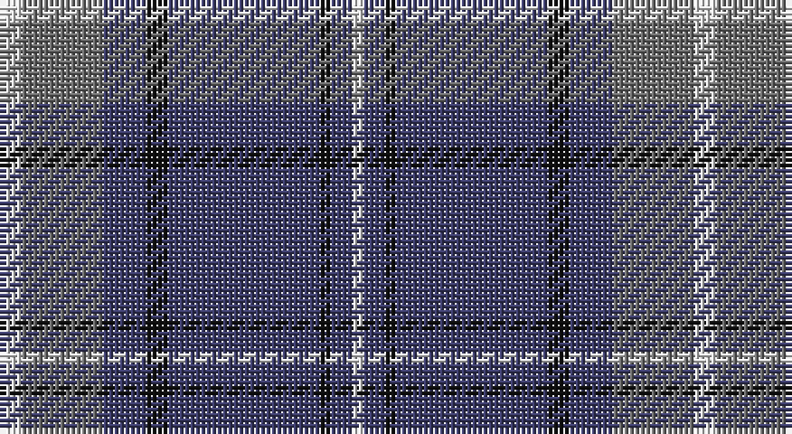

This page is one **sett** — a single exact thread-count. It belongs to the [tartan](/setts/w4y15db8k4db28k2db4w2/)
(the same proportion at any scale), whose colour order is pattern [WBKBKBGW](/stripes/wbkbkbgw/).

Sourced from tartans-authority.  It is a [8 stripe tartan](/stripes/stripes8/).

Original link http://www.tartansauthority.com/tartan-ferret/display/7936/

## Register references

External register numbers recorded for this tartan.

- Scottish Register of Tartans: [7936](https://www.tartanregister.gov.uk/tartanDetails?ref=7936)
- Scottish Tartans Authority (ITI): 7936

## Thread count
LN/4 N15 B8 K4 B28 K2 B4 LN/2

One full sett is **128 threads**.

## Palette

Palette: <strong>Tartan Register</strong> <small style="color:#888">(2 of 4 colours)</small>
<table><thead><tr><th>Colour</th><th>Threads</th><th>Shade</th><th>Base</th><th>OKLCh</th></tr></thead><tbody><tr><td>LN/</td><td style="text-align:right;font-variant-numeric:tabular-nums">4</td><td><code style="background-color:#E0E0E0;">#E0E0E0</code> <small style="color:#888">#E0E0E0</small></td><td>W <code style="background-color:#F7F7F7;">#F7F7F7</code></td><td><small style="color:#888">oklch(90.7% 0.000 89.9)</small></td></tr><tr><td>N</td><td style="text-align:right;font-variant-numeric:tabular-nums">15</td><td><code style="background-color:#6C6C6C;">#6C6C6C</code> <small style="color:#888">#6C6C6C</small></td><td>G <code style="background-color:#006100;">#006100</code></td><td><small style="color:#888">oklch(53.1% 0.000 89.9)</small></td></tr><tr><td>B</td><td style="text-align:right;font-variant-numeric:tabular-nums">8</td><td><code style="background-color:#3C3C68;">#3C3C68</code> <small style="color:#888">#3C3C68</small></td><td>B <code style="background-color:#2A418A;">#2A418A</code></td><td><small style="color:#888">oklch(37.8% 0.074 282.3)</small></td></tr><tr><td>K</td><td style="text-align:right;font-variant-numeric:tabular-nums">4</td><td><code style="background-color:#101010;">#101010</code> <small style="color:#888">#101010</small></td><td>K <code style="background-color:#000000;">#000000</code></td><td><small style="color:#888">oklch(17.3% 0.000 89.9)</small></td></tr><tr><td>B</td><td style="text-align:right;font-variant-numeric:tabular-nums">28</td><td><code style="background-color:#3C3C68;">#3C3C68</code> <small style="color:#888">#3C3C68</small></td><td>B <code style="background-color:#2A418A;">#2A418A</code></td><td><small style="color:#888">oklch(37.8% 0.074 282.3)</small></td></tr><tr><td>K</td><td style="text-align:right;font-variant-numeric:tabular-nums">2</td><td><code style="background-color:#101010;">#101010</code> <small style="color:#888">#101010</small></td><td>K <code style="background-color:#000000;">#000000</code></td><td><small style="color:#888">oklch(17.3% 0.000 89.9)</small></td></tr><tr><td>B</td><td style="text-align:right;font-variant-numeric:tabular-nums">4</td><td><code style="background-color:#3C3C68;">#3C3C68</code> <small style="color:#888">#3C3C68</small></td><td>B <code style="background-color:#2A418A;">#2A418A</code></td><td><small style="color:#888">oklch(37.8% 0.074 282.3)</small></td></tr><tr><td>LN/</td><td style="text-align:right;font-variant-numeric:tabular-nums">2</td><td><code style="background-color:#E0E0E0;">#E0E0E0</code> <small style="color:#888">#E0E0E0</small></td><td>W <code style="background-color:#F7F7F7;">#F7F7F7</code></td><td><small style="color:#888">oklch(90.7% 0.000 89.9)</small></td></tr></tbody></table>

# Sample pattern

## Nearest tartans

The nearest existing variants by ΔTartan distance, with this tartan at the top so the swatches line up against it.

ΔTartan

Tartan

Sett

—

<a href="/ttd/edit/#slug=w4y15db8k4db28k2db4w2">Kelvinside Academy (School)</a> <a class="nn-out" href="/variants/s8/w4y15db8k4db28k2db4w2/" title="open its dictionary page">↗</a>

0.76

<a href="/ttd/edit/#slug=db2ly1db18g7r7db1g1~x2&amp;base=w4y15db8k4db28k2db4w2">Unnamed C20th - USA</a> <a class="nn-out" href="/variants/s7/db2ly1db18g7r7db1g1~x2/" title="open its dictionary page">↗</a>

0.94

<a href="/ttd/edit/#slug=db22ly2db1ly2db10y2g11y6~x2&amp;base=w4y15db8k4db28k2db4w2">Katsushika (Corporate)</a> <a class="nn-out" href="/variants/s8/db22ly2db1ly2db10y2g11y6~x2/" title="open its dictionary page">↗</a>

0.98

<a href="/ttd/edit/#slug=db3r3g18db16w2db26r3g3~x2&amp;base=w4y15db8k4db28k2db4w2">MacHardy</a> <a class="nn-out" href="/variants/s8/db3r3g18db16w2db26r3g3~x2/" title="open its dictionary page">↗</a>

1.00

<a href="/ttd/edit/#slug=n42db2n2db17lo8db4~x2&amp;base=w4y15db8k4db28k2db4w2">Connecticut State Police PB (Cor.)</a> <a class="nn-out" href="/variants/s6/n42db2n2db17lo8db4~x2/" title="open its dictionary page">↗</a>

1.04

<a href="/ttd/edit/#slug=k3t10lo5t29k10r6k2~x2&amp;base=w4y15db8k4db28k2db4w2">Perkins (2015)</a> <a class="nn-out" href="/variants/s7/k3t10lo5t29k10r6k2~x2/" title="open its dictionary page">↗</a>

1.04

<a href="/ttd/edit/#slug=o1lb6db4lb1db16n1db4n6lb1~x4&amp;base=w4y15db8k4db28k2db4w2">Fujisankei Serene (Corporate)</a> <a class="nn-out" href="/variants/s9/o1lb6db4lb1db16n1db4n6lb1~x4/" title="open its dictionary page">↗</a>

1.04

<a href="/ttd/edit/#slug=r1db12y5db2y4lb1~x2&amp;base=w4y15db8k4db28k2db4w2">Connaught Green</a> <a class="nn-out" href="/variants/s6/r1db12y5db2y4lb1~x2/" title="open its dictionary page">↗</a>

1.05

<a href="/ttd/edit/#slug=y8ly4y35db2lt8db2y4db21y4~x2&amp;base=w4y15db8k4db28k2db4w2">Bedford Academy</a> <a class="nn-out" href="/variants/s9/y8ly4y35db2lt8db2y4db21y4~x2/" title="open its dictionary page">↗</a>

1.05

<a href="/ttd/edit/#slug=db22ly2db1ly2db10r2g11r6~x2&amp;base=w4y15db8k4db28k2db4w2">Katsushika Scottish Country Dancers</a> <a class="nn-out" href="/variants/s8/db22ly2db1ly2db10r2g11r6~x2/" title="open its dictionary page">↗</a>

1.06

<a href="/ttd/edit/#slug=o8ly4o35db2t8db2o4db21o4~x2&amp;base=w4y15db8k4db28k2db4w2">Bedford Academy (Corporate)</a> <a class="nn-out" href="/variants/s9/o8ly4o35db2t8db2o4db21o4~x2/" title="open its dictionary page">↗</a>

## Neighbour map

Every grey dot is one of 14360 variants placed by the first two principal components of the ΔTartan feature space (44% of its variance). Red is this tartan; blue dots are its nearest — click one to open its page.

<svg viewBox="0 0 640 380" role="img" style="max-width:100%;height:auto;border:1px solid #e0e0e0;border-radius:4px;display:block" xmlns="http://www.w3.org/2000/svg"><image href="/nn/cloud.v1.png" width="640" height="380"/><a href="/variants/s7/db2ly1db18g7r7db1g1~x2/"><circle cx="349.9" cy="173.6" r="4" fill="#3465a4"><title>Unnamed C20th - USA</title></circle></a><a href="/variants/s8/db22ly2db1ly2db10y2g11y6~x2/"><circle cx="348.8" cy="173.7" r="4" fill="#3465a4"><title>Katsushika (Corporate)</title></circle></a><a href="/variants/s8/db3r3g18db16w2db26r3g3~x2/"><circle cx="360.0" cy="198.7" r="4" fill="#3465a4"><title>MacHardy</title></circle></a><a href="/variants/s6/n42db2n2db17lo8db4~x2/"><circle cx="380.8" cy="179.7" r="4" fill="#3465a4"><title>Connecticut State Police PB (Cor.)</title></circle></a><a href="/variants/s7/k3t10lo5t29k10r6k2~x2/"><circle cx="333.0" cy="183.2" r="4" fill="#3465a4"><title>Perkins (2015)</title></circle></a><a href="/variants/s9/o1lb6db4lb1db16n1db4n6lb1~x4/"><circle cx="344.2" cy="168.9" r="4" fill="#3465a4"><title>Fujisankei Serene (Corporate)</title></circle></a><a href="/variants/s6/r1db12y5db2y4lb1~x2/"><circle cx="353.3" cy="220.4" r="4" fill="#3465a4"><title>Connaught Green</title></circle></a><a href="/variants/s9/y8ly4y35db2lt8db2y4db21y4~x2/"><circle cx="336.5" cy="159.7" r="4" fill="#3465a4"><title>Bedford Academy</title></circle></a><a href="/variants/s8/db22ly2db1ly2db10r2g11r6~x2/"><circle cx="346.2" cy="166.7" r="4" fill="#3465a4"><title>Katsushika Scottish Country Dancers</title></circle></a><a href="/variants/s9/o8ly4o35db2t8db2o4db21o4~x2/"><circle cx="357.0" cy="166.0" r="4" fill="#3465a4"><title>Bedford Academy (Corporate)</title></circle></a><circle cx="351.5" cy="187.3" r="5" fill="#c00000"/></svg>

ID: /variants/s8/w4y15db8k4db28k2db4w2/
