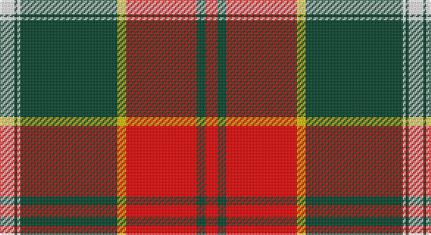

This page is one **sett** — a single exact thread-count. It belongs to the [tartan](/setts/w5dg1w1dg33ly3r24dg3r4/)
(the same proportion at any scale), whose colour order is pattern [RGRYGWGW](/stripes/rgrygwgw/).

Sourced from register-of-tartans.  It is a [8 stripe tartan](/stripes/stripes8/).

Original link https://www.tartanregister.gov.uk/tartanDetails.aspx?ref=11621

## Register references

External register numbers recorded for this tartan.

- Scottish Register of Tartans: [11621](https://www.tartanregister.gov.uk/tartanDetails.aspx?ref=11621)

## Thread count
W/10 DG2 W2 DG66 Y6 R48 DG6 R/8

One full sett is **278 threads**.

## Palette

Palette: <strong>Tartan Register</strong>
<table><thead><tr><th>Colour</th><th>Threads</th><th>Shade</th><th>Base</th><th>OKLCh</th></tr></thead><tbody><tr><td>W/</td><td style="text-align:right;font-variant-numeric:tabular-nums">10</td><td><code style="background-color:#FFFFFF;">#FFFFFF</code> <small style="color:#888">#FFFFFF</small></td><td>W <code style="background-color:#F7F7F7;">#F7F7F7</code></td><td><small style="color:#888">oklch(100.0% 0.000 89.9)</small></td></tr><tr><td>DG</td><td style="text-align:right;font-variant-numeric:tabular-nums">2</td><td><code style="background-color:#004028;">#004028</code> <small style="color:#888">#004028</small></td><td>G <code style="background-color:#006100;">#006100</code></td><td><small style="color:#888">oklch(32.8% 0.073 160.8)</small></td></tr><tr><td>W</td><td style="text-align:right;font-variant-numeric:tabular-nums">2</td><td><code style="background-color:#FFFFFF;">#FFFFFF</code> <small style="color:#888">#FFFFFF</small></td><td>W <code style="background-color:#F7F7F7;">#F7F7F7</code></td><td><small style="color:#888">oklch(100.0% 0.000 89.9)</small></td></tr><tr><td>DG</td><td style="text-align:right;font-variant-numeric:tabular-nums">66</td><td><code style="background-color:#004028;">#004028</code> <small style="color:#888">#004028</small></td><td>G <code style="background-color:#006100;">#006100</code></td><td><small style="color:#888">oklch(32.8% 0.073 160.8)</small></td></tr><tr><td>Y</td><td style="text-align:right;font-variant-numeric:tabular-nums">6</td><td><code style="background-color:#E8C000;">#E8C000</code> <small style="color:#888">#E8C000</small></td><td>Y <code style="background-color:#F2BF00;">#F2BF00</code></td><td><small style="color:#888">oklch(81.9% 0.168 93.7)</small></td></tr><tr><td>R</td><td style="text-align:right;font-variant-numeric:tabular-nums">48</td><td><code style="background-color:#FF0000;">#FF0000</code> <small style="color:#888">#FF0000</small></td><td>R <code style="background-color:#CC0000;">#CC0000</code></td><td><small style="color:#888">oklch(62.8% 0.258 29.2)</small></td></tr><tr><td>DG</td><td style="text-align:right;font-variant-numeric:tabular-nums">6</td><td><code style="background-color:#004028;">#004028</code> <small style="color:#888">#004028</small></td><td>G <code style="background-color:#006100;">#006100</code></td><td><small style="color:#888">oklch(32.8% 0.073 160.8)</small></td></tr><tr><td>R/</td><td style="text-align:right;font-variant-numeric:tabular-nums">8</td><td><code style="background-color:#FF0000;">#FF0000</code> <small style="color:#888">#FF0000</small></td><td>R <code style="background-color:#CC0000;">#CC0000</code></td><td><small style="color:#888">oklch(62.8% 0.258 29.2)</small></td></tr></tbody></table>

# Sample pattern

## Nearest tartans

The nearest existing variants by ΔTartan distance, with this tartan at the top so the swatches line up against it.

ΔTartan

Tartan

Sett

—

<a href="/ttd/edit/#slug=w5dg1w1dg33ly3r24dg3r4~x2">Sutherland de Albergaria Dress (Personal)</a> <a class="nn-out" href="/variants/s8/w5dg1w1dg33ly3r24dg3r4~x2/" title="open its dictionary page">↗</a>

1.10

<a href="/ttd/edit/#slug=r25n2r3lo2r3n11w13lo1~x2&amp;base=w5dg1w1dg33ly3r24dg3r4~x2">Citylink Gold (Corporate)</a> <a class="nn-out" href="/variants/s8/r25n2r3lo2r3n11w13lo1~x2/" title="open its dictionary page">↗</a>

1.17

<a href="/ttd/edit/#slug=w10k2w2k66ly6r48k5r8&amp;base=w5dg1w1dg33ly3r24dg3r4~x2">Sutherland de Albergaria (Personal)</a> <a class="nn-out" href="/variants/s8/w10k2w2k66ly6r48k5r8/" title="open its dictionary page">↗</a>

1.19

<a href="/ttd/edit/#slug=r56w2db6w2g32r11db6w5&amp;base=w5dg1w1dg33ly3r24dg3r4~x2">Spens</a> <a class="nn-out" href="/variants/s8/r56w2db6w2g32r11db6w5/" title="open its dictionary page">↗</a>

1.24

<a href="/ttd/edit/#slug=g4r3k1r28g14r4g4w3g4r4g4w3~x2&amp;base=w5dg1w1dg33ly3r24dg3r4~x2">Scott</a> <a class="nn-out" href="/variants/s12/g4r3k1r28g14r4g4w3g4r4g4w3~x2/" title="open its dictionary page">↗</a>

1.26

<a href="/ttd/edit/#slug=ly32g2m1g2m1g2m32do1m1do4~x2&amp;base=w5dg1w1dg33ly3r24dg3r4~x2">Connaught Irish District Tartan</a> <a class="nn-out" href="/variants/s10/ly32g2m1g2m1g2m32do1m1do4~x2/" title="open its dictionary page">↗</a>

1.31

<a href="/ttd/edit/#slug=r50ly8k2w2k2ly8k22r3~x2&amp;base=w5dg1w1dg33ly3r24dg3r4~x2">FIRES Center of Excelence</a> <a class="nn-out" href="/variants/s8/r50ly8k2w2k2ly8k22r3~x2/" title="open its dictionary page">↗</a>

1.31

<a href="/ttd/edit/#slug=w3k3w3k37r40w1r2lo3~x2&amp;base=w5dg1w1dg33ly3r24dg3r4~x2">Marjoribanks (Clan)</a> <a class="nn-out" href="/variants/s8/w3k3w3k37r40w1r2lo3~x2/" title="open its dictionary page">↗</a>

1.34

<a href="/ttd/edit/#slug=r28g4k4g4k4t6ly1~x2&amp;base=w5dg1w1dg33ly3r24dg3r4~x2">Livingstone, MacLay MacLeay</a> <a class="nn-out" href="/variants/s7/r28g4k4g4k4t6ly1~x2/" title="open its dictionary page">↗</a>

1.37

<a href="/ttd/edit/#slug=t1r1lo1k15lo15r1t1lo1~x4&amp;base=w5dg1w1dg33ly3r24dg3r4~x2">Pittsburgh St Andrew's Society</a> <a class="nn-out" href="/variants/s8/t1r1lo1k15lo15r1t1lo1~x4/" title="open its dictionary page">↗</a>

1.38

<a href="/ttd/edit/#slug=r25k7r3g13t1k2~x4&amp;base=w5dg1w1dg33ly3r24dg3r4~x2">MacPhail</a> <a class="nn-out" href="/variants/s6/r25k7r3g13t1k2~x4/" title="open its dictionary page">↗</a>

## Neighbour map

Every grey dot is one of 14360 variants placed by the first two principal components of the ΔTartan feature space (44% of its variance). Red is this tartan; blue dots are its nearest — click one to open its page.

<svg viewBox="0 0 640 380" role="img" style="max-width:100%;height:auto;border:1px solid #e0e0e0;border-radius:4px;display:block" xmlns="http://www.w3.org/2000/svg"><image href="/nn/cloud.v1.png" width="640" height="380"/><a href="/variants/s8/r25n2r3lo2r3n11w13lo1~x2/"><circle cx="303.4" cy="128.5" r="4" fill="#3465a4"><title>Citylink Gold (Corporate)</title></circle></a><a href="/variants/s8/w10k2w2k66ly6r48k5r8/"><circle cx="320.2" cy="107.6" r="4" fill="#3465a4"><title>Sutherland de Albergaria (Personal)</title></circle></a><a href="/variants/s8/r56w2db6w2g32r11db6w5/"><circle cx="359.1" cy="124.2" r="4" fill="#3465a4"><title>Spens</title></circle></a><a href="/variants/s12/g4r3k1r28g14r4g4w3g4r4g4w3~x2/"><circle cx="333.5" cy="109.2" r="4" fill="#3465a4"><title>Scott</title></circle></a><a href="/variants/s10/ly32g2m1g2m1g2m32do1m1do4~x2/"><circle cx="311.2" cy="76.4" r="4" fill="#3465a4"><title>Connaught Irish District Tartan</title></circle></a><a href="/variants/s8/r50ly8k2w2k2ly8k22r3~x2/"><circle cx="336.0" cy="107.6" r="4" fill="#3465a4"><title>FIRES Center of Excelence</title></circle></a><a href="/variants/s8/w3k3w3k37r40w1r2lo3~x2/"><circle cx="327.3" cy="93.8" r="4" fill="#3465a4"><title>Marjoribanks (Clan)</title></circle></a><a href="/variants/s7/r28g4k4g4k4t6ly1~x2/"><circle cx="308.9" cy="107.5" r="4" fill="#3465a4"><title>Livingstone, MacLay MacLeay</title></circle></a><a href="/variants/s8/t1r1lo1k15lo15r1t1lo1~x4/"><circle cx="283.0" cy="129.6" r="4" fill="#3465a4"><title>Pittsburgh St Andrew's Society</title></circle></a><a href="/variants/s6/r25k7r3g13t1k2~x4/"><circle cx="324.7" cy="148.4" r="4" fill="#3465a4"><title>MacPhail</title></circle></a><circle cx="318.8" cy="104.9" r="5" fill="#c00000"/></svg>

ID: /variants/s8/w5dg1w1dg33ly3r24dg3r4~x2/
