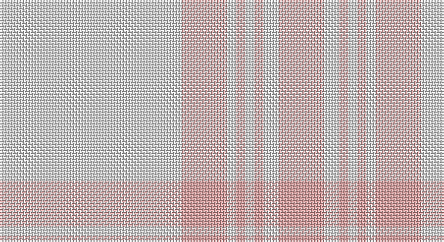

This page is one **sett** — a single exact thread-count. It belongs to the [tartan](/setts/w60lr15w3lr3w3lr3w5lr15/)
(the same proportion at any scale), whose colour order is pattern [WYWYWYWY](/stripes/wywywywy/).

Sourced from register-of-tartans.  It is a [8 stripe tartan](/stripes/stripes8/).

Original link https://www.tartanregister.gov.uk/tartanDetails.aspx?ref=2013

2 attestations — the source records this cloth was collapsed from (oldest owns this page)

<ul>
<li>01/01/2007 — Walk the Walk (register-of-tartans, <a href="https://www.tartanregister.gov.uk/tartanDetails.aspx?ref=2013">record</a>)</li>
<li>pre 2007 — Walk the Walk (Corporate) (tartans-authority, <a href="http://www.tartansauthority.com/tartan-ferret/display/7306/">record</a>)</li>
</ul>

## Register references

External register numbers recorded for this tartan.

- Scottish Register of Tartans: [2013](https://www.tartanregister.gov.uk/tartanDetails.aspx?ref=2013)
- Scottish Tartans Authority (ITI): 7306

## Thread count
LN/120 LR30 LN6 LR6 LN6 LR6 LN10 LR/30

One full sett is **278 threads**.

## Palette

Palette: <strong>Tartan Register</strong> <small style="color:#888">(2 of 7 colours)</small>
<table><thead><tr><th>Colour</th><th>Threads</th><th>Shade</th><th>Base</th><th>OKLCh</th></tr></thead><tbody><tr><td>LN/</td><td style="text-align:right;font-variant-numeric:tabular-nums">120</td><td><code style="background-color:#E0E0E0;">#E0E0E0</code> <small style="color:#888">#E0E0E0</small></td><td>W <code style="background-color:#F7F7F7;">#F7F7F7</code></td><td><small style="color:#888">oklch(90.7% 0.000 89.9)</small></td></tr><tr><td>LR</td><td style="text-align:right;font-variant-numeric:tabular-nums">30</td><td><code style="background-color:#ECA4A4;">#ECA4A4</code> <small style="color:#888">#ECA4A4</small></td><td>Y <code style="background-color:#F2BF00;">#F2BF00</code></td><td><small style="color:#888">oklch(78.8% 0.086 19.2)</small></td></tr><tr><td>LN</td><td style="text-align:right;font-variant-numeric:tabular-nums">6</td><td><code style="background-color:#E0E0E0;">#E0E0E0</code> <small style="color:#888">#E0E0E0</small></td><td>W <code style="background-color:#F7F7F7;">#F7F7F7</code></td><td><small style="color:#888">oklch(90.7% 0.000 89.9)</small></td></tr><tr><td>LR</td><td style="text-align:right;font-variant-numeric:tabular-nums">6</td><td><code style="background-color:#ECA4A4;">#ECA4A4</code> <small style="color:#888">#ECA4A4</small></td><td>Y <code style="background-color:#F2BF00;">#F2BF00</code></td><td><small style="color:#888">oklch(78.8% 0.086 19.2)</small></td></tr><tr><td>LN</td><td style="text-align:right;font-variant-numeric:tabular-nums">6</td><td><code style="background-color:#E0E0E0;">#E0E0E0</code> <small style="color:#888">#E0E0E0</small></td><td>W <code style="background-color:#F7F7F7;">#F7F7F7</code></td><td><small style="color:#888">oklch(90.7% 0.000 89.9)</small></td></tr><tr><td>LR</td><td style="text-align:right;font-variant-numeric:tabular-nums">6</td><td><code style="background-color:#ECA4A4;">#ECA4A4</code> <small style="color:#888">#ECA4A4</small></td><td>Y <code style="background-color:#F2BF00;">#F2BF00</code></td><td><small style="color:#888">oklch(78.8% 0.086 19.2)</small></td></tr><tr><td>LN</td><td style="text-align:right;font-variant-numeric:tabular-nums">10</td><td><code style="background-color:#E0E0E0;">#E0E0E0</code> <small style="color:#888">#E0E0E0</small></td><td>W <code style="background-color:#F7F7F7;">#F7F7F7</code></td><td><small style="color:#888">oklch(90.7% 0.000 89.9)</small></td></tr><tr><td>LR/</td><td style="text-align:right;font-variant-numeric:tabular-nums">30</td><td><code style="background-color:#ECA4A4;">#ECA4A4</code> <small style="color:#888">#ECA4A4</small></td><td>Y <code style="background-color:#F2BF00;">#F2BF00</code></td><td><small style="color:#888">oklch(78.8% 0.086 19.2)</small></td></tr></tbody></table>

# Sample pattern

## Nearest tartans

The nearest existing variants by ΔTartan distance, with this tartan at the top so the swatches line up against it.

ΔTartan

Tartan

Sett

—

<a href="/ttd/edit/#slug=w60lr15w3lr3w3lr3w5lr15~x2">Walk the Walk</a> <a class="nn-out" href="/variants/s8/w60lr15w3lr3w3lr3w5lr15~x2/" title="open its dictionary page">↗</a>

2.36

<a href="/variants/s8/w8wi30w60wi15lo2wi2lo2wi5~x2/">Amazon</a>

3.17

<a href="/ttd/edit/#slug=w8lb30w60lb15lo2lb2lo2lb5~x2&amp;base=w60lr15w3lr3w3lr3w5lr15~x2">Amazon</a> <a class="nn-out" href="/variants/s8/w8lb30w60lb15lo2lb2lo2lb5~x2/" title="open its dictionary page">↗</a>

3.44

<a href="/ttd/edit/#slug=t4lo15t4lo15t4w2~x2&amp;base=w60lr15w3lr3w3lr3w5lr15~x2">Takla Makan #2</a> <a class="nn-out" href="/variants/s6/t4lo15t4lo15t4w2~x2/" title="open its dictionary page">↗</a>

3.48

<a href="/ttd/edit/#slug=lb25w5r1w1r1w20~x4&amp;base=w60lr15w3lr3w3lr3w5lr15~x2">Masai Shuka 13 (Artefact)</a> <a class="nn-out" href="/variants/s6/lb25w5r1w1r1w20~x4/" title="open its dictionary page">↗</a>

3.53

<a href="/ttd/edit/#slug=n2o3n3o3n10o2n18o1~x4&amp;base=w60lr15w3lr3w3lr3w5lr15~x2">Hebridean Cairn (Fashion)</a> <a class="nn-out" href="/variants/s8/n2o3n3o3n10o2n18o1~x4/" title="open its dictionary page">↗</a>

3.53

<a href="/ttd/edit/#slug=loi81g6lo8g8~x2&amp;base=w60lr15w3lr3w3lr3w5lr15~x2">Young in Australia (Name)</a> <a class="nn-out" href="/variants/s4/loi81g6lo8g8~x2/" title="open its dictionary page">↗</a>

3.77

<a href="/ttd/edit/#slug=n8o74lb8n42o11dp2o16n4&amp;base=w60lr15w3lr3w3lr3w5lr15~x2">Orkney Slate (Fashion)</a> <a class="nn-out" href="/variants/s8/n8o74lb8n42o11dp2o16n4/" title="open its dictionary page">↗</a>

3.78

<a href="/ttd/edit/#slug=n18o2n10o3n3o3n2o3n3o3n10o2n18o1~x4&amp;base=w60lr15w3lr3w3lr3w5lr15~x2">Hebridean Cairn</a> <a class="nn-out" href="/variants/s14/n18o2n10o3n3o3n2o3n3o3n10o2n18o1~x4/" title="open its dictionary page">↗</a>

3.84

<a href="/ttd/edit/#slug=w4o28t48ly3~x2&amp;base=w60lr15w3lr3w3lr3w5lr15~x2">McKerrell of Hillhouse Dress (Clan)</a> <a class="nn-out" href="/variants/s4/w4o28t48ly3~x2/" title="open its dictionary page">↗</a>

3.90

<a href="/ttd/edit/#slug=n11o1n4o8r1~x8&amp;base=w60lr15w3lr3w3lr3w5lr15~x2">Cairns, David (Personal)</a> <a class="nn-out" href="/variants/s5/n11o1n4o8r1~x8/" title="open its dictionary page">↗</a>

## Neighbour map

Every grey dot is one of 14360 variants placed by the first two principal components of the ΔTartan feature space (44% of its variance). Red is this tartan; blue dots are its nearest — click one to open its page.

<svg viewBox="0 0 640 380" role="img" style="max-width:100%;height:auto;border:1px solid #e0e0e0;border-radius:4px;display:block" xmlns="http://www.w3.org/2000/svg"><image href="/nn/cloud.v1.png" width="640" height="380"/><a href="/variants/s8/w8wi30w60wi15lo2wi2lo2wi5~x2/"><circle cx="566.3" cy="226.8" r="4" fill="#3465a4"><title>Amazon</title></circle></a><a href="/variants/s8/w8lb30w60lb15lo2lb2lo2lb5~x2/"><circle cx="481.9" cy="177.6" r="4" fill="#3465a4"><title>Amazon</title></circle></a><a href="/variants/s6/t4lo15t4lo15t4w2~x2/"><circle cx="521.0" cy="315.2" r="4" fill="#3465a4"><title>Takla Makan #2</title></circle></a><a href="/variants/s6/lb25w5r1w1r1w20~x4/"><circle cx="448.0" cy="205.6" r="4" fill="#3465a4"><title>Masai Shuka 13 (Artefact)</title></circle></a><a href="/variants/s8/n2o3n3o3n10o2n18o1~x4/"><circle cx="626.0" cy="297.6" r="4" fill="#3465a4"><title>Hebridean Cairn (Fashion)</title></circle></a><a href="/variants/s4/loi81g6lo8g8~x2/"><circle cx="626.0" cy="313.4" r="4" fill="#3465a4"><title>Young in Australia (Name)</title></circle></a><a href="/variants/s8/n8o74lb8n42o11dp2o16n4/"><circle cx="524.1" cy="194.2" r="4" fill="#3465a4"><title>Orkney Slate (Fashion)</title></circle></a><a href="/variants/s14/n18o2n10o3n3o3n2o3n3o3n10o2n18o1~x4/"><circle cx="626.0" cy="279.5" r="4" fill="#3465a4"><title>Hebridean Cairn</title></circle></a><a href="/variants/s4/w4o28t48ly3~x2/"><circle cx="501.7" cy="294.2" r="4" fill="#3465a4"><title>McKerrell of Hillhouse Dress (Clan)</title></circle></a><a href="/variants/s5/n11o1n4o8r1~x8/"><circle cx="504.6" cy="311.7" r="4" fill="#3465a4"><title>Cairns, David (Personal)</title></circle></a><circle cx="626.0" cy="241.4" r="5" fill="#c00000"/></svg>

ID: /variants/s8/w60lr15w3lr3w3lr3w5lr15~x2/
