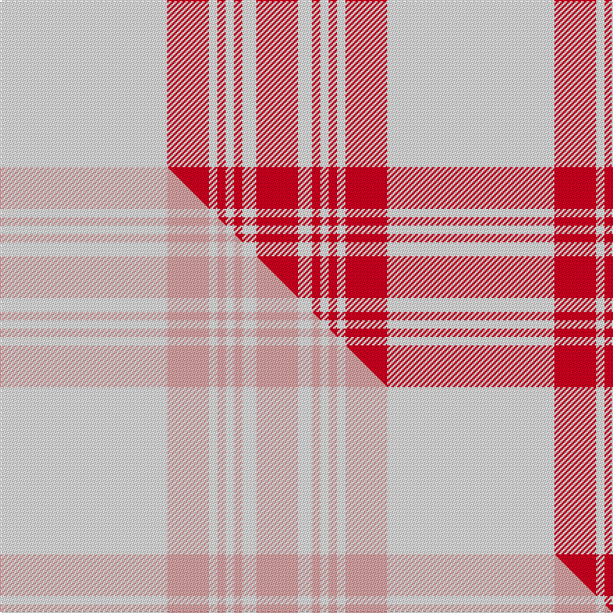

This is one **variant** — a specific cloth: this exact thread count and colourway, with its own
provenance below. It is one weaving of the [sett](/setts/w60r15w3r3w3r3w5r15/) (the scale-free proportion — the
same cloth at any scale or shade), whose colour order is pattern [RWRWRWRW](/stripes/rwrwrwrw/).

Part of the [Walk the Walk](/tartans/walk-the-walk/) tartan — the named design grouping this sett with its other cloths.

Sourced from tartans-authority.  It is a [8 stripe tartan](/stripes/stripes8/).

Original link [https://www.tartanregister.gov.uk/tartanDetails.aspx?ref=7306](https://www.tartanregister.gov.uk/tartanDetails.aspx?ref=7306)

Dataset <small>— provenance for this record, inherited from the source manifest</small>

<dl class="dataset-prov">
<dt>source</dt><dd><a href="/sources/tartans-authority/">Scottish Tartans Authority</a></dd>
<dt>data captured from</dt><dd><a href="https://github.com/thetartan/tartan-database/blob/master/data/tartans-authority/data.csv">https://github.com/thetartan/tartan-database/blob/master/data/tartans-authority/data.csv</a></dd>
<dt>data date</dt><dd>pre 2007 <small>(this record)</small></dd>
<dt>licence</dt><dd><a href="https://creativecommons.org/licenses/by-nc-nd/4.0/">CC BY-NC-ND 4.0</a></dd>
</dl>

Capture chain <small>— the hands this data passed through, oldest first; each capture carries its own licence</small>

<ol class="capture-chain">
<li><a href="https://www.tartansauthority.com/">Scottish Tartans Authority</a> <small>the heritage body's archive — its tartan-ferret record browser is retired (links repaired to the SRT, above)</small></li>
<li><a href="https://github.com/thetartan/tartan-database">thetartan/tartan-database</a> <small>2016-2017</small> · <a href="https://creativecommons.org/licenses/by-nc-nd/4.0/">CC BY-NC-ND 4.0</a> <small>Levko Kravets's frozen compilation — the capture we vendored, and where its CC licence text came from</small></li>
<li>this dictionary <small>captured 2026-06-10 · commit 5bf86c7566</small> <small>each re-capture is a git commit to data/sources</small></li>
</ol>

## Register references

External register numbers recorded for this tartan.

- Scottish Tartans Authority (ITI): 7306

## Thread count
W/120 R30 W6 R6 W6 R6 W10 R/30

One full sett is **278 threads**.

## Palette
<table><thead><tr><th>Colour</th><th>Shade</th><th>OKLCh</th></tr></thead><tbody><tr><td>W</td><td><code style="background-color:#F7F7F7;">#F7F7F7</code> <small style="color:#888">#F7F7F7</small></td><td><small style="color:#888">oklch(97.6% 0.000 89.9)</small></td></tr><tr><td>R</td><td><code style="background-color:#D60020;">#D60020</code> <small style="color:#888">#D60020</small></td><td><small style="color:#888">oklch(55.2% 0.224 25.5)</small></td></tr></tbody></table>

# Sample pattern

## Compared to the master

This cloth is one sett of its design; the master sett (the exemplar the design is anchored on) is below for comparison.

Its **ΔTartan distance** from the master is **0.16** — the same measure the nearest-tartans table ranks by (0 is identical; a re-scale of the same cloth is near 0, a recolour or a different proportion further).

<figure class="master-compare" style="margin:0">

this sett
master sett ★

<figcaption style="color:#888;font-size:smaller">One weave of this sett against the <a href="/setts/w60lr15w3lr3w3lr3w5lr15/">master sett ★</a>, split on the diagonal: a shared proportion runs seamlessly across it with only the shades shifting; a different proportion breaks on it.</figcaption>
</figure>

## Nearest tartan variants

The nearest existing variants by ΔTartan distance, with this cloth at the top so the swatches line up against it.

ΔTartan

Threads

Variant

Sett

—

278

<a href="/variants/s8/w60r15w3r3w3r3w5r15~x2/">Walk the Walk (Corporate)</a>

<a href="/ttd/edit/#slug=r55w20r8w2r8w2r8w2~x2&amp;base=w60r15w3r3w3r3w5r15~x2" title="compare in the TTD">0.95</a>

306

<a href="/variants/s8/r55w20r8w2r8w2r8w2~x2/">Masai Shuka 08 (Artefact)</a>

<a href="/ttd/edit/#slug=r36w4r3w4r6w2r1w12~x4&amp;base=w60r15w3r3w3r3w5r15~x2" title="compare in the TTD">0.99</a>

352

<a href="/variants/s8/r36w4r3w4r6w2r1w12~x4/">Menzies (1815)</a>

<a href="/ttd/edit/#slug=r36w4r3w4r6w2r1w12&amp;base=w60r15w3r3w3r3w5r15~x2" title="compare in the TTD">0.99</a>

88

<a href="/variants/s8/r36w4r3w4r6w2r1w12/">Menzies Dress</a>

<a href="/ttd/edit/#slug=r36w4r3w4r6w2r1w12~x2&amp;base=w60r15w3r3w3r3w5r15~x2" title="compare in the TTD">0.99</a>

176

<a href="/variants/s8/r36w4r3w4r6w2r1w12~x2/">Menzies Red &amp; White Clan Tartan</a>

<a href="/ttd/edit/#slug=w18r9w1r1w2r1w1r9db3r4~x4&amp;base=w60r15w3r3w3r3w5r15~x2" title="compare in the TTD">1.96</a>

304

<a href="/variants/s10/w18r9w1r1w2r1w1r9db3r4~x4/">Swiss Red (Fashion)</a>

<a href="/ttd/edit/#slug=w18r9w1r1w2r1w1r9db3r4~x4~w3600000&amp;base=w60r15w3r3w3r3w5r15~x2" title="compare in the TTD">1.96</a>

304

<a href="/variants/s10/w18r9w1r1w2r1w1r9db3r4~x4~w3600000/">Swiss Red</a>

<a href="/ttd/edit/#slug=w75dy1r20w16r20w20g9w16g1r38~x2~w4000000&amp;base=w60r15w3r3w3r3w5r15~x2" title="compare in the TTD">2.48</a>

638

<a href="/variants/s10/w75dy1r20w16r20w20g9w16g1r38~x2~w4000000/">Border Sett</a>

<a href="/ttd/edit/#slug=r2g2w2r23w2g2w23g2r2w2~x2&amp;base=w60r15w3r3w3r3w5r15~x2" title="compare in the TTD">2.95</a>

240

<a href="/variants/s10/r2g2w2r23w2g2w23g2r2w2~x2/">Hose Artifact Tartan</a>

<a href="/ttd/edit/#slug=r4w8r3w2r3w2r21g2r2g4~x2&amp;base=w60r15w3r3w3r3w5r15~x2" title="compare in the TTD">3.07</a>

188

<a href="/variants/s10/r4w8r3w2r3w2r21g2r2g4~x2/">Queen Alexandra Tartan</a>

<a href="/ttd/edit/#slug=o31w5o2w5o4w3o2w7~x2&amp;base=w60r15w3r3w3r3w5r15~x2" title="compare in the TTD">3.15</a>

160

<a href="/variants/s8/o31w5o2w5o4w3o2w7~x2/">Menzies, Brown &amp; White</a>

## Neighbour map

Every grey dot is one of 13621 variants placed by the first two principal components of the ΔTartan feature space (42% of its variance). Red is this tartan; blue dots are its nearest — click one to open its page.

<svg viewBox="0 0 640 380" role="img" style="max-width:100%;height:auto;border:1px solid #e0e0e0;border-radius:4px;display:block" xmlns="http://www.w3.org/2000/svg"><image href="/nn/cloud.v1.png" width="640" height="380"/><a href="/variants/s8/r55w20r8w2r8w2r8w2~x2/"><circle cx="537.8" cy="148.4" r="4" fill="#3465a4"><title>Masai Shuka 08 (Artefact)</title></circle></a><a href="/variants/s8/r36w4r3w4r6w2r1w12~x4/"><circle cx="491.0" cy="139.6" r="4" fill="#3465a4"><title>Menzies (1815)</title></circle></a><a href="/variants/s8/r36w4r3w4r6w2r1w12/"><circle cx="491.0" cy="139.6" r="4" fill="#3465a4"><title>Menzies Dress</title></circle></a><a href="/variants/s8/r36w4r3w4r6w2r1w12~x2/"><circle cx="491.0" cy="139.6" r="4" fill="#3465a4"><title>Menzies Red &amp; White Clan Tartan</title></circle></a><a href="/variants/s10/w18r9w1r1w2r1w1r9db3r4~x4/"><circle cx="317.6" cy="154.9" r="4" fill="#3465a4"><title>Swiss Red (Fashion)</title></circle></a><a href="/variants/s10/w18r9w1r1w2r1w1r9db3r4~x4~w3600000/"><circle cx="330.3" cy="158.6" r="4" fill="#3465a4"><title>Swiss Red</title></circle></a><a href="/variants/s10/w75dy1r20w16r20w20g9w16g1r38~x2~w4000000/"><circle cx="366.4" cy="115.2" r="4" fill="#3465a4"><title>Border Sett</title></circle></a><a href="/variants/s10/r2g2w2r23w2g2w23g2r2w2~x2/"><circle cx="303.3" cy="158.7" r="4" fill="#3465a4"><title>Hose Artifact Tartan</title></circle></a><a href="/variants/s10/r4w8r3w2r3w2r21g2r2g4~x2/"><circle cx="378.0" cy="170.1" r="4" fill="#3465a4"><title>Queen Alexandra Tartan</title></circle></a><a href="/variants/s8/o31w5o2w5o4w3o2w7~x2/"><circle cx="454.6" cy="184.8" r="4" fill="#3465a4"><title>Menzies, Brown &amp; White</title></circle></a><circle cx="462.5" cy="164.2" r="5" fill="#c00000"/><text x="320" y="376" text-anchor="middle" font-size="11" fill="#999">ground</text><text x="11" y="190" text-anchor="middle" font-size="11" fill="#999" transform="rotate(-90 11 190)">complexity</text></svg>

ID: /variants/s8/w60r15w3r3w3r3w5r15~x2/
