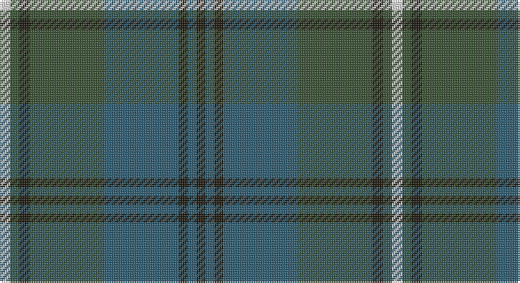

This page is one **sett** — a single exact thread-count. It belongs to the [tartan](/setts/w6dg5k6dg42n42k5n5k5/)
(the same proportion at any scale), whose colour order is pattern [KBKBGKGW](/stripes/kbkbgkgw/).

Part of the [Ben Lomond](/tartans/ben-lomond/) tartan — the named design grouping this sett with its other cloths.

Sourced from house-of-tartan.  It is a [8 stripe tartan](/stripes/stripes8/).

Original link http://www.house-of-tartan.scotland.net/house/TartanViewjs.asp?colr=Def&tnam=6500

## Provenance

Earliest known date: pre 2005

## Thread count
LN/6 N5 K6 N42 B42 K5 B5 K/5

One full sett is **221 threads**.

## Palette

Palette: <strong>Tartan Dictionary</strong> <small style="color:#888">(1 of 4 colours)</small>
<table><thead><tr><th>Colour</th><th>Threads</th><th>Shade</th><th>Base</th><th>OKLCh</th></tr></thead><tbody><tr><td>LN/</td><td style="text-align:right;font-variant-numeric:tabular-nums">6</td><td><code style="background-color:#E0E0E0;">#E0E0E0</code> <small style="color:#888">#E0E0E0</small></td><td>W <code style="background-color:#F7F7F7;">#F7F7F7</code></td><td><small style="color:#888">oklch(90.7% 0.000 89.9)</small></td></tr><tr><td>N</td><td style="text-align:right;font-variant-numeric:tabular-nums">5</td><td><code style="background-color:#3A5134;">#3A5134</code> <small style="color:#888">#3A5134</small></td><td>G <code style="background-color:#006100;">#006100</code></td><td><small style="color:#888">oklch(40.7% 0.055 139.3)</small></td></tr><tr><td>K</td><td style="text-align:right;font-variant-numeric:tabular-nums">6</td><td><code style="background-color:#1E1A10;">#1E1A10</code> <small style="color:#888">#1E1A10</small></td><td>K <code style="background-color:#000000;">#000000</code></td><td><small style="color:#888">oklch(21.9% 0.019 88.7)</small></td></tr><tr><td>N</td><td style="text-align:right;font-variant-numeric:tabular-nums">42</td><td><code style="background-color:#3A5134;">#3A5134</code> <small style="color:#888">#3A5134</small></td><td>G <code style="background-color:#006100;">#006100</code></td><td><small style="color:#888">oklch(40.7% 0.055 139.3)</small></td></tr><tr><td>B</td><td style="text-align:right;font-variant-numeric:tabular-nums">42</td><td><code style="background-color:#2D5C71;">#2D5C71</code> <small style="color:#888">#2D5C71</small></td><td>B <code style="background-color:#2A418A;">#2A418A</code></td><td><small style="color:#888">oklch(45.1% 0.062 229.4)</small></td></tr><tr><td>K</td><td style="text-align:right;font-variant-numeric:tabular-nums">5</td><td><code style="background-color:#1E1A10;">#1E1A10</code> <small style="color:#888">#1E1A10</small></td><td>K <code style="background-color:#000000;">#000000</code></td><td><small style="color:#888">oklch(21.9% 0.019 88.7)</small></td></tr><tr><td>B</td><td style="text-align:right;font-variant-numeric:tabular-nums">5</td><td><code style="background-color:#2D5C71;">#2D5C71</code> <small style="color:#888">#2D5C71</small></td><td>B <code style="background-color:#2A418A;">#2A418A</code></td><td><small style="color:#888">oklch(45.1% 0.062 229.4)</small></td></tr><tr><td>K/</td><td style="text-align:right;font-variant-numeric:tabular-nums">5</td><td><code style="background-color:#1E1A10;">#1E1A10</code> <small style="color:#888">#1E1A10</small></td><td>K <code style="background-color:#000000;">#000000</code></td><td><small style="color:#888">oklch(21.9% 0.019 88.7)</small></td></tr></tbody></table>

# Sample pattern

## Compared to the master

This cloth is one sett of its design; the master sett (the exemplar the design is anchored on) is below for comparison.

<figure style="margin:0"><figcaption style="color:#888;font-size:smaller">this sett</figcaption></figure>
<figure style="margin:0"><figcaption style="color:#888;font-size:smaller"><a href="/setts/k2t2k2t15g15k2g2w2/">master sett →</a></figcaption></figure>

## Nearest tartans

The nearest existing variants by ΔTartan distance, with this tartan at the top so the swatches line up against it.

ΔTartan

Tartan

Sett

—

<a href="/ttd/edit/#slug=w6dg5k6dg42n42k5n5k5">Ben Lomond Fashion Tartan</a> <a class="nn-out" href="/variants/s8/w6dg5k6dg42n42k5n5k5/" title="open its dictionary page">↗</a>

1.20

<a href="/ttd/edit/#slug=y24r2y3db14dt24r2dt3db3~x2&amp;base=w6dg5k6dg42n42k5n5k5">Grampian (District)</a> <a class="nn-out" href="/variants/s8/y24r2y3db14dt24r2dt3db3~x2/" title="open its dictionary page">↗</a>

1.34

<a href="/ttd/edit/#slug=dy28g2dy4db18g23db2g3lo4~x2&amp;base=w6dg5k6dg42n42k5n5k5">Eastern Western Motor Group, Dalbraith</a> <a class="nn-out" href="/variants/s8/dy28g2dy4db18g23db2g3lo4~x2/" title="open its dictionary page">↗</a>

1.40

<a href="/ttd/edit/#slug=dg36db3dg3db3dg6n34r4n4~x2&amp;base=w6dg5k6dg42n42k5n5k5">Wcwm 1530</a> <a class="nn-out" href="/variants/s8/dg36db3dg3db3dg6n34r4n4~x2/" title="open its dictionary page">↗</a>

1.41

<a href="/ttd/edit/#slug=dp4dt18r2dt2r2dt9g20dt3g4~x2&amp;base=w6dg5k6dg42n42k5n5k5">St. Andrews New Golf Club</a> <a class="nn-out" href="/variants/s9/dp4dt18r2dt2r2dt9g20dt3g4~x2/" title="open its dictionary page">↗</a>

1.41

<a href="/ttd/edit/#slug=dg11r4dg4r7dg41db11t4db41r4db8&amp;base=w6dg5k6dg42n42k5n5k5">Stuart/Stewart of Appin #2</a> <a class="nn-out" href="/variants/s10/dg11r4dg4r7dg41db11t4db41r4db8/" title="open its dictionary page">↗</a>

1.43

<a href="/ttd/edit/#slug=db20dy2db2dy2db2dy6g15dy2~x2&amp;base=w6dg5k6dg42n42k5n5k5">Gammell (Brown) (Personal)</a> <a class="nn-out" href="/variants/s8/db20dy2db2dy2db2dy6g15dy2~x2/" title="open its dictionary page">↗</a>

1.46

<a href="/ttd/edit/#slug=dg8r3dg3r5dg26db7t3db28r3db6~x2&amp;base=w6dg5k6dg42n42k5n5k5">Stuart/Stewart of Appin</a> <a class="nn-out" href="/variants/s10/dg8r3dg3r5dg26db7t3db28r3db6~x2/" title="open its dictionary page">↗</a>

1.47

<a href="/ttd/edit/#slug=lo2n28k2w2k2g26n3g5lo2~x2&amp;base=w6dg5k6dg42n42k5n5k5">Clyde (WCWM Fashion)</a> <a class="nn-out" href="/variants/s9/lo2n28k2w2k2g26n3g5lo2~x2/" title="open its dictionary page">↗</a>

1.48

<a href="/ttd/edit/#slug=db32do3db3do3db3do10g24r3~x2&amp;base=w6dg5k6dg42n42k5n5k5">Gammell Family Tartan</a> <a class="nn-out" href="/variants/s8/db32do3db3do3db3do10g24r3~x2/" title="open its dictionary page">↗</a>

1.48

<a href="/ttd/edit/#slug=n4o4n4k4n18k3do38w3~x2&amp;base=w6dg5k6dg42n42k5n5k5">Scotch Mist</a> <a class="nn-out" href="/variants/s8/n4o4n4k4n18k3do38w3~x2/" title="open its dictionary page">↗</a>

## Neighbour map

Every grey dot is one of 14360 variants placed by the first two principal components of the ΔTartan feature space (44% of its variance). Red is this tartan; blue dots are its nearest — click one to open its page.

<svg viewBox="0 0 640 380" role="img" style="max-width:100%;height:auto;border:1px solid #e0e0e0;border-radius:4px;display:block" xmlns="http://www.w3.org/2000/svg"><image href="/nn/cloud.v1.png" width="640" height="380"/><a href="/variants/s8/y24r2y3db14dt24r2dt3db3~x2/"><circle cx="277.9" cy="221.1" r="4" fill="#3465a4"><title>Grampian (District)</title></circle></a><a href="/variants/s8/dy28g2dy4db18g23db2g3lo4~x2/"><circle cx="289.5" cy="219.4" r="4" fill="#3465a4"><title>Eastern Western Motor Group, Dalbraith</title></circle></a><a href="/variants/s8/dg36db3dg3db3dg6n34r4n4~x2/"><circle cx="361.3" cy="218.5" r="4" fill="#3465a4"><title>Wcwm 1530</title></circle></a><a href="/variants/s9/dp4dt18r2dt2r2dt9g20dt3g4~x2/"><circle cx="341.2" cy="233.8" r="4" fill="#3465a4"><title>St. Andrews New Golf Club</title></circle></a><a href="/variants/s10/dg11r4dg4r7dg41db11t4db41r4db8/"><circle cx="305.5" cy="206.9" r="4" fill="#3465a4"><title>Stuart/Stewart of Appin #2</title></circle></a><a href="/variants/s8/db20dy2db2dy2db2dy6g15dy2~x2/"><circle cx="340.6" cy="239.6" r="4" fill="#3465a4"><title>Gammell (Brown) (Personal)</title></circle></a><a href="/variants/s10/dg8r3dg3r5dg26db7t3db28r3db6~x2/"><circle cx="293.9" cy="211.6" r="4" fill="#3465a4"><title>Stuart/Stewart of Appin</title></circle></a><a href="/variants/s9/lo2n28k2w2k2g26n3g5lo2~x2/"><circle cx="326.5" cy="179.5" r="4" fill="#3465a4"><title>Clyde (WCWM Fashion)</title></circle></a><a href="/variants/s8/db32do3db3do3db3do10g24r3~x2/"><circle cx="315.5" cy="217.5" r="4" fill="#3465a4"><title>Gammell Family Tartan</title></circle></a><a href="/variants/s8/n4o4n4k4n18k3do38w3~x2/"><circle cx="329.7" cy="186.4" r="4" fill="#3465a4"><title>Scotch Mist</title></circle></a><circle cx="294.5" cy="229.6" r="5" fill="#c00000"/></svg>

ID: /variants/s8/w6dg5k6dg42n42k5n5k5/
