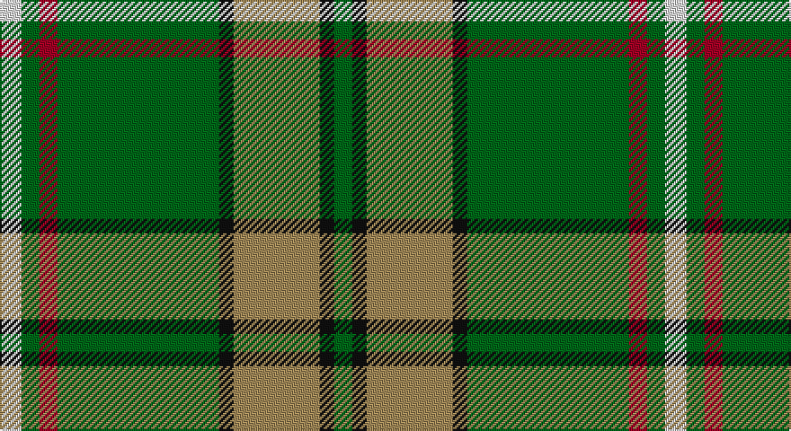

This page is one **sett** — a single exact thread-count. It belongs to the [tartan](/setts/w6g5r5g45k4lo24k4g5/)
(the same proportion at any scale), whose colour order is pattern [GKYKGRGW](/stripes/gkykgrgw/).

Part of the [O'Neill](/tartans/o-neill/) tartan — the named design grouping this sett with its other cloths.

Sourced from tartans-authority.  It is a [8 stripe tartan](/stripes/stripes8/).

Original link http://www.tartansauthority.com/tartan-ferret/display/2663/

## Also known as

This cloth is also recorded under:

- O'Neill Clan/Family
- O'Neill Personal
- O'Neill Pipe Band 1999
- O'Neill Pipe Band 1999/ Oliver dress
- O'Neill, Red

2 attestations — the source records this cloth was collapsed from (oldest owns this page)

<ul>
<li>1999 — O'Neill (Name) (tartans-authority, <a href="http://www.tartansauthority.com/tartan-ferret/display/2663/">record</a>)</li>
<li>01/01/2000 — O'Neill (register-of-tartans, <a href="https://www.tartanregister.gov.uk/tartanDetails.aspx?ref=4824">record</a>)</li>
</ul>

## Register references

External register numbers recorded for this tartan.

- Scottish Register of Tartans: [4824](https://www.tartanregister.gov.uk/tartanDetails.aspx?ref=4824)
- Scottish Tartans Authority (ITI): 2663
- Scottish Tartans World Register: 2663

## Thread count
LN/12 G10 DR10 G90 K8 LT48 K8 G/10

One full sett is **370 threads**.

## Palette

Palette: <strong>Tartan Register</strong> <small style="color:#888">(4 of 5 colours)</small>
<table><thead><tr><th>Colour</th><th>Threads</th><th>Shade</th><th>Base</th><th>OKLCh</th></tr></thead><tbody><tr><td>LN/</td><td style="text-align:right;font-variant-numeric:tabular-nums">12</td><td><code style="background-color:#E0E0E0;">#E0E0E0</code> <small style="color:#888">#E0E0E0</small></td><td>W <code style="background-color:#F7F7F7;">#F7F7F7</code></td><td><small style="color:#888">oklch(90.7% 0.000 89.9)</small></td></tr><tr><td>G</td><td style="text-align:right;font-variant-numeric:tabular-nums">10</td><td><code style="background-color:#006818;">#006818</code> <small style="color:#888">#006818</small></td><td>G <code style="background-color:#006100;">#006100</code></td><td><small style="color:#888">oklch(45.0% 0.142 145.0)</small></td></tr><tr><td>DR</td><td style="text-align:right;font-variant-numeric:tabular-nums">10</td><td><code style="background-color:#A00024;">#A00024</code> <small style="color:#888">#A00024</small></td><td>R <code style="background-color:#CC0000;">#CC0000</code></td><td><small style="color:#888">oklch(44.6% 0.179 21.0)</small></td></tr><tr><td>G</td><td style="text-align:right;font-variant-numeric:tabular-nums">90</td><td><code style="background-color:#006818;">#006818</code> <small style="color:#888">#006818</small></td><td>G <code style="background-color:#006100;">#006100</code></td><td><small style="color:#888">oklch(45.0% 0.142 145.0)</small></td></tr><tr><td>K</td><td style="text-align:right;font-variant-numeric:tabular-nums">8</td><td><code style="background-color:#101010;">#101010</code> <small style="color:#888">#101010</small></td><td>K <code style="background-color:#000000;">#000000</code></td><td><small style="color:#888">oklch(17.3% 0.000 89.9)</small></td></tr><tr><td>LT</td><td style="text-align:right;font-variant-numeric:tabular-nums">48</td><td><code style="background-color:#A08858;">#A08858</code> <small style="color:#888">#A08858</small></td><td>Y <code style="background-color:#F2BF00;">#F2BF00</code></td><td><small style="color:#888">oklch(63.7% 0.071 84.0)</small></td></tr><tr><td>K</td><td style="text-align:right;font-variant-numeric:tabular-nums">8</td><td><code style="background-color:#101010;">#101010</code> <small style="color:#888">#101010</small></td><td>K <code style="background-color:#000000;">#000000</code></td><td><small style="color:#888">oklch(17.3% 0.000 89.9)</small></td></tr><tr><td>G/</td><td style="text-align:right;font-variant-numeric:tabular-nums">10</td><td><code style="background-color:#006818;">#006818</code> <small style="color:#888">#006818</small></td><td>G <code style="background-color:#006100;">#006100</code></td><td><small style="color:#888">oklch(45.0% 0.142 145.0)</small></td></tr></tbody></table>

# Sample pattern

## Compared to the master

This cloth is one sett of its design; the master sett (the exemplar the design is anchored on) is below for comparison.

<figure style="margin:0"><figcaption style="color:#888;font-size:smaller">this sett</figcaption></figure>
<figure style="margin:0"><figcaption style="color:#888;font-size:smaller"><a href="/setts/w2r1w2g6w10r6w2g1w2/">master sett →</a></figcaption></figure>

## Nearest tartans

The nearest existing variants by ΔTartan distance, with this tartan at the top so the swatches line up against it.

ΔTartan

Tartan

Sett

—

<a href="/ttd/edit/#slug=w6g5r5g45k4lo24k4g5~x2">O'Neill (Name)</a> <a class="nn-out" href="/variants/s8/w6g5r5g45k4lo24k4g5~x2/" title="open its dictionary page">↗</a>

0.59

<a href="/ttd/edit/#slug=t2g1t1g12dg2g1m6ly2~x4&amp;base=w6g5r5g45k4lo24k4g5~x2">Manitoba</a> <a class="nn-out" href="/variants/s8/t2g1t1g12dg2g1m6ly2~x4/" title="open its dictionary page">↗</a>

0.66

<a href="/ttd/edit/#slug=w6g5r5g45k4o24k4g5~x2&amp;base=w6g5r5g45k4lo24k4g5~x2">O'Neill</a> <a class="nn-out" href="/variants/s8/w6g5r5g45k4o24k4g5~x2/" title="open its dictionary page">↗</a>

0.84

<a href="/ttd/edit/#slug=t2g1t1g12dg2g1r6ly2~x4&amp;base=w6g5r5g45k4lo24k4g5~x2">Manitoba District Tartan</a> <a class="nn-out" href="/variants/s8/t2g1t1g12dg2g1r6ly2~x4/" title="open its dictionary page">↗</a>

0.85

<a href="/ttd/edit/#slug=g13k1r1k1b2k1ly4~x8&amp;base=w6g5r5g45k4lo24k4g5~x2">Alberta (Province)</a> <a class="nn-out" href="/variants/s7/g13k1r1k1b2k1ly4~x8/" title="open its dictionary page">↗</a>

0.88

<a href="/ttd/edit/#slug=g12k1r1k1t2k1ly4~x2&amp;base=w6g5r5g45k4lo24k4g5~x2">Alberta District Tartan</a> <a class="nn-out" href="/variants/s7/g12k1r1k1t2k1ly4~x2/" title="open its dictionary page">↗</a>

0.88

<a href="/ttd/edit/#slug=g12k1r1k1b2k1ly4~x8&amp;base=w6g5r5g45k4lo24k4g5~x2">Alberta (District)</a> <a class="nn-out" href="/variants/s7/g12k1r1k1b2k1ly4~x8/" title="open its dictionary page">↗</a>

0.89

<a href="/ttd/edit/#slug=t2g1t1g12r2g1ri6ly2~x2&amp;base=w6g5r5g45k4lo24k4g5~x2">Manitoba</a> <a class="nn-out" href="/variants/s8/t2g1t1g12r2g1ri6ly2~x2/" title="open its dictionary page">↗</a>

0.93

<a href="/ttd/edit/#slug=g20ly2o5w4g2o2g2o2db6~x2&amp;base=w6g5r5g45k4lo24k4g5~x2">Boucherville (Tartan de..) District Tartan</a> <a class="nn-out" href="/variants/s9/g20ly2o5w4g2o2g2o2db6~x2/" title="open its dictionary page">↗</a>

1.10

<a href="/ttd/edit/#slug=g4lo1dt1lo1dt2g9r1dt6w1~x4&amp;base=w6g5r5g45k4lo24k4g5~x2">Casey of West Virginia (Personal)</a> <a class="nn-out" href="/variants/s9/g4lo1dt1lo1dt2g9r1dt6w1~x4/" title="open its dictionary page">↗</a>

1.10

<a href="/ttd/edit/#slug=r2db10w1m1g1r1g6m1g10w1~x2&amp;base=w6g5r5g45k4lo24k4g5~x2">Tennessee</a> <a class="nn-out" href="/variants/s10/r2db10w1m1g1r1g6m1g10w1~x2/" title="open its dictionary page">↗</a>

## Neighbour map

Every grey dot is one of 14360 variants placed by the first two principal components of the ΔTartan feature space (44% of its variance). Red is this tartan; blue dots are its nearest — click one to open its page.

<svg viewBox="0 0 640 380" role="img" style="max-width:100%;height:auto;border:1px solid #e0e0e0;border-radius:4px;display:block" xmlns="http://www.w3.org/2000/svg"><image href="/nn/cloud.v1.png" width="640" height="380"/><a href="/variants/s8/t2g1t1g12dg2g1m6ly2~x4/"><circle cx="266.8" cy="167.6" r="4" fill="#3465a4"><title>Manitoba</title></circle></a><a href="/variants/s8/w6g5r5g45k4o24k4g5~x2/"><circle cx="282.8" cy="159.7" r="4" fill="#3465a4"><title>O'Neill</title></circle></a><a href="/variants/s8/t2g1t1g12dg2g1r6ly2~x4/"><circle cx="280.1" cy="173.4" r="4" fill="#3465a4"><title>Manitoba District Tartan</title></circle></a><a href="/variants/s7/g13k1r1k1b2k1ly4~x8/"><circle cx="290.2" cy="153.1" r="4" fill="#3465a4"><title>Alberta (Province)</title></circle></a><a href="/variants/s7/g12k1r1k1t2k1ly4~x2/"><circle cx="269.8" cy="155.8" r="4" fill="#3465a4"><title>Alberta District Tartan</title></circle></a><a href="/variants/s7/g12k1r1k1b2k1ly4~x8/"><circle cx="270.2" cy="157.0" r="4" fill="#3465a4"><title>Alberta (District)</title></circle></a><a href="/variants/s8/t2g1t1g12r2g1ri6ly2~x2/"><circle cx="268.2" cy="162.1" r="4" fill="#3465a4"><title>Manitoba</title></circle></a><a href="/variants/s9/g20ly2o5w4g2o2g2o2db6~x2/"><circle cx="257.8" cy="164.4" r="4" fill="#3465a4"><title>Boucherville (Tartan de..) District Tartan</title></circle></a><a href="/variants/s9/g4lo1dt1lo1dt2g9r1dt6w1~x4/"><circle cx="240.1" cy="181.0" r="4" fill="#3465a4"><title>Casey of West Virginia (Personal)</title></circle></a><a href="/variants/s10/r2db10w1m1g1r1g6m1g10w1~x2/"><circle cx="246.8" cy="163.2" r="4" fill="#3465a4"><title>Tennessee</title></circle></a><circle cx="299.0" cy="167.7" r="5" fill="#c00000"/></svg>

ID: /variants/s8/w6g5r5g45k4lo24k4g5~x2/
