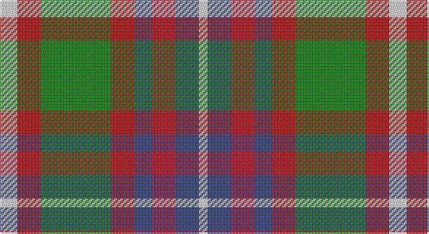

This page is one **sett** — a single exact thread-count. It belongs to the [tartan](/setts/w6ri8g24ri8db6r8db8w3/)
(the same proportion at any scale), whose colour order is pattern [WBRBRGRW](/stripes/wbrbrgrw/).

Sourced from weddslist.  It is a [8 stripe tartan](/stripes/stripes8/).

Original link http://www.weddslist.com/cgi-bin/tartans/pg.pl?source=sts

## Thread count
LN/12 Ra16 G48 Ra16 B12 R16 B16 LN/6

One full sett is **266 threads**.

## Palette

Palette: <strong>Tartan Dictionary</strong> <small style="color:#888">(1 of 5 colours)</small>
<table><thead><tr><th>Colour</th><th>Threads</th><th>Shade</th><th>Base</th><th>OKLCh</th></tr></thead><tbody><tr><td>LN/</td><td style="text-align:right;font-variant-numeric:tabular-nums">12</td><td><code style="background-color:#E0E0E0;">#E0E0E0</code> <small style="color:#888">#E0E0E0</small></td><td>W <code style="background-color:#F7F7F7;">#F7F7F7</code></td><td><small style="color:#888">oklch(90.7% 0.000 89.9)</small></td></tr><tr><td>Ra</td><td style="text-align:right;font-variant-numeric:tabular-nums">16</td><td><code style="background-color:#C00000;">#C00000</code> <small style="color:#888">#C00000</small></td><td>R <code style="background-color:#CC0000;">#CC0000</code></td><td><small style="color:#888">oklch(50.7% 0.208 29.2)</small></td></tr><tr><td>G</td><td style="text-align:right;font-variant-numeric:tabular-nums">48</td><td><code style="background-color:#008000;">#008000</code> <small style="color:#888">#008000</small></td><td>G <code style="background-color:#006100;">#006100</code></td><td><small style="color:#888">oklch(52.0% 0.177 142.5)</small></td></tr><tr><td>Ra</td><td style="text-align:right;font-variant-numeric:tabular-nums">16</td><td><code style="background-color:#C00000;">#C00000</code> <small style="color:#888">#C00000</small></td><td>R <code style="background-color:#CC0000;">#CC0000</code></td><td><small style="color:#888">oklch(50.7% 0.208 29.2)</small></td></tr><tr><td>B</td><td style="text-align:right;font-variant-numeric:tabular-nums">12</td><td><code style="background-color:#304080;">#304080</code> <small style="color:#888">#304080</small></td><td>B <code style="background-color:#2A418A;">#2A418A</code></td><td><small style="color:#888">oklch(39.4% 0.109 270.2)</small></td></tr><tr><td>R</td><td style="text-align:right;font-variant-numeric:tabular-nums">16</td><td><code style="background-color:#C00020;">#C00020</code> <small style="color:#888">#C00020</small></td><td>R <code style="background-color:#CC0000;">#CC0000</code></td><td><small style="color:#888">oklch(50.9% 0.206 24.5)</small></td></tr><tr><td>B</td><td style="text-align:right;font-variant-numeric:tabular-nums">16</td><td><code style="background-color:#304080;">#304080</code> <small style="color:#888">#304080</small></td><td>B <code style="background-color:#2A418A;">#2A418A</code></td><td><small style="color:#888">oklch(39.4% 0.109 270.2)</small></td></tr><tr><td>LN/</td><td style="text-align:right;font-variant-numeric:tabular-nums">6</td><td><code style="background-color:#E0E0E0;">#E0E0E0</code> <small style="color:#888">#E0E0E0</small></td><td>W <code style="background-color:#F7F7F7;">#F7F7F7</code></td><td><small style="color:#888">oklch(90.7% 0.000 89.9)</small></td></tr></tbody></table>

# Sample pattern

## Nearest tartans

The nearest existing variants by ΔTartan distance, with this tartan at the top so the swatches line up against it.

ΔTartan

Tartan

Sett

—

<a href="/ttd/edit/#slug=w6ri8g24ri8db6r8db8w3~x2">Utah Centennial</a> <a class="nn-out" href="/variants/s8/w6ri8g24ri8db6r8db8w3~x2/" title="open its dictionary page">↗</a>

0.74

<a href="/ttd/edit/#slug=db2y1o1dg6w3o3o1y1&amp;base=w6ri8g24ri8db6r8db8w3~x2">Equorian Olympic</a> <a class="nn-out" href="/variants/s8/db2y1o1dg6w3o3o1y1/" title="open its dictionary page">↗</a>

0.80

<a href="/ttd/edit/#slug=o6w2k4dy12k4w2o6r3~x2&amp;base=w6ri8g24ri8db6r8db8w3~x2">Strathblane</a> <a class="nn-out" href="/variants/s8/o6w2k4dy12k4w2o6r3~x2/" title="open its dictionary page">↗</a>

0.92

<a href="/ttd/edit/#slug=do3o1lr1do1o3do3lr3ly6n1~x6&amp;base=w6ri8g24ri8db6r8db8w3~x2">Toorak Chapler</a> <a class="nn-out" href="/variants/s9/do3o1lr1do1o3do3lr3ly6n1~x6/" title="open its dictionary page">↗</a>

0.93

<a href="/ttd/edit/#slug=r2lo8db2y4k4y1~x6&amp;base=w6ri8g24ri8db6r8db8w3~x2">Thompson (J.C.'s Fancy) (Personal)</a> <a class="nn-out" href="/variants/s6/r2lo8db2y4k4y1~x6/" title="open its dictionary page">↗</a>

1.00

<a href="/ttd/edit/#slug=r22t6db10ly4r4w4g22db8ly3&amp;base=w6ri8g24ri8db6r8db8w3~x2">Unnamed No 14</a> <a class="nn-out" href="/variants/s9/r22t6db10ly4r4w4g22db8ly3/" title="open its dictionary page">↗</a>

1.03

<a href="/ttd/edit/#slug=lb3g6lb1db1r5db2o5db1lb3~x4&amp;base=w6ri8g24ri8db6r8db8w3~x2">Wombles 7 (Corporate)</a> <a class="nn-out" href="/variants/s9/lb3g6lb1db1r5db2o5db1lb3~x4/" title="open its dictionary page">↗</a>

1.07

<a href="/ttd/edit/#slug=o56k12o7k12o7g50db50ly10&amp;base=w6ri8g24ri8db6r8db8w3~x2">Sikh</a> <a class="nn-out" href="/variants/s8/o56k12o7k12o7g50db50ly10/" title="open its dictionary page">↗</a>

1.11

<a href="/ttd/edit/#slug=t4dy27lr8k4lr8k4lr8r11ly3~x2&amp;base=w6ri8g24ri8db6r8db8w3~x2">Brittany Hunting French Fancy Tartan</a> <a class="nn-out" href="/variants/s9/t4dy27lr8k4lr8k4lr8r11ly3~x2/" title="open its dictionary page">↗</a>

1.11

<a href="/ttd/edit/#slug=w6gi10r22db16g2g4g5~x2&amp;base=w6ri8g24ri8db6r8db8w3~x2">Nicolson of Taransay (Personal)</a> <a class="nn-out" href="/variants/s7/w6gi10r22db16g2g4g5~x2/" title="open its dictionary page">↗</a>

1.12

<a href="/ttd/edit/#slug=dy17g5db2w12db2ly4g7~x4&amp;base=w6ri8g24ri8db6r8db8w3~x2">Northern Ontario</a> <a class="nn-out" href="/variants/s7/dy17g5db2w12db2ly4g7~x4/" title="open its dictionary page">↗</a>

## Neighbour map

Every grey dot is one of 14360 variants placed by the first two principal components of the ΔTartan feature space (44% of its variance). Red is this tartan; blue dots are its nearest — click one to open its page.

<svg viewBox="0 0 640 380" role="img" style="max-width:100%;height:auto;border:1px solid #e0e0e0;border-radius:4px;display:block" xmlns="http://www.w3.org/2000/svg"><image href="/nn/cloud.v1.png" width="640" height="380"/><a href="/variants/s8/db2y1o1dg6w3o3o1y1/"><circle cx="95.6" cy="195.7" r="4" fill="#3465a4"><title>Equorian Olympic</title></circle></a><a href="/variants/s8/o6w2k4dy12k4w2o6r3~x2/"><circle cx="87.3" cy="207.2" r="4" fill="#3465a4"><title>Strathblane</title></circle></a><a href="/variants/s9/do3o1lr1do1o3do3lr3ly6n1~x6/"><circle cx="79.1" cy="190.9" r="4" fill="#3465a4"><title>Toorak Chapler</title></circle></a><a href="/variants/s6/r2lo8db2y4k4y1~x6/"><circle cx="143.6" cy="213.0" r="4" fill="#3465a4"><title>Thompson (J.C.'s Fancy) (Personal)</title></circle></a><a href="/variants/s9/r22t6db10ly4r4w4g22db8ly3/"><circle cx="89.1" cy="164.6" r="4" fill="#3465a4"><title>Unnamed No 14</title></circle></a><a href="/variants/s9/lb3g6lb1db1r5db2o5db1lb3~x4/"><circle cx="50.7" cy="200.5" r="4" fill="#3465a4"><title>Wombles 7 (Corporate)</title></circle></a><a href="/variants/s8/o56k12o7k12o7g50db50ly10/"><circle cx="142.3" cy="189.5" r="4" fill="#3465a4"><title>Sikh</title></circle></a><a href="/variants/s9/t4dy27lr8k4lr8k4lr8r11ly3~x2/"><circle cx="118.8" cy="151.3" r="4" fill="#3465a4"><title>Brittany Hunting French Fancy Tartan</title></circle></a><a href="/variants/s7/w6gi10r22db16g2g4g5~x2/"><circle cx="105.1" cy="162.1" r="4" fill="#3465a4"><title>Nicolson of Taransay (Personal)</title></circle></a><a href="/variants/s7/dy17g5db2w12db2ly4g7~x4/"><circle cx="102.8" cy="176.6" r="4" fill="#3465a4"><title>Northern Ontario</title></circle></a><circle cx="107.2" cy="190.5" r="5" fill="#c00000"/></svg>

ID: /variants/s8/w6ri8g24ri8db6r8db8w3~x2/
