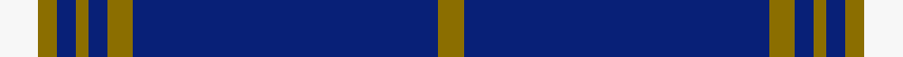

This is one **variant** — a specific cloth: this exact thread count and colourway, with its own
provenance below. It is one weaving of the [sett](/tartans/m/mo/morris/) (the scale-free proportion — the
same cloth at any scale or shade), whose colour order is pattern [GBGBGBGW](/stripes/gbgbgbgw/).

Part of the [Morris](/tartans/m/mo/morris/) tartan — the named design grouping this sett with its other cloths.

Sourced from tartans-authority.  It is a [8 stripe tartan](/stripes/stripes8/).

Original link <code>http://www.tartansauthority.com/tartan-ferret/display/5749/</code> — retired · [Internet Archive copy](https://web.archive.org/web/*/http://www.tartansauthority.com/tartan-ferret/display/5749/*)

## Provenance

Earliest known date: 2002 The tartan for this Welsh surname and its variations, Meyrick, Meurig, is actually woven in Wales at the Cambrian Woollen Mill, weaving on the same site since 1830. This tartan differs from many traditional patterns in that the warp and weft differ, giving the finished worsted wool cloth more of a predominant stripe, vertically noticeable in the finished Kilt, or Cilt in Wales.

2 attestations — the source records this cloth was collapsed from (oldest owns this page)

<ul>
<li>2002 — Morris (Welsh Name) (tartans-authority, <a href="https://web.archive.org/web/*/http://www.tartansauthority.com/tartan-ferret/display/5749/*">record</a>)  <em>The tartan for this Welsh surname and its variations, is commercially accepted as a tartan or ?plaid? in Wales, this is one of the tartans actually woven in Wales at the Cambrian Woollen Mill, weaving on the same site since 1830. This tartan differs from many traditional patterns in that the warp and weft differ, giving the finished worsted wool cloth more of a predominant ?stripe?, vertically noticeable in the finished Kilt, or ?Cilt? in Wales. Available from Wales Tartan Centres in Swansea, +44 (0)1792 474685.</em></li>
<li>2002 — Morris Welsh Name Tartan (house-of-tartan, <a href="http://www.house-of-tartan.scotland.net/house/TartanViewjs.asp?colr=Def&tnam=5749">record</a>) </li>
</ul>

Dataset <small>— provenance for this record, inherited from the source manifest</small>

<dl class="dataset-prov">
<dt>source</dt><dd><a href="/sources/tartans-authority/">Scottish Tartans Authority</a></dd>
<dt>data captured from</dt><dd><a href="https://github.com/thetartan/tartan-database/blob/master/data/tartans-authority/data.csv">https://github.com/thetartan/tartan-database/blob/master/data/tartans-authority/data.csv</a></dd>
<dt>data date</dt><dd>2002 <small>(this record)</small></dd>
<dt>licence</dt><dd><a href="https://creativecommons.org/licenses/by-nc-nd/4.0/">CC BY-NC-ND 4.0</a></dd>
</dl>

Capture chain <small>— the hands this data passed through, oldest first; each capture carries its own licence</small>

<ol class="capture-chain">
<li><a href="https://www.tartansauthority.com/">Scottish Tartans Authority</a> <small>the heritage body’s archive — its tartan-ferret record browser is retired; dead record links are shown unlinked, with an Internet Archive copy (ITI numbers are not SRT references)</small></li>
<li><a href="https://github.com/thetartan/tartan-database">thetartan/tartan-database</a> <small>2016-2017</small> · <a href="https://creativecommons.org/licenses/by-nc-nd/4.0/">CC BY-NC-ND 4.0</a> <small>Levko Kravets's frozen compilation — the capture we vendored, and where its CC licence text came from</small></li>
<li>this dictionary <small>captured 2026-06-10 · commit 5bf86c7566</small> <small>each re-capture is a git commit to data/sources</small></li>
</ol>

## Register references

External register numbers recorded for this tartan.

- Scottish Tartans Authority (ITI): 5749

## Thread count
W/6 Y3 DB3 Y2 DB3 Y4 DB48 Y/4

One full sett is **136 threads**.

## Palette
<table><thead><tr><th>Colour</th><th>Shade</th><th>OKLCh</th></tr></thead><tbody><tr><td>Y</td><td><code style="background-color:#8B6E00;">#8B6E00</code> <small style="color:#888">#8B6E00</small></td><td><small style="color:#888">oklch(55.1% 0.113 90.4)</small></td></tr><tr><td>W</td><td><code style="background-color:#F7F7F7;">#F7F7F7</code> <small style="color:#888">#F7F7F7</small></td><td><small style="color:#888">oklch(97.6% 0.000 89.9)</small></td></tr><tr><td>DB</td><td><code style="background-color:#082077;">#082077</code> <small style="color:#888">#082077</small></td><td><small style="color:#888">oklch(30.0% 0.149 265.1)</small></td></tr></tbody></table>

# Sample pattern

## Nearest tartan variants

The nearest existing variants by ΔTartan distance, with this cloth at the top so the swatches line up against it.

ΔTartan

Threads

Variant

Sett

—

136

<a href="/variants/s8/w6y3db3y2db3y4db48y4/">Morris (Welsh Name)</a>

<a href="/ttd/edit/#slug=y4db48y4db3y2db3y3w4&amp;base=w6y3db3y2db3y4db48y4" title="compare in the TTD">0.60</a>

134

<a href="/variants/s8/y4db48y4db3y2db3y3w4/">Morris of Wales</a>

<a href="/ttd/edit/#slug=db96y11db8y11db16y6w4y16w8&amp;base=w6y3db3y2db3y4db48y4" title="compare in the TTD">1.10</a>

248

<a href="/variants/s9/db96y11db8y11db16y6w4y16w8/">University of North Carolina at Greensboro, The</a>

<a href="/ttd/edit/#slug=db62w2db4w5db6y2dr8y3w4~x2&amp;base=w6y3db3y2db3y4db48y4" title="compare in the TTD">2.53</a>

252

<a href="/variants/s9/db62w2db4w5db6y2dr8y3w4~x2/">George, Stuart (Personal)</a>

<a href="/ttd/edit/#slug=db43ly5db1ly4db1ly2db7w1db2~x2&amp;base=w6y3db3y2db3y4db48y4" title="compare in the TTD">3.10</a>

174

<a href="/variants/s9/db43ly5db1ly4db1ly2db7w1db2~x2/">University of Delaware (Corporate)</a>

<a href="/ttd/edit/#slug=db48g4db6y2db2lr2db2g10lr6db2lr5~x2&amp;base=w6y3db3y2db3y4db48y4" title="compare in the TTD">3.11</a>

250

<a href="/variants/s11/db48g4db6y2db2lr2db2g10lr6db2lr5~x2/">Damson</a>

<a href="/ttd/edit/#slug=db67w10y14db10w2&amp;base=w6y3db3y2db3y4db48y4" title="compare in the TTD">3.16</a>

137

<a href="/variants/s5/db67w10y14db10w2/">St. John (Corporate?)</a>

<a href="/ttd/edit/#slug=db43y5db1y4db1y2db7w1db2~x2&amp;base=w6y3db3y2db3y4db48y4" title="compare in the TTD">3.18</a>

174

<a href="/variants/s9/db43y5db1y4db1y2db7w1db2~x2/">University of Delaware Fightin' Blue Hen</a>

<a href="/ttd/edit/#slug=db63ly3w3db8ly3db3w3db3r14db9ly3~x2&amp;base=w6y3db3y2db3y4db48y4" title="compare in the TTD">3.42</a>

328

<a href="/variants/s11/db63ly3w3db8ly3db3w3db3r14db9ly3~x2/">Ottawa Fire Service (Corporate)</a>

<a href="/ttd/edit/#slug=db144dr9lb44db4lb4db4&amp;base=w6y3db3y2db3y4db48y4" title="compare in the TTD">3.44</a>

270

<a href="/variants/s6/db144dr9lb44db4lb4db4/">United French Freemasons (Corporate</a>

<a href="/ttd/edit/#slug=db16lb4db1lb2db24w1y4~x2&amp;base=w6y3db3y2db3y4db48y4" title="compare in the TTD">3.47</a>

168

<a href="/variants/s7/db16lb4db1lb2db24w1y4~x2/">Talisker</a>

## Neighbour map

Every grey dot is one of 13656 variants placed by the first two principal components of the ΔTartan feature space (42% of its variance). Red is this tartan; blue dots are its nearest — click one to open its page. The map is a flat projection of a many-dimensional space — [how to read it](/posts/neighbourhood-maps/).

<svg viewBox="0 0 640 380" role="img" style="max-width:100%;height:auto;border:1px solid #e0e0e0;border-radius:4px;display:block" xmlns="http://www.w3.org/2000/svg"><image href="/nn/cloud.v1.png" width="640" height="380"/><a href="/variants/s8/y4db48y4db3y2db3y3w4/"><circle cx="535.7" cy="144.8" r="4" fill="#3465a4"><title>Morris of Wales</title></circle></a><a href="/variants/s9/db96y11db8y11db16y6w4y16w8/"><circle cx="462.4" cy="152.0" r="4" fill="#3465a4"><title>University of North Carolina at Greensboro, The</title></circle></a><a href="/variants/s9/db62w2db4w5db6y2dr8y3w4~x2/"><circle cx="495.9" cy="110.4" r="4" fill="#3465a4"><title>George, Stuart (Personal)</title></circle></a><a href="/variants/s9/db43ly5db1ly4db1ly2db7w1db2~x2/"><circle cx="603.2" cy="124.1" r="4" fill="#3465a4"><title>University of Delaware (Corporate)</title></circle></a><a href="/variants/s11/db48g4db6y2db2lr2db2g10lr6db2lr5~x2/"><circle cx="433.3" cy="122.2" r="4" fill="#3465a4"><title>Damson</title></circle></a><a href="/variants/s5/db67w10y14db10w2/"><circle cx="504.6" cy="172.7" r="4" fill="#3465a4"><title>St. John (Corporate?)</title></circle></a><a href="/variants/s9/db43y5db1y4db1y2db7w1db2~x2/"><circle cx="626.0" cy="125.7" r="4" fill="#3465a4"><title>University of Delaware Fightin' Blue Hen</title></circle></a><a href="/variants/s11/db63ly3w3db8ly3db3w3db3r14db9ly3~x2/"><circle cx="454.6" cy="105.3" r="4" fill="#3465a4"><title>Ottawa Fire Service (Corporate)</title></circle></a><a href="/variants/s6/db144dr9lb44db4lb4db4/"><circle cx="539.2" cy="162.1" r="4" fill="#3465a4"><title>United French Freemasons (Corporate</title></circle></a><a href="/variants/s7/db16lb4db1lb2db24w1y4~x2/"><circle cx="519.6" cy="165.4" r="4" fill="#3465a4"><title>Talisker</title></circle></a><circle cx="506.2" cy="144.1" r="5" fill="#c00000"/><text x="320" y="376" text-anchor="middle" font-size="11" fill="#999">ground</text><text x="11" y="190" text-anchor="middle" font-size="11" fill="#999" transform="rotate(-90 11 190)">complexity</text></svg>

ID: /variants/s8/w6y3db3y2db3y4db48y4/
