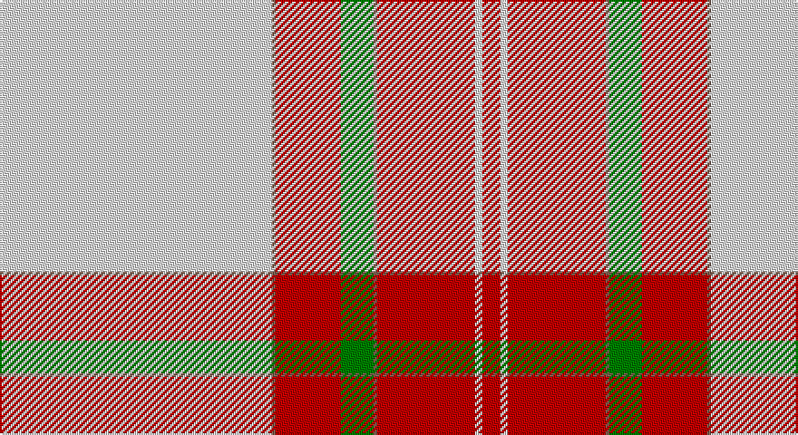

This page is one **sett** — a single exact thread-count. It belongs to the [tartan](/setts/w75o1r18g9o1r27w2r5/)
(the same proportion at any scale), whose colour order is pattern [RWRRGRRW](/stripes/rwrrgrrw/).

Part of the [Unidentified Ross-shire](/tartans/unidentified-ross-shire/) tartan — the named design grouping this sett with its other cloths.

Sourced from weddslist.  It is a [8 stripe tartan](/stripes/stripes8/).

Original link http://www.weddslist.com/cgi-bin/tartans/pg.pl?source=sts

## Also known as

This cloth is also recorded under:

- Unidentified, Ross-shire

## Thread count
LN/150 LT2 R36 G18 LT2 R54 LN4 R/10

One full sett is **392 threads**.

## Palette

Palette: <strong>Tartan Dictionary</strong> <small style="color:#888">(1 of 4 colours)</small>
<table><thead><tr><th>Colour</th><th>Threads</th><th>Shade</th><th>Base</th><th>OKLCh</th></tr></thead><tbody><tr><td>LN/</td><td style="text-align:right;font-variant-numeric:tabular-nums">150</td><td><code style="background-color:#E0E0E0;">#E0E0E0</code> <small style="color:#888">#E0E0E0</small></td><td>W <code style="background-color:#F7F7F7;">#F7F7F7</code></td><td><small style="color:#888">oklch(90.7% 0.000 89.9)</small></td></tr><tr><td>LT</td><td style="text-align:right;font-variant-numeric:tabular-nums">2</td><td><code style="background-color:#806050;">#806050</code> <small style="color:#888">#806050</small></td><td>R <code style="background-color:#CC0000;">#CC0000</code></td><td><small style="color:#888">oklch(51.7% 0.049 47.8)</small></td></tr><tr><td>R</td><td style="text-align:right;font-variant-numeric:tabular-nums">36</td><td><code style="background-color:#C00000;">#C00000</code> <small style="color:#888">#C00000</small></td><td>R <code style="background-color:#CC0000;">#CC0000</code></td><td><small style="color:#888">oklch(50.7% 0.208 29.2)</small></td></tr><tr><td>G</td><td style="text-align:right;font-variant-numeric:tabular-nums">18</td><td><code style="background-color:#008000;">#008000</code> <small style="color:#888">#008000</small></td><td>G <code style="background-color:#006100;">#006100</code></td><td><small style="color:#888">oklch(52.0% 0.177 142.5)</small></td></tr><tr><td>LT</td><td style="text-align:right;font-variant-numeric:tabular-nums">2</td><td><code style="background-color:#806050;">#806050</code> <small style="color:#888">#806050</small></td><td>R <code style="background-color:#CC0000;">#CC0000</code></td><td><small style="color:#888">oklch(51.7% 0.049 47.8)</small></td></tr><tr><td>R</td><td style="text-align:right;font-variant-numeric:tabular-nums">54</td><td><code style="background-color:#C00000;">#C00000</code> <small style="color:#888">#C00000</small></td><td>R <code style="background-color:#CC0000;">#CC0000</code></td><td><small style="color:#888">oklch(50.7% 0.208 29.2)</small></td></tr><tr><td>LN</td><td style="text-align:right;font-variant-numeric:tabular-nums">4</td><td><code style="background-color:#E0E0E0;">#E0E0E0</code> <small style="color:#888">#E0E0E0</small></td><td>W <code style="background-color:#F7F7F7;">#F7F7F7</code></td><td><small style="color:#888">oklch(90.7% 0.000 89.9)</small></td></tr><tr><td>R/</td><td style="text-align:right;font-variant-numeric:tabular-nums">10</td><td><code style="background-color:#C00000;">#C00000</code> <small style="color:#888">#C00000</small></td><td>R <code style="background-color:#CC0000;">#CC0000</code></td><td><small style="color:#888">oklch(50.7% 0.208 29.2)</small></td></tr></tbody></table>

# Sample pattern

## Compared to the master

This cloth is one sett of its design; the master sett (the exemplar the design is anchored on) is below for comparison.

<figure style="margin:0"><figcaption style="color:#888;font-size:smaller">this sett</figcaption></figure>
<figure style="margin:0"><figcaption style="color:#888;font-size:smaller"><a href="/setts/w75dy1r18dg9dy1r27w2r5/">master sett →</a></figcaption></figure>

## Nearest tartans

The nearest existing variants by ΔTartan distance, with this tartan at the top so the swatches line up against it.

ΔTartan

Tartan

Sett

—

<a href="/ttd/edit/#slug=w75o1r18g9o1r27w2r5~x2">Unidentified, Ross-shire</a> <a class="nn-out" href="/variants/s8/w75o1r18g9o1r27w2r5~x2/" title="open its dictionary page">↗</a>

0.23

<a href="/ttd/edit/#slug=w75dy1r18dg9dy1r27w2r5~x2&amp;base=w75o1r18g9o1r27w2r5~x2">Unidentified Ross-shire</a> <a class="nn-out" href="/variants/s8/w75dy1r18dg9dy1r27w2r5~x2/" title="open its dictionary page">↗</a>

0.38

<a href="/ttd/edit/#slug=w50k1r12w1dg12r13w1r2~x2&amp;base=w75o1r18g9o1r27w2r5~x2">Unidentified Blanket</a> <a class="nn-out" href="/variants/s8/w50k1r12w1dg12r13w1r2~x2/" title="open its dictionary page">↗</a>

0.53

<a href="/ttd/edit/#slug=w57k1r12w1g12r14w1r2~x2&amp;base=w75o1r18g9o1r27w2r5~x2">McBrayer Dress</a> <a class="nn-out" href="/variants/s8/w57k1r12w1g12r14w1r2~x2/" title="open its dictionary page">↗</a>

0.56

<a href="/ttd/edit/#slug=w50k1r12w1g12r13w1r2~x2&amp;base=w75o1r18g9o1r27w2r5~x2">Unidentified, Blanket</a> <a class="nn-out" href="/variants/s8/w50k1r12w1g12r13w1r2~x2/" title="open its dictionary page">↗</a>

0.81

<a href="/ttd/edit/#slug=w80k2r19w2dg19r22w2r4~x2&amp;base=w75o1r18g9o1r27w2r5~x2">Wilsons' Blanket Pattern (Artefact)</a> <a class="nn-out" href="/variants/s8/w80k2r19w2dg19r22w2r4~x2/" title="open its dictionary page">↗</a>

0.88

<a href="/ttd/edit/#slug=w50k1r14w1dg14r14w1r2~x4&amp;base=w75o1r18g9o1r27w2r5~x2">Wilson's Blanket Pattern</a> <a class="nn-out" href="/variants/s8/w50k1r14w1dg14r14w1r2~x4/" title="open its dictionary page">↗</a>

1.03

<a href="/ttd/edit/#slug=w30k1r7dg7r8w1r2~x4&amp;base=w75o1r18g9o1r27w2r5~x2">MMK 1777</a> <a class="nn-out" href="/variants/s7/w30k1r7dg7r8w1r2~x4/" title="open its dictionary page">↗</a>

1.15

<a href="/variants/s10/w52r22w6r8k1db3~x2/">MacGregor Dress Red Fancy Tartan</a>

1.20

<a href="/ttd/edit/#slug=w80t1r14t9r24w2r4~x2&amp;base=w75o1r18g9o1r27w2r5~x2">Unidentified Fisherwife's Plaid</a> <a class="nn-out" href="/variants/s7/w80t1r14t9r24w2r4~x2/" title="open its dictionary page">↗</a>

1.33

<a href="/ttd/edit/#slug=w52r22w6r8k1db3~x2&amp;base=w75o1r18g9o1r27w2r5~x2">MacGregor Dress Red (Dance)</a> <a class="nn-out" href="/variants/s6/w52r22w6r8k1db3~x2/" title="open its dictionary page">↗</a>

## Neighbour map

Every grey dot is one of 14360 variants placed by the first two principal components of the ΔTartan feature space (44% of its variance). Red is this tartan; blue dots are its nearest — click one to open its page.

<svg viewBox="0 0 640 380" role="img" style="max-width:100%;height:auto;border:1px solid #e0e0e0;border-radius:4px;display:block" xmlns="http://www.w3.org/2000/svg"><image href="/nn/cloud.v1.png" width="640" height="380"/><a href="/variants/s8/w75dy1r18dg9dy1r27w2r5~x2/"><circle cx="379.0" cy="74.3" r="4" fill="#3465a4"><title>Unidentified Ross-shire</title></circle></a><a href="/variants/s8/w50k1r12w1dg12r13w1r2~x2/"><circle cx="362.9" cy="74.9" r="4" fill="#3465a4"><title>Unidentified Blanket</title></circle></a><a href="/variants/s8/w57k1r12w1g12r14w1r2~x2/"><circle cx="390.2" cy="73.9" r="4" fill="#3465a4"><title>McBrayer Dress</title></circle></a><a href="/variants/s8/w50k1r12w1g12r13w1r2~x2/"><circle cx="362.4" cy="76.7" r="4" fill="#3465a4"><title>Unidentified, Blanket</title></circle></a><a href="/variants/s8/w80k2r19w2dg19r22w2r4~x2/"><circle cx="337.7" cy="77.0" r="4" fill="#3465a4"><title>Wilsons' Blanket Pattern (Artefact)</title></circle></a><a href="/variants/s8/w50k1r14w1dg14r14w1r2~x4/"><circle cx="328.1" cy="70.1" r="4" fill="#3465a4"><title>Wilson's Blanket Pattern</title></circle></a><a href="/variants/s7/w30k1r7dg7r8w1r2~x4/"><circle cx="330.7" cy="107.8" r="4" fill="#3465a4"><title>MMK 1777</title></circle></a><a href="/variants/s10/w52r22w6r8k1db3~x2/"><circle cx="339.3" cy="68.3" r="4" fill="#3465a4"><title>MacGregor Dress Red Fancy Tartan</title></circle></a><a href="/variants/s7/w80t1r14t9r24w2r4~x2/"><circle cx="435.1" cy="100.9" r="4" fill="#3465a4"><title>Unidentified Fisherwife's Plaid</title></circle></a><a href="/variants/s6/w52r22w6r8k1db3~x2/"><circle cx="403.0" cy="91.3" r="4" fill="#3465a4"><title>MacGregor Dress Red (Dance)</title></circle></a><circle cx="377.7" cy="75.9" r="5" fill="#c00000"/></svg>

ID: /variants/s8/w75o1r18g9o1r27w2r5~x2/
