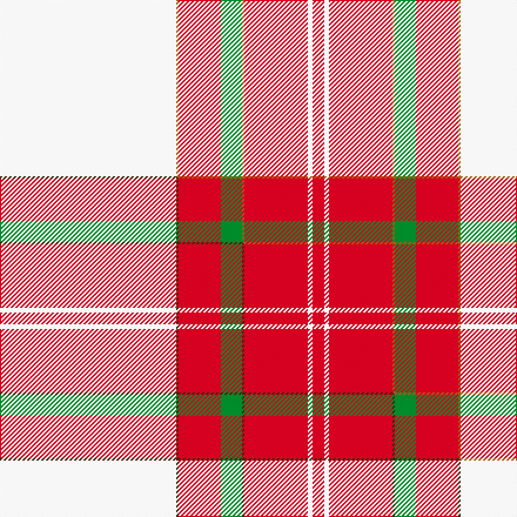

This page is one **sett** — a single exact thread-count. It belongs to the [tartan](/setts/w75o1r18g9o1r27w2r5/)
(the same proportion at any scale), whose colour order is pattern [RWRRGRRW](/stripes/rwrrgrrw/).

Part of the [Unidentified Ross-shire](/tartans/unidentified-ross-shire/) tartan — the named design grouping this sett with its other cloths.

Sourced from weddslist.  It is a [8 stripe tartan](/stripes/stripes8/).

Original link http://www.weddslist.com/cgi-bin/tartans/pg.pl?source=sts

## Thread count
W/150 O2 R36 G18 O2 R54 W4 R/10

One full sett is **392 threads**.

## Palette
<table><thead><tr><th>Colour</th><th>Shade</th><th>OKLCh</th></tr></thead><tbody><tr><td>G</td><td><code style="background-color:#008B2A;">#008B2A</code> <small style="color:#888">#008B2A</small></td><td><small style="color:#888">oklch(55.4% 0.170 145.9)</small></td></tr><tr><td>W</td><td><code style="background-color:#F7F7F7;">#F7F7F7</code> <small style="color:#888">#F7F7F7</small></td><td><small style="color:#888">oklch(97.6% 0.000 89.9)</small></td></tr><tr><td>O</td><td><code style="background-color:#A65C11;">#A65C11</code> <small style="color:#888">#A65C11</small></td><td><small style="color:#888">oklch(55.0% 0.125 58.3)</small></td></tr><tr><td>R</td><td><code style="background-color:#D60020;">#D60020</code> <small style="color:#888">#D60020</small></td><td><small style="color:#888">oklch(55.2% 0.224 25.5)</small></td></tr></tbody></table>

# Sample pattern

## Compared to the master

This cloth is one sett of its design; the master sett (the exemplar the design is anchored on) is below for comparison.

Its **ΔTartan distance** from the master is **0.21** — the same measure the nearest-tartans table ranks by (0 is identical; a re-scale of the same cloth is near 0, a recolour or a different proportion further).

<figure class="master-compare" style="margin:0">

this sett
master sett ★

<figcaption style="color:#888;font-size:smaller">One weave of this sett against the <a href="/setts/w75dy1r18g9dy1r27w2r5/">master sett ★</a>, split on the diagonal: a shared proportion runs seamlessly across it with only the shades shifting; a different proportion breaks on it.</figcaption>
</figure>

## Nearest tartan variants

The nearest existing variants by ΔTartan distance, with this cloth at the top so the swatches line up against it.

ΔTartan

Threads

Variant

Sett

—

392

<a href="/variants/s8/w75o1r18g9o1r27w2r5~x2/">Unidentified, Ross-shire</a>

<a href="/ttd/edit/#slug=w75dy1r18g9dy1r27w2r5~x2&amp;base=w75o1r18g9o1r27w2r5~x2" title="compare in the TTD">0.60</a>

392

<a href="/variants/s8/w75dy1r18g9dy1r27w2r5~x2/">Unidentified Ross-shire</a>

<a href="/ttd/edit/#slug=w80lb1r14lb9r24w2r4~x2&amp;base=w75o1r18g9o1r27w2r5~x2" title="compare in the TTD">1.16</a>

368

<a href="/variants/s7/w80lb1r14lb9r24w2r4~x2/">Unidentified Fisherwife's Plaid</a>

<a href="/ttd/edit/#slug=r42b2w2b2r5ri12w32r4~x2~r1707016-ri2008029&amp;base=w75o1r18g9o1r27w2r5~x2" title="compare in the TTD">2.50</a>

312

<a href="/variants/s8/r42b2w2b2r5ri12w32r4~x2~r1707016-ri2008029/">Longniddry, dress Burgundy</a>

<a href="/ttd/edit/#slug=r36w1db3y1g16r8db3w5&amp;base=w75o1r18g9o1r27w2r5~x2" title="compare in the TTD">2.60</a>

105

<a href="/variants/s8/r36w1db3y1g16r8db3w5/">Drummond of Perth</a>

<a href="/ttd/edit/#slug=r56w2db6w2g32r11db6w5&amp;base=w75o1r18g9o1r27w2r5~x2" title="compare in the TTD">2.60</a>

179

<a href="/variants/s8/r56w2db6w2g32r11db6w5/">Spens</a>

<a href="/ttd/edit/#slug=g3r2dp2r30w30g2w3~x2&amp;base=w75o1r18g9o1r27w2r5~x2" title="compare in the TTD">2.70</a>

276

<a href="/variants/s7/g3r2dp2r30w30g2w3~x2/">Torridon, Burgundy (Dance)</a>

## Neighbour map

Every grey dot is one of 13620 variants placed by the first two principal components of the ΔTartan feature space (42% of its variance). Red is this tartan; blue dots are its nearest — click one to open its page.

<svg viewBox="0 0 640 380" role="img" style="max-width:100%;height:auto;border:1px solid #e0e0e0;border-radius:4px;display:block" xmlns="http://www.w3.org/2000/svg"><image href="/nn/cloud.v1.png" width="640" height="380"/><a href="/variants/s8/w75dy1r18g9dy1r27w2r5~x2/"><circle cx="371.1" cy="97.2" r="4" fill="#3465a4"><title>Unidentified Ross-shire</title></circle></a><a href="/variants/s7/w80lb1r14lb9r24w2r4~x2/"><circle cx="441.0" cy="126.5" r="4" fill="#3465a4"><title>Unidentified Fisherwife's Plaid</title></circle></a><a href="/variants/s8/r42b2w2b2r5ri12w32r4~x2~r1707016-ri2008029/"><circle cx="292.1" cy="133.0" r="4" fill="#3465a4"><title>Longniddry, dress Burgundy</title></circle></a><a href="/variants/s8/r36w1db3y1g16r8db3w5/"><circle cx="366.2" cy="104.0" r="4" fill="#3465a4"><title>Drummond of Perth</title></circle></a><a href="/variants/s8/r56w2db6w2g32r11db6w5/"><circle cx="348.5" cy="130.6" r="4" fill="#3465a4"><title>Spens</title></circle></a><a href="/variants/s7/g3r2dp2r30w30g2w3~x2/"><circle cx="291.1" cy="155.5" r="4" fill="#3465a4"><title>Torridon, Burgundy (Dance)</title></circle></a><circle cx="370.1" cy="95.7" r="5" fill="#c00000"/><text x="320" y="376" text-anchor="middle" font-size="11" fill="#999">ground</text><text x="11" y="190" text-anchor="middle" font-size="11" fill="#999" transform="rotate(-90 11 190)">complexity</text></svg>

ID: /variants/s8/w75o1r18g9o1r27w2r5~x2/
