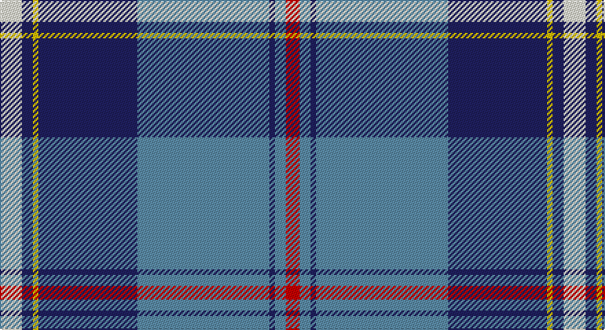

This page is one **sett** — a single exact thread-count. It belongs to the [tartan](/setts/w8db4ly2db36t48db2t4r5/)
(the same proportion at any scale), whose colour order is pattern [RBBBBYBW](/stripes/rbbbbybw/).

Sourced from register-of-tartans.  It is a [8 stripe tartan](/stripes/stripes8/).

Original link https://www.tartanregister.gov.uk/tartanDetails.aspx?ref=2758

2 attestations — the source records this cloth was collapsed from (oldest owns this page)

<ul>
<li>01/10/2007 — MacRaes of America (register-of-tartans, <a href="https://www.tartanregister.gov.uk/tartanDetails.aspx?ref=2758">record</a>)</li>
<li>Octpber 2007 — MacRaes of America (tartans-authority, <a href="http://www.tartansauthority.com/tartan-ferret/display/7304/">record</a>)</li>
</ul>

## Register references

External register numbers recorded for this tartan.

- Scottish Register of Tartans: [2758](https://www.tartanregister.gov.uk/tartanDetails.aspx?ref=2758)
- Scottish Tartans Authority (ITI): 7304

## Thread count
LY/16 DB8 Y4 DB72 B96 DB4 B8 R/10

One full sett is **410 threads**.

## Palette

Palette: <strong>Tartan Register</strong> <small style="color:#888">(4 of 5 colours)</small>
<table><thead><tr><th>Colour</th><th>Threads</th><th>Shade</th><th>Base</th><th>OKLCh</th></tr></thead><tbody><tr><td>LY/</td><td style="text-align:right;font-variant-numeric:tabular-nums">16</td><td><code style="background-color:#F0F0D8;">#F0F0D8</code> <small style="color:#888">#F0F0D8</small></td><td>W <code style="background-color:#F7F7F7;">#F7F7F7</code></td><td><small style="color:#888">oklch(94.9% 0.032 107.0)</small></td></tr><tr><td>DB</td><td style="text-align:right;font-variant-numeric:tabular-nums">8</td><td><code style="background-color:#202060;">#202060</code> <small style="color:#888">#202060</small></td><td>B <code style="background-color:#2A418A;">#2A418A</code></td><td><small style="color:#888">oklch(28.9% 0.111 276.9)</small></td></tr><tr><td>Y</td><td style="text-align:right;font-variant-numeric:tabular-nums">4</td><td><code style="background-color:#E8C000;">#E8C000</code> <small style="color:#888">#E8C000</small></td><td>Y <code style="background-color:#F2BF00;">#F2BF00</code></td><td><small style="color:#888">oklch(81.9% 0.168 93.7)</small></td></tr><tr><td>DB</td><td style="text-align:right;font-variant-numeric:tabular-nums">72</td><td><code style="background-color:#202060;">#202060</code> <small style="color:#888">#202060</small></td><td>B <code style="background-color:#2A418A;">#2A418A</code></td><td><small style="color:#888">oklch(28.9% 0.111 276.9)</small></td></tr><tr><td>B</td><td style="text-align:right;font-variant-numeric:tabular-nums">96</td><td><code style="background-color:#5C8CA8;">#5C8CA8</code> <small style="color:#888">#5C8CA8</small></td><td>B <code style="background-color:#2A418A;">#2A418A</code></td><td><small style="color:#888">oklch(61.7% 0.067 235.0)</small></td></tr><tr><td>DB</td><td style="text-align:right;font-variant-numeric:tabular-nums">4</td><td><code style="background-color:#202060;">#202060</code> <small style="color:#888">#202060</small></td><td>B <code style="background-color:#2A418A;">#2A418A</code></td><td><small style="color:#888">oklch(28.9% 0.111 276.9)</small></td></tr><tr><td>B</td><td style="text-align:right;font-variant-numeric:tabular-nums">8</td><td><code style="background-color:#5C8CA8;">#5C8CA8</code> <small style="color:#888">#5C8CA8</small></td><td>B <code style="background-color:#2A418A;">#2A418A</code></td><td><small style="color:#888">oklch(61.7% 0.067 235.0)</small></td></tr><tr><td>R/</td><td style="text-align:right;font-variant-numeric:tabular-nums">10</td><td><code style="background-color:#C80000;">#C80000</code> <small style="color:#888">#C80000</small></td><td>R <code style="background-color:#CC0000;">#CC0000</code></td><td><small style="color:#888">oklch(52.3% 0.215 29.2)</small></td></tr></tbody></table>

# Sample pattern

## Nearest tartans

The nearest existing variants by ΔTartan distance, with this tartan at the top so the swatches line up against it.

ΔTartan

Tartan

Sett

—

<a href="/ttd/edit/#slug=w8db4ly2db36t48db2t4r5~x2">MacRaes of America</a> <a class="nn-out" href="/variants/s8/w8db4ly2db36t48db2t4r5~x2/" title="open its dictionary page">↗</a>

0.83

<a href="/ttd/edit/#slug=t14lb1t3lo2t3lb1t4db24r3~x4&amp;base=w8db4ly2db36t48db2t4r5~x2">Musselburgh</a> <a class="nn-out" href="/variants/s9/t14lb1t3lo2t3lb1t4db24r3~x4/" title="open its dictionary page">↗</a>

0.86

<a href="/ttd/edit/#slug=b20m1w3dt1w2dt8g3w1~x4&amp;base=w8db4ly2db36t48db2t4r5~x2">Kruenaegel and Schropp</a> <a class="nn-out" href="/variants/s8/b20m1w3dt1w2dt8g3w1~x4/" title="open its dictionary page">↗</a>

0.90

<a href="/ttd/edit/#slug=b20r1w3db1w2db8g3w1~x4&amp;base=w8db4ly2db36t48db2t4r5~x2">Kruenaegel and Schropp (Name)</a> <a class="nn-out" href="/variants/s8/b20r1w3db1w2db8g3w1~x4/" title="open its dictionary page">↗</a>

0.97

<a href="/ttd/edit/#slug=w3lg15dbi6db2dbi1db2dbi1db21ly2~x2&amp;base=w8db4ly2db36t48db2t4r5~x2">Blue Knights, The</a> <a class="nn-out" href="/variants/s9/w3lg15dbi6db2dbi1db2dbi1db21ly2~x2/" title="open its dictionary page">↗</a>

0.99

<a href="/ttd/edit/#slug=w10db2w1db35g10lo3g10r4~x2&amp;base=w8db4ly2db36t48db2t4r5~x2">Sandelin (Personal)</a> <a class="nn-out" href="/variants/s8/w10db2w1db35g10lo3g10r4~x2/" title="open its dictionary page">↗</a>

1.01

<a href="/variants/s8/t72r16k5ly2dt16~x2/">Thomas Jean Marc Personal Tartan</a>

1.07

<a href="/ttd/edit/#slug=db42lbi2lb2lbi2db5dt12lb32db4~x2&amp;base=w8db4ly2db36t48db2t4r5~x2">Longniddry Eildon Blue Dress Fancy Tartan</a> <a class="nn-out" href="/variants/s8/db42lbi2lb2lbi2db5dt12lb32db4~x2/" title="open its dictionary page">↗</a>

1.09

<a href="/ttd/edit/#slug=b24k8g8r2g4k1w2k1g4~x2&amp;base=w8db4ly2db36t48db2t4r5~x2">Ferguson (Tarlogie)</a> <a class="nn-out" href="/variants/s9/b24k8g8r2g4k1w2k1g4~x2/" title="open its dictionary page">↗</a>

1.10

<a href="/ttd/edit/#slug=dt42t2w2t2dt5k12w32db4~x2&amp;base=w8db4ly2db36t48db2t4r5~x2">Comrie, Navy Blue (Dance)</a> <a class="nn-out" href="/variants/s8/dt42t2w2t2dt5k12w32db4~x2/" title="open its dictionary page">↗</a>

1.13

<a href="/ttd/edit/#slug=ly4db24t5g2db3k5t33r2~x2&amp;base=w8db4ly2db36t48db2t4r5~x2">Los Angeles</a> <a class="nn-out" href="/variants/s8/ly4db24t5g2db3k5t33r2~x2/" title="open its dictionary page">↗</a>

## Neighbour map

Every grey dot is one of 14360 variants placed by the first two principal components of the ΔTartan feature space (44% of its variance). Red is this tartan; blue dots are its nearest — click one to open its page.

<svg viewBox="0 0 640 380" role="img" style="max-width:100%;height:auto;border:1px solid #e0e0e0;border-radius:4px;display:block" xmlns="http://www.w3.org/2000/svg"><image href="/nn/cloud.v1.png" width="640" height="380"/><a href="/variants/s9/t14lb1t3lo2t3lb1t4db24r3~x4/"><circle cx="273.4" cy="123.2" r="4" fill="#3465a4"><title>Musselburgh</title></circle></a><a href="/variants/s8/b20m1w3dt1w2dt8g3w1~x4/"><circle cx="281.8" cy="133.0" r="4" fill="#3465a4"><title>Kruenaegel and Schropp</title></circle></a><a href="/variants/s8/b20r1w3db1w2db8g3w1~x4/"><circle cx="264.1" cy="123.8" r="4" fill="#3465a4"><title>Kruenaegel and Schropp (Name)</title></circle></a><a href="/variants/s9/w3lg15dbi6db2dbi1db2dbi1db21ly2~x2/"><circle cx="246.9" cy="126.8" r="4" fill="#3465a4"><title>Blue Knights, The</title></circle></a><a href="/variants/s8/w10db2w1db35g10lo3g10r4~x2/"><circle cx="273.1" cy="113.0" r="4" fill="#3465a4"><title>Sandelin (Personal)</title></circle></a><a href="/variants/s8/t72r16k5ly2dt16~x2/"><circle cx="326.3" cy="104.3" r="4" fill="#3465a4"><title>Thomas Jean Marc Personal Tartan</title></circle></a><a href="/variants/s8/db42lbi2lb2lbi2db5dt12lb32db4~x2/"><circle cx="288.7" cy="139.6" r="4" fill="#3465a4"><title>Longniddry Eildon Blue Dress Fancy Tartan</title></circle></a><a href="/variants/s9/b24k8g8r2g4k1w2k1g4~x2/"><circle cx="244.7" cy="127.6" r="4" fill="#3465a4"><title>Ferguson (Tarlogie)</title></circle></a><a href="/variants/s8/dt42t2w2t2dt5k12w32db4~x2/"><circle cx="229.9" cy="116.0" r="4" fill="#3465a4"><title>Comrie, Navy Blue (Dance)</title></circle></a><a href="/variants/s8/ly4db24t5g2db3k5t33r2~x2/"><circle cx="250.6" cy="128.9" r="4" fill="#3465a4"><title>Los Angeles</title></circle></a><circle cx="283.3" cy="120.9" r="5" fill="#c00000"/></svg>

ID: /variants/s8/w8db4ly2db36t48db2t4r5~x2/
