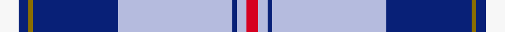

This is one **variant** — a specific cloth: this exact thread count and colourway, with its own
provenance below. It is one weaving of the [sett](/setts/w8db4y2db36lb48db2lb4r5/) (the scale-free proportion — the
same cloth at any scale or shade), whose colour order is pattern [RWBWBGBW](/stripes/rwbwbgbw/).

Sourced from register-of-tartans.  It is a [8 stripe tartan](/stripes/stripes8/).

Original link [https://www.tartanregister.gov.uk/tartanDetails.aspx?ref=2758](https://www.tartanregister.gov.uk/tartanDetails.aspx?ref=2758)

2 attestations — the source records this cloth was collapsed from (oldest owns this page)

<ul>
<li>01/10/2007 — MacRaes of America (register-of-tartans, <a href="https://www.tartanregister.gov.uk/tartanDetails.aspx?ref=2758">record</a>)  <em>New design for Clan Macrae of North America requested by Captain John MacRae-Hall President of the Clan MacRae Society of North America. Being woven by Fraser & Kirkbright of Vancouver.</em></li>
<li>Octpber 2007 — MacRaes of America (tartans-authority, <a href="https://www.tartanregister.gov.uk/tartanDetails.aspx?ref=7304">record</a>)  <em>New design for Clan Macrae of North America requested by Captain John MacRae-Hall President of the Clan MacRae Society of North America. Being woven by Fraser & Kirkbright of Vancouver.</em></li>
</ul>

Dataset <small>— provenance for this record, inherited from the source manifest</small>

<dl class="dataset-prov">
<dt>source</dt><dd><a href="/sources/register-of-tartans/">Scottish Register of Tartans</a></dd>
<dt>data captured from</dt><dd><a href="https://github.com/thetartan/tartan-database/blob/master/data/register-of-tartans/data.csv">https://github.com/thetartan/tartan-database/blob/master/data/register-of-tartans/data.csv</a></dd>
<dt>data date</dt><dd>01/10/2007 <small>(this record)</small></dd>
<dt>licence</dt><dd><a href="https://www.tartanregister.gov.uk/copyright">Crown copyright</a></dd>
</dl>

Capture chain <small>— the hands this data passed through, oldest first; each capture carries its own licence</small>

<ol class="capture-chain">
<li><a href="https://www.tartanregister.gov.uk/">Scottish Register of Tartans</a> · <a href="https://www.tartanregister.gov.uk/copyright">Crown copyright</a> <small>the living register — still published by National Records of Scotland</small></li>
<li><a href="https://github.com/thetartan/tartan-database">thetartan/tartan-database</a> <small>2016-2017</small> · <a href="https://creativecommons.org/licenses/by-nc-nd/4.0/">CC BY-NC-ND 4.0</a> <small>Levko Kravets's frozen compilation — the capture we vendored, and where its CC licence text came from</small></li>
<li>this dictionary <small>captured 2026-06-10 · commit 5bf86c7566</small> <small>each re-capture is a git commit to data/sources</small></li>
</ol>

## Register references

External register numbers recorded for this tartan.

- Scottish Register of Tartans: [2758](https://www.tartanregister.gov.uk/tartanDetails.aspx?ref=2758)
- Scottish Tartans Authority (ITI): 7304

## Thread count
W/16 DB8 Y4 DB72 LB96 DB4 LB8 R/10

One full sett is **410 threads**.

## Palette
<table><thead><tr><th>Colour</th><th>Shade</th><th>OKLCh</th></tr></thead><tbody><tr><td>LB</td><td><code style="background-color:#B5BBDE;">#B5BBDE</code> <small style="color:#888">#B5BBDE</small></td><td><small style="color:#888">oklch(79.9% 0.050 277.6)</small></td></tr><tr><td>DB</td><td><code style="background-color:#082077;">#082077</code> <small style="color:#888">#082077</small></td><td><small style="color:#888">oklch(30.0% 0.149 265.1)</small></td></tr><tr><td>W</td><td><code style="background-color:#F7F7F7;">#F7F7F7</code> <small style="color:#888">#F7F7F7</small></td><td><small style="color:#888">oklch(97.6% 0.000 89.9)</small></td></tr><tr><td>R</td><td><code style="background-color:#D60020;">#D60020</code> <small style="color:#888">#D60020</small></td><td><small style="color:#888">oklch(55.2% 0.224 25.5)</small></td></tr><tr><td>Y</td><td><code style="background-color:#8B6E00;">#8B6E00</code> <small style="color:#888">#8B6E00</small></td><td><small style="color:#888">oklch(55.1% 0.113 90.4)</small></td></tr></tbody></table>

# Sample pattern

## Nearest tartan variants

The nearest existing variants by ΔTartan distance, with this cloth at the top so the swatches line up against it.

ΔTartan

Threads

Variant

Sett

—

410

<a href="/variants/s8/w8db4y2db36lb48db2lb4r5~x2/">MacRaes of America</a>

<a href="/ttd/edit/#slug=lb14w1lb3y2lb3w1lb4db24r3~x2&amp;base=w8db4y2db36lb48db2lb4r5~x2" title="compare in the TTD">1.49</a>

186

<a href="/variants/s9/lb14w1lb3y2lb3w1lb4db24r3~x2/">Musselburgh District Tartan</a>

<a href="/ttd/edit/#slug=lb49db25g16db4w3r8ly4lb18ly1db9~x2&amp;base=w8db4y2db36lb48db2lb4r5~x2" title="compare in the TTD">1.59</a>

432

<a href="/variants/s10/lb49db25g16db4w3r8ly4lb18ly1db9~x2/">State Seal of Hawaii (Fashion)</a>

<a href="/ttd/edit/#slug=db7r3db26lb2db2lb26y4~x2&amp;base=w8db4y2db36lb48db2lb4r5~x2" title="compare in the TTD">1.69</a>

258

<a href="/variants/s7/db7r3db26lb2db2lb26y4~x2/">Int. Police Association (Official)</a>

<a href="/ttd/edit/#slug=db14r6db52lb4db4lb51y8&amp;base=w8db4y2db36lb48db2lb4r5~x2" title="compare in the TTD">1.70</a>

256

<a href="/variants/s7/db14r6db52lb4db4lb51y8/">International Police Association (IPA 2010)</a>

<a href="/ttd/edit/#slug=y6r21b2dg6b41lb2b2lb6&amp;base=w8db4y2db36lb48db2lb4r5~x2" title="compare in the TTD">1.83</a>

160

<a href="/variants/s8/y6r21b2dg6b41lb2b2lb6/">Manitoba</a>

<a href="/ttd/edit/#slug=w4lb1y2lb22db20w2db4w2~x2&amp;base=w8db4y2db36lb48db2lb4r5~x2" title="compare in the TTD">1.95</a>

216

<a href="/variants/s8/w4lb1y2lb22db20w2db4w2~x2/">Gorman Blue (Personal)</a>

<a href="/ttd/edit/#slug=dp1g1db2y1db16lb16db1w2r1~x4&amp;base=w8db4y2db36lb48db2lb4r5~x2" title="compare in the TTD">2.10</a>

320

<a href="/variants/s9/dp1g1db2y1db16lb16db1w2r1~x4/">Eastern States Exposition-West Springfield</a>

<a href="/ttd/edit/#slug=lb28db15r2db2w1db6~x2&amp;base=w8db4y2db36lb48db2lb4r5~x2" title="compare in the TTD">2.12</a>

148

<a href="/variants/s6/lb28db15r2db2w1db6~x2/">Corries</a>

<a href="/ttd/edit/#slug=dt4w2dt1lb24dt10w1db2w5db3r2~x2~dt1204274-db1106275&amp;base=w8db4y2db36lb48db2lb4r5~x2" title="compare in the TTD">2.15</a>

204

<a href="/variants/s10/dbi4w2dbi1lb24dbi10w1db2w5db3r2~x2~dbi1204274-db1106275/">Rikaco Morning Dew 1 (Fashion)</a>

<a href="/ttd/edit/#slug=r2db36lb36w3lb36db36y2~x2&amp;base=w8db4y2db36lb48db2lb4r5~x2" title="compare in the TTD">2.63</a>

596

<a href="/variants/s7/r2db36lb36w3lb36db36y2~x2/">MacKerrell</a>

## Neighbour map

Every grey dot is one of 13621 variants placed by the first two principal components of the ΔTartan feature space (42% of its variance). Red is this tartan; blue dots are its nearest — click one to open its page.

<svg viewBox="0 0 640 380" role="img" style="max-width:100%;height:auto;border:1px solid #e0e0e0;border-radius:4px;display:block" xmlns="http://www.w3.org/2000/svg"><image href="/nn/cloud.v1.png" width="640" height="380"/><a href="/variants/s9/lb14w1lb3y2lb3w1lb4db24r3~x2/"><circle cx="262.7" cy="124.3" r="4" fill="#3465a4"><title>Musselburgh District Tartan</title></circle></a><a href="/variants/s10/lb49db25g16db4w3r8ly4lb18ly1db9~x2/"><circle cx="261.9" cy="97.6" r="4" fill="#3465a4"><title>State Seal of Hawaii (Fashion)</title></circle></a><a href="/variants/s7/db7r3db26lb2db2lb26y4~x2/"><circle cx="287.5" cy="179.9" r="4" fill="#3465a4"><title>Int. Police Association (Official)</title></circle></a><a href="/variants/s7/db14r6db52lb4db4lb51y8/"><circle cx="288.5" cy="180.0" r="4" fill="#3465a4"><title>International Police Association (IPA 2010)</title></circle></a><a href="/variants/s8/y6r21b2dg6b41lb2b2lb6/"><circle cx="329.6" cy="146.2" r="4" fill="#3465a4"><title>Manitoba</title></circle></a><a href="/variants/s8/w4lb1y2lb22db20w2db4w2~x2/"><circle cx="282.1" cy="166.9" r="4" fill="#3465a4"><title>Gorman Blue (Personal)</title></circle></a><a href="/variants/s9/dp1g1db2y1db16lb16db1w2r1~x4/"><circle cx="223.2" cy="102.3" r="4" fill="#3465a4"><title>Eastern States Exposition-West Springfield</title></circle></a><a href="/variants/s6/lb28db15r2db2w1db6~x2/"><circle cx="334.6" cy="154.0" r="4" fill="#3465a4"><title>Corries</title></circle></a><a href="/variants/s10/dbi4w2dbi1lb24dbi10w1db2w5db3r2~x2~dbi1204274-db1106275/"><circle cx="231.7" cy="115.8" r="4" fill="#3465a4"><title>Rikaco Morning Dew 1 (Fashion)</title></circle></a><a href="/variants/s7/r2db36lb36w3lb36db36y2~x2/"><circle cx="265.6" cy="173.6" r="4" fill="#3465a4"><title>MacKerrell</title></circle></a><circle cx="281.8" cy="129.7" r="5" fill="#c00000"/><text x="320" y="376" text-anchor="middle" font-size="11" fill="#999">ground</text><text x="11" y="190" text-anchor="middle" font-size="11" fill="#999" transform="rotate(-90 11 190)">complexity</text></svg>

ID: /variants/s8/w8db4y2db36lb48db2lb4r5~x2/
