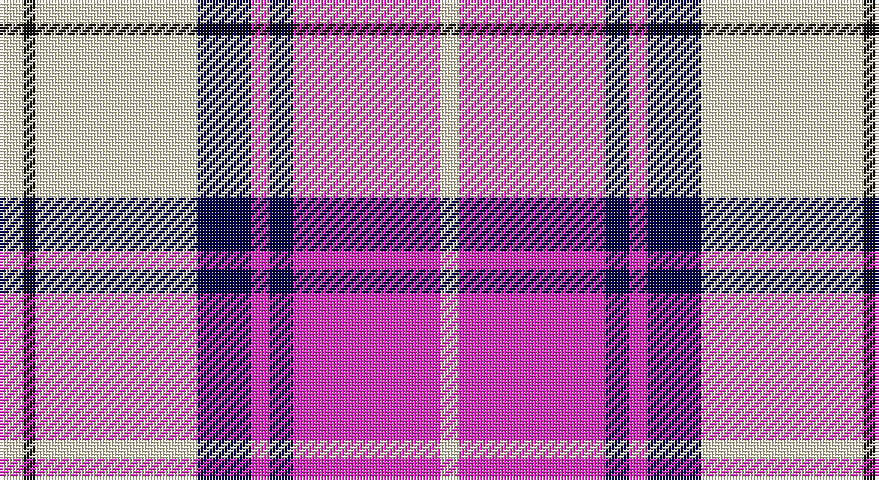

This page is one **sett** — a single exact thread-count. It belongs to the [tartan](/setts/w8k4w54db18m6db8m49w6/)
(the same proportion at any scale), whose colour order is pattern [WKWBRBRW](/stripes/wkwbrbrw/).

Sourced from register-of-tartans.  It is a [8 stripe tartan](/stripes/stripes8/).

Original link https://www.tartanregister.gov.uk/tartanDetails.aspx?ref=11142

## Register references

External register numbers recorded for this tartan.

- Scottish Register of Tartans: [11142](https://www.tartanregister.gov.uk/tartanDetails.aspx?ref=11142)

## Thread count
LY/8 K4 LY54 DB18 LR6 DB8 LR49 LY/6

One full sett is **292 threads**.

## Palette

Palette: <strong>Tartan Register</strong> <small style="color:#888">(2 of 4 colours)</small>
<table><thead><tr><th>Colour</th><th>Threads</th><th>Shade</th><th>Base</th><th>OKLCh</th></tr></thead><tbody><tr><td>LY/</td><td style="text-align:right;font-variant-numeric:tabular-nums">8</td><td><code style="background-color:#F8F4D0;">#F8F4D0</code> <small style="color:#888">#F8F4D0</small></td><td>W <code style="background-color:#F7F7F7;">#F7F7F7</code></td><td><small style="color:#888">oklch(96.1% 0.047 102.0)</small></td></tr><tr><td>K</td><td style="text-align:right;font-variant-numeric:tabular-nums">4</td><td><code style="background-color:#101010;">#101010</code> <small style="color:#888">#101010</small></td><td>K <code style="background-color:#000000;">#000000</code></td><td><small style="color:#888">oklch(17.3% 0.000 89.9)</small></td></tr><tr><td>LY</td><td style="text-align:right;font-variant-numeric:tabular-nums">54</td><td><code style="background-color:#F8F4D0;">#F8F4D0</code> <small style="color:#888">#F8F4D0</small></td><td>W <code style="background-color:#F7F7F7;">#F7F7F7</code></td><td><small style="color:#888">oklch(96.1% 0.047 102.0)</small></td></tr><tr><td>DB</td><td style="text-align:right;font-variant-numeric:tabular-nums">18</td><td><code style="background-color:#000048;">#000048</code> <small style="color:#888">#000048</small></td><td>B <code style="background-color:#2A418A;">#2A418A</code></td><td><small style="color:#888">oklch(18.2% 0.126 264.1)</small></td></tr><tr><td>LR</td><td style="text-align:right;font-variant-numeric:tabular-nums">6</td><td><code style="background-color:#EC34C4;">#EC34C4</code> <small style="color:#888">#EC34C4</small></td><td>R <code style="background-color:#CC0000;">#CC0000</code></td><td><small style="color:#888">oklch(65.8% 0.255 338.8)</small></td></tr><tr><td>DB</td><td style="text-align:right;font-variant-numeric:tabular-nums">8</td><td><code style="background-color:#000048;">#000048</code> <small style="color:#888">#000048</small></td><td>B <code style="background-color:#2A418A;">#2A418A</code></td><td><small style="color:#888">oklch(18.2% 0.126 264.1)</small></td></tr><tr><td>LR</td><td style="text-align:right;font-variant-numeric:tabular-nums">49</td><td><code style="background-color:#EC34C4;">#EC34C4</code> <small style="color:#888">#EC34C4</small></td><td>R <code style="background-color:#CC0000;">#CC0000</code></td><td><small style="color:#888">oklch(65.8% 0.255 338.8)</small></td></tr><tr><td>LY/</td><td style="text-align:right;font-variant-numeric:tabular-nums">6</td><td><code style="background-color:#F8F4D0;">#F8F4D0</code> <small style="color:#888">#F8F4D0</small></td><td>W <code style="background-color:#F7F7F7;">#F7F7F7</code></td><td><small style="color:#888">oklch(96.1% 0.047 102.0)</small></td></tr></tbody></table>

# Sample pattern

## Nearest tartans

The nearest existing variants by ΔTartan distance, with this tartan at the top so the swatches line up against it.

ΔTartan

Tartan

Sett

—

<a href="/ttd/edit/#slug=w8k4w54db18m6db8m49w6">Merida Dance</a> <a class="nn-out" href="/variants/s8/w8k4w54db18m6db8m49w6/" title="open its dictionary page">↗</a>

0.72

<a href="/ttd/edit/#slug=w8k6w54db16m6db8m49w6&amp;base=w8k4w54db18m6db8m49w6">Meridia Dance</a> <a class="nn-out" href="/variants/s8/w8k6w54db16m6db8m49w6/" title="open its dictionary page">↗</a>

1.06

<a href="/ttd/edit/#slug=dp8db2dp24db5w26k2w8~x2&amp;base=w8k4w54db18m6db8m49w6">Lennox Purple Dress District Tartan</a> <a class="nn-out" href="/variants/s7/dp8db2dp24db5w26k2w8~x2/" title="open its dictionary page">↗</a>

1.08

<a href="/ttd/edit/#slug=w5k3w31p26w4p10t4~x2&amp;base=w8k4w54db18m6db8m49w6">MacPherson, dress (purple)</a> <a class="nn-out" href="/variants/s7/w5k3w31p26w4p10t4~x2/" title="open its dictionary page">↗</a>

1.08

<a href="/ttd/edit/#slug=w5dp2w34dp34k2dp2t4~x2&amp;base=w8k4w54db18m6db8m49w6">Cunningham Dress Purple (Dance)</a> <a class="nn-out" href="/variants/s7/w5dp2w34dp34k2dp2t4~x2/" title="open its dictionary page">↗</a>

1.09

<a href="/ttd/edit/#slug=w5k3w31dp26w4dp10t4~x2&amp;base=w8k4w54db18m6db8m49w6">MacPherson Dress Purple</a> <a class="nn-out" href="/variants/s7/w5k3w31dp26w4dp10t4~x2/" title="open its dictionary page">↗</a>

1.23

<a href="/ttd/edit/#slug=w4dbi2w1r2w16dbi16r16dbi12db1w4~x2&amp;base=w8k4w54db18m6db8m49w6">Spirit of Russia, The</a> <a class="nn-out" href="/variants/s10/w4dbi2w1r2w16dbi16r16dbi12db1w4~x2/" title="open its dictionary page">↗</a>

1.26

<a href="/ttd/edit/#slug=t1dp3k2w1dp8w1k2w9k1w3t1~x6&amp;base=w8k4w54db18m6db8m49w6">MacRae, Dress Purple (Dance)</a> <a class="nn-out" href="/variants/s11/t1dp3k2w1dp8w1k2w9k1w3t1~x6/" title="open its dictionary page">↗</a>

1.40

<a href="/ttd/edit/#slug=t2dp1k1dp20w20dp1w2~x4&amp;base=w8k4w54db18m6db8m49w6">Cunningham Dress Purple (Dance) Fashion Tartan</a> <a class="nn-out" href="/variants/s7/t2dp1k1dp20w20dp1w2~x4/" title="open its dictionary page">↗</a>

1.41

<a href="/variants/s7/w30b4w3dp2r2dp24wi2~x2/">St Andrews Links Dress</a>

1.42

<a href="/ttd/edit/#slug=m18w2m2t3m2w2m4k10mi2w25k3~x2&amp;base=w8k4w54db18m6db8m49w6">MacKellar Dress, Cerise (Dance)</a> <a class="nn-out" href="/variants/s11/m18w2m2t3m2w2m4k10mi2w25k3~x2/" title="open its dictionary page">↗</a>

## Neighbour map

Every grey dot is one of 14360 variants placed by the first two principal components of the ΔTartan feature space (44% of its variance). Red is this tartan; blue dots are its nearest — click one to open its page.

<svg viewBox="0 0 640 380" role="img" style="max-width:100%;height:auto;border:1px solid #e0e0e0;border-radius:4px;display:block" xmlns="http://www.w3.org/2000/svg"><image href="/nn/cloud.v1.png" width="640" height="380"/><a href="/variants/s8/w8k6w54db16m6db8m49w6/"><circle cx="204.6" cy="150.4" r="4" fill="#3465a4"><title>Meridia Dance</title></circle></a><a href="/variants/s7/dp8db2dp24db5w26k2w8~x2/"><circle cx="236.7" cy="160.9" r="4" fill="#3465a4"><title>Lennox Purple Dress District Tartan</title></circle></a><a href="/variants/s7/w5k3w31p26w4p10t4~x2/"><circle cx="249.2" cy="164.0" r="4" fill="#3465a4"><title>MacPherson, dress (purple)</title></circle></a><a href="/variants/s7/w5dp2w34dp34k2dp2t4~x2/"><circle cx="279.0" cy="124.5" r="4" fill="#3465a4"><title>Cunningham Dress Purple (Dance)</title></circle></a><a href="/variants/s7/w5k3w31dp26w4dp10t4~x2/"><circle cx="250.4" cy="165.1" r="4" fill="#3465a4"><title>MacPherson Dress Purple</title></circle></a><a href="/variants/s10/w4dbi2w1r2w16dbi16r16dbi12db1w4~x2/"><circle cx="192.2" cy="136.6" r="4" fill="#3465a4"><title>Spirit of Russia, The</title></circle></a><a href="/variants/s11/t1dp3k2w1dp8w1k2w9k1w3t1~x6/"><circle cx="179.9" cy="143.5" r="4" fill="#3465a4"><title>MacRae, Dress Purple (Dance)</title></circle></a><a href="/variants/s7/t2dp1k1dp20w20dp1w2~x4/"><circle cx="299.7" cy="120.4" r="4" fill="#3465a4"><title>Cunningham Dress Purple (Dance) Fashion Tartan</title></circle></a><a href="/variants/s7/w30b4w3dp2r2dp24wi2~x2/"><circle cx="247.1" cy="115.1" r="4" fill="#3465a4"><title>St Andrews Links Dress</title></circle></a><a href="/variants/s11/m18w2m2t3m2w2m4k10mi2w25k3~x2/"><circle cx="180.3" cy="105.6" r="4" fill="#3465a4"><title>MacKellar Dress, Cerise (Dance)</title></circle></a><circle cx="217.3" cy="131.7" r="5" fill="#c00000"/></svg>

ID: /variants/s8/w8k4w54db18m6db8m49w6/
