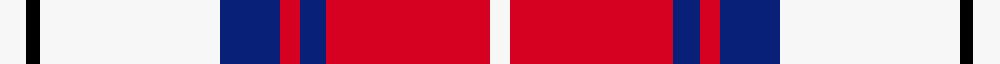

This page is one **sett** — a single exact thread-count. It belongs to the [tartan](/setts/w8k4w54db18r6db8r49w6/)
(the same proportion at any scale), whose colour order is pattern [WKWBRBRW](/stripes/wkwbrbrw/).

Sourced from register-of-tartans.  It is a [8 stripe tartan](/stripes/stripes8/).

Original link https://www.tartanregister.gov.uk/tartanDetails.aspx?ref=11142

## Register references

External register numbers recorded for this tartan.

- Scottish Register of Tartans: [11142](https://www.tartanregister.gov.uk/tartanDetails.aspx?ref=11142)

## Thread count
W/8 K4 W54 DB18 R6 DB8 R49 W/6

One full sett is **292 threads**.

## Palette
<table><thead><tr><th>Colour</th><th>Shade</th><th>OKLCh</th></tr></thead><tbody><tr><td>DB</td><td><code style="background-color:#082077;">#082077</code> <small style="color:#888">#082077</small></td><td><small style="color:#888">oklch(30.0% 0.149 265.1)</small></td></tr><tr><td>K</td><td><code style="background-color:#000000;">#000000</code> <small style="color:#888">#000000</small></td><td><small style="color:#888">oklch(0.0% 0.000 0.0)</small></td></tr><tr><td>LR</td><td><code style="background-color:#D60020;">#D60020</code> <small style="color:#888">#D60020</small></td><td><small style="color:#888">oklch(55.2% 0.224 25.5)</small></td></tr><tr><td>LY</td><td><code style="background-color:#F7F7F7;">#F7F7F7</code> <small style="color:#888">#F7F7F7</small></td><td><small style="color:#888">oklch(97.6% 0.000 89.9)</small></td></tr></tbody></table>

# Sample pattern

## Nearest variants

The nearest existing variants by ΔTartan distance, with this cloth at the top so the swatches line up against it.

ΔTartan

Threads

Variant

Sett

—

292

<a href="/variants/s8/w8k4w54db18r6db8r49w6/">Merida Dance</a>

<a href="/ttd/edit/#slug=w8k6w54db16m6db8m49w6&amp;base=w8k4w54db18r6db8r49w6" title="compare in the TTD">0.38</a>

292

<a href="/variants/s8/w8k6w54db16m6db8m49w6/">Meridia Dance</a>

<a href="/ttd/edit/#slug=w5k2w30r24w3r8db3~x2&amp;base=w8k4w54db18r6db8r49w6" title="compare in the TTD">2.57</a>

284

<a href="/variants/s7/w5k2w30r24w3r8db3~x2/">Arduaine, Red (Dance)</a>

<a href="/ttd/edit/#slug=w2r12db2w6k6w1&amp;base=w8k4w54db18r6db8r49w6" title="compare in the TTD">2.66</a>

55

<a href="/variants/s6/w2r12db2w6k6w1/">MacTavish</a>

<a href="/ttd/edit/#slug=w5r2w34r34k2r2db4~x2&amp;base=w8k4w54db18r6db8r49w6" title="compare in the TTD">2.95</a>

314

<a href="/variants/s7/w5r2w34r34k2r2db4~x2/">Cunningham Dress</a>

## Neighbour map

Every grey dot is one of 13620 variants placed by the first two principal components of the ΔTartan feature space (42% of its variance). Red is this tartan; blue dots are its nearest — click one to open its page.

<svg viewBox="0 0 640 380" role="img" style="max-width:100%;height:auto;border:1px solid #e0e0e0;border-radius:4px;display:block" xmlns="http://www.w3.org/2000/svg"><image href="/nn/cloud.v1.png" width="640" height="380"/><a href="/variants/s8/w8k6w54db16m6db8m49w6/"><circle cx="206.7" cy="171.0" r="4" fill="#3465a4"><title>Meridia Dance</title></circle></a><a href="/variants/s7/w5k2w30r24w3r8db3~x2/"><circle cx="281.7" cy="158.0" r="4" fill="#3465a4"><title>Arduaine, Red (Dance)</title></circle></a><a href="/variants/s6/w2r12db2w6k6w1/"><circle cx="178.0" cy="185.1" r="4" fill="#3465a4"><title>MacTavish</title></circle></a><a href="/variants/s7/w5r2w34r34k2r2db4~x2/"><circle cx="271.0" cy="132.3" r="4" fill="#3465a4"><title>Cunningham Dress</title></circle></a><circle cx="220.4" cy="156.2" r="5" fill="#c00000"/><text x="320" y="376" text-anchor="middle" font-size="11" fill="#999">ground</text><text x="11" y="190" text-anchor="middle" font-size="11" fill="#999" transform="rotate(-90 11 190)">complexity</text></svg>

ID: /variants/s8/w8k4w54db18r6db8r49w6/
