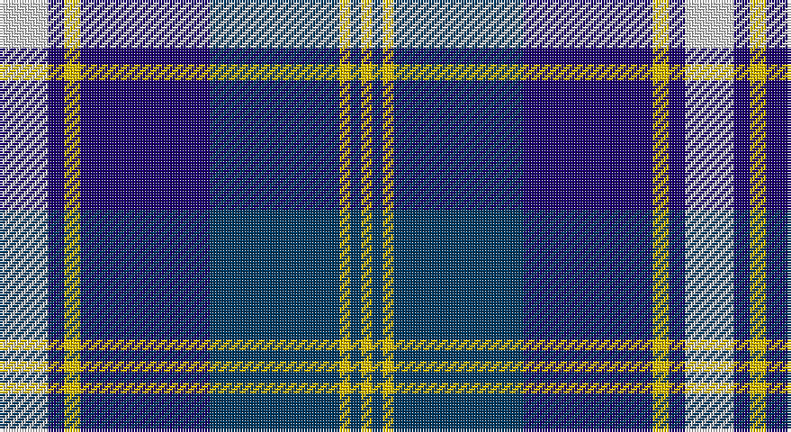

This page is one **sett** — a single exact thread-count. It belongs to the [tartan](/setts/w9db3ly3db24dt24ly2dt2ly2/)
(the same proportion at any scale), whose colour order is pattern [WBYBBYBY](/stripes/wbybbyby/).

Part of the [Halesowen](/tartans/halesowen/) tartan — the named design grouping this sett with its other cloths.

Sourced from register-of-tartans.  It is a [8 stripe tartan](/stripes/stripes8/).

Original link https://www.tartanregister.gov.uk/tartanDetails.aspx?ref=5797

## Also known as

This cloth is also recorded under:

- Halesowen #2

## Register references

External register numbers recorded for this tartan.

- Scottish Register of Tartans: [5797](https://www.tartanregister.gov.uk/tartanDetails.aspx?ref=5797)
- Scottish Tartans Authority (ITI): 7845

## Thread count
LN/18 DB6 Y6 DB48 DBa48 Y4 DBa4 Y/4

One full sett is **254 threads**.

## Palette

Palette: <strong>Tartan Register</strong>
<table><thead><tr><th>Colour</th><th>Threads</th><th>Shade</th><th>Base</th><th>OKLCh</th></tr></thead><tbody><tr><td>LN/</td><td style="text-align:right;font-variant-numeric:tabular-nums">18</td><td><code style="background-color:#E0E0E0;">#E0E0E0</code> <small style="color:#888">#E0E0E0</small></td><td>W <code style="background-color:#F7F7F7;">#F7F7F7</code></td><td><small style="color:#888">oklch(90.7% 0.000 89.9)</small></td></tr><tr><td>DB</td><td style="text-align:right;font-variant-numeric:tabular-nums">6</td><td><code style="background-color:#1C0070;">#1C0070</code> <small style="color:#888">#1C0070</small></td><td>B <code style="background-color:#2A418A;">#2A418A</code></td><td><small style="color:#888">oklch(26.3% 0.162 277.1)</small></td></tr><tr><td>Y</td><td style="text-align:right;font-variant-numeric:tabular-nums">6</td><td><code style="background-color:#E8C000;">#E8C000</code> <small style="color:#888">#E8C000</small></td><td>Y <code style="background-color:#F2BF00;">#F2BF00</code></td><td><small style="color:#888">oklch(81.9% 0.168 93.7)</small></td></tr><tr><td>DB</td><td style="text-align:right;font-variant-numeric:tabular-nums">48</td><td><code style="background-color:#1C0070;">#1C0070</code> <small style="color:#888">#1C0070</small></td><td>B <code style="background-color:#2A418A;">#2A418A</code></td><td><small style="color:#888">oklch(26.3% 0.162 277.1)</small></td></tr><tr><td>DBa</td><td style="text-align:right;font-variant-numeric:tabular-nums">48</td><td><code style="background-color:#003C64;">#003C64</code> <small style="color:#888">#003C64</small></td><td>B <code style="background-color:#2A418A;">#2A418A</code></td><td><small style="color:#888">oklch(34.5% 0.089 246.0)</small></td></tr><tr><td>Y</td><td style="text-align:right;font-variant-numeric:tabular-nums">4</td><td><code style="background-color:#E8C000;">#E8C000</code> <small style="color:#888">#E8C000</small></td><td>Y <code style="background-color:#F2BF00;">#F2BF00</code></td><td><small style="color:#888">oklch(81.9% 0.168 93.7)</small></td></tr><tr><td>DBa</td><td style="text-align:right;font-variant-numeric:tabular-nums">4</td><td><code style="background-color:#003C64;">#003C64</code> <small style="color:#888">#003C64</small></td><td>B <code style="background-color:#2A418A;">#2A418A</code></td><td><small style="color:#888">oklch(34.5% 0.089 246.0)</small></td></tr><tr><td>Y/</td><td style="text-align:right;font-variant-numeric:tabular-nums">4</td><td><code style="background-color:#E8C000;">#E8C000</code> <small style="color:#888">#E8C000</small></td><td>Y <code style="background-color:#F2BF00;">#F2BF00</code></td><td><small style="color:#888">oklch(81.9% 0.168 93.7)</small></td></tr></tbody></table>

# Sample pattern

## Compared to the master

This cloth is one sett of its design; the master sett (the exemplar the design is anchored on) is below for comparison.

<figure style="margin:0"><figcaption style="color:#888;font-size:smaller">this sett</figcaption></figure>
<figure style="margin:0"><figcaption style="color:#888;font-size:smaller"><a href="/setts/w9b3ly3b24db24ly2db2ly2/">master sett →</a></figcaption></figure>

## Nearest tartans

The nearest existing variants by ΔTartan distance, with this tartan at the top so the swatches line up against it.

ΔTartan

Tartan

Sett

—

<a href="/ttd/edit/#slug=w9db3ly3db24dt24ly2dt2ly2~x2">Halesowen #2</a> <a class="nn-out" href="/variants/s8/w9db3ly3db24dt24ly2dt2ly2~x2/" title="open its dictionary page">↗</a>

1.05

<a href="/ttd/edit/#slug=lb4r2db20k6lb5k4lb3k2r2db2~x2&amp;base=w9db3ly3db24dt24ly2dt2ly2~x2">Scottish Knights Templar MTS (Corp)</a> <a class="nn-out" href="/variants/s10/lb4r2db20k6lb5k4lb3k2r2db2~x2/" title="open its dictionary page">↗</a>

1.08

<a href="/ttd/edit/#slug=w9b3ly3b24db24ly2db2ly2~x2&amp;base=w9db3ly3db24dt24ly2dt2ly2~x2">Halesowen (District)</a> <a class="nn-out" href="/variants/s8/w9b3ly3b24db24ly2db2ly2~x2/" title="open its dictionary page">↗</a>

1.10

<a href="/ttd/edit/#slug=ly12dbi2ly2dbi30db3dbi2db13w4~x2&amp;base=w9db3ly3db24dt24ly2dt2ly2~x2">Highlands School (N. Carolina) Corporate Tartan</a> <a class="nn-out" href="/variants/s8/ly12dbi2ly2dbi30db3dbi2db13w4~x2/" title="open its dictionary page">↗</a>

1.14

<a href="/ttd/edit/#slug=db25k3db7k15b25k2b2w4~x2&amp;base=w9db3ly3db24dt24ly2dt2ly2~x2">Sabema</a> <a class="nn-out" href="/variants/s8/db25k3db7k15b25k2b2w4~x2/" title="open its dictionary page">↗</a>

1.15

<a href="/ttd/edit/#slug=lb33k4lb4k5lb4k7db41r4~x2&amp;base=w9db3ly3db24dt24ly2dt2ly2~x2">Kinnaird</a> <a class="nn-out" href="/variants/s8/lb33k4lb4k5lb4k7db41r4~x2/" title="open its dictionary page">↗</a>

1.16

<a href="/ttd/edit/#slug=w4k24ly2n24t5k4ly4~x2&amp;base=w9db3ly3db24dt24ly2dt2ly2~x2">Mina Perhonen</a> <a class="nn-out" href="/variants/s7/w4k24ly2n24t5k4ly4~x2/" title="open its dictionary page">↗</a>

1.17

<a href="/ttd/edit/#slug=dbi26w2dbi3db15t26db2t3ly4~x2&amp;base=w9db3ly3db24dt24ly2dt2ly2~x2">Banff, and Buchan</a> <a class="nn-out" href="/variants/s8/dbi26w2dbi3db15t26db2t3ly4~x2/" title="open its dictionary page">↗</a>

1.21

<a href="/ttd/edit/#slug=lo12db2lo2db30dt2db2dt13lb4~x2&amp;base=w9db3ly3db24dt24ly2dt2ly2~x2">Highlands School (North Carolina)</a> <a class="nn-out" href="/variants/s8/lo12db2lo2db30dt2db2dt13lb4~x2/" title="open its dictionary page">↗</a>

1.22

<a href="/ttd/edit/#slug=g2db14lg6lr1g1lr6r1~x4&amp;base=w9db3ly3db24dt24ly2dt2ly2~x2">Loch Ness in Scotland</a> <a class="nn-out" href="/variants/s7/g2db14lg6lr1g1lr6r1~x4/" title="open its dictionary page">↗</a>

1.22

<a href="/ttd/edit/#slug=r2t2r2t21lg11k17lb2~x2&amp;base=w9db3ly3db24dt24ly2dt2ly2~x2">Loch Ness (Fashion)</a> <a class="nn-out" href="/variants/s7/r2t2r2t21lg11k17lb2~x2/" title="open its dictionary page">↗</a>

## Neighbour map

Every grey dot is one of 14360 variants placed by the first two principal components of the ΔTartan feature space (44% of its variance). Red is this tartan; blue dots are its nearest — click one to open its page.

<svg viewBox="0 0 640 380" role="img" style="max-width:100%;height:auto;border:1px solid #e0e0e0;border-radius:4px;display:block" xmlns="http://www.w3.org/2000/svg"><image href="/nn/cloud.v1.png" width="640" height="380"/><a href="/variants/s10/lb4r2db20k6lb5k4lb3k2r2db2~x2/"><circle cx="208.4" cy="162.7" r="4" fill="#3465a4"><title>Scottish Knights Templar MTS (Corp)</title></circle></a><a href="/variants/s8/w9b3ly3b24db24ly2db2ly2~x2/"><circle cx="210.7" cy="169.5" r="4" fill="#3465a4"><title>Halesowen (District)</title></circle></a><a href="/variants/s8/ly12dbi2ly2dbi30db3dbi2db13w4~x2/"><circle cx="259.8" cy="156.5" r="4" fill="#3465a4"><title>Highlands School (N. Carolina) Corporate Tartan</title></circle></a><a href="/variants/s8/db25k3db7k15b25k2b2w4~x2/"><circle cx="215.5" cy="195.5" r="4" fill="#3465a4"><title>Sabema</title></circle></a><a href="/variants/s8/lb33k4lb4k5lb4k7db41r4~x2/"><circle cx="202.4" cy="157.9" r="4" fill="#3465a4"><title>Kinnaird</title></circle></a><a href="/variants/s7/w4k24ly2n24t5k4ly4~x2/"><circle cx="187.2" cy="169.3" r="4" fill="#3465a4"><title>Mina Perhonen</title></circle></a><a href="/variants/s8/dbi26w2dbi3db15t26db2t3ly4~x2/"><circle cx="182.0" cy="165.4" r="4" fill="#3465a4"><title>Banff, and Buchan</title></circle></a><a href="/variants/s8/lo12db2lo2db30dt2db2dt13lb4~x2/"><circle cx="272.7" cy="161.3" r="4" fill="#3465a4"><title>Highlands School (North Carolina)</title></circle></a><a href="/variants/s7/g2db14lg6lr1g1lr6r1~x4/"><circle cx="199.8" cy="157.5" r="4" fill="#3465a4"><title>Loch Ness in Scotland</title></circle></a><a href="/variants/s7/r2t2r2t21lg11k17lb2~x2/"><circle cx="169.2" cy="171.4" r="4" fill="#3465a4"><title>Loch Ness (Fashion)</title></circle></a><circle cx="202.3" cy="168.4" r="5" fill="#c00000"/></svg>

ID: /variants/s8/w9db3ly3db24dt24ly2dt2ly2~x2/
