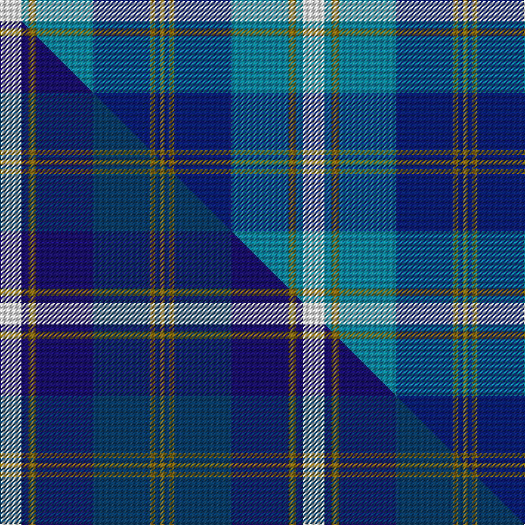

This is one **variant** — a specific cloth: this exact thread count and colourway, with its own
provenance below. It is one weaving of the [sett](/setts/w9t3y3t24db24y2db2y2/) (the scale-free proportion — the
same cloth at any scale or shade), whose colour order is pattern [GBGBBGBW](/stripes/gbgbbgbw/).

Part of the [Halesowen](/tartans/h/ha/halesowen/) tartan — the named design grouping this sett with its other cloths.

Sourced from tartans-authority.  It is a [8 stripe tartan](/stripes/stripes8/).

Original link [https://www.tartanregister.gov.uk/tartanDetails.aspx?ref=7661](https://www.tartanregister.gov.uk/tartanDetails.aspx?ref=7661)

2 attestations — the source records this cloth was collapsed from (oldest owns this page)

<ul>
<li>pre 2008 — Halesowen (District) (tartans-authority, <a href="https://www.tartanregister.gov.uk/tartanDetails.aspx?ref=7661">record</a>)  <em>Possible district tartan if proof of acceptance is provided. Based on the mediaeval version of the Halesowen flag in which the main colour is royal blue. In the centre is a band of white for the chevron with a narrow thread 'outline' in gold. Later there is three further thin one thread gold bands - these represent each of the fleur-de-lys. The darker blue section was added to make the overall design look more balanced and has sometimes been used as a sporting colour in the town as well as of royal blue.</em></li>
<li>undated — Halesowen (register-of-tartans, <a href="https://www.tartanregister.gov.uk/tartanDetails.aspx?ref=5667">record</a>)  <em>Possible district tartan if proof of acceptance is provided. Based on the mediaeval version of the Halesowen flag in which the main colour is royal blue. In the centre is a band of white for the chevron with a narrow thread 'outline' in gold. Later there is three further thin one thread gold bands - these represent each of the fleur-de-lys. The darker blue section was added to make the overall design look more balanced and has sometimes been used as a sporting colour in the town as well as of royal blue.</em></li>
</ul>

Dataset <small>— provenance for this record, inherited from the source manifest</small>

<dl class="dataset-prov">
<dt>source</dt><dd><a href="/sources/tartans-authority/">Scottish Tartans Authority</a></dd>
<dt>data captured from</dt><dd><a href="https://github.com/thetartan/tartan-database/blob/master/data/tartans-authority/data.csv">https://github.com/thetartan/tartan-database/blob/master/data/tartans-authority/data.csv</a></dd>
<dt>data date</dt><dd>pre 2008 <small>(this record)</small></dd>
<dt>licence</dt><dd><a href="https://creativecommons.org/licenses/by-nc-nd/4.0/">CC BY-NC-ND 4.0</a></dd>
</dl>

Capture chain <small>— the hands this data passed through, oldest first; each capture carries its own licence</small>

<ol class="capture-chain">
<li><a href="https://www.tartansauthority.com/">Scottish Tartans Authority</a> <small>the heritage body's archive — its tartan-ferret record browser is retired (links repaired to the SRT, above)</small></li>
<li><a href="https://github.com/thetartan/tartan-database">thetartan/tartan-database</a> <small>2016-2017</small> · <a href="https://creativecommons.org/licenses/by-nc-nd/4.0/">CC BY-NC-ND 4.0</a> <small>Levko Kravets's frozen compilation — the capture we vendored, and where its CC licence text came from</small></li>
<li>this dictionary <small>captured 2026-06-10 · commit 5bf86c7566</small> <small>each re-capture is a git commit to data/sources</small></li>
</ol>

## Register references

External register numbers recorded for this tartan.

- Scottish Register of Tartans: [5667](https://www.tartanregister.gov.uk/tartanDetails.aspx?ref=5667)
- Scottish Tartans Authority (ITI): 7661
- Scottish Tartans World Register: 3279

## Thread count
W/18 T6 Y6 T48 DB48 Y4 DB4 Y/4

One full sett is **254 threads**.

## Palette
<table><thead><tr><th>Colour</th><th>Shade</th><th>OKLCh</th></tr></thead><tbody><tr><td>T</td><td><code style="background-color:#00879F;">#00879F</code> <small style="color:#888">#00879F</small></td><td><small style="color:#888">oklch(57.4% 0.102 216.1)</small></td></tr><tr><td>DB</td><td><code style="background-color:#082077;">#082077</code> <small style="color:#888">#082077</small></td><td><small style="color:#888">oklch(30.0% 0.149 265.1)</small></td></tr><tr><td>W</td><td><code style="background-color:#F7F7F7;">#F7F7F7</code> <small style="color:#888">#F7F7F7</small></td><td><small style="color:#888">oklch(97.6% 0.000 89.9)</small></td></tr><tr><td>Y</td><td><code style="background-color:#8B6E00;">#8B6E00</code> <small style="color:#888">#8B6E00</small></td><td><small style="color:#888">oklch(55.1% 0.113 90.4)</small></td></tr></tbody></table>

# Sample pattern

## Compared to the master

This cloth is one sett of its design; the master sett (the exemplar the design is anchored on) is below for comparison.

Its **ΔTartan distance** from the master is **0.78** — the same measure the nearest-tartans table ranks by (0 is identical; a re-scale of the same cloth is near 0, a recolour or a different proportion further).

<figure class="master-compare" style="margin:0">

this sett
master sett ★

<figcaption style="color:#888;font-size:smaller">One weave of this sett against the <a href="/setts/w9db3y3db24dbi24y2dbi2y2/">master sett ★</a>, split on the diagonal: a shared proportion runs seamlessly across it with only the shades shifting; a different proportion breaks on it.</figcaption>
</figure>

## Nearest tartan variants

The nearest existing variants by ΔTartan distance, with this cloth at the top so the swatches line up against it.

ΔTartan

Threads

Variant

Sett

—

254

<a href="/variants/s8/w9t3y3t24db24y2db2y2~x2/">Halesowen (District)</a>

<a href="/ttd/edit/#slug=w9db3y3db24dbi24y2dbi2y2~x2~db1106275-dbi1404245&amp;base=w9t3y3t24db24y2db2y2~x2" title="compare in the TTD">0.78</a>

254

<a href="/variants/s8/w9db3y3db24dbi24y2dbi2y2~x2~db1106275-dbi1404245/">Halesowen #2</a>

<a href="/ttd/edit/#slug=w4lb1y2lb22db20w2db4w2~x2&amp;base=w9t3y3t24db24y2db2y2~x2" title="compare in the TTD">1.08</a>

216

<a href="/variants/s8/w4lb1y2lb22db20w2db4w2~x2/">Gorman Blue (Personal)</a>

<a href="/ttd/edit/#slug=g5db15lr11lb2lr1lb1g4~x4~lr3200000-lb3103284&amp;base=w9t3y3t24db24y2db2y2~x2" title="compare in the TTD">1.97</a>

276

<a href="/variants/s7/g5db15lbi11lb2lbi1lb1g4~x4~lbi3200000-lb3103284/">Highlands Country Club (Corporate)</a>

<a href="/ttd/edit/#slug=r15lb98db72ly25db8w15&amp;base=w9t3y3t24db24y2db2y2~x2" title="compare in the TTD">1.99</a>

436

<a href="/variants/s6/r15lb98db72ly25db8w15/">Afternoon Tea / Earl Grey</a>

<a href="/ttd/edit/#slug=db7w3db2w6db16lb26dr4~x2&amp;base=w9t3y3t24db24y2db2y2~x2" title="compare in the TTD">2.28</a>

234

<a href="/variants/s7/db7w3db2w6db16lb26dr4~x2/">Keela (Corporate)</a>

<a href="/ttd/edit/#slug=g5db15lb11w2lb1w1dg4~x4&amp;base=w9t3y3t24db24y2db2y2~x2" title="compare in the TTD">2.37</a>

276

<a href="/variants/s7/g5db15lb11w2lb1w1dg4~x4/">Highlands Country Club Corporate Tartan</a>

<a href="/ttd/edit/#slug=db7r3db26lb2db2lb26y4~x2&amp;base=w9t3y3t24db24y2db2y2~x2" title="compare in the TTD">2.42</a>

258

<a href="/variants/s7/db7r3db26lb2db2lb26y4~x2/">Int. Police Association (Official)</a>

<a href="/ttd/edit/#slug=db14r6db52lb4db4lb51y8&amp;base=w9t3y3t24db24y2db2y2~x2" title="compare in the TTD">2.44</a>

256

<a href="/variants/s7/db14r6db52lb4db4lb51y8/">International Police Association (IPA 2010)</a>

<a href="/ttd/edit/#slug=db15lb11lr2lb1lr1g4lr1lb1lr2lb11db15g5~x4~lb3103284-lr3200000&amp;base=w9t3y3t24db24y2db2y2~x2" title="compare in the TTD">2.45</a>

472

<a href="/variants/s12/db15lb11lbi2lb1lbi1g4lbi1lb1lbi2lb11db15g5~x4~lb3103284-lbi3200000/">Highlands Country Club</a>

<a href="/ttd/edit/#slug=y4dt4lb5db24y2dt24w4~x2~dt1204274-db1406275&amp;base=w9t3y3t24db24y2db2y2~x2" title="compare in the TTD">2.62</a>

252

<a href="/variants/s7/y4db4lb5dbi24y2db24w4~x2~db1204274-dbi1406275/">Mina Perhonen Japanese Corporate Tartan</a>

## Neighbour map

Every grey dot is one of 13656 variants placed by the first two principal components of the ΔTartan feature space (42% of its variance). Red is this tartan; blue dots are its nearest — click one to open its page. The map is a flat projection of a many-dimensional space — [how to read it](/posts/neighbourhood-maps/).

<svg viewBox="0 0 640 380" role="img" style="max-width:100%;height:auto;border:1px solid #e0e0e0;border-radius:4px;display:block" xmlns="http://www.w3.org/2000/svg"><image href="/nn/cloud.v1.png" width="640" height="380"/><a href="/variants/s8/w9db3y3db24dbi24y2dbi2y2~x2~db1106275-dbi1404245/"><circle cx="248.9" cy="194.9" r="4" fill="#3465a4"><title>Halesowen #2</title></circle></a><a href="/variants/s8/w4lb1y2lb22db20w2db4w2~x2/"><circle cx="282.1" cy="166.6" r="4" fill="#3465a4"><title>Gorman Blue (Personal)</title></circle></a><a href="/variants/s7/g5db15lbi11lb2lbi1lb1g4~x4~lbi3200000-lb3103284/"><circle cx="229.5" cy="203.6" r="4" fill="#3465a4"><title>Highlands Country Club (Corporate)</title></circle></a><a href="/variants/s6/r15lb98db72ly25db8w15/"><circle cx="208.0" cy="191.3" r="4" fill="#3465a4"><title>Afternoon Tea / Earl Grey</title></circle></a><a href="/variants/s7/db7w3db2w6db16lb26dr4~x2/"><circle cx="257.4" cy="217.7" r="4" fill="#3465a4"><title>Keela (Corporate)</title></circle></a><a href="/variants/s7/g5db15lb11w2lb1w1dg4~x4/"><circle cx="195.3" cy="186.3" r="4" fill="#3465a4"><title>Highlands Country Club Corporate Tartan</title></circle></a><a href="/variants/s7/db7r3db26lb2db2lb26y4~x2/"><circle cx="287.3" cy="179.3" r="4" fill="#3465a4"><title>Int. Police Association (Official)</title></circle></a><a href="/variants/s7/db14r6db52lb4db4lb51y8/"><circle cx="288.3" cy="179.5" r="4" fill="#3465a4"><title>International Police Association (IPA 2010)</title></circle></a><a href="/variants/s12/db15lb11lbi2lb1lbi1g4lbi1lb1lbi2lb11db15g5~x4~lb3103284-lbi3200000/"><circle cx="254.2" cy="181.0" r="4" fill="#3465a4"><title>Highlands Country Club</title></circle></a><a href="/variants/s7/y4db4lb5dbi24y2db24w4~x2~db1204274-dbi1406275/"><circle cx="269.0" cy="203.6" r="4" fill="#3465a4"><title>Mina Perhonen Japanese Corporate Tartan</title></circle></a><circle cx="248.8" cy="199.2" r="5" fill="#c00000"/><text x="320" y="376" text-anchor="middle" font-size="11" fill="#999">ground</text><text x="11" y="190" text-anchor="middle" font-size="11" fill="#999" transform="rotate(-90 11 190)">complexity</text></svg>

ID: /variants/s8/w9t3y3t24db24y2db2y2~x2/
