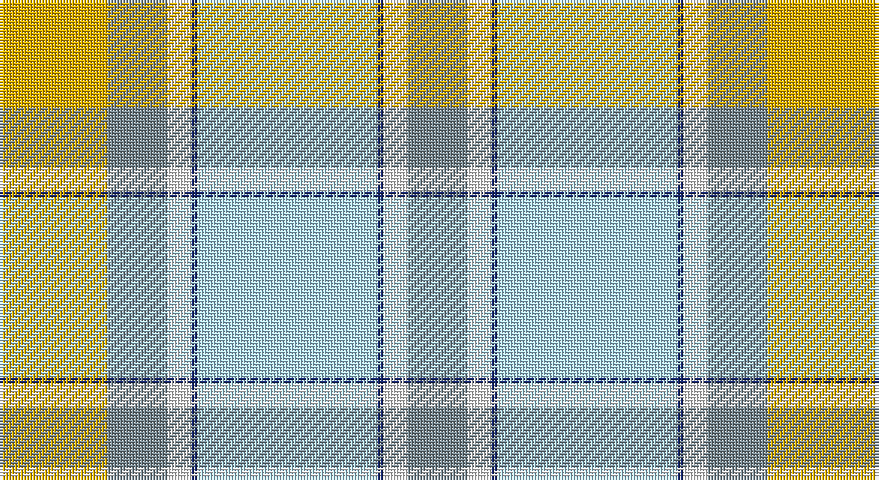

This page is one **sett** — a single exact thread-count. It belongs to the [tartan](/setts/wi30db1w4y10ly18/)
(the same proportion at any scale), whose colour order is pattern [GWBWBWGY](/stripes/gwbwbwgy/).

Sourced from register-of-tartans.  It is a [8 stripe tartan](/stripes/stripes8/).

Original link https://www.tartanregister.gov.uk/tartanDetails.aspx?ref=10101

## Register references

External register numbers recorded for this tartan.

- Scottish Register of Tartans: [10101](https://www.tartanregister.gov.uk/tartanDetails.aspx?ref=10101)

## Thread count
Y/36 LG20 W8 DB2 LB60 DB2 W8 LG/20

One full sett is **256 threads**.

## Palette

Palette: <strong>Tartan Register</strong> <small style="color:#888">(1 of 5 colours)</small>
<table><thead><tr><th>Colour</th><th>Threads</th><th>Shade</th><th>Base</th><th>OKLCh</th></tr></thead><tbody><tr><td>Y/</td><td style="text-align:right;font-variant-numeric:tabular-nums">36</td><td><code style="background-color:#EBAF01;">#EBAF01</code> <small style="color:#888">#EBAF01</small></td><td>Y <code style="background-color:#F2BF00;">#F2BF00</code></td><td><small style="color:#888">oklch(78.8% 0.162 83.6)</small></td></tr><tr><td>LG</td><td style="text-align:right;font-variant-numeric:tabular-nums">20</td><td><code style="background-color:#798A92;">#798A92</code> <small style="color:#888">#798A92</small></td><td>G <code style="background-color:#006100;">#006100</code></td><td><small style="color:#888">oklch(62.2% 0.023 227.8)</small></td></tr><tr><td>W</td><td style="text-align:right;font-variant-numeric:tabular-nums">8</td><td><code style="background-color:#FFFFFF;">#FFFFFF</code> <small style="color:#888">#FFFFFF</small></td><td>W <code style="background-color:#F7F7F7;">#F7F7F7</code></td><td><small style="color:#888">oklch(100.0% 0.000 89.9)</small></td></tr><tr><td>DB</td><td style="text-align:right;font-variant-numeric:tabular-nums">2</td><td><code style="background-color:#14256B;">#14256B</code> <small style="color:#888">#14256B</small></td><td>B <code style="background-color:#2A418A;">#2A418A</code></td><td><small style="color:#888">oklch(30.2% 0.124 267.6)</small></td></tr><tr><td>LB</td><td style="text-align:right;font-variant-numeric:tabular-nums">60</td><td><code style="background-color:#B2E5FF;">#B2E5FF</code> <small style="color:#888">#B2E5FF</small></td><td>W <code style="background-color:#F7F7F7;">#F7F7F7</code></td><td><small style="color:#888">oklch(89.5% 0.063 230.5)</small></td></tr><tr><td>DB</td><td style="text-align:right;font-variant-numeric:tabular-nums">2</td><td><code style="background-color:#14256B;">#14256B</code> <small style="color:#888">#14256B</small></td><td>B <code style="background-color:#2A418A;">#2A418A</code></td><td><small style="color:#888">oklch(30.2% 0.124 267.6)</small></td></tr><tr><td>W</td><td style="text-align:right;font-variant-numeric:tabular-nums">8</td><td><code style="background-color:#FFFFFF;">#FFFFFF</code> <small style="color:#888">#FFFFFF</small></td><td>W <code style="background-color:#F7F7F7;">#F7F7F7</code></td><td><small style="color:#888">oklch(100.0% 0.000 89.9)</small></td></tr><tr><td>LG/</td><td style="text-align:right;font-variant-numeric:tabular-nums">20</td><td><code style="background-color:#798A92;">#798A92</code> <small style="color:#888">#798A92</small></td><td>G <code style="background-color:#006100;">#006100</code></td><td><small style="color:#888">oklch(62.2% 0.023 227.8)</small></td></tr></tbody></table>

# Sample pattern

## Nearest tartans

The nearest existing variants by ΔTartan distance, with this tartan at the top so the swatches line up against it.

ΔTartan

Tartan

Sett

—

<a href="/ttd/edit/#slug=wi30db1w4y10ly18~x2">Alloway Primary School (Ayr)</a> <a class="nn-out" href="/variants/s8/wi30db1w4y10ly18~x2/" title="open its dictionary page">↗</a>

1.26

<a href="/variants/s8/lb30db1w4o10ly18~x2/">Alloway Primary (Corporate)</a>

1.34

<a href="/ttd/edit/#slug=y6db2y1w17y1db2y16lo27dg2~x2&amp;base=wi30db1w4y10ly18~x2">Rutlin (Personal)</a> <a class="nn-out" href="/variants/s9/y6db2y1w17y1db2y16lo27dg2~x2/" title="open its dictionary page">↗</a>

1.35

<a href="/variants/s13/wi4n1lr29n6w13n13w6n13w13n6lr29n1lg4~x2/">Delta Dental Association</a>

1.40

<a href="/ttd/edit/#slug=w36lt12w1r12g16ly2~x2&amp;base=wi30db1w4y10ly18~x2">MacNappy</a> <a class="nn-out" href="/variants/s6/w36lt12w1r12g16ly2~x2/" title="open its dictionary page">↗</a>

1.56

<a href="/ttd/edit/#slug=g4o1lo29o6w13o13w6o13w13o6lo29o1t4~x2&amp;base=wi30db1w4y10ly18~x2">Delta Dental Association (Corporate)</a> <a class="nn-out" href="/variants/s13/g4o1lo29o6w13o13w6o13w13o6lo29o1t4~x2/" title="open its dictionary page">↗</a>

1.65

<a href="/ttd/edit/#slug=lb8w16g18r2ly4r1lb4~x2&amp;base=wi30db1w4y10ly18~x2">Lake Ainslie Heritage</a> <a class="nn-out" href="/variants/s7/lb8w16g18r2ly4r1lb4~x2/" title="open its dictionary page">↗</a>

1.71

<a href="/ttd/edit/#slug=r4g1w5g1r2g1w5lb4lg20lb8ly2lb8ly4~x2&amp;base=wi30db1w4y10ly18~x2">Pille Family (Personal)</a> <a class="nn-out" href="/variants/s13/r4g1w5g1r2g1w5lb4lg20lb8ly2lb8ly4~x2/" title="open its dictionary page">↗</a>

1.78

<a href="/ttd/edit/#slug=db4k1lg18y2lg11y11lb18k1r4~x2&amp;base=wi30db1w4y10ly18~x2">Morgan in Maryland (USA)</a> <a class="nn-out" href="/variants/s9/db4k1lg18y2lg11y11lb18k1r4~x2/" title="open its dictionary page">↗</a>

1.82

<a href="/ttd/edit/#slug=t25k1dy6k1lr10w3lr10k1ly3~x4&amp;base=wi30db1w4y10ly18~x2">O'Rourke (Estimated threadcount)</a> <a class="nn-out" href="/variants/s9/t25k1dy6k1lr10w3lr10k1ly3~x4/" title="open its dictionary page">↗</a>

1.82

<a href="/ttd/edit/#slug=w3b19w1lb17ly11g10w1b3w1~x2&amp;base=wi30db1w4y10ly18~x2">Bird Family (Australia) (Name)</a> <a class="nn-out" href="/variants/s9/w3b19w1lb17ly11g10w1b3w1~x2/" title="open its dictionary page">↗</a>

## Neighbour map

Every grey dot is one of 14360 variants placed by the first two principal components of the ΔTartan feature space (44% of its variance). Red is this tartan; blue dots are its nearest — click one to open its page.

<svg viewBox="0 0 640 380" role="img" style="max-width:100%;height:auto;border:1px solid #e0e0e0;border-radius:4px;display:block" xmlns="http://www.w3.org/2000/svg"><image href="/nn/cloud.v1.png" width="640" height="380"/><a href="/variants/s8/lb30db1w4o10ly18~x2/"><circle cx="258.0" cy="145.7" r="4" fill="#3465a4"><title>Alloway Primary (Corporate)</title></circle></a><a href="/variants/s9/y6db2y1w17y1db2y16lo27dg2~x2/"><circle cx="251.6" cy="128.2" r="4" fill="#3465a4"><title>Rutlin (Personal)</title></circle></a><a href="/variants/s13/wi4n1lr29n6w13n13w6n13w13n6lr29n1lg4~x2/"><circle cx="223.1" cy="108.5" r="4" fill="#3465a4"><title>Delta Dental Association</title></circle></a><a href="/variants/s6/w36lt12w1r12g16ly2~x2/"><circle cx="250.2" cy="126.5" r="4" fill="#3465a4"><title>MacNappy</title></circle></a><a href="/variants/s13/g4o1lo29o6w13o13w6o13w13o6lo29o1t4~x2/"><circle cx="251.5" cy="128.3" r="4" fill="#3465a4"><title>Delta Dental Association (Corporate)</title></circle></a><a href="/variants/s7/lb8w16g18r2ly4r1lb4~x2/"><circle cx="155.0" cy="149.0" r="4" fill="#3465a4"><title>Lake Ainslie Heritage</title></circle></a><a href="/variants/s13/r4g1w5g1r2g1w5lb4lg20lb8ly2lb8ly4~x2/"><circle cx="137.3" cy="101.2" r="4" fill="#3465a4"><title>Pille Family (Personal)</title></circle></a><a href="/variants/s9/db4k1lg18y2lg11y11lb18k1r4~x2/"><circle cx="170.9" cy="127.8" r="4" fill="#3465a4"><title>Morgan in Maryland (USA)</title></circle></a><a href="/variants/s9/t25k1dy6k1lr10w3lr10k1ly3~x4/"><circle cx="237.8" cy="115.8" r="4" fill="#3465a4"><title>O'Rourke (Estimated threadcount)</title></circle></a><a href="/variants/s9/w3b19w1lb17ly11g10w1b3w1~x2/"><circle cx="142.6" cy="133.7" r="4" fill="#3465a4"><title>Bird Family (Australia) (Name)</title></circle></a><circle cx="225.1" cy="124.8" r="5" fill="#c00000"/></svg>

ID: /variants/s8/wi30db1w4y10ly18~x2/
