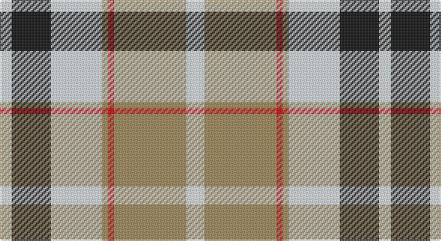

This page is one **sett** — a single exact thread-count. It belongs to the [tartan](/setts/wi4k13wi17lo2r2lo24wi2w2/)
(the same proportion at any scale), whose colour order is pattern [WKWYRYWW](/stripes/wkwyryww/).

Sourced from register-of-tartans.  It is a [8 stripe tartan](/stripes/stripes8/).

Original link https://www.tartanregister.gov.uk/tartanDetails.aspx?ref=2032

2 attestations — the source records this cloth was collapsed from (oldest owns this page)

<ul>
<li>01/08/2006 — Lalage (Personal) (register-of-tartans, <a href="https://www.tartanregister.gov.uk/tartanDetails.aspx?ref=2032">record</a>)</li>
<li>2006 August — Lalage (Personal) (tartans-authority, <a href="http://www.tartansauthority.com/tartan-ferret/display/6999/">record</a>)</li>
</ul>

## Register references

External register numbers recorded for this tartan.

- Scottish Register of Tartans: [2032](https://www.tartanregister.gov.uk/tartanDetails.aspx?ref=2032)
- Scottish Tartans Authority (ITI): 6999

## Thread count
LN/8 K26 LN34 LT4 R4 LT48 LN4 W/4

One full sett is **252 threads**.

## Palette

Palette: <strong>Tartan Register</strong> <small style="color:#888">(4 of 5 colours)</small>
<table><thead><tr><th>Colour</th><th>Threads</th><th>Shade</th><th>Base</th><th>OKLCh</th></tr></thead><tbody><tr><td>LN/</td><td style="text-align:right;font-variant-numeric:tabular-nums">8</td><td><code style="background-color:#DCECF4;">#DCECF4</code> <small style="color:#888">#DCECF4</small></td><td>W <code style="background-color:#F7F7F7;">#F7F7F7</code></td><td><small style="color:#888">oklch(93.4% 0.020 229.0)</small></td></tr><tr><td>K</td><td style="text-align:right;font-variant-numeric:tabular-nums">26</td><td><code style="background-color:#101010;">#101010</code> <small style="color:#888">#101010</small></td><td>K <code style="background-color:#000000;">#000000</code></td><td><small style="color:#888">oklch(17.3% 0.000 89.9)</small></td></tr><tr><td>LN</td><td style="text-align:right;font-variant-numeric:tabular-nums">34</td><td><code style="background-color:#DCECF4;">#DCECF4</code> <small style="color:#888">#DCECF4</small></td><td>W <code style="background-color:#F7F7F7;">#F7F7F7</code></td><td><small style="color:#888">oklch(93.4% 0.020 229.0)</small></td></tr><tr><td>LT</td><td style="text-align:right;font-variant-numeric:tabular-nums">4</td><td><code style="background-color:#A08858;">#A08858</code> <small style="color:#888">#A08858</small></td><td>Y <code style="background-color:#F2BF00;">#F2BF00</code></td><td><small style="color:#888">oklch(63.7% 0.071 84.0)</small></td></tr><tr><td>R</td><td style="text-align:right;font-variant-numeric:tabular-nums">4</td><td><code style="background-color:#DC0000;">#DC0000</code> <small style="color:#888">#DC0000</small></td><td>R <code style="background-color:#CC0000;">#CC0000</code></td><td><small style="color:#888">oklch(56.2% 0.230 29.2)</small></td></tr><tr><td>LT</td><td style="text-align:right;font-variant-numeric:tabular-nums">48</td><td><code style="background-color:#A08858;">#A08858</code> <small style="color:#888">#A08858</small></td><td>Y <code style="background-color:#F2BF00;">#F2BF00</code></td><td><small style="color:#888">oklch(63.7% 0.071 84.0)</small></td></tr><tr><td>LN</td><td style="text-align:right;font-variant-numeric:tabular-nums">4</td><td><code style="background-color:#DCECF4;">#DCECF4</code> <small style="color:#888">#DCECF4</small></td><td>W <code style="background-color:#F7F7F7;">#F7F7F7</code></td><td><small style="color:#888">oklch(93.4% 0.020 229.0)</small></td></tr><tr><td>W/</td><td style="text-align:right;font-variant-numeric:tabular-nums">4</td><td><code style="background-color:#F8F8F8;">#F8F8F8</code> <small style="color:#888">#F8F8F8</small></td><td>W <code style="background-color:#F7F7F7;">#F7F7F7</code></td><td><small style="color:#888">oklch(97.9% 0.000 89.9)</small></td></tr></tbody></table>

# Sample pattern

## Nearest tartans

The nearest existing variants by ΔTartan distance, with this tartan at the top so the swatches line up against it.

ΔTartan

Tartan

Sett

—

<a href="/ttd/edit/#slug=wi4k13wi17lo2r2lo24wi2w2~x2">Lalage (Personal)</a> <a class="nn-out" href="/variants/s8/wi4k13wi17lo2r2lo24wi2w2~x2/" title="open its dictionary page">↗</a>

0.83

<a href="/ttd/edit/#slug=r5w2o20ly2k16w18k2w5~x2&amp;base=wi4k13wi17lo2r2lo24wi2w2~x2">Ailsa Craig</a> <a class="nn-out" href="/variants/s8/r5w2o20ly2k16w18k2w5~x2/" title="open its dictionary page">↗</a>

0.89

<a href="/ttd/edit/#slug=w39db9k10dg11r7k3r7~x2&amp;base=wi4k13wi17lo2r2lo24wi2w2~x2">MacDuff Dress #5</a> <a class="nn-out" href="/variants/s7/w39db9k10dg11r7k3r7~x2/" title="open its dictionary page">↗</a>

0.91

<a href="/ttd/edit/#slug=r5w2t20ly2k16w18k2w5~x2&amp;base=wi4k13wi17lo2r2lo24wi2w2~x2">Ailsa Craig (District)</a> <a class="nn-out" href="/variants/s8/r5w2t20ly2k16w18k2w5~x2/" title="open its dictionary page">↗</a>

0.92

<a href="/ttd/edit/#slug=w39db9k10g11r7k3r7~x2&amp;base=wi4k13wi17lo2r2lo24wi2w2~x2">MacDuff dress</a> <a class="nn-out" href="/variants/s7/w39db9k10g11r7k3r7~x2/" title="open its dictionary page">↗</a>

0.93

<a href="/ttd/edit/#slug=w4k2w18k11db2y18ly2~x2&amp;base=wi4k13wi17lo2r2lo24wi2w2~x2">Barbour - Ancient</a> <a class="nn-out" href="/variants/s7/w4k2w18k11db2y18ly2~x2/" title="open its dictionary page">↗</a>

0.93

<a href="/ttd/edit/#slug=r3w33dp8dg18r9g3~x2&amp;base=wi4k13wi17lo2r2lo24wi2w2~x2">MacKintosh Dress (Dance)</a> <a class="nn-out" href="/variants/s6/r3w33dp8dg18r9g3~x2/" title="open its dictionary page">↗</a>

1.02

<a href="/ttd/edit/#slug=r2db2w26g25k14db13w26db2r2~x2&amp;base=wi4k13wi17lo2r2lo24wi2w2~x2">MacNaughton Dress</a> <a class="nn-out" href="/variants/s9/r2db2w26g25k14db13w26db2r2~x2/" title="open its dictionary page">↗</a>

1.04

<a href="/ttd/edit/#slug=r34w3gi4g23w24k3gi4~x2&amp;base=wi4k13wi17lo2r2lo24wi2w2~x2">MacLachlan Dress Clan Tartan</a> <a class="nn-out" href="/variants/s7/r34w3gi4g23w24k3gi4~x2/" title="open its dictionary page">↗</a>

1.06

<a href="/ttd/edit/#slug=db2w14p4ly1g8db2~x2&amp;base=wi4k13wi17lo2r2lo24wi2w2~x2">Manx Laxey, dress green</a> <a class="nn-out" href="/variants/s6/db2w14p4ly1g8db2~x2/" title="open its dictionary page">↗</a>

1.08

<a href="/ttd/edit/#slug=db4w1db2w18g3w1r9ly4~x4&amp;base=wi4k13wi17lo2r2lo24wi2w2~x2">Manitoba Dress (1958) (District)</a> <a class="nn-out" href="/variants/s8/db4w1db2w18g3w1r9ly4~x4/" title="open its dictionary page">↗</a>

## Neighbour map

Every grey dot is one of 14360 variants placed by the first two principal components of the ΔTartan feature space (44% of its variance). Red is this tartan; blue dots are its nearest — click one to open its page.

<svg viewBox="0 0 640 380" role="img" style="max-width:100%;height:auto;border:1px solid #e0e0e0;border-radius:4px;display:block" xmlns="http://www.w3.org/2000/svg"><image href="/nn/cloud.v1.png" width="640" height="380"/><a href="/variants/s8/r5w2o20ly2k16w18k2w5~x2/"><circle cx="117.1" cy="147.9" r="4" fill="#3465a4"><title>Ailsa Craig</title></circle></a><a href="/variants/s7/w39db9k10dg11r7k3r7~x2/"><circle cx="170.4" cy="139.6" r="4" fill="#3465a4"><title>MacDuff Dress #5</title></circle></a><a href="/variants/s8/r5w2t20ly2k16w18k2w5~x2/"><circle cx="115.6" cy="148.7" r="4" fill="#3465a4"><title>Ailsa Craig (District)</title></circle></a><a href="/variants/s7/w39db9k10g11r7k3r7~x2/"><circle cx="164.3" cy="138.9" r="4" fill="#3465a4"><title>MacDuff dress</title></circle></a><a href="/variants/s7/w4k2w18k11db2y18ly2~x2/"><circle cx="129.6" cy="159.4" r="4" fill="#3465a4"><title>Barbour - Ancient</title></circle></a><a href="/variants/s6/r3w33dp8dg18r9g3~x2/"><circle cx="175.2" cy="158.8" r="4" fill="#3465a4"><title>MacKintosh Dress (Dance)</title></circle></a><a href="/variants/s9/r2db2w26g25k14db13w26db2r2~x2/"><circle cx="167.9" cy="141.2" r="4" fill="#3465a4"><title>MacNaughton Dress</title></circle></a><a href="/variants/s7/r34w3gi4g23w24k3gi4~x2/"><circle cx="153.8" cy="156.0" r="4" fill="#3465a4"><title>MacLachlan Dress Clan Tartan</title></circle></a><a href="/variants/s6/db2w14p4ly1g8db2~x2/"><circle cx="186.5" cy="153.0" r="4" fill="#3465a4"><title>Manx Laxey, dress green</title></circle></a><a href="/variants/s8/db4w1db2w18g3w1r9ly4~x4/"><circle cx="211.6" cy="115.2" r="4" fill="#3465a4"><title>Manitoba Dress (1958) (District)</title></circle></a><circle cx="165.7" cy="134.6" r="5" fill="#c00000"/></svg>

ID: /variants/s8/wi4k13wi17lo2r2lo24wi2w2~x2/
