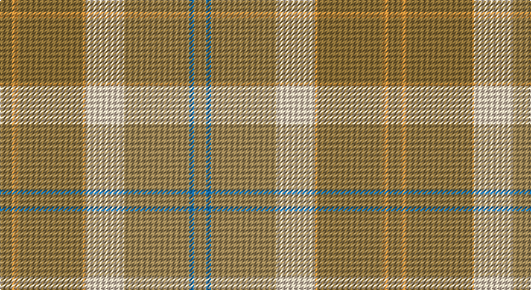

This page is one **sett** — a single exact thread-count. It belongs to the [tartan](/setts/y10lo5y54lo2lb32loi54b4loi10/)
(the same proportion at any scale), whose colour order is pattern [GYGYWYBY](/stripes/gygywyby/).

Sourced from register-of-tartans.  It is a [8 stripe tartan](/stripes/stripes8/).

Original link https://www.tartanregister.gov.uk/tartanDetails.aspx?ref=659

## Provenance

Earliest known date: pre 2003 From the Marton Mills Keighly range (5.5oz polyester/cotton).

## Also known as

This cloth is also recorded under:

- Cladish Weavers

3 attestations — the source records this cloth was collapsed from (oldest owns this page)

<ul>
<li>01/01/2003 — Cladish (register-of-tartans, <a href="https://www.tartanregister.gov.uk/tartanDetails.aspx?ref=659">record</a>)</li>
<li>pre 2003 — Cladish (Fashion) (tartans-authority, <a href="http://www.tartansauthority.com/tartan-ferret/display/6011/">record</a>)</li>
<li>undated — Cladish Weavers Tartan (house-of-tartan, <a href="http://www.house-of-tartan.scotland.net/house/TartanViewjs.asp?colr=Def&tnam=6011">record</a>)</li>
</ul>

## Register references

External register numbers recorded for this tartan.

- Scottish Register of Tartans: [659](https://www.tartanregister.gov.uk/tartanDetails.aspx?ref=659)
- Scottish Tartans Authority (ITI): 6011

## Thread count
LT/10 O5 LT54 O2 LR32 LTa54 B4 LTa/10

One full sett is **322 threads**.

## Palette

Palette: <strong>Tartan Register</strong>
<table><thead><tr><th>Colour</th><th>Threads</th><th>Shade</th><th>Base</th><th>OKLCh</th></tr></thead><tbody><tr><td>LT/</td><td style="text-align:right;font-variant-numeric:tabular-nums">10</td><td><code style="background-color:#8C7038;">#8C7038</code> <small style="color:#888">#8C7038</small></td><td>G <code style="background-color:#006100;">#006100</code></td><td><small style="color:#888">oklch(56.0% 0.082 83.0)</small></td></tr><tr><td>O</td><td style="text-align:right;font-variant-numeric:tabular-nums">5</td><td><code style="background-color:#DC943C;">#DC943C</code> <small style="color:#888">#DC943C</small></td><td>Y <code style="background-color:#F2BF00;">#F2BF00</code></td><td><small style="color:#888">oklch(72.3% 0.133 67.9)</small></td></tr><tr><td>LT</td><td style="text-align:right;font-variant-numeric:tabular-nums">54</td><td><code style="background-color:#8C7038;">#8C7038</code> <small style="color:#888">#8C7038</small></td><td>G <code style="background-color:#006100;">#006100</code></td><td><small style="color:#888">oklch(56.0% 0.082 83.0)</small></td></tr><tr><td>O</td><td style="text-align:right;font-variant-numeric:tabular-nums">2</td><td><code style="background-color:#DC943C;">#DC943C</code> <small style="color:#888">#DC943C</small></td><td>Y <code style="background-color:#F2BF00;">#F2BF00</code></td><td><small style="color:#888">oklch(72.3% 0.133 67.9)</small></td></tr><tr><td>LR</td><td style="text-align:right;font-variant-numeric:tabular-nums">32</td><td><code style="background-color:#E8CCB8;">#E8CCB8</code> <small style="color:#888">#E8CCB8</small></td><td>W <code style="background-color:#F7F7F7;">#F7F7F7</code></td><td><small style="color:#888">oklch(86.3% 0.042 57.7)</small></td></tr><tr><td>LTa</td><td style="text-align:right;font-variant-numeric:tabular-nums">54</td><td><code style="background-color:#A08858;">#A08858</code> <small style="color:#888">#A08858</small></td><td>Y <code style="background-color:#F2BF00;">#F2BF00</code></td><td><small style="color:#888">oklch(63.7% 0.071 84.0)</small></td></tr><tr><td>B</td><td style="text-align:right;font-variant-numeric:tabular-nums">4</td><td><code style="background-color:#1474B4;">#1474B4</code> <small style="color:#888">#1474B4</small></td><td>B <code style="background-color:#2A418A;">#2A418A</code></td><td><small style="color:#888">oklch(54.0% 0.129 245.1)</small></td></tr><tr><td>LTa/</td><td style="text-align:right;font-variant-numeric:tabular-nums">10</td><td><code style="background-color:#A08858;">#A08858</code> <small style="color:#888">#A08858</small></td><td>Y <code style="background-color:#F2BF00;">#F2BF00</code></td><td><small style="color:#888">oklch(63.7% 0.071 84.0)</small></td></tr></tbody></table>

# Sample pattern

## Nearest tartans

The nearest existing variants by ΔTartan distance, with this tartan at the top so the swatches line up against it.

ΔTartan

Tartan

Sett

—

<a href="/ttd/edit/#slug=y10lo5y54lo2lb32loi54b4loi10">Cladish</a> <a class="nn-out" href="/variants/s8/y10lo5y54lo2lb32loi54b4loi10/" title="open its dictionary page">↗</a>

1.73

<a href="/ttd/edit/#slug=r3k1yi8ly1dy7ly1yi19y25k1~x2&amp;base=y10lo5y54lo2lb32loi54b4loi10">Broons, The (DC Thomson)</a> <a class="nn-out" href="/variants/s9/r3k1yi8ly1dy7ly1yi19y25k1~x2/" title="open its dictionary page">↗</a>

1.82

<a href="/ttd/edit/#slug=lo3ly12lo12w3ly2lyi26lo3ly1~x2&amp;base=y10lo5y54lo2lb32loi54b4loi10">Desert in Bloom</a> <a class="nn-out" href="/variants/s8/lo3ly12lo12w3ly2lyi26lo3ly1~x2/" title="open its dictionary page">↗</a>

1.89

<a href="/ttd/edit/#slug=y25w2t4lo7t4w2loi25w2t4lo7~x2&amp;base=y10lo5y54lo2lb32loi54b4loi10">O'Monaghan (Personal)</a> <a class="nn-out" href="/variants/s10/y25w2t4lo7t4w2loi25w2t4lo7~x2/" title="open its dictionary page">↗</a>

1.90

<a href="/ttd/edit/#slug=n8o4lb2o4n1o12g9n24r4~x2&amp;base=y10lo5y54lo2lb32loi54b4loi10">Willsher Wedding (Personal)</a> <a class="nn-out" href="/variants/s9/n8o4lb2o4n1o12g9n24r4~x2/" title="open its dictionary page">↗</a>

1.91

<a href="/ttd/edit/#slug=g4n4g2lo36n14lo2t4g7r5lo3~x2&amp;base=y10lo5y54lo2lb32loi54b4loi10">Rikaco Eve (Fashion)</a> <a class="nn-out" href="/variants/s10/g4n4g2lo36n14lo2t4g7r5lo3~x2/" title="open its dictionary page">↗</a>

1.96

<a href="/ttd/edit/#slug=r12w4r3lo18r3ly4g2~x2&amp;base=y10lo5y54lo2lb32loi54b4loi10">Golden Pheasant</a> <a class="nn-out" href="/variants/s7/r12w4r3lo18r3ly4g2~x2/" title="open its dictionary page">↗</a>

1.97

<a href="/ttd/edit/#slug=dt5t2dt11y2dt2y6o17oi9dt1o1~x2&amp;base=y10lo5y54lo2lb32loi54b4loi10">Clarks No.1</a> <a class="nn-out" href="/variants/s10/dt5t2dt11y2dt2y6o17oi9dt1o1~x2/" title="open its dictionary page">↗</a>

2.01

<a href="/ttd/edit/#slug=lri3lb3lri1y25lri15lr5lb4ly2~x2&amp;base=y10lo5y54lo2lb32loi54b4loi10">Rikaco Morning Dew #2</a> <a class="nn-out" href="/variants/s8/lri3lb3lri1y25lri15lr5lb4ly2~x2/" title="open its dictionary page">↗</a>

2.04

<a href="/variants/s12/y23o4dy6g6y4lb1y4~x4/">Tricor</a>

2.11

<a href="/ttd/edit/#slug=r5lp2y24lr2y2lr2y6lr8r6lr8ly4~x2&amp;base=y10lo5y54lo2lb32loi54b4loi10">Tasmanian</a> <a class="nn-out" href="/variants/s11/r5lp2y24lr2y2lr2y6lr8r6lr8ly4~x2/" title="open its dictionary page">↗</a>

## Neighbour map

Every grey dot is one of 14360 variants placed by the first two principal components of the ΔTartan feature space (44% of its variance). Red is this tartan; blue dots are its nearest — click one to open its page.

<svg viewBox="0 0 640 380" role="img" style="max-width:100%;height:auto;border:1px solid #e0e0e0;border-radius:4px;display:block" xmlns="http://www.w3.org/2000/svg"><image href="/nn/cloud.v1.png" width="640" height="380"/><a href="/variants/s9/r3k1yi8ly1dy7ly1yi19y25k1~x2/"><circle cx="321.2" cy="153.6" r="4" fill="#3465a4"><title>Broons, The (DC Thomson)</title></circle></a><a href="/variants/s8/lo3ly12lo12w3ly2lyi26lo3ly1~x2/"><circle cx="375.5" cy="188.4" r="4" fill="#3465a4"><title>Desert in Bloom</title></circle></a><a href="/variants/s10/y25w2t4lo7t4w2loi25w2t4lo7~x2/"><circle cx="212.2" cy="171.4" r="4" fill="#3465a4"><title>O'Monaghan (Personal)</title></circle></a><a href="/variants/s9/n8o4lb2o4n1o12g9n24r4~x2/"><circle cx="349.2" cy="189.8" r="4" fill="#3465a4"><title>Willsher Wedding (Personal)</title></circle></a><a href="/variants/s10/g4n4g2lo36n14lo2t4g7r5lo3~x2/"><circle cx="355.7" cy="164.7" r="4" fill="#3465a4"><title>Rikaco Eve (Fashion)</title></circle></a><a href="/variants/s7/r12w4r3lo18r3ly4g2~x2/"><circle cx="282.9" cy="219.5" r="4" fill="#3465a4"><title>Golden Pheasant</title></circle></a><a href="/variants/s10/dt5t2dt11y2dt2y6o17oi9dt1o1~x2/"><circle cx="259.6" cy="187.1" r="4" fill="#3465a4"><title>Clarks No.1</title></circle></a><a href="/variants/s8/lri3lb3lri1y25lri15lr5lb4ly2~x2/"><circle cx="374.3" cy="191.3" r="4" fill="#3465a4"><title>Rikaco Morning Dew #2</title></circle></a><a href="/variants/s12/y23o4dy6g6y4lb1y4~x4/"><circle cx="384.8" cy="190.3" r="4" fill="#3465a4"><title>Tricor</title></circle></a><a href="/variants/s11/r5lp2y24lr2y2lr2y6lr8r6lr8ly4~x2/"><circle cx="292.5" cy="176.4" r="4" fill="#3465a4"><title>Tasmanian</title></circle></a><circle cx="321.2" cy="175.8" r="5" fill="#c00000"/></svg>

ID: /variants/s8/y10lo5y54lo2lb32loi54b4loi10/
