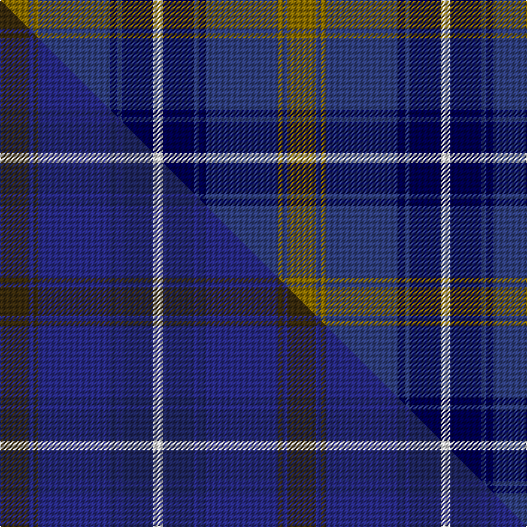

This is one **variant** — a specific cloth: this exact thread count and colourway, with its own
provenance below. It is one weaving of the [sett](/tartans/h/hi/highlands-school-2/) (the scale-free proportion — the
same cloth at any scale or shade), whose colour order is pattern [GBGBBBBW](/stripes/gbgbbbbw/).

Part of the [Highlands School](/tartans/h/hi/highlands-school-2/) tartan — the named design grouping this sett with its other cloths.

Sourced from weddslist.  It is a [8 stripe tartan](/stripes/stripes8/).

Original link [http://www.weddslist.com/cgi-bin/tartans/pg.pl?source=sts](http://www.weddslist.com/cgi-bin/tartans/pg.pl?source=sts)

Dataset <small>— provenance for this record, inherited from the source manifest</small>

<dl class="dataset-prov">
<dt>source</dt><dd><a href="/sources/weddslist/">Weddslist</a></dd>
<dt>data captured from</dt><dd><a href="https://github.com/thetartan/tartan-database/blob/master/data/weddslist/data.csv">https://github.com/thetartan/tartan-database/blob/master/data/weddslist/data.csv</a></dd>
<dt>data date</dt><dd>2016-11-17 <small>(dataset default)</small></dd>
<dt>licence</dt><dd><a href="https://creativecommons.org/licenses/by-nc-nd/4.0/">CC BY-NC-ND 4.0</a></dd>
</dl>

Capture chain <small>— the hands this data passed through, oldest first; each capture carries its own licence</small>

<ol class="capture-chain">
<li><a href="https://www.weddslist.com/tartans/">Weddslist</a> <small>the living privately compiled reference</small></li>
<li><a href="https://github.com/thetartan/tartan-database">thetartan/tartan-database</a> <small>2016-2017</small> · <a href="https://creativecommons.org/licenses/by-nc-nd/4.0/">CC BY-NC-ND 4.0</a> <small>Levko Kravets's frozen compilation — the capture we vendored, and where its CC licence text came from</small></li>
<li>this dictionary <small>captured 2026-06-10 · commit 5bf86c7566</small> <small>each re-capture is a git commit to data/sources</small></li>
</ol>

## Thread count
Y/24 DBi4 Y4 DBi60 DB6 DBi4 DB26 W/8

One full sett is **240 threads**.

## Palette
<table><thead><tr><th>Colour</th><th>Shade</th><th>OKLCh</th></tr></thead><tbody><tr><td>DB</td><td><code style="background-color:#304080;">#304080</code> <small style="color:#888">#304080</small></td><td><small style="color:#888">oklch(39.4% 0.109 270.2)</small></td></tr><tr><td>DB</td><td><code style="background-color:#000050;">#000050</code> <small style="color:#888">#000050</small></td><td><small style="color:#888">oklch(19.5% 0.135 264.1)</small></td></tr><tr><td>Y</td><td><code style="background-color:#8B6E00;">#8B6E00</code> <small style="color:#888">#8B6E00</small></td><td><small style="color:#888">oklch(55.1% 0.113 90.4)</small></td></tr><tr><td>W</td><td><code style="background-color:#F7F7F7;">#F7F7F7</code> <small style="color:#888">#F7F7F7</small></td><td><small style="color:#888">oklch(97.6% 0.000 89.9)</small></td></tr></tbody></table>

# Sample pattern

## Compared to the master

This cloth is one sett of its design; the master sett (the exemplar the design is anchored on) is below for comparison.

Its **ΔTartan distance** from the master is **0.17** — the same measure the nearest-tartans table ranks by (0 is identical; a re-scale of the same cloth is near 0, a recolour or a different proportion further).

<figure class="master-compare" style="margin:0">

this sett
master sett ★

<figcaption style="color:#888;font-size:smaller">One weave of this sett against the <a href="/setts/dy12dbi2dy2dbi30db3dbi2db13w4/">master sett ★</a>, split on the diagonal: a shared proportion runs seamlessly across it with only the shades shifting; a different proportion breaks on it.</figcaption>
</figure>

## Nearest tartan variants

The nearest existing variants by ΔTartan distance, with this cloth at the top so the swatches line up against it.

ΔTartan

Threads

Variant

Sett

—

240

<a href="/variants/s8/y12dbi2y2dbi30db3dbi2db13w4~x2~dbi1604274-db0805267/">Highlands School, (North Carolina)</a>

<a href="/ttd/edit/#slug=w9db3y3db24dbi24y2dbi2y2~x2~db1106275-dbi1404245&amp;base=y12dbi2y2dbi30db3dbi2db13w4~x2~dbi1604274-db0805267" title="compare in the TTD">1.94</a>

254

<a href="/variants/s8/w9db3y3db24dbi24y2dbi2y2~x2~db1106275-dbi1404245/">Halesowen #2</a>

<a href="/ttd/edit/#slug=dr10db15g2db2w1db1w1~x4&amp;base=y12dbi2y2dbi30db3dbi2db13w4~x2~dbi1604274-db0805267" title="compare in the TTD">2.16</a>

212

<a href="/variants/s7/dr10db15g2db2w1db1w1~x4/">Ikelman #4 (Personal)</a>

<a href="/ttd/edit/#slug=db6lb3db3lb15dg7db7dg5db17dg46dgi4~dgi1605139&amp;base=y12dbi2y2dbi30db3dbi2db13w4~x2~dbi1604274-db0805267" title="compare in the TTD">2.36</a>

216

<a href="/variants/s10/db6lb3db3lb15dg7db7dg5db17dg46dgi4~dgi1605139/">Jones (Welsh Name)</a>

<a href="/ttd/edit/#slug=db10dr3db3dr6db26g12dr6g2dr3g6lo2~x2&amp;base=y12dbi2y2dbi30db3dbi2db13w4~x2~dbi1604274-db0805267" title="compare in the TTD">2.41</a>

292

<a href="/variants/s11/db10dr3db3dr6db26g12dr6g2dr3g6lo2~x2/">Law of Atholl (Personal)</a>

<a href="/ttd/edit/#slug=dr1g4ly1g3dr4db15w1~x4&amp;base=y12dbi2y2dbi30db3dbi2db13w4~x2~dbi1604274-db0805267" title="compare in the TTD">2.52</a>

224

<a href="/variants/s7/dr1g4ly1g3dr4db15w1~x4/">Bressuire (District)</a>

<a href="/ttd/edit/#slug=do2db4g12db3do6lb2db24do2db2g2~x2&amp;base=y12dbi2y2dbi30db3dbi2db13w4~x2~dbi1604274-db0805267" title="compare in the TTD">2.63</a>

228

<a href="/variants/s10/do2db4g12db3do6lb2db24do2db2g2~x2/">Wicklow</a>

<a href="/ttd/edit/#slug=w9t3y3t24db24y2db2y2~x2&amp;base=y12dbi2y2dbi30db3dbi2db13w4~x2~dbi1604274-db0805267" title="compare in the TTD">2.63</a>

254

<a href="/variants/s8/w9t3y3t24db24y2db2y2~x2/">Halesowen (District)</a>

<a href="/ttd/edit/#slug=n8y4n35db2lt8db2n4db21n4~x2~db1108266-lt3103227&amp;base=y12dbi2y2dbi30db3dbi2db13w4~x2~dbi1604274-db0805267" title="compare in the TTD">2.85</a>

328

<a href="/variants/s9/n8y4n35db2lt8db2n4db21n4~x2~db1108266-lt3103227/">Bedford Academy</a>

<a href="/ttd/edit/#slug=db22ly2db1ly2db10y2g11y6~x2~ly3307090-y2400000&amp;base=y12dbi2y2dbi30db3dbi2db13w4~x2~dbi1604274-db0805267" title="compare in the TTD">2.92</a>

168

<a href="/variants/s8/db22ly2db1ly2db10y2g11y6~x2~ly3307090-y2400000/">Katsushika (Corporate)</a>

<a href="/ttd/edit/#slug=db32do3db3do3db3do10g24dr3~x2&amp;base=y12dbi2y2dbi30db3dbi2db13w4~x2~dbi1604274-db0805267" title="compare in the TTD">2.94</a>

254

<a href="/variants/s8/db32do3db3do3db3do10g24dr3~x2/">Gammell Family Tartan</a>

## Neighbour map

Every grey dot is one of 13657 variants placed by the first two principal components of the ΔTartan feature space (42% of its variance). Red is this tartan; blue dots are its nearest — click one to open its page. The map is a flat projection of a many-dimensional space — [how to read it](/posts/neighbourhood-maps/).

<svg viewBox="0 0 640 380" role="img" style="max-width:100%;height:auto;border:1px solid #e0e0e0;border-radius:4px;display:block" xmlns="http://www.w3.org/2000/svg"><image href="/nn/cloud.v1.png" width="640" height="380"/><a href="/variants/s8/w9db3y3db24dbi24y2dbi2y2~x2~db1106275-dbi1404245/"><circle cx="248.8" cy="194.9" r="4" fill="#3465a4"><title>Halesowen #2</title></circle></a><a href="/variants/s7/dr10db15g2db2w1db1w1~x4/"><circle cx="370.9" cy="187.0" r="4" fill="#3465a4"><title>Ikelman #4 (Personal)</title></circle></a><a href="/variants/s10/db6lb3db3lb15dg7db7dg5db17dg46dgi4~dgi1605139/"><circle cx="328.2" cy="180.7" r="4" fill="#3465a4"><title>Jones (Welsh Name)</title></circle></a><a href="/variants/s11/db10dr3db3dr6db26g12dr6g2dr3g6lo2~x2/"><circle cx="311.0" cy="197.0" r="4" fill="#3465a4"><title>Law of Atholl (Personal)</title></circle></a><a href="/variants/s7/dr1g4ly1g3dr4db15w1~x4/"><circle cx="303.3" cy="176.2" r="4" fill="#3465a4"><title>Bressuire (District)</title></circle></a><a href="/variants/s10/do2db4g12db3do6lb2db24do2db2g2~x2/"><circle cx="360.0" cy="191.4" r="4" fill="#3465a4"><title>Wicklow</title></circle></a><a href="/variants/s8/w9t3y3t24db24y2db2y2~x2/"><circle cx="248.7" cy="199.2" r="4" fill="#3465a4"><title>Halesowen (District)</title></circle></a><a href="/variants/s9/n8y4n35db2lt8db2n4db21n4~x2~db1108266-lt3103227/"><circle cx="399.0" cy="187.6" r="4" fill="#3465a4"><title>Bedford Academy</title></circle></a><a href="/variants/s8/db22ly2db1ly2db10y2g11y6~x2~ly3307090-y2400000/"><circle cx="358.7" cy="179.1" r="4" fill="#3465a4"><title>Katsushika (Corporate)</title></circle></a><a href="/variants/s8/db32do3db3do3db3do10g24dr3~x2/"><circle cx="323.0" cy="215.5" r="4" fill="#3465a4"><title>Gammell Family Tartan</title></circle></a><circle cx="320.7" cy="189.3" r="5" fill="#c00000"/><text x="320" y="376" text-anchor="middle" font-size="11" fill="#999">ground</text><text x="11" y="190" text-anchor="middle" font-size="11" fill="#999" transform="rotate(-90 11 190)">complexity</text></svg>

ID: /variants/s8/y12dbi2y2dbi30db3dbi2db13w4~x2~dbi1604274-db0805267/
