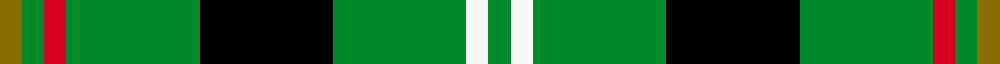

This page is one **sett** — a single exact thread-count. It belongs to the [tartan](/setts/y1g1r1g6k6g6w1g1/)
(the same proportion at any scale), whose colour order is pattern [GGRGKGWG](/stripes/ggrgkgwg/).

Sourced from weddslist.  It is a [8 stripe tartan](/stripes/stripes8/).

Original link [http://www.weddslist.com/cgi-bin/tartans/pg.pl?source=sts](http://www.weddslist.com/cgi-bin/tartans/pg.pl?source=sts)

Dataset <small>— provenance for this record, inherited from the source manifest</small>

<dl class="dataset-prov">
<dt>source</dt><dd><a href="/sources/weddslist/">Weddslist</a></dd>
<dt>data captured from</dt><dd><a href="https://github.com/thetartan/tartan-database/blob/master/data/weddslist/data.csv">https://github.com/thetartan/tartan-database/blob/master/data/weddslist/data.csv</a></dd>
<dt>data date</dt><dd>2016-11-17 <small>(dataset default)</small></dd>
<dt>licence</dt><dd><a href="https://creativecommons.org/licenses/by-nc-nd/4.0/">CC BY-NC-ND 4.0</a></dd>
</dl>

Capture chain <small>— the hands this data passed through, oldest first; each capture carries its own licence</small>

<ol class="capture-chain">
<li><a href="https://www.weddslist.com/tartans/">Weddslist</a> <small>the living privately compiled reference</small></li>
<li><a href="https://github.com/thetartan/tartan-database">thetartan/tartan-database</a> <small>2016-2017</small> · <a href="https://creativecommons.org/licenses/by-nc-nd/4.0/">CC BY-NC-ND 4.0</a> <small>Levko Kravets's frozen compilation — the capture we vendored, and where its CC licence text came from</small></li>
<li>this dictionary <small>captured 2026-06-10 · commit 5bf86c7566</small> <small>each re-capture is a git commit to data/sources</small></li>
</ol>

## Thread count
Y/4 G4 R4 G24 K24 G24 W4 G/4

One full sett is **176 threads**.

## Palette
<table><thead><tr><th>Colour</th><th>Shade</th><th>OKLCh</th></tr></thead><tbody><tr><td>K</td><td><code style="background-color:#000000;">#000000</code> <small style="color:#888">#000000</small></td><td><small style="color:#888">oklch(0.0% 0.000 0.0)</small></td></tr><tr><td>G</td><td><code style="background-color:#008B2A;">#008B2A</code> <small style="color:#888">#008B2A</small></td><td><small style="color:#888">oklch(55.4% 0.170 145.9)</small></td></tr><tr><td>W</td><td><code style="background-color:#F7F7F7;">#F7F7F7</code> <small style="color:#888">#F7F7F7</small></td><td><small style="color:#888">oklch(97.6% 0.000 89.9)</small></td></tr><tr><td>R</td><td><code style="background-color:#D60020;">#D60020</code> <small style="color:#888">#D60020</small></td><td><small style="color:#888">oklch(55.2% 0.224 25.5)</small></td></tr><tr><td>Y</td><td><code style="background-color:#8B6E00;">#8B6E00</code> <small style="color:#888">#8B6E00</small></td><td><small style="color:#888">oklch(55.1% 0.113 90.4)</small></td></tr></tbody></table>

# Sample pattern

## Nearest tartan variants

The nearest existing variants by ΔTartan distance, with this cloth at the top so the swatches line up against it.

ΔTartan

Threads

Variant

Sett

—

176

<a href="/variants/s8/y1g1r1g6k6g6w1g1~x4/">Vermont</a>

<a href="/ttd/edit/#slug=dg50r5dg8w10dg8db8dg8y21~x2&amp;base=y1g1r1g6k6g6w1g1~x4" title="compare in the TTD">1.28</a>

330

<a href="/variants/s8/dg50r5dg8w10dg8db8dg8y21~x2/">St Patrick's Krewe</a>

<a href="/ttd/edit/#slug=g20dp2g3dp2g14k18g4~x2&amp;base=y1g1r1g6k6g6w1g1~x4" title="compare in the TTD">1.43</a>

204

<a href="/variants/s7/g20dp2g3dp2g14k18g4~x2/">Pringle, James (Fashion)</a>

<a href="/ttd/edit/#slug=g3w1g12r6g3k3g2~x4&amp;base=y1g1r1g6k6g6w1g1~x4" title="compare in the TTD">1.57</a>

220

<a href="/variants/s7/g3w1g12r6g3k3g2~x4/">Arkansas (Fashion)</a>

<a href="/ttd/edit/#slug=dg3w1dg12r6dg3k3dg2~x4~dg1806142&amp;base=y1g1r1g6k6g6w1g1~x4" title="compare in the TTD">1.57</a>

220

<a href="/variants/s7/dg3w1dg12r6dg3k3dg2~x4~dg1806142/">Arkansas</a>

<a href="/ttd/edit/#slug=r3g24k28g19y3g3y3~x2&amp;base=y1g1r1g6k6g6w1g1~x4" title="compare in the TTD">1.74</a>

320

<a href="/variants/s7/r3g24k28g19y3g3y3~x2/">Paton</a>

<a href="/ttd/edit/#slug=db2r1g10r1k6g12r2g1r1g3w2~x4&amp;base=y1g1r1g6k6g6w1g1~x4" title="compare in the TTD">1.78</a>

312

<a href="/variants/s11/db2r1g10r1k6g12r2g1r1g3w2~x4/">Ronald, Clan (Clan)</a>

<a href="/ttd/edit/#slug=g8w4g50k12g4k15ly5~x2&amp;base=y1g1r1g6k6g6w1g1~x4" title="compare in the TTD">1.83</a>

366

<a href="/variants/s7/g8w4g50k12g4k15ly5~x2/">Instakilt, Green (Fashion)</a>

<a href="/ttd/edit/#slug=g5k15g5k15g19r2g13lb4~x2&amp;base=y1g1r1g6k6g6w1g1~x4" title="compare in the TTD">2.04</a>

294

<a href="/variants/s8/g5k15g5k15g19r2g13lb4~x2/">Strath Hallidale (Fashion)</a>

<a href="/ttd/edit/#slug=dr3g20k20g20lo2g2lo2~x2&amp;base=y1g1r1g6k6g6w1g1~x4" title="compare in the TTD">2.08</a>

266

<a href="/variants/s7/dr3g20k20g20lo2g2lo2~x2/">Paton (Personal)</a>

<a href="/ttd/edit/#slug=k3dg14k8dg8dr3dg4lo3dg24w3~x2&amp;base=y1g1r1g6k6g6w1g1~x4" title="compare in the TTD">2.18</a>

268

<a href="/variants/s9/k3dg14k8dg8dr3dg4lo3dg24w3~x2/">MacStumer Hunting</a>

## Neighbour map

Every grey dot is one of 13621 variants placed by the first two principal components of the ΔTartan feature space (42% of its variance). Red is this tartan; blue dots are its nearest — click one to open its page.

<svg viewBox="0 0 640 380" role="img" style="max-width:100%;height:auto;border:1px solid #e0e0e0;border-radius:4px;display:block" xmlns="http://www.w3.org/2000/svg"><image href="/nn/cloud.v1.png" width="640" height="380"/><a href="/variants/s8/dg50r5dg8w10dg8db8dg8y21~x2/"><circle cx="314.7" cy="179.3" r="4" fill="#3465a4"><title>St Patrick's Krewe</title></circle></a><a href="/variants/s7/g20dp2g3dp2g14k18g4~x2/"><circle cx="321.6" cy="202.9" r="4" fill="#3465a4"><title>Pringle, James (Fashion)</title></circle></a><a href="/variants/s7/g3w1g12r6g3k3g2~x4/"><circle cx="325.0" cy="186.3" r="4" fill="#3465a4"><title>Arkansas (Fashion)</title></circle></a><a href="/variants/s7/dg3w1dg12r6dg3k3dg2~x4~dg1806142/"><circle cx="334.3" cy="186.6" r="4" fill="#3465a4"><title>Arkansas</title></circle></a><a href="/variants/s7/r3g24k28g19y3g3y3~x2/"><circle cx="247.6" cy="186.3" r="4" fill="#3465a4"><title>Paton</title></circle></a><a href="/variants/s11/db2r1g10r1k6g12r2g1r1g3w2~x4/"><circle cx="266.8" cy="135.8" r="4" fill="#3465a4"><title>Ronald, Clan (Clan)</title></circle></a><a href="/variants/s7/g8w4g50k12g4k15ly5~x2/"><circle cx="302.6" cy="159.4" r="4" fill="#3465a4"><title>Instakilt, Green (Fashion)</title></circle></a><a href="/variants/s8/g5k15g5k15g19r2g13lb4~x2/"><circle cx="218.3" cy="204.2" r="4" fill="#3465a4"><title>Strath Hallidale (Fashion)</title></circle></a><a href="/variants/s7/dr3g20k20g20lo2g2lo2~x2/"><circle cx="277.2" cy="183.4" r="4" fill="#3465a4"><title>Paton (Personal)</title></circle></a><a href="/variants/s9/k3dg14k8dg8dr3dg4lo3dg24w3~x2/"><circle cx="336.8" cy="172.2" r="4" fill="#3465a4"><title>MacStumer Hunting</title></circle></a><circle cx="230.6" cy="186.7" r="5" fill="#c00000"/><text x="320" y="376" text-anchor="middle" font-size="11" fill="#999">ground</text><text x="11" y="190" text-anchor="middle" font-size="11" fill="#999" transform="rotate(-90 11 190)">complexity</text></svg>

ID: /variants/s8/y1g1r1g6k6g6w1g1~x4/
