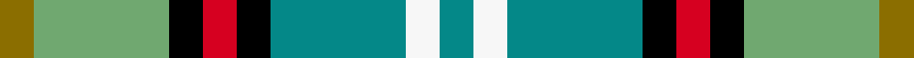

This page is one **sett** — a single exact thread-count. It belongs to the [tartan](/setts/y1ly4k1r1k1g4w1g1/)
(the same proportion at any scale), whose colour order is pattern [GWGKRKYG](/stripes/gwgkrkyg/).

Sourced from register-of-tartans.  It is a [8 stripe tartan](/stripes/stripes8/).

Original link https://www.tartanregister.gov.uk/tartanDetails.aspx?ref=1041

2 attestations — the source records this cloth was collapsed from (oldest owns this page)

<ul>
<li>01/01/1988 — Dunedin (NZ) (register-of-tartans, <a href="https://www.tartanregister.gov.uk/tartanDetails.aspx?ref=1041">record</a>)  <em>This tartan was designed to commemorate the first settlers from the Free Church of Scotland who stepped ashore on the 23rd of March 1848, at Otago Harbour, New Zealand, after a voyage of 116 days. It was at the upper end of this harbour they established the first settlement which was to become the City of Dunedin sometimes known as the Edinburgh of the South. Dunedin District Tartan is the copyright property of Vilma R. Nelson. License to distribute is held by The Suit Surgeons Ltd, 120 Lower Stuart Street, Dunedin, New Zealand, phone +64 3 477-1001 or fax +64 3 477-1002. The small white stripes represent the first two ships; the blue strips the sea they crossed; the green for new pastures; the gold for crops grown. The red signifies blood ties left behind; and the black sadness for loved ones missed.</em></li>
<li>1988 — Dunedin (NZ) (District) (tartans-authority, <a href="http://www.tartansauthority.com/tartan-ferret/display/2114/">record</a>)  <em>This tartan was designed to commemorate the first settlers from the Free Church of Scotland who stepped ashore on the 23rd of March 1848, at Otago Harbour, New Zealand, after a voyage of 116 days. It was at the upper end of this harbour they established the first settlement which was to become the City of Dunedin sometimes known as the Edinburgh of the South. Dunedin District Tartan is the copyright property of Vilma R. Nelson. License to distribute is held by The Suit Surgeons Ltd of Dunedin. The small white stripes represent the first two ships; the blue strips the sea they crossed; the green for new pastures; the gold for crops grown. The red signifies blood ties left behind; and the black sadness for loved ones missed.</em></li>
</ul>

## Register references

External register numbers recorded for this tartan.

- Scottish Register of Tartans: [1041](https://www.tartanregister.gov.uk/tartanDetails.aspx?ref=1041)
- Scottish Tartans Authority (ITI): 2114
- Scottish Tartans World Register: 2114

## Thread count
Y/8 LY32 K8 R8 K8 G32 W8 G/8

One full sett is **208 threads**.

## Palette
<table><thead><tr><th>Colour</th><th>Shade</th><th>OKLCh</th></tr></thead><tbody><tr><td>G</td><td><code style="background-color:#048888;">#048888</code> <small style="color:#888">#048888</small></td><td><small style="color:#888">oklch(56.8% 0.096 194.8)</small></td></tr><tr><td>K</td><td><code style="background-color:#000000;">#000000</code> <small style="color:#888">#000000</small></td><td><small style="color:#888">oklch(0.0% 0.000 0.0)</small></td></tr><tr><td>LY</td><td><code style="background-color:#70A870;">#70A870</code> <small style="color:#888">#70A870</small></td><td><small style="color:#888">oklch(67.8% 0.100 144.4)</small></td></tr><tr><td>R</td><td><code style="background-color:#D60020;">#D60020</code> <small style="color:#888">#D60020</small></td><td><small style="color:#888">oklch(55.2% 0.224 25.5)</small></td></tr><tr><td>W</td><td><code style="background-color:#F7F7F7;">#F7F7F7</code> <small style="color:#888">#F7F7F7</small></td><td><small style="color:#888">oklch(97.6% 0.000 89.9)</small></td></tr><tr><td>Y</td><td><code style="background-color:#8B6E00;">#8B6E00</code> <small style="color:#888">#8B6E00</small></td><td><small style="color:#888">oklch(55.1% 0.113 90.4)</small></td></tr></tbody></table>

# Sample pattern

## Nearest tartan variants

The nearest existing variants by ΔTartan distance, with this cloth at the top so the swatches line up against it.

ΔTartan

Threads

Variant

Sett

—

208

<a href="/variants/s8/y1ly4k1r1k1g4w1g1~x8~ly2704144-g2304202/">Dunedin (NZ)</a>

2.72

—

<a href="/variants/s8/dg9w2dg9k2ly14lyi4w2r2~x4~ly2503076-lyi2705081/">MacShane (Clan)</a>

<a href="/ttd/edit/#slug=lb2k2dg8g8r1g1w1~x4~dg1806142-g2304202&amp;base=y1ly4k1r1k1g4w1g1~x8~ly2704144-g2304202" title="compare in the TTD">2.92</a>

172

<a href="/variants/s7/lb2k2dg8g8r1g1w1~x4~dg1806142-g2304202/">Lundy (Personal)</a>

## Neighbour map

Every grey dot is one of 13620 variants placed by the first two principal components of the ΔTartan feature space (42% of its variance). Red is this tartan; blue dots are its nearest — click one to open its page.

<svg viewBox="0 0 640 380" role="img" style="max-width:100%;height:auto;border:1px solid #e0e0e0;border-radius:4px;display:block" xmlns="http://www.w3.org/2000/svg"><image href="/nn/cloud.v1.png" width="640" height="380"/><a href="/variants/s8/dg9w2dg9k2ly14lyi4w2r2~x4~ly2503076-lyi2705081/"><circle cx="127.5" cy="179.8" r="4" fill="#3465a4"><title>MacShane (Clan)</title></circle></a><a href="/variants/s7/lb2k2dg8g8r1g1w1~x4~dg1806142-g2304202/"><circle cx="150.7" cy="179.5" r="4" fill="#3465a4"><title>Lundy (Personal)</title></circle></a><circle cx="65.2" cy="203.9" r="5" fill="#c00000"/><text x="320" y="376" text-anchor="middle" font-size="11" fill="#999">ground</text><text x="11" y="190" text-anchor="middle" font-size="11" fill="#999" transform="rotate(-90 11 190)">complexity</text></svg>

ID: /variants/s8/y1ly4k1r1k1g4w1g1~x8~ly2704144-g2304202/
