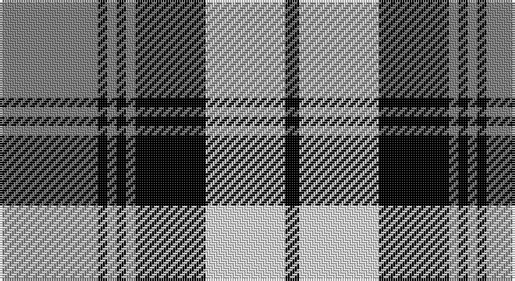

This page is one **sett** — a single exact thread-count. It belongs to the [tartan](/setts/y21k2y2k2y2k15w17k3/)
(the same proportion at any scale), whose colour order is pattern [GKGKGKWK](/stripes/gkgkgkwk/).

Part of the [Laksaa](/tartans/laksaa/) tartan — the named design grouping this sett with its other cloths.

Sourced from weddslist.  It is a [8 stripe tartan](/stripes/stripes8/).

Original link http://www.weddslist.com/cgi-bin/tartans/pg.pl?source=sts

## Thread count
N/42 K4 N4 K4 N4 K30 LN34 K/6

One full sett is **208 threads**.

## Palette

Palette: <strong>Tartan Register</strong>
<table><thead><tr><th>Colour</th><th>Threads</th><th>Shade</th><th>Base</th><th>OKLCh</th></tr></thead><tbody><tr><td>N/</td><td style="text-align:right;font-variant-numeric:tabular-nums">42</td><td><code style="background-color:#808080;">#808080</code> <small style="color:#888">#808080</small></td><td>G <code style="background-color:#006100;">#006100</code></td><td><small style="color:#888">oklch(60.0% 0.000 89.9)</small></td></tr><tr><td>K</td><td style="text-align:right;font-variant-numeric:tabular-nums">4</td><td><code style="background-color:#000000;">#000000</code> <small style="color:#888">#000000</small></td><td>K <code style="background-color:#000000;">#000000</code></td><td><small style="color:#888">oklch(0.0% 0.000 0.0)</small></td></tr><tr><td>N</td><td style="text-align:right;font-variant-numeric:tabular-nums">4</td><td><code style="background-color:#808080;">#808080</code> <small style="color:#888">#808080</small></td><td>G <code style="background-color:#006100;">#006100</code></td><td><small style="color:#888">oklch(60.0% 0.000 89.9)</small></td></tr><tr><td>K</td><td style="text-align:right;font-variant-numeric:tabular-nums">4</td><td><code style="background-color:#000000;">#000000</code> <small style="color:#888">#000000</small></td><td>K <code style="background-color:#000000;">#000000</code></td><td><small style="color:#888">oklch(0.0% 0.000 0.0)</small></td></tr><tr><td>N</td><td style="text-align:right;font-variant-numeric:tabular-nums">4</td><td><code style="background-color:#808080;">#808080</code> <small style="color:#888">#808080</small></td><td>G <code style="background-color:#006100;">#006100</code></td><td><small style="color:#888">oklch(60.0% 0.000 89.9)</small></td></tr><tr><td>K</td><td style="text-align:right;font-variant-numeric:tabular-nums">30</td><td><code style="background-color:#000000;">#000000</code> <small style="color:#888">#000000</small></td><td>K <code style="background-color:#000000;">#000000</code></td><td><small style="color:#888">oklch(0.0% 0.000 0.0)</small></td></tr><tr><td>LN</td><td style="text-align:right;font-variant-numeric:tabular-nums">34</td><td><code style="background-color:#E0E0E0;">#E0E0E0</code> <small style="color:#888">#E0E0E0</small></td><td>W <code style="background-color:#F7F7F7;">#F7F7F7</code></td><td><small style="color:#888">oklch(90.7% 0.000 89.9)</small></td></tr><tr><td>K/</td><td style="text-align:right;font-variant-numeric:tabular-nums">6</td><td><code style="background-color:#000000;">#000000</code> <small style="color:#888">#000000</small></td><td>K <code style="background-color:#000000;">#000000</code></td><td><small style="color:#888">oklch(0.0% 0.000 0.0)</small></td></tr></tbody></table>

# Sample pattern

## Compared to the master

This cloth is one sett of its design; the master sett (the exemplar the design is anchored on) is below for comparison.

<figure style="margin:0"><figcaption style="color:#888;font-size:smaller">this sett</figcaption></figure>
<figure style="margin:0"><figcaption style="color:#888;font-size:smaller"><a href="/setts/n22k2n2k2n2k16w16k3/">master sett →</a></figcaption></figure>

## Nearest tartans

The nearest existing variants by ΔTartan distance, with this tartan at the top so the swatches line up against it.

ΔTartan

Tartan

Sett

—

<a href="/ttd/edit/#slug=y21k2y2k2y2k15w17k3~x2">Laksaa</a> <a class="nn-out" href="/variants/s8/y21k2y2k2y2k15w17k3~x2/" title="open its dictionary page">↗</a>

0.48

<a href="/ttd/edit/#slug=n22k2n2k2n2k16w16k3~x2&amp;base=y21k2y2k2y2k15w17k3~x2">Laksaa (Manx)</a> <a class="nn-out" href="/variants/s8/n22k2n2k2n2k16w16k3~x2/" title="open its dictionary page">↗</a>

1.04

<a href="/ttd/edit/#slug=ly1k4db2k10w1db2w10db1w4ly1~x4&amp;base=y21k2y2k2y2k15w17k3~x2">Chieftain</a> <a class="nn-out" href="/variants/s10/ly1k4db2k10w1db2w10db1w4ly1~x4/" title="open its dictionary page">↗</a>

1.08

<a href="/ttd/edit/#slug=g24k3g2k3g4k4m20k3m6~x2&amp;base=y21k2y2k2y2k15w17k3~x2">Alma College</a> <a class="nn-out" href="/variants/s9/g24k3g2k3g4k4m20k3m6~x2/" title="open its dictionary page">↗</a>

1.14

<a href="/ttd/edit/#slug=k4w2k2w2k2w4k2w2k4db12w1~x4&amp;base=y21k2y2k2y2k15w17k3~x2">Napier</a> <a class="nn-out" href="/variants/s11/k4w2k2w2k2w4k2w2k4db12w1~x4/" title="open its dictionary page">↗</a>

1.16

<a href="/ttd/edit/#slug=n12dt2n2dt2n2dt10w12dt3~x2&amp;base=y21k2y2k2y2k15w17k3~x2">Grey Watch Dress (Fashion)</a> <a class="nn-out" href="/variants/s8/n12dt2n2dt2n2dt10w12dt3~x2/" title="open its dictionary page">↗</a>

1.21

<a href="/ttd/edit/#slug=t2w2t15k15w2k15w2t3w2t7w2~x2&amp;base=y21k2y2k2y2k15w17k3~x2">Clark (Clan)</a> <a class="nn-out" href="/variants/s11/t2w2t15k15w2k15w2t3w2t7w2~x2/" title="open its dictionary page">↗</a>

1.22

<a href="/ttd/edit/#slug=k4ly2k13ly1w8t13ly2t4~x2&amp;base=y21k2y2k2y2k15w17k3~x2">Bannockbane, Blue</a> <a class="nn-out" href="/variants/s8/k4ly2k13ly1w8t13ly2t4~x2/" title="open its dictionary page">↗</a>

1.23

<a href="/ttd/edit/#slug=k4w2k2w2k2w4k2w2k4db12w1~x2&amp;base=y21k2y2k2y2k15w17k3~x2">Napier</a> <a class="nn-out" href="/variants/s11/k4w2k2w2k2w4k2w2k4db12w1~x2/" title="open its dictionary page">↗</a>

1.25

<a href="/ttd/edit/#slug=db12w4db1w4r8w2r1~x4&amp;base=y21k2y2k2y2k15w17k3~x2">Sunderland</a> <a class="nn-out" href="/variants/s7/db12w4db1w4r8w2r1~x4/" title="open its dictionary page">↗</a>

1.27

<a href="/ttd/edit/#slug=r2w8k14o25w2k2w2~x2&amp;base=y21k2y2k2y2k15w17k3~x2">Merric, Dark Camel..</a> <a class="nn-out" href="/variants/s7/r2w8k14o25w2k2w2~x2/" title="open its dictionary page">↗</a>

## Neighbour map

Every grey dot is one of 14360 variants placed by the first two principal components of the ΔTartan feature space (44% of its variance). Red is this tartan; blue dots are its nearest — click one to open its page.

<svg viewBox="0 0 640 380" role="img" style="max-width:100%;height:auto;border:1px solid #e0e0e0;border-radius:4px;display:block" xmlns="http://www.w3.org/2000/svg"><image href="/nn/cloud.v1.png" width="640" height="380"/><a href="/variants/s8/n22k2n2k2n2k16w16k3~x2/"><circle cx="215.2" cy="183.6" r="4" fill="#3465a4"><title>Laksaa (Manx)</title></circle></a><a href="/variants/s10/ly1k4db2k10w1db2w10db1w4ly1~x4/"><circle cx="172.9" cy="155.8" r="4" fill="#3465a4"><title>Chieftain</title></circle></a><a href="/variants/s9/g24k3g2k3g4k4m20k3m6~x2/"><circle cx="248.5" cy="175.5" r="4" fill="#3465a4"><title>Alma College</title></circle></a><a href="/variants/s11/k4w2k2w2k2w4k2w2k4db12w1~x4/"><circle cx="188.3" cy="175.4" r="4" fill="#3465a4"><title>Napier</title></circle></a><a href="/variants/s8/n12dt2n2dt2n2dt10w12dt3~x2/"><circle cx="172.4" cy="218.5" r="4" fill="#3465a4"><title>Grey Watch Dress (Fashion)</title></circle></a><a href="/variants/s11/t2w2t15k15w2k15w2t3w2t7w2~x2/"><circle cx="214.3" cy="188.6" r="4" fill="#3465a4"><title>Clark (Clan)</title></circle></a><a href="/variants/s8/k4ly2k13ly1w8t13ly2t4~x2/"><circle cx="146.0" cy="172.5" r="4" fill="#3465a4"><title>Bannockbane, Blue</title></circle></a><a href="/variants/s11/k4w2k2w2k2w4k2w2k4db12w1~x2/"><circle cx="182.0" cy="174.5" r="4" fill="#3465a4"><title>Napier</title></circle></a><a href="/variants/s7/db12w4db1w4r8w2r1~x4/"><circle cx="211.5" cy="188.3" r="4" fill="#3465a4"><title>Sunderland</title></circle></a><a href="/variants/s7/r2w8k14o25w2k2w2~x2/"><circle cx="220.8" cy="157.3" r="4" fill="#3465a4"><title>Merric, Dark Camel..</title></circle></a><circle cx="194.5" cy="179.2" r="5" fill="#c00000"/></svg>

ID: /variants/s8/y21k2y2k2y2k15w17k3~x2/
