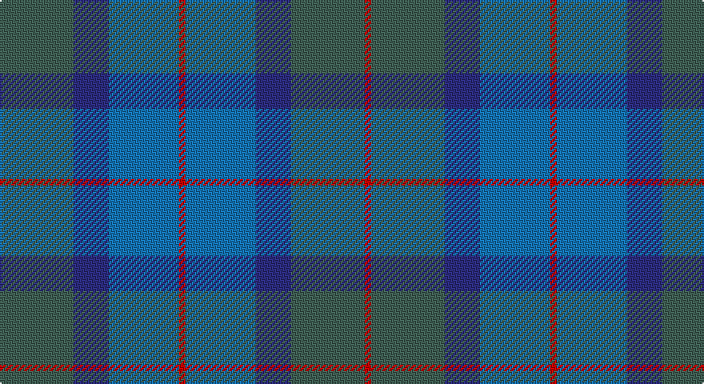

This page is one **sett** — a single exact thread-count. It belongs to the [tartan](/setts/y23db11b22r2b22db11y23r2/)
(the same proportion at any scale), whose colour order is pattern [GBBRBBGR](/stripes/gbbrbbgr/).

Part of the [Skibo](/tartans/skibo/) tartan — the named design grouping this sett with its other cloths.

Sourced from register-of-tartans.  It is a [8 stripe tartan](/stripes/stripes8/).

Original link https://www.tartanregister.gov.uk/tartanDetails.aspx?ref=3809

## Register references

External register numbers recorded for this tartan.

- Scottish Register of Tartans: [3809](https://www.tartanregister.gov.uk/tartanDetails.aspx?ref=3809)
- Scottish Tartans Authority (ITI): 2550
- Scottish Tartans World Register: 2550

## Thread count
N/46 DB22 B44 R4 B44 DB22 N46 R/4

One full sett is **414 threads**.

## Palette

Palette: <strong>Tartan Register</strong> <small style="color:#888">(4 of 5 colours)</small>
<table><thead><tr><th>Colour</th><th>Threads</th><th>Shade</th><th>Base</th><th>OKLCh</th></tr></thead><tbody><tr><td>N/</td><td style="text-align:right;font-variant-numeric:tabular-nums">46</td><td><code style="background-color:#406054;">#406054</code> <small style="color:#888">#406054</small></td><td>G <code style="background-color:#006100;">#006100</code></td><td><small style="color:#888">oklch(46.0% 0.042 169.0)</small></td></tr><tr><td>DB</td><td style="text-align:right;font-variant-numeric:tabular-nums">22</td><td><code style="background-color:#2C2C80;">#2C2C80</code> <small style="color:#888">#2C2C80</small></td><td>B <code style="background-color:#2A418A;">#2A418A</code></td><td><small style="color:#888">oklch(35.0% 0.138 276.6)</small></td></tr><tr><td>B</td><td style="text-align:right;font-variant-numeric:tabular-nums">44</td><td><code style="background-color:#1474B4;">#1474B4</code> <small style="color:#888">#1474B4</small></td><td>B <code style="background-color:#2A418A;">#2A418A</code></td><td><small style="color:#888">oklch(54.0% 0.129 245.1)</small></td></tr><tr><td>R</td><td style="text-align:right;font-variant-numeric:tabular-nums">4</td><td><code style="background-color:#C80000;">#C80000</code> <small style="color:#888">#C80000</small></td><td>R <code style="background-color:#CC0000;">#CC0000</code></td><td><small style="color:#888">oklch(52.3% 0.215 29.2)</small></td></tr><tr><td>B</td><td style="text-align:right;font-variant-numeric:tabular-nums">44</td><td><code style="background-color:#1474B4;">#1474B4</code> <small style="color:#888">#1474B4</small></td><td>B <code style="background-color:#2A418A;">#2A418A</code></td><td><small style="color:#888">oklch(54.0% 0.129 245.1)</small></td></tr><tr><td>DB</td><td style="text-align:right;font-variant-numeric:tabular-nums">22</td><td><code style="background-color:#2C2C80;">#2C2C80</code> <small style="color:#888">#2C2C80</small></td><td>B <code style="background-color:#2A418A;">#2A418A</code></td><td><small style="color:#888">oklch(35.0% 0.138 276.6)</small></td></tr><tr><td>N</td><td style="text-align:right;font-variant-numeric:tabular-nums">46</td><td><code style="background-color:#406054;">#406054</code> <small style="color:#888">#406054</small></td><td>G <code style="background-color:#006100;">#006100</code></td><td><small style="color:#888">oklch(46.0% 0.042 169.0)</small></td></tr><tr><td>R/</td><td style="text-align:right;font-variant-numeric:tabular-nums">4</td><td><code style="background-color:#C80000;">#C80000</code> <small style="color:#888">#C80000</small></td><td>R <code style="background-color:#CC0000;">#CC0000</code></td><td><small style="color:#888">oklch(52.3% 0.215 29.2)</small></td></tr></tbody></table>

# Sample pattern

## Nearest tartans

The nearest existing variants by ΔTartan distance, with this tartan at the top so the swatches line up against it.

ΔTartan

Tartan

Sett

—

<a href="/ttd/edit/#slug=y23db11b22r2b22db11y23r2~x2">Skibo</a> <a class="nn-out" href="/variants/s8/y23db11b22r2b22db11y23r2~x2/" title="open its dictionary page">↗</a>

1.31

<a href="/ttd/edit/#slug=r2y23db11b22r2~x2&amp;base=y23db11b22r2b22db11y23r2~x2">Skibo (Corporate)</a> <a class="nn-out" href="/variants/s5/r2y23db11b22r2~x2/" title="open its dictionary page">↗</a>

1.69

<a href="/ttd/edit/#slug=dg10db2dg2db6t5db1t2~x2&amp;base=y23db11b22r2b22db11y23r2~x2">Unidentified No 17</a> <a class="nn-out" href="/variants/s7/dg10db2dg2db6t5db1t2~x2/" title="open its dictionary page">↗</a>

1.77

<a href="/ttd/edit/#slug=dt8db10dt22dg7g10dg22dp3~x2&amp;base=y23db11b22r2b22db11y23r2~x2">Baron of Crawfordjohn (Personal)</a> <a class="nn-out" href="/variants/s7/dt8db10dt22dg7g10dg22dp3~x2/" title="open its dictionary page">↗</a>

1.82

<a href="/ttd/edit/#slug=dg7db3dg7dt22db22w3db5~x2&amp;base=y23db11b22r2b22db11y23r2~x2">United Colours of Scotland (Corporat</a> <a class="nn-out" href="/variants/s7/dg7db3dg7dt22db22w3db5~x2/" title="open its dictionary page">↗</a>

1.83

<a href="/ttd/edit/#slug=g35y25m15t2t21~x2&amp;base=y23db11b22r2b22db11y23r2~x2">Dunans Rising</a> <a class="nn-out" href="/variants/s5/g35y25m15t2t21~x2/" title="open its dictionary page">↗</a>

1.94

<a href="/ttd/edit/#slug=dbi7db2dbi25db10g21db2~x2&amp;base=y23db11b22r2b22db11y23r2~x2">Sugiyama</a> <a class="nn-out" href="/variants/s6/dbi7db2dbi25db10g21db2~x2/" title="open its dictionary page">↗</a>

1.94

<a href="/ttd/edit/#slug=t11db1t1db1t1db8dg8db1dg8db8t8db1t1~x2&amp;base=y23db11b22r2b22db11y23r2~x2">Sutherland #3</a> <a class="nn-out" href="/variants/s13/t11db1t1db1t1db8dg8db1dg8db8t8db1t1~x2/" title="open its dictionary page">↗</a>

1.95

<a href="/variants/s11/n4dt3n7db9ni13r2n13dt9n7db3ni4~x2/">Paul Henry (Personal)</a>

1.98

<a href="/ttd/edit/#slug=b25db4b4db4b4db23t23lr4t23db23b23db4b4~x2&amp;base=y23db11b22r2b22db11y23r2~x2">Poulter, Blue (Corprate)</a> <a class="nn-out" href="/variants/s13/b25db4b4db4b4db23t23lr4t23db23b23db4b4~x2/" title="open its dictionary page">↗</a>

1.98

<a href="/ttd/edit/#slug=t11dt2t4dt2t4dt11b11dt2ti4dt2b11dt11t11dt2t4~x2&amp;base=y23db11b22r2b22db11y23r2~x2">Scottish Gas</a> <a class="nn-out" href="/variants/s15/t11dt2t4dt2t4dt11b11dt2ti4dt2b11dt11t11dt2t4~x2/" title="open its dictionary page">↗</a>

## Neighbour map

Every grey dot is one of 14360 variants placed by the first two principal components of the ΔTartan feature space (44% of its variance). Red is this tartan; blue dots are its nearest — click one to open its page.

<svg viewBox="0 0 640 380" role="img" style="max-width:100%;height:auto;border:1px solid #e0e0e0;border-radius:4px;display:block" xmlns="http://www.w3.org/2000/svg"><image href="/nn/cloud.v1.png" width="640" height="380"/><a href="/variants/s5/r2y23db11b22r2~x2/"><circle cx="291.1" cy="268.8" r="4" fill="#3465a4"><title>Skibo (Corporate)</title></circle></a><a href="/variants/s7/dg10db2dg2db6t5db1t2~x2/"><circle cx="309.5" cy="278.0" r="4" fill="#3465a4"><title>Unidentified No 17</title></circle></a><a href="/variants/s7/dt8db10dt22dg7g10dg22dp3~x2/"><circle cx="242.7" cy="295.1" r="4" fill="#3465a4"><title>Baron of Crawfordjohn (Personal)</title></circle></a><a href="/variants/s7/dg7db3dg7dt22db22w3db5~x2/"><circle cx="289.6" cy="276.2" r="4" fill="#3465a4"><title>United Colours of Scotland (Corporat</title></circle></a><a href="/variants/s5/g35y25m15t2t21~x2/"><circle cx="263.3" cy="272.3" r="4" fill="#3465a4"><title>Dunans Rising</title></circle></a><a href="/variants/s6/dbi7db2dbi25db10g21db2~x2/"><circle cx="345.7" cy="268.0" r="4" fill="#3465a4"><title>Sugiyama</title></circle></a><a href="/variants/s13/t11db1t1db1t1db8dg8db1dg8db8t8db1t1~x2/"><circle cx="288.9" cy="236.7" r="4" fill="#3465a4"><title>Sutherland #3</title></circle></a><a href="/variants/s11/n4dt3n7db9ni13r2n13dt9n7db3ni4~x2/"><circle cx="231.9" cy="271.2" r="4" fill="#3465a4"><title>Paul Henry (Personal)</title></circle></a><a href="/variants/s13/b25db4b4db4b4db23t23lr4t23db23b23db4b4~x2/"><circle cx="227.0" cy="244.9" r="4" fill="#3465a4"><title>Poulter, Blue (Corprate)</title></circle></a><a href="/variants/s15/t11dt2t4dt2t4dt11b11dt2ti4dt2b11dt11t11dt2t4~x2/"><circle cx="231.5" cy="269.7" r="4" fill="#3465a4"><title>Scottish Gas</title></circle></a><circle cx="289.3" cy="275.9" r="5" fill="#c00000"/></svg>

ID: /variants/s8/y23db11b22r2b22db11y23r2~x2/
