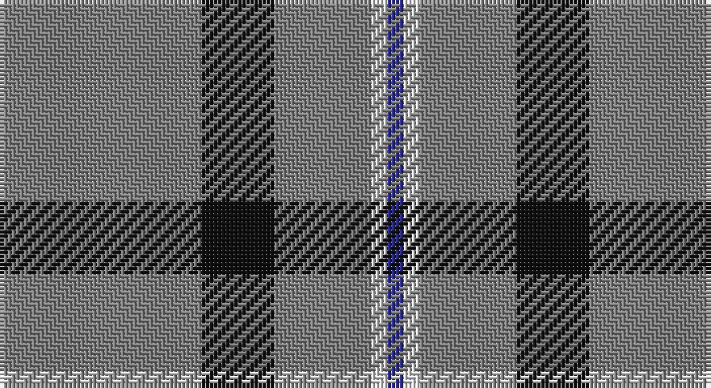

This page is one **sett** — a single exact thread-count. It belongs to the [tartan](/setts/y24y1k9y1y9y2w2db2/)
(the same proportion at any scale), whose colour order is pattern [BWGGGKGG](/stripes/bwgggkgg/).

Part of the [Gairloch](/tartans/gairloch/) tartan — the named design grouping this sett with its other cloths.

Sourced from register-of-tartans.  It is a [8 stripe tartan](/stripes/stripes8/).

Original link https://www.tartanregister.gov.uk/tartanDetails.aspx?ref=5102

## Register references

External register numbers recorded for this tartan.

- Scottish Register of Tartans: [5102](https://www.tartanregister.gov.uk/tartanDetails.aspx?ref=5102)
- Scottish Tartans Authority (ITI): 3852

## Thread count
N/48 N2 K18 N2 N18 N4 LN4 DB/4

One full sett is **148 threads**.

## Palette

Palette: <strong>Tartan Register</strong>
<table><thead><tr><th>Colour</th><th>Threads</th><th>Shade</th><th>Base</th><th>OKLCh</th></tr></thead><tbody><tr><td>N/</td><td style="text-align:right;font-variant-numeric:tabular-nums">48</td><td><code style="background-color:#808080;">#808080</code> <small style="color:#888">#808080</small></td><td>G <code style="background-color:#006100;">#006100</code></td><td><small style="color:#888">oklch(60.0% 0.000 89.9)</small></td></tr><tr><td>N</td><td style="text-align:right;font-variant-numeric:tabular-nums">2</td><td><code style="background-color:#808080;">#808080</code> <small style="color:#888">#808080</small></td><td>G <code style="background-color:#006100;">#006100</code></td><td><small style="color:#888">oklch(60.0% 0.000 89.9)</small></td></tr><tr><td>K</td><td style="text-align:right;font-variant-numeric:tabular-nums">18</td><td><code style="background-color:#101010;">#101010</code> <small style="color:#888">#101010</small></td><td>K <code style="background-color:#000000;">#000000</code></td><td><small style="color:#888">oklch(17.3% 0.000 89.9)</small></td></tr><tr><td>N</td><td style="text-align:right;font-variant-numeric:tabular-nums">2</td><td><code style="background-color:#808080;">#808080</code> <small style="color:#888">#808080</small></td><td>G <code style="background-color:#006100;">#006100</code></td><td><small style="color:#888">oklch(60.0% 0.000 89.9)</small></td></tr><tr><td>N</td><td style="text-align:right;font-variant-numeric:tabular-nums">18</td><td><code style="background-color:#808080;">#808080</code> <small style="color:#888">#808080</small></td><td>G <code style="background-color:#006100;">#006100</code></td><td><small style="color:#888">oklch(60.0% 0.000 89.9)</small></td></tr><tr><td>N</td><td style="text-align:right;font-variant-numeric:tabular-nums">4</td><td><code style="background-color:#808080;">#808080</code> <small style="color:#888">#808080</small></td><td>G <code style="background-color:#006100;">#006100</code></td><td><small style="color:#888">oklch(60.0% 0.000 89.9)</small></td></tr><tr><td>LN</td><td style="text-align:right;font-variant-numeric:tabular-nums">4</td><td><code style="background-color:#E0E0E0;">#E0E0E0</code> <small style="color:#888">#E0E0E0</small></td><td>W <code style="background-color:#F7F7F7;">#F7F7F7</code></td><td><small style="color:#888">oklch(90.7% 0.000 89.9)</small></td></tr><tr><td>DB/</td><td style="text-align:right;font-variant-numeric:tabular-nums">4</td><td><code style="background-color:#2C2C80;">#2C2C80</code> <small style="color:#888">#2C2C80</small></td><td>B <code style="background-color:#2A418A;">#2A418A</code></td><td><small style="color:#888">oklch(35.0% 0.138 276.6)</small></td></tr></tbody></table>

# Sample pattern

## Nearest tartans

The nearest existing variants by ΔTartan distance, with this tartan at the top so the swatches line up against it.

ΔTartan

Tartan

Sett

—

<a href="/ttd/edit/#slug=y24y1k9y1y9y2w2db2~x2">Gairloch</a> <a class="nn-out" href="/variants/s8/y24y1k9y1y9y2w2db2~x2/" title="open its dictionary page">↗</a>

1.39

<a href="/ttd/edit/#slug=n14b3n2lb8n5lb2k2n25w2~x2&amp;base=y24y1k9y1y9y2w2db2~x2">Turnberry Scotland</a> <a class="nn-out" href="/variants/s9/n14b3n2lb8n5lb2k2n25w2~x2/" title="open its dictionary page">↗</a>

1.44

<a href="/ttd/edit/#slug=dy6r2dy42db2dy5w16dy5db2~x2&amp;base=y24y1k9y1y9y2w2db2~x2">Glenlivet Dress Reproduction (Corp)</a> <a class="nn-out" href="/variants/s8/dy6r2dy42db2dy5w16dy5db2~x2/" title="open its dictionary page">↗</a>

1.45

<a href="/ttd/edit/#slug=n6k1lo6k1n28w1k2w1n16w1r5~x2&amp;base=y24y1k9y1y9y2w2db2~x2">Historic Caledonian Railway Enthusiasts', The</a> <a class="nn-out" href="/variants/s11/n6k1lo6k1n28w1k2w1n16w1r5~x2/" title="open its dictionary page">↗</a>

1.57

<a href="/ttd/edit/#slug=n83k7w6n10r7k3r20w3~x2&amp;base=y24y1k9y1y9y2w2db2~x2">President High School</a> <a class="nn-out" href="/variants/s8/n83k7w6n10r7k3r20w3~x2/" title="open its dictionary page">↗</a>

1.58

<a href="/ttd/edit/#slug=r1y20r1y3w1k1w1k4y3k1y2ly1~x2&amp;base=y24y1k9y1y9y2w2db2~x2">Stuart/Stewart Authentic Grey</a> <a class="nn-out" href="/variants/s12/r1y20r1y3w1k1w1k4y3k1y2ly1~x2/" title="open its dictionary page">↗</a>

1.58

<a href="/ttd/edit/#slug=n140k3w16k3do16k3do16&amp;base=y24y1k9y1y9y2w2db2~x2">Crail</a> <a class="nn-out" href="/variants/s7/n140k3w16k3do16k3do16/" title="open its dictionary page">↗</a>

1.59

<a href="/ttd/edit/#slug=r4g3dp3g44dp16g10w2g2dp2~x2&amp;base=y24y1k9y1y9y2w2db2~x2">Glenfeshie (Personal)</a> <a class="nn-out" href="/variants/s9/r4g3dp3g44dp16g10w2g2dp2~x2/" title="open its dictionary page">↗</a>

1.59

<a href="/ttd/edit/#slug=t66w2t10w2t10w2t12r3db24~x2&amp;base=y24y1k9y1y9y2w2db2~x2">RAAF #5</a> <a class="nn-out" href="/variants/s9/t66w2t10w2t10w2t12r3db24~x2/" title="open its dictionary page">↗</a>

1.60

<a href="/ttd/edit/#slug=r1o20r1o3w1k1w1k4o3k1o2ly1~x2&amp;base=y24y1k9y1y9y2w2db2~x2">Stewart Grey Fancy Tartan</a> <a class="nn-out" href="/variants/s12/r1o20r1o3w1k1w1k4o3k1o2ly1~x2/" title="open its dictionary page">↗</a>

1.61

<a href="/ttd/edit/#slug=db3o1w1o25w1o1dp3~x4&amp;base=y24y1k9y1y9y2w2db2~x2">St. Giles Check (Corporate)</a> <a class="nn-out" href="/variants/s7/db3o1w1o25w1o1dp3~x4/" title="open its dictionary page">↗</a>

## Neighbour map

Every grey dot is one of 14360 variants placed by the first two principal components of the ΔTartan feature space (44% of its variance). Red is this tartan; blue dots are its nearest — click one to open its page.

<svg viewBox="0 0 640 380" role="img" style="max-width:100%;height:auto;border:1px solid #e0e0e0;border-radius:4px;display:block" xmlns="http://www.w3.org/2000/svg"><image href="/nn/cloud.v1.png" width="640" height="380"/><a href="/variants/s9/n14b3n2lb8n5lb2k2n25w2~x2/"><circle cx="414.0" cy="161.7" r="4" fill="#3465a4"><title>Turnberry Scotland</title></circle></a><a href="/variants/s8/dy6r2dy42db2dy5w16dy5db2~x2/"><circle cx="451.4" cy="136.5" r="4" fill="#3465a4"><title>Glenlivet Dress Reproduction (Corp)</title></circle></a><a href="/variants/s11/n6k1lo6k1n28w1k2w1n16w1r5~x2/"><circle cx="474.9" cy="117.4" r="4" fill="#3465a4"><title>Historic Caledonian Railway Enthusiasts', The</title></circle></a><a href="/variants/s8/n83k7w6n10r7k3r20w3~x2/"><circle cx="453.5" cy="130.4" r="4" fill="#3465a4"><title>President High School</title></circle></a><a href="/variants/s12/r1y20r1y3w1k1w1k4y3k1y2ly1~x2/"><circle cx="436.4" cy="96.6" r="4" fill="#3465a4"><title>Stuart/Stewart Authentic Grey</title></circle></a><a href="/variants/s7/n140k3w16k3do16k3do16/"><circle cx="501.4" cy="111.6" r="4" fill="#3465a4"><title>Crail</title></circle></a><a href="/variants/s9/r4g3dp3g44dp16g10w2g2dp2~x2/"><circle cx="449.0" cy="147.9" r="4" fill="#3465a4"><title>Glenfeshie (Personal)</title></circle></a><a href="/variants/s9/t66w2t10w2t10w2t12r3db24~x2/"><circle cx="499.9" cy="131.3" r="4" fill="#3465a4"><title>RAAF #5</title></circle></a><a href="/variants/s12/r1o20r1o3w1k1w1k4o3k1o2ly1~x2/"><circle cx="432.9" cy="94.3" r="4" fill="#3465a4"><title>Stewart Grey Fancy Tartan</title></circle></a><a href="/variants/s7/db3o1w1o25w1o1dp3~x4/"><circle cx="543.9" cy="137.5" r="4" fill="#3465a4"><title>St. Giles Check (Corporate)</title></circle></a><circle cx="470.3" cy="147.3" r="5" fill="#c00000"/></svg>

ID: /variants/s8/y24y1k9y1y9y2w2db2~x2/
