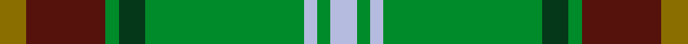
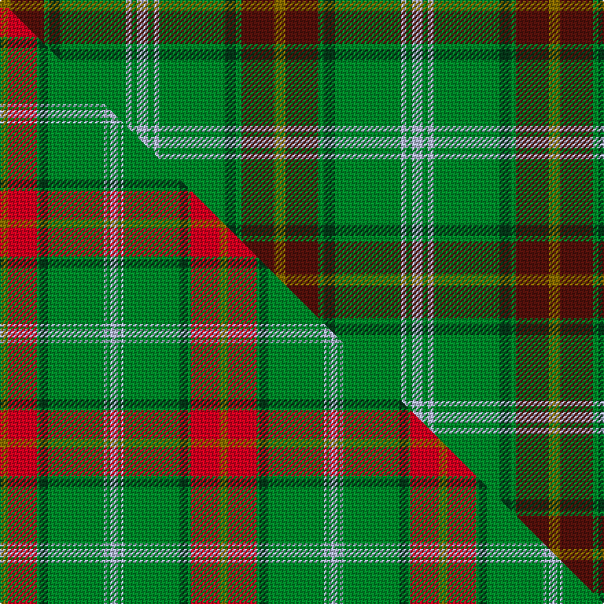

This page is one **sett** — a single exact thread-count. It belongs to the [tartan](/setts/y2dr6g1dg2g12lb1g1lb2/)
(the same proportion at any scale), whose colour order is pattern [GBGGGWGW](/stripes/gbgggwgw/).

Part of the [Manitoba](/tartans/manitoba/) tartan — the named design grouping this sett with its other cloths.

Sourced from weddslist.  It is a [8 stripe tartan](/stripes/stripes8/).

Original link http://www.weddslist.com/cgi-bin/tartans/pg.pl?source=sts

## Provenance

Earliest known date: 1962 The official recording of the sett shows the letter G for the dark green stripe. In heraldic terms this means 'Gules' - red. The designer, Hugh Kirkwood Rankine, clearly intended dark green and this is reproduced here.It was given Royal Assent in 1962.

2 attestations — the source records this cloth was collapsed from (oldest owns this page)

<ul>
<li>undated — Manitoba (weddslist, <a href="http://www.weddslist.com/cgi-bin/tartans/pg.pl?source=sts">record</a>) </li>
<li>undated — Manitoba District Tartan (house-of-tartan, <a href="http://www.house-of-tartan.scotland.net/house/TartanViewjs.asp?colr=Def&tnam=144">record</a>) </li>
</ul>

Dataset <small>— provenance for this record, inherited from the source manifest</small>

<dl class="dataset-prov">
<dt>source</dt><dd><a href="/sources/weddslist/">Weddslist</a></dd>
<dt>data captured from</dt><dd><a href="https://github.com/thetartan/tartan-database/blob/master/data/weddslist/data.csv">https://github.com/thetartan/tartan-database/blob/master/data/weddslist/data.csv</a></dd>
<dt>data date</dt><dd>2016-11-17 <small>(dataset default)</small></dd>
<dt>licence</dt><dd><a href="https://creativecommons.org/licenses/by-nc-nd/4.0/">CC BY-NC-ND 4.0</a></dd>
</dl>

Capture chain <small>— the hands this data passed through, oldest first; each capture carries its own licence</small>

<ol class="capture-chain">
<li><a href="https://www.weddslist.com/tartans/">Weddslist</a> <small>the living privately compiled reference</small></li>
<li><a href="https://github.com/thetartan/tartan-database">thetartan/tartan-database</a> <small>2016-2017</small> · <a href="https://creativecommons.org/licenses/by-nc-nd/4.0/">CC BY-NC-ND 4.0</a> <small>Levko Kravets's frozen compilation — the capture we vendored, and where its CC licence text came from</small></li>
<li>this dictionary <small>captured 2026-06-10 · commit 5bf86c7566</small> <small>each re-capture is a git commit to data/sources</small></li>
</ol>

## Thread count
Y/8 DR24 G4 DG8 G48 LB4 G4 LB/8

One full sett is **200 threads**.

## Palette
<table><thead><tr><th>Colour</th><th>Shade</th><th>OKLCh</th></tr></thead><tbody><tr><td>LB</td><td><code style="background-color:#B5BBDE;">#B5BBDE</code> <small style="color:#888">#B5BBDE</small></td><td><small style="color:#888">oklch(79.9% 0.050 277.6)</small></td></tr><tr><td>DG</td><td><code style="background-color:#053819;">#053819</code> <small style="color:#888">#053819</small></td><td><small style="color:#888">oklch(30.0% 0.075 151.3)</small></td></tr><tr><td>DR</td><td><code style="background-color:#55120C;">#55120C</code> <small style="color:#888">#55120C</small></td><td><small style="color:#888">oklch(30.0% 0.099 29.3)</small></td></tr><tr><td>G</td><td><code style="background-color:#008B2A;">#008B2A</code> <small style="color:#888">#008B2A</small></td><td><small style="color:#888">oklch(55.4% 0.170 145.9)</small></td></tr><tr><td>Y</td><td><code style="background-color:#8B6E00;">#8B6E00</code> <small style="color:#888">#8B6E00</small></td><td><small style="color:#888">oklch(55.1% 0.113 90.4)</small></td></tr></tbody></table>

# Sample pattern

## Compared to the master

This cloth is one sett of its design; the master sett (the exemplar the design is anchored on) is below for comparison.

Its **ΔTartan distance** from the master is **0.52** — the same measure the nearest-tartans table ranks by (0 is identical; a re-scale of the same cloth is near 0, a recolour or a different proportion further).

<figure class="master-compare" style="margin:0">

this sett
master sett ★

<figcaption style="color:#888;font-size:smaller">One weave of this sett against the <a href="/setts/y6r21g2dg6g41lb2g2lb6/">master sett ★</a>, split on the diagonal: a shared proportion runs seamlessly across it with only the shades shifting; a different proportion breaks on it.</figcaption>
</figure>

## Nearest tartan variants

The nearest existing variants by ΔTartan distance, with this cloth at the top so the swatches line up against it.

ΔTartan

Threads

Variant

Sett

—

200

<a href="/variants/s8/y2dr6g1dg2g12lb1g1lb2~x4/">Manitoba</a>

<a href="/ttd/edit/#slug=y6r21g2dg6g41lb2g2lb6&amp;base=y2dr6g1dg2g12lb1g1lb2~x4" title="compare in the TTD">0.52</a>

160

<a href="/variants/s8/y6r21g2dg6g41lb2g2lb6/">Manitoba</a>

<a href="/ttd/edit/#slug=g20y2n5w4g2n2g2n2db6~x2&amp;base=y2dr6g1dg2g12lb1g1lb2~x4" title="compare in the TTD">1.89</a>

128

<a href="/variants/s9/g20y2n5w4g2n2g2n2db6~x2/">Boucherville (Tartan de..) District Tartan</a>

<a href="/ttd/edit/#slug=lr1do12g2dr2g16dr2g2do12lo1~x4&amp;base=y2dr6g1dg2g12lb1g1lb2~x4" title="compare in the TTD">2.58</a>

392

<a href="/variants/s9/lr1do12g2dr2g16dr2g2do12lo1~x4/">MacFie Hunting (Clan?)</a>

<a href="/ttd/edit/#slug=dr4db15w2n15g30dr2g4~x2&amp;base=y2dr6g1dg2g12lb1g1lb2~x4" title="compare in the TTD">2.66</a>

272

<a href="/variants/s7/dr4db15w2n15g30dr2g4~x2/">Sinclair Green (Personal)</a>

<a href="/ttd/edit/#slug=ly5g14dy4db4dy27g3dy4ly5~x2~ly3307090-dy1603076&amp;base=y2dr6g1dg2g12lb1g1lb2~x4" title="compare in the TTD">2.72</a>

244

<a href="/variants/s8/ly5g14dy4db4dy27g3dy4ly5~x2~ly3307090-dy1603076/">Invertere (Daks #2) (Fashion)</a>

<a href="/ttd/edit/#slug=y5g3y3g53dr7db5dr13w4~x2&amp;base=y2dr6g1dg2g12lb1g1lb2~x4" title="compare in the TTD">2.92</a>

354

<a href="/variants/s8/y5g3y3g53dr7db5dr13w4~x2/">Hall (P.I.E.) (Personal)</a>

<a href="/ttd/edit/#slug=dr4g46dr10db10dy33db5dy4ly3~x2&amp;base=y2dr6g1dg2g12lb1g1lb2~x4" title="compare in the TTD">3.04</a>

446

<a href="/variants/s8/dr4g46dr10db10dy33db5dy4ly3~x2/">State Seal of Minnesota (Fashion)</a>

<a href="/ttd/edit/#slug=r2w2y27g14y2db14y2~x2&amp;base=y2dr6g1dg2g12lb1g1lb2~x4" title="compare in the TTD">3.04</a>

244

<a href="/variants/s7/r2w2y27g14y2db14y2~x2/">Fraser Yellow</a>

<a href="/ttd/edit/#slug=g12db2dr2db2dt26dg2g3dg3g24dr4~x2&amp;base=y2dr6g1dg2g12lb1g1lb2~x4" title="compare in the TTD">3.14</a>

288

<a href="/variants/s10/g12db2dr2db2dt26dg2g3dg3g24dr4~x2/">New South Wales Waratah</a>

<a href="/ttd/edit/#slug=y2r6g1ri2g12lb1g1lb2~x2~r1707016-ri2008029&amp;base=y2dr6g1dg2g12lb1g1lb2~x4" title="compare in the TTD">3.14</a>

100

<a href="/variants/s8/y2r6g1ri2g12lb1g1lb2~x2~r1707016-ri2008029/">Manitoba</a>

## Neighbour map

Every grey dot is one of 13620 variants placed by the first two principal components of the ΔTartan feature space (42% of its variance). Red is this tartan; blue dots are its nearest — click one to open its page.

<svg viewBox="0 0 640 380" role="img" style="max-width:100%;height:auto;border:1px solid #e0e0e0;border-radius:4px;display:block" xmlns="http://www.w3.org/2000/svg"><image href="/nn/cloud.v1.png" width="640" height="380"/><a href="/variants/s8/y6r21g2dg6g41lb2g2lb6/"><circle cx="321.4" cy="150.5" r="4" fill="#3465a4"><title>Manitoba</title></circle></a><a href="/variants/s9/g20y2n5w4g2n2g2n2db6~x2/"><circle cx="303.2" cy="193.9" r="4" fill="#3465a4"><title>Boucherville (Tartan de..) District Tartan</title></circle></a><a href="/variants/s9/lr1do12g2dr2g16dr2g2do12lo1~x4/"><circle cx="336.2" cy="185.6" r="4" fill="#3465a4"><title>MacFie Hunting (Clan?)</title></circle></a><a href="/variants/s7/dr4db15w2n15g30dr2g4~x2/"><circle cx="293.9" cy="204.2" r="4" fill="#3465a4"><title>Sinclair Green (Personal)</title></circle></a><a href="/variants/s8/ly5g14dy4db4dy27g3dy4ly5~x2~ly3307090-dy1603076/"><circle cx="326.8" cy="222.6" r="4" fill="#3465a4"><title>Invertere (Daks #2) (Fashion)</title></circle></a><a href="/variants/s8/y5g3y3g53dr7db5dr13w4~x2/"><circle cx="379.0" cy="157.1" r="4" fill="#3465a4"><title>Hall (P.I.E.) (Personal)</title></circle></a><a href="/variants/s8/dr4g46dr10db10dy33db5dy4ly3~x2/"><circle cx="276.5" cy="191.6" r="4" fill="#3465a4"><title>State Seal of Minnesota (Fashion)</title></circle></a><a href="/variants/s7/r2w2y27g14y2db14y2~x2/"><circle cx="288.1" cy="184.1" r="4" fill="#3465a4"><title>Fraser Yellow</title></circle></a><a href="/variants/s10/g12db2dr2db2dt26dg2g3dg3g24dr4~x2/"><circle cx="333.0" cy="191.1" r="4" fill="#3465a4"><title>New South Wales Waratah</title></circle></a><a href="/variants/s8/y2r6g1ri2g12lb1g1lb2~x2~r1707016-ri2008029/"><circle cx="296.6" cy="178.5" r="4" fill="#3465a4"><title>Manitoba</title></circle></a><circle cx="305.4" cy="192.0" r="5" fill="#c00000"/><text x="320" y="376" text-anchor="middle" font-size="11" fill="#999">ground</text><text x="11" y="190" text-anchor="middle" font-size="11" fill="#999" transform="rotate(-90 11 190)">complexity</text></svg>

ID: /variants/s8/y2dr6g1dg2g12lb1g1lb2~x4/
