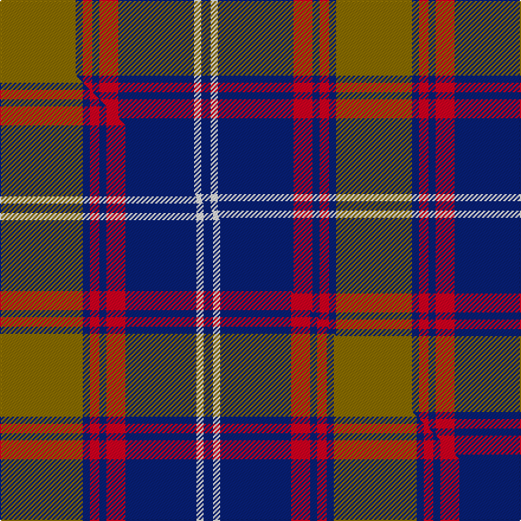

This is one **variant** — a specific cloth: this exact thread count and colourway, with its own
provenance below. It is one weaving of the [sett](/tartans/c/cl/clemens-and-august/) (the scale-free proportion — the
same cloth at any scale or shade), whose colour order is pattern [BWBRBRBG](/stripes/bwbrbrbg/).

Part of the [Clemens and August](/tartans/c/cl/clemens-and-august/) tartan — the named design grouping this sett with its other cloths.

Sourced from tartans-authority.  It is a [8 stripe tartan](/stripes/stripes8/).

Original link <code>http://www.tartansauthority.com/tartan-ferret/display/7827/</code> — retired · [Internet Archive copy](https://web.archive.org/web/*/http://www.tartansauthority.com/tartan-ferret/display/7827/*)

Dataset <small>— provenance for this record, inherited from the source manifest</small>

<dl class="dataset-prov">
<dt>source</dt><dd><a href="/sources/tartans-authority/">Scottish Tartans Authority</a></dd>
<dt>data captured from</dt><dd><a href="https://github.com/thetartan/tartan-database/blob/master/data/tartans-authority/data.csv">https://github.com/thetartan/tartan-database/blob/master/data/tartans-authority/data.csv</a></dd>
<dt>data date</dt><dd>Dec. 2008 <small>(this record)</small></dd>
<dt>licence</dt><dd><a href="https://creativecommons.org/licenses/by-nc-nd/4.0/">CC BY-NC-ND 4.0</a></dd>
</dl>

Capture chain <small>— the hands this data passed through, oldest first; each capture carries its own licence</small>

<ol class="capture-chain">
<li><a href="https://www.tartansauthority.com/">Scottish Tartans Authority</a> <small>the heritage body’s archive — its tartan-ferret record browser is retired; dead record links are shown unlinked, with an Internet Archive copy (ITI numbers are not SRT references)</small></li>
<li><a href="https://github.com/thetartan/tartan-database">thetartan/tartan-database</a> <small>2016-2017</small> · <a href="https://creativecommons.org/licenses/by-nc-nd/4.0/">CC BY-NC-ND 4.0</a> <small>Levko Kravets's frozen compilation — the capture we vendored, and where its CC licence text came from</small></li>
<li>this dictionary <small>captured 2026-06-10 · commit 5bf86c7566</small> <small>each re-capture is a git commit to data/sources</small></li>
</ol>

## Register references

External register numbers recorded for this tartan.

- Scottish Tartans Authority (ITI): 7827

## Thread count
Y/64 DB6 R8 DB6 R16 DB64 W6 DB/8

One full sett is **284 threads**.

## Palette
<table><thead><tr><th>Colour</th><th>Shade</th><th>OKLCh</th></tr></thead><tbody><tr><td>DB</td><td><code style="background-color:#082077;">#082077</code> <small style="color:#888">#082077</small></td><td><small style="color:#888">oklch(30.0% 0.149 265.1)</small></td></tr><tr><td>W</td><td><code style="background-color:#F7F7F7;">#F7F7F7</code> <small style="color:#888">#F7F7F7</small></td><td><small style="color:#888">oklch(97.6% 0.000 89.9)</small></td></tr><tr><td>R</td><td><code style="background-color:#D60020;">#D60020</code> <small style="color:#888">#D60020</small></td><td><small style="color:#888">oklch(55.2% 0.224 25.5)</small></td></tr><tr><td>Y</td><td><code style="background-color:#8B6E00;">#8B6E00</code> <small style="color:#888">#8B6E00</small></td><td><small style="color:#888">oklch(55.1% 0.113 90.4)</small></td></tr></tbody></table>

# Sample pattern

## Compared to the master

This cloth is one sett of its design; the master sett (the exemplar the design is anchored on) is below for comparison.

Its **ΔTartan distance** from the master is **0.15** — the same measure the nearest-tartans table ranks by (0 is identical; a re-scale of the same cloth is near 0, a recolour or a different proportion further).

<figure class="master-compare" style="margin:0">

this sett
master sett ★

<figcaption style="color:#888;font-size:smaller">One weave of this sett against the <a href="/setts/y35db3r4db3r8db30w3db4/">master sett ★</a>, split on the diagonal: a shared proportion runs seamlessly across it with only the shades shifting; a different proportion breaks on it.</figcaption>
</figure>

## Nearest tartan variants

The nearest existing variants by ΔTartan distance, with this cloth at the top so the swatches line up against it.

ΔTartan

Threads

Variant

Sett

—

284

<a href="/variants/s8/y32db3r4db3r8db32w3db4~x2/">Clemens and August (Personal)</a>

<a href="/ttd/edit/#slug=y35db3r4db3r8db30w3db4~x2&amp;base=y32db3r4db3r8db32w3db4~x2" title="compare in the TTD">0.15</a>

282

<a href="/variants/s8/y35db3r4db3r8db30w3db4~x2/">Clemens and August (Personal)</a>

<a href="/ttd/edit/#slug=g3r12dg12g5r2db30g2r2~x2&amp;base=y32db3r4db3r8db32w3db4~x2" title="compare in the TTD">2.23</a>

262

<a href="/variants/s8/g3r12dg12g5r2db30g2r2~x2/">Rannoch Moor (Fashion)</a>

<a href="/ttd/edit/#slug=db13g8r5db3g2r1y1~x4&amp;base=y32db3r4db3r8db32w3db4~x2" title="compare in the TTD">2.24</a>

208

<a href="/variants/s7/db13g8r5db3g2r1y1~x4/">Fibonacci7</a>

<a href="/ttd/edit/#slug=db24w3db4y6db4w3db15r52db6&amp;base=y32db3r4db3r8db32w3db4~x2" title="compare in the TTD">2.32</a>

204

<a href="/variants/s9/db24w3db4y6db4w3db15r52db6/">Mercer, James (Personal)</a>

<a href="/ttd/edit/#slug=db16w2db3y4db3w2db10r35db4~x2&amp;base=y32db3r4db3r8db32w3db4~x2" title="compare in the TTD">2.32</a>

276

<a href="/variants/s9/db16w2db3y4db3w2db10r35db4~x2/">Mercer Personal Tartan</a>

<a href="/ttd/edit/#slug=y2db3w6db15r24db3w2~x2&amp;base=y32db3r4db3r8db32w3db4~x2" title="compare in the TTD">2.37</a>

212

<a href="/variants/s7/y2db3w6db15r24db3w2~x2/">Fazzolettone (Fashion?)</a>

<a href="/ttd/edit/#slug=r2t13dr3t3dr16lb2~x4&amp;base=y32db3r4db3r8db32w3db4~x2" title="compare in the TTD">2.58</a>

296

<a href="/variants/s6/r2t13dr3t3dr16lb2~x4/">MacArthur-Fox Blue (Personal)</a>

<a href="/ttd/edit/#slug=db3dbi1g5db3r9db1r1db2~x4~db2316264-dbi2920264&amp;base=y32db3r4db3r8db32w3db4~x2" title="compare in the TTD">2.62</a>

180

<a href="/variants/s8/db3dbi1g5db3r9db1r1db2~x4~db2316264-dbi2920264/">Unidentified #61</a>

<a href="/ttd/edit/#slug=g10r1g1r1g1r4db12r1db2~x2&amp;base=y32db3r4db3r8db32w3db4~x2" title="compare in the TTD">2.63</a>

108

<a href="/variants/s9/g10r1g1r1g1r4db12r1db2~x2/">Unidentified Portrait</a>

<a href="/ttd/edit/#slug=db1lyi1db13ly3y3ly3r1ly1~x4~lyi6614084-ly6307084&amp;base=y32db3r4db3r8db32w3db4~x2" title="compare in the TTD">2.68</a>

200

<a href="/variants/s8/db1lyi1db13ly3y3ly3r1ly1~x4~lyi6614084-ly6307084/">Glen Moray</a>

## Neighbour map

Every grey dot is one of 13662 variants placed by the first two principal components of the ΔTartan feature space (42% of its variance). Red is this tartan; blue dots are its nearest — click one to open its page. The map is a flat projection of a many-dimensional space — [how to read it](/posts/neighbourhood-maps/).

<svg viewBox="0 0 640 380" role="img" style="max-width:100%;height:auto;border:1px solid #e0e0e0;border-radius:4px;display:block" xmlns="http://www.w3.org/2000/svg"><image href="/nn/cloud.v1.png" width="640" height="380"/><a href="/variants/s8/y35db3r4db3r8db30w3db4~x2/"><circle cx="275.7" cy="178.4" r="4" fill="#3465a4"><title>Clemens and August (Personal)</title></circle></a><a href="/variants/s8/g3r12dg12g5r2db30g2r2~x2/"><circle cx="262.9" cy="173.6" r="4" fill="#3465a4"><title>Rannoch Moor (Fashion)</title></circle></a><a href="/variants/s7/db13g8r5db3g2r1y1~x4/"><circle cx="273.3" cy="197.4" r="4" fill="#3465a4"><title>Fibonacci7</title></circle></a><a href="/variants/s9/db24w3db4y6db4w3db15r52db6/"><circle cx="298.2" cy="144.9" r="4" fill="#3465a4"><title>Mercer, James (Personal)</title></circle></a><a href="/variants/s9/db16w2db3y4db3w2db10r35db4~x2/"><circle cx="299.3" cy="145.1" r="4" fill="#3465a4"><title>Mercer Personal Tartan</title></circle></a><a href="/variants/s7/y2db3w6db15r24db3w2~x2/"><circle cx="247.3" cy="176.6" r="4" fill="#3465a4"><title>Fazzolettone (Fashion?)</title></circle></a><a href="/variants/s6/r2t13dr3t3dr16lb2~x4/"><circle cx="304.1" cy="224.9" r="4" fill="#3465a4"><title>MacArthur-Fox Blue (Personal)</title></circle></a><a href="/variants/s8/db3dbi1g5db3r9db1r1db2~x4~db2316264-dbi2920264/"><circle cx="210.4" cy="201.9" r="4" fill="#3465a4"><title>Unidentified #61</title></circle></a><a href="/variants/s9/g10r1g1r1g1r4db12r1db2~x2/"><circle cx="272.0" cy="186.6" r="4" fill="#3465a4"><title>Unidentified Portrait</title></circle></a><a href="/variants/s8/db1lyi1db13ly3y3ly3r1ly1~x4~lyi6614084-ly6307084/"><circle cx="308.9" cy="162.2" r="4" fill="#3465a4"><title>Glen Moray</title></circle></a><circle cx="280.6" cy="181.4" r="5" fill="#c00000"/><text x="320" y="376" text-anchor="middle" font-size="11" fill="#999">ground</text><text x="11" y="190" text-anchor="middle" font-size="11" fill="#999" transform="rotate(-90 11 190)">complexity</text></svg>

ID: /variants/s8/y32db3r4db3r8db32w3db4~x2/
