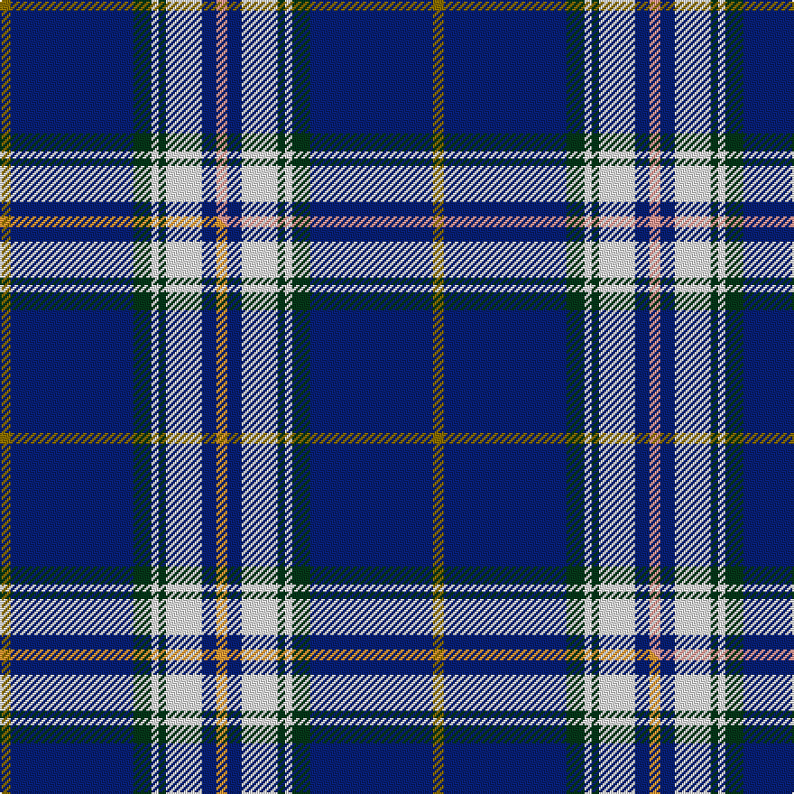

This is one **variant** — a specific cloth: this exact thread count and colourway, with its own
provenance below. It is one weaving of the [sett](/setts/y3db34dg5w2dg2w10db4lr3/) (the scale-free proportion — the
same cloth at any scale or shade), whose colour order is pattern [GBGWGWBY](/stripes/gbgwgwby/).

Part of the [Royal Troon Golf Club, The](/tartans/r/ro/royal-troon-golf-club-the/) tartan — the named design grouping this sett with its other cloths.

Sourced from tartans-authority.  It is a [8 stripe tartan](/stripes/stripes8/).

Original link [https://www.tartanregister.gov.uk/tartanDetails.aspx?ref=11094](https://www.tartanregister.gov.uk/tartanDetails.aspx?ref=11094)

Dataset <small>— provenance for this record, inherited from the source manifest</small>

<dl class="dataset-prov">
<dt>source</dt><dd><a href="/sources/tartans-authority/">Scottish Tartans Authority</a></dd>
<dt>data captured from</dt><dd><a href="https://github.com/thetartan/tartan-database/blob/master/data/tartans-authority/data.csv">https://github.com/thetartan/tartan-database/blob/master/data/tartans-authority/data.csv</a></dd>
<dt>data date</dt><dd>2014 <small>(this record)</small></dd>
<dt>licence</dt><dd><a href="https://creativecommons.org/licenses/by-nc-nd/4.0/">CC BY-NC-ND 4.0</a></dd>
</dl>

Capture chain <small>— the hands this data passed through, oldest first; each capture carries its own licence</small>

<ol class="capture-chain">
<li><a href="https://www.tartansauthority.com/">Scottish Tartans Authority</a> <small>the heritage body's archive — its tartan-ferret record browser is retired (links repaired to the SRT, above)</small></li>
<li><a href="https://github.com/thetartan/tartan-database">thetartan/tartan-database</a> <small>2016-2017</small> · <a href="https://creativecommons.org/licenses/by-nc-nd/4.0/">CC BY-NC-ND 4.0</a> <small>Levko Kravets's frozen compilation — the capture we vendored, and where its CC licence text came from</small></li>
<li>this dictionary <small>captured 2026-06-10 · commit 5bf86c7566</small> <small>each re-capture is a git commit to data/sources</small></li>
</ol>

## Register references

External register numbers recorded for this tartan.

- Scottish Register of Tartans: [11094](https://www.tartanregister.gov.uk/tartanDetails?ref=11094)
- Scottish Tartans Authority (ITI): 11094

## Thread count
Y/6 DB68 DG10 W4 DG4 W20 DB8 LR/6

One full sett is **240 threads**.

## Palette
<table><thead><tr><th>Colour</th><th>Shade</th><th>OKLCh</th></tr></thead><tbody><tr><td>DB</td><td><code style="background-color:#082077;">#082077</code> <small style="color:#888">#082077</small></td><td><small style="color:#888">oklch(30.0% 0.149 265.1)</small></td></tr><tr><td>DG</td><td><code style="background-color:#053819;">#053819</code> <small style="color:#888">#053819</small></td><td><small style="color:#888">oklch(30.0% 0.075 151.3)</small></td></tr><tr><td>LR</td><td><code style="background-color:#FF9C97;">#FF9C97</code> <small style="color:#888">#FF9C97</small></td><td><small style="color:#888">oklch(79.3% 0.119 23.2)</small></td></tr><tr><td>W</td><td><code style="background-color:#F7F7F7;">#F7F7F7</code> <small style="color:#888">#F7F7F7</small></td><td><small style="color:#888">oklch(97.6% 0.000 89.9)</small></td></tr><tr><td>Y</td><td><code style="background-color:#8B6E00;">#8B6E00</code> <small style="color:#888">#8B6E00</small></td><td><small style="color:#888">oklch(55.1% 0.113 90.4)</small></td></tr></tbody></table>

# Sample pattern

## Compared to the master

This cloth is one sett of its design; the master sett (the exemplar the design is anchored on) is below for comparison.

Its **ΔTartan distance** from the master is **0.30** — the same measure the nearest-tartans table ranks by (0 is identical; a re-scale of the same cloth is near 0, a recolour or a different proportion further).

<figure class="master-compare" style="margin:0">

this sett
master sett ★

<figcaption style="color:#888;font-size:smaller">One weave of this sett against the <a href="/setts/y3db34dg5w2dg2w10db4lo3/">master sett ★</a>, split on the diagonal: a shared proportion runs seamlessly across it with only the shades shifting; a different proportion breaks on it.</figcaption>
</figure>

## Nearest tartan variants

The nearest existing variants by ΔTartan distance, with this cloth at the top so the swatches line up against it.

ΔTartan

Threads

Variant

Sett

—

240

<a href="/variants/s8/y3db34dg5w2dg2w10db4lr3~x2/">Royal Troon Golf Club, The</a>

<a href="/ttd/edit/#slug=y3db34dg5w2dg2w10db4lo3~x2&amp;base=y3db34dg5w2dg2w10db4lr3~x2" title="compare in the TTD">0.30</a>

240

<a href="/variants/s8/y3db34dg5w2dg2w10db4lo3~x2/">Royal Troon Golf Club, The</a>

<a href="/ttd/edit/#slug=db37dr4w9db2w2ly9db4w2db2dy2~x2&amp;base=y3db34dg5w2dg2w10db4lr3~x2" title="compare in the TTD">1.31</a>

214

<a href="/variants/s10/db37dr4w9db2w2ly9db4w2db2dy2~x2/">Stuart/Stewart navy</a>

<a href="/ttd/edit/#slug=w6db2w3db2g2db20r1~x2&amp;base=y3db34dg5w2dg2w10db4lr3~x2" title="compare in the TTD">2.48</a>

130

<a href="/variants/s7/w6db2w3db2g2db20r1~x2/">Gonzaga University’s True Blue and White</a>

<a href="/ttd/edit/#slug=db22ly2db1ly2db10y2g11y6~x2~ly3307090-y2400000&amp;base=y3db34dg5w2dg2w10db4lr3~x2" title="compare in the TTD">2.56</a>

168

<a href="/variants/s8/db22ly2db1ly2db10y2g11y6~x2~ly3307090-y2400000/">Katsushika (Corporate)</a>

<a href="/ttd/edit/#slug=db28y3w1y3db4w2r1w5~x4&amp;base=y3db34dg5w2dg2w10db4lr3~x2" title="compare in the TTD">2.85</a>

244

<a href="/variants/s8/db28y3w1y3db4w2r1w5~x4/">Baker Dress Family Tartan</a>

<a href="/ttd/edit/#slug=y4db8r3db14w18o4g28db58w4&amp;base=y3db34dg5w2dg2w10db4lr3~x2" title="compare in the TTD">2.99</a>

274

<a href="/variants/s9/y4db8r3db14w18o4g28db58w4/">Scotia</a>

<a href="/ttd/edit/#slug=db28dr3w1dr3db4w2dp1w5~x4&amp;base=y3db34dg5w2dg2w10db4lr3~x2" title="compare in the TTD">3.01</a>

244

<a href="/variants/s8/db28dr3w1dr3db4w2dp1w5~x4/">Baker Family Tartan</a>

<a href="/ttd/edit/#slug=g6n16db49lb14db2w6~x2~n1702249-db1106275&amp;base=y3db34dg5w2dg2w10db4lr3~x2" title="compare in the TTD">3.06</a>

348

<a href="/variants/s6/g6n16db49lb14db2w6~x2~n1702249-db1106275/">Gorman Family (Canada) (Personal)</a>

<a href="/ttd/edit/#slug=db32w2dt1w2db4dt1g8w8ly8dt1db16dt1w4~x2~db1406275-dt1204274&amp;base=y3db34dg5w2dg2w10db4lr3~x2" title="compare in the TTD">3.16</a>

280

<a href="/variants/s13/dbi32w2db1w2dbi4db1g8w8ly8db1dbi16db1w4~x2~dbi1406275-db1204274/">Spirit of India (Fashion)</a>

<a href="/ttd/edit/#slug=dr10db15g2db2w1db1w1~x4&amp;base=y3db34dg5w2dg2w10db4lr3~x2" title="compare in the TTD">3.17</a>

212

<a href="/variants/s7/dr10db15g2db2w1db1w1~x4/">Ikelman #4 (Personal)</a>

## Neighbour map

Every grey dot is one of 13621 variants placed by the first two principal components of the ΔTartan feature space (42% of its variance). Red is this tartan; blue dots are its nearest — click one to open its page.

<svg viewBox="0 0 640 380" role="img" style="max-width:100%;height:auto;border:1px solid #e0e0e0;border-radius:4px;display:block" xmlns="http://www.w3.org/2000/svg"><image href="/nn/cloud.v1.png" width="640" height="380"/><a href="/variants/s8/y3db34dg5w2dg2w10db4lo3~x2/"><circle cx="326.7" cy="142.3" r="4" fill="#3465a4"><title>Royal Troon Golf Club, The</title></circle></a><a href="/variants/s10/db37dr4w9db2w2ly9db4w2db2dy2~x2/"><circle cx="335.2" cy="123.1" r="4" fill="#3465a4"><title>Stuart/Stewart navy</title></circle></a><a href="/variants/s7/w6db2w3db2g2db20r1~x2/"><circle cx="374.4" cy="143.4" r="4" fill="#3465a4"><title>Gonzaga University’s True Blue and White</title></circle></a><a href="/variants/s8/db22ly2db1ly2db10y2g11y6~x2~ly3307090-y2400000/"><circle cx="358.9" cy="179.3" r="4" fill="#3465a4"><title>Katsushika (Corporate)</title></circle></a><a href="/variants/s8/db28y3w1y3db4w2r1w5~x4/"><circle cx="411.1" cy="119.7" r="4" fill="#3465a4"><title>Baker Dress Family Tartan</title></circle></a><a href="/variants/s9/y4db8r3db14w18o4g28db58w4/"><circle cx="261.2" cy="121.2" r="4" fill="#3465a4"><title>Scotia</title></circle></a><a href="/variants/s8/db28dr3w1dr3db4w2dp1w5~x4/"><circle cx="449.9" cy="142.7" r="4" fill="#3465a4"><title>Baker Family Tartan</title></circle></a><a href="/variants/s6/g6n16db49lb14db2w6~x2~n1702249-db1106275/"><circle cx="312.8" cy="162.8" r="4" fill="#3465a4"><title>Gorman Family (Canada) (Personal)</title></circle></a><a href="/variants/s13/dbi32w2db1w2dbi4db1g8w8ly8db1dbi16db1w4~x2~dbi1406275-db1204274/"><circle cx="328.3" cy="104.8" r="4" fill="#3465a4"><title>Spirit of India (Fashion)</title></circle></a><a href="/variants/s7/dr10db15g2db2w1db1w1~x4/"><circle cx="371.1" cy="187.3" r="4" fill="#3465a4"><title>Ikelman #4 (Personal)</title></circle></a><circle cx="327.3" cy="142.3" r="5" fill="#c00000"/><text x="320" y="376" text-anchor="middle" font-size="11" fill="#999">ground</text><text x="11" y="190" text-anchor="middle" font-size="11" fill="#999" transform="rotate(-90 11 190)">complexity</text></svg>

ID: /variants/s8/y3db34dg5w2dg2w10db4lr3~x2/
