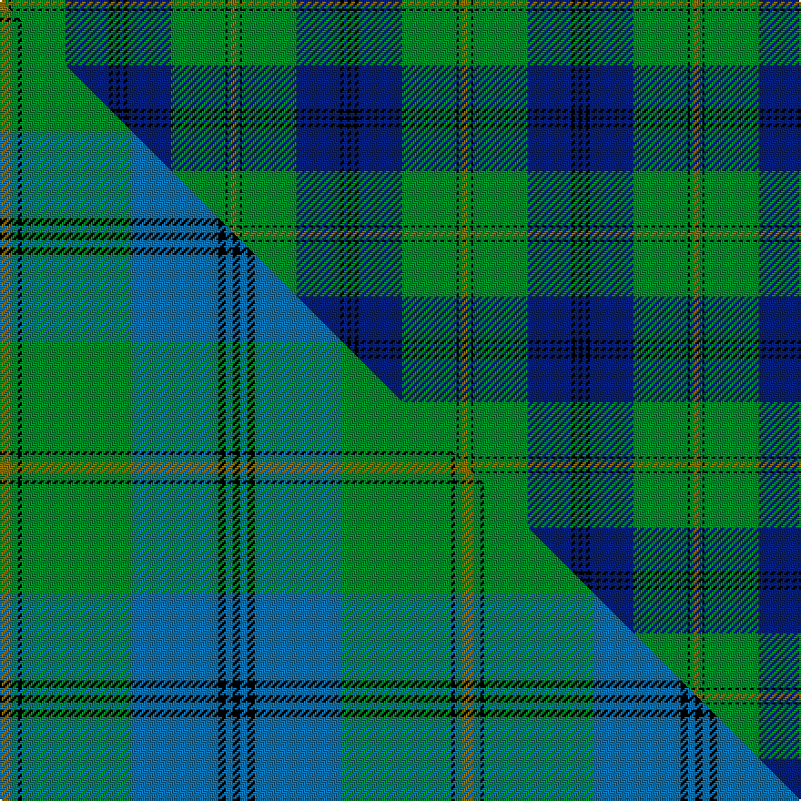

This is one **variant** — a specific cloth: this exact thread count and colourway, with its own
provenance below. It is one weaving of the [sett](/setts/y3g2k1g30db24k2db2k2/) (the scale-free proportion — the
same cloth at any scale or shade), whose colour order is pattern [GGKGBKBK](/stripes/ggkgbkbk/).

Part of the [Johnston](/tartans/johnston/) tartan — the named design grouping this sett with its other cloths.

Sourced from weddslist.  It is a [8 stripe tartan](/stripes/stripes8/).

Original link [http://www.weddslist.com/cgi-bin/tartans/pg.pl?source=rb](http://www.weddslist.com/cgi-bin/tartans/pg.pl?source=rb)

2 attestations — the source records this cloth was collapsed from (oldest owns this page)

<ul>
<li>undated — Johnston (weddslist, <a href="http://www.weddslist.com/cgi-bin/tartans/pg.pl?source=rb">record</a>) </li>
<li>undated — Johnston (weddslist, <a href="http://www.weddslist.com/cgi-bin/tartans/pg.pl?source=x">record</a>) </li>
</ul>

Dataset <small>— provenance for this record, inherited from the source manifest</small>

<dl class="dataset-prov">
<dt>source</dt><dd><a href="/sources/weddslist/">Weddslist</a></dd>
<dt>data captured from</dt><dd><a href="https://github.com/thetartan/tartan-database/blob/master/data/weddslist/data.csv">https://github.com/thetartan/tartan-database/blob/master/data/weddslist/data.csv</a></dd>
<dt>data date</dt><dd>2016-11-17 <small>(dataset default)</small></dd>
<dt>licence</dt><dd><a href="https://creativecommons.org/licenses/by-nc-nd/4.0/">CC BY-NC-ND 4.0</a></dd>
</dl>

Capture chain <small>— the hands this data passed through, oldest first; each capture carries its own licence</small>

<ol class="capture-chain">
<li><a href="https://www.weddslist.com/tartans/">Weddslist</a> <small>the living privately compiled reference</small></li>
<li><a href="https://github.com/thetartan/tartan-database">thetartan/tartan-database</a> <small>2016-2017</small> · <a href="https://creativecommons.org/licenses/by-nc-nd/4.0/">CC BY-NC-ND 4.0</a> <small>Levko Kravets's frozen compilation — the capture we vendored, and where its CC licence text came from</small></li>
<li>this dictionary <small>captured 2026-06-10 · commit 5bf86c7566</small> <small>each re-capture is a git commit to data/sources</small></li>
</ol>

## Thread count
Y/3 G2 K1 G30 DB24 K2 DB2 K/2

One full sett is **127 threads**.

## Palette
<table><thead><tr><th>Colour</th><th>Shade</th><th>OKLCh</th></tr></thead><tbody><tr><td>DB</td><td><code style="background-color:#082077;">#082077</code> <small style="color:#888">#082077</small></td><td><small style="color:#888">oklch(30.0% 0.149 265.1)</small></td></tr><tr><td>G</td><td><code style="background-color:#008B2A;">#008B2A</code> <small style="color:#888">#008B2A</small></td><td><small style="color:#888">oklch(55.4% 0.170 145.9)</small></td></tr><tr><td>K</td><td><code style="background-color:#000000;">#000000</code> <small style="color:#888">#000000</small></td><td><small style="color:#888">oklch(0.0% 0.000 0.0)</small></td></tr><tr><td>Y</td><td><code style="background-color:#8B6E00;">#8B6E00</code> <small style="color:#888">#8B6E00</small></td><td><small style="color:#888">oklch(55.1% 0.113 90.4)</small></td></tr></tbody></table>

# Sample pattern

## Compared to the master

This cloth is one sett of its design; the master sett (the exemplar the design is anchored on) is below for comparison.

Its **ΔTartan distance** from the master is **0.15** — the same measure the nearest-tartans table ranks by (0 is identical; a re-scale of the same cloth is near 0, a recolour or a different proportion further).

<figure class="master-compare" style="margin:0">

this sett
master sett ★

<figcaption style="color:#888;font-size:smaller">One weave of this sett against the <a href="/setts/y3g2k1g30t24k2t2k2/">master sett ★</a>, split on the diagonal: a shared proportion runs seamlessly across it with only the shades shifting; a different proportion breaks on it.</figcaption>
</figure>

## Nearest tartan variants

The nearest existing variants by ΔTartan distance, with this cloth at the top so the swatches line up against it.

ΔTartan

Threads

Variant

Sett

—

127

<a href="/variants/s8/y3g2k1g30db24k2db2k2/">Johnston</a>

<a href="/ttd/edit/#slug=y3g2k1g30db24k2db2k2~x2&amp;base=y3g2k1g30db24k2db2k2" title="compare in the TTD">0.00</a>

254

<a href="/variants/s8/y3g2k1g30db24k2db2k2~x2/">Johnston Clan Tartan</a>

<a href="/ttd/edit/#slug=k1b1k1b12g12k1g1ly1~x4~b2105244&amp;base=y3g2k1g30db24k2db2k2" title="compare in the TTD">0.68</a>

232

<a href="/variants/s8/k1t1k1t12g12k1g1ly1~x4~t2105244/">Banff Centennial</a>

<a href="/ttd/edit/#slug=dg4w1dg26t26k2t4~x4&amp;base=y3g2k1g30db24k2db2k2" title="compare in the TTD">1.21</a>

472

<a href="/variants/s6/dg4w1dg26t26k2t4~x4/">Melville (Two black lines)</a>

<a href="/ttd/edit/#slug=k3db3k3db22g26k2db1y3~x2&amp;base=y3g2k1g30db24k2db2k2" title="compare in the TTD">1.30</a>

240

<a href="/variants/s8/k3db3k3db22g26k2db1y3~x2/">Johnstone Clan Tartan</a>

<a href="/ttd/edit/#slug=db18dp2db16k13g3k2g42lo3~x2&amp;base=y3g2k1g30db24k2db2k2" title="compare in the TTD">1.43</a>

354

<a href="/variants/s8/db18dp2db16k13g3k2g42lo3~x2/">McFadden (Personal)</a>

<a href="/ttd/edit/#slug=db4k4db24g32w1g2~x4&amp;base=y3g2k1g30db24k2db2k2" title="compare in the TTD">1.51</a>

512

<a href="/variants/s6/db4k4db24g32w1g2~x4/">Oliphant (Clan)</a>

<a href="/ttd/edit/#slug=db4k4db24g32w1g2~x2&amp;base=y3g2k1g30db24k2db2k2" title="compare in the TTD">1.51</a>

256

<a href="/variants/s6/db4k4db24g32w1g2~x2/">Oliphant Family Tartan</a>

<a href="/ttd/edit/#slug=db4k4db24g32w1g2~x4~db1406275-w4000000&amp;base=y3g2k1g30db24k2db2k2" title="compare in the TTD">1.51</a>

512

<a href="/variants/s6/db4k4db24g32w1g2~x4~db1406275-w4000000/">Oliphant</a>

<a href="/ttd/edit/#slug=db28y1db2k16g24k1g2r3~x2&amp;base=y3g2k1g30db24k2db2k2" title="compare in the TTD">1.66</a>

246

<a href="/variants/s8/db28y1db2k16g24k1g2r3~x2/">Ogilvy VS</a>

<a href="/ttd/edit/#slug=db2g2k1g30db20r2db2r2~x2&amp;base=y3g2k1g30db24k2db2k2" title="compare in the TTD">1.74</a>

236

<a href="/variants/s8/db2g2k1g30db20r2db2r2~x2/">Gretna Green Fashion Tartan</a>

## Neighbour map

Every grey dot is one of 13621 variants placed by the first two principal components of the ΔTartan feature space (42% of its variance). Red is this tartan; blue dots are its nearest — click one to open its page.

<svg viewBox="0 0 640 380" role="img" style="max-width:100%;height:auto;border:1px solid #e0e0e0;border-radius:4px;display:block" xmlns="http://www.w3.org/2000/svg"><image href="/nn/cloud.v1.png" width="640" height="380"/><a href="/variants/s8/y3g2k1g30db24k2db2k2~x2/"><circle cx="303.2" cy="121.8" r="4" fill="#3465a4"><title>Johnston Clan Tartan</title></circle></a><a href="/variants/s8/k1t1k1t12g12k1g1ly1~x4~t2105244/"><circle cx="266.9" cy="167.3" r="4" fill="#3465a4"><title>Banff Centennial</title></circle></a><a href="/variants/s6/dg4w1dg26t26k2t4~x4/"><circle cx="345.2" cy="168.6" r="4" fill="#3465a4"><title>Melville (Two black lines)</title></circle></a><a href="/variants/s8/k3db3k3db22g26k2db1y3~x2/"><circle cx="252.4" cy="133.4" r="4" fill="#3465a4"><title>Johnstone Clan Tartan</title></circle></a><a href="/variants/s8/db18dp2db16k13g3k2g42lo3~x2/"><circle cx="219.4" cy="133.0" r="4" fill="#3465a4"><title>McFadden (Personal)</title></circle></a><a href="/variants/s6/db4k4db24g32w1g2~x4/"><circle cx="320.2" cy="145.8" r="4" fill="#3465a4"><title>Oliphant (Clan)</title></circle></a><a href="/variants/s6/db4k4db24g32w1g2~x2/"><circle cx="320.2" cy="145.8" r="4" fill="#3465a4"><title>Oliphant Family Tartan</title></circle></a><a href="/variants/s6/db4k4db24g32w1g2~x4~db1406275-w4000000/"><circle cx="309.3" cy="132.6" r="4" fill="#3465a4"><title>Oliphant</title></circle></a><a href="/variants/s8/db28y1db2k16g24k1g2r3~x2/"><circle cx="202.1" cy="117.2" r="4" fill="#3465a4"><title>Ogilvy VS</title></circle></a><a href="/variants/s8/db2g2k1g30db20r2db2r2~x2/"><circle cx="336.3" cy="121.1" r="4" fill="#3465a4"><title>Gretna Green Fashion Tartan</title></circle></a><circle cx="303.2" cy="121.8" r="5" fill="#c00000"/><text x="320" y="376" text-anchor="middle" font-size="11" fill="#999">ground</text><text x="11" y="190" text-anchor="middle" font-size="11" fill="#999" transform="rotate(-90 11 190)">complexity</text></svg>

ID: /variants/s8/y3g2k1g30db24k2db2k2/
