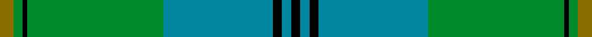

This page is one **sett** — a single exact thread-count. It belongs to the [tartan](/setts/y3g2k1g30t24k2t2k2/)
(the same proportion at any scale), whose colour order is pattern [GGKGBKBK](/stripes/ggkgbkbk/).

Part of the [Johnston](/tartans/johnston/) tartan — the named design grouping this sett with its other cloths.

Sourced from tartans-authority.  It is a [8 stripe tartan](/stripes/stripes8/).

Original link http://www.tartansauthority.com/tartan-ferret/display/1063/

## Register references

External register numbers recorded for this tartan.

- Scottish Tartans Authority (ITI): 1063

## Thread count
Y/6 G4 K2 G60 T48 K4 T4 K/4

One full sett is **254 threads**.

## Palette
<table><thead><tr><th>Colour</th><th>Shade</th><th>OKLCh</th></tr></thead><tbody><tr><td>T</td><td><code style="background-color:#00879F;">#00879F</code> <small style="color:#888">#00879F</small></td><td><small style="color:#888">oklch(57.4% 0.102 216.1)</small></td></tr><tr><td>G</td><td><code style="background-color:#008B2A;">#008B2A</code> <small style="color:#888">#008B2A</small></td><td><small style="color:#888">oklch(55.4% 0.170 145.9)</small></td></tr><tr><td>K</td><td><code style="background-color:#000000;">#000000</code> <small style="color:#888">#000000</small></td><td><small style="color:#888">oklch(0.0% 0.000 0.0)</small></td></tr><tr><td>Y</td><td><code style="background-color:#8B6E00;">#8B6E00</code> <small style="color:#888">#8B6E00</small></td><td><small style="color:#888">oklch(55.1% 0.113 90.4)</small></td></tr></tbody></table>

# Sample pattern

## Nearest tartan variants

The nearest existing variants by ΔTartan distance, with this cloth at the top so the swatches line up against it.

ΔTartan

Threads

Variant

Sett

—

254

<a href="/variants/s8/y3g2k1g30t24k2t2k2~x2/">Johnston (Clan)</a>

<a href="/ttd/edit/#slug=y3g2k1g30b24k2b2k2~x2~b2105244&amp;base=y3g2k1g30t24k2t2k2~x2" title="compare in the TTD">0.06</a>

254

<a href="/variants/s8/y3g2k1g30t24k2t2k2~x2~t2105244/">Johnston/Johnstone</a>

<a href="/ttd/edit/#slug=y3g2k1g30db24k2db2k2&amp;base=y3g2k1g30t24k2t2k2~x2" title="compare in the TTD">0.17</a>

127

<a href="/variants/s8/y3g2k1g30db24k2db2k2/">Johnston</a>

<a href="/ttd/edit/#slug=y3g2k1g30db24k2db2k2~x2&amp;base=y3g2k1g30t24k2t2k2~x2" title="compare in the TTD">0.17</a>

254

<a href="/variants/s8/y3g2k1g30db24k2db2k2~x2/">Johnston / Johnstone</a>

<a href="/ttd/edit/#slug=k1b1k1b12g12k1g1ly1~x4~b2105244&amp;base=y3g2k1g30t24k2t2k2~x2" title="compare in the TTD">0.65</a>

232

<a href="/variants/s8/k1t1k1t12g12k1g1ly1~x4~t2105244/">Banff Centennial</a>

<a href="/ttd/edit/#slug=dy4g3r2g36t30k3t3k3~x2&amp;base=y3g2k1g30t24k2t2k2~x2" title="compare in the TTD">0.74</a>

322

<a href="/variants/s8/dy4g3r2g36t30k3t3k3~x2/">Chartered Accountants of Scotland</a>

<a href="/ttd/edit/#slug=r3g1k1g12t12k1t1k1~x4&amp;base=y3g2k1g30t24k2t2k2~x2" title="compare in the TTD">0.92</a>

240

<a href="/variants/s8/r3g1k1g12t12k1t1k1~x4/">Peter of Lee (Personal)</a>

<a href="/ttd/edit/#slug=dg4w1dg26t26k2t4~x4&amp;base=y3g2k1g30t24k2t2k2~x2" title="compare in the TTD">1.21</a>

472

<a href="/variants/s6/dg4w1dg26t26k2t4~x4/">Melville (Two black lines)</a>

<a href="/ttd/edit/#slug=k3db3k3db22g26k2db1y3~x2&amp;base=y3g2k1g30t24k2t2k2~x2" title="compare in the TTD">1.30</a>

240

<a href="/variants/s8/k3db3k3db22g26k2db1y3~x2/">Johnstone/Johnston</a>

<a href="/ttd/edit/#slug=t36r2t4w1dy14g4y2g18~x2&amp;base=y3g2k1g30t24k2t2k2~x2" title="compare in the TTD">1.47</a>

216

<a href="/variants/s8/t36r2t4w1dy14g4y2g18~x2/">Yorkland (Personal)</a>

<a href="/ttd/edit/#slug=db4k4db24g32w1g2~x4~db1406275-w4000000&amp;base=y3g2k1g30t24k2t2k2~x2" title="compare in the TTD">1.51</a>

512

<a href="/variants/s6/db4k4db24g32w1g2~x4~db1406275-w4000000/">Oliphant</a>

## Neighbour map

Every grey dot is one of 13620 variants placed by the first two principal components of the ΔTartan feature space (42% of its variance). Red is this tartan; blue dots are its nearest — click one to open its page.

<svg viewBox="0 0 640 380" role="img" style="max-width:100%;height:auto;border:1px solid #e0e0e0;border-radius:4px;display:block" xmlns="http://www.w3.org/2000/svg"><image href="/nn/cloud.v1.png" width="640" height="380"/><a href="/variants/s8/y3g2k1g30t24k2t2k2~x2~t2105244/"><circle cx="347.0" cy="122.3" r="4" fill="#3465a4"><title>Johnston/Johnstone</title></circle></a><a href="/variants/s8/y3g2k1g30db24k2db2k2/"><circle cx="303.2" cy="121.8" r="4" fill="#3465a4"><title>Johnston</title></circle></a><a href="/variants/s8/y3g2k1g30db24k2db2k2~x2/"><circle cx="303.2" cy="121.8" r="4" fill="#3465a4"><title>Johnston / Johnstone</title></circle></a><a href="/variants/s8/k1t1k1t12g12k1g1ly1~x4~t2105244/"><circle cx="266.9" cy="167.1" r="4" fill="#3465a4"><title>Banff Centennial</title></circle></a><a href="/variants/s8/dy4g3r2g36t30k3t3k3~x2/"><circle cx="290.5" cy="148.5" r="4" fill="#3465a4"><title>Chartered Accountants of Scotland</title></circle></a><a href="/variants/s8/r3g1k1g12t12k1t1k1~x4/"><circle cx="238.9" cy="170.9" r="4" fill="#3465a4"><title>Peter of Lee (Personal)</title></circle></a><a href="/variants/s6/dg4w1dg26t26k2t4~x4/"><circle cx="345.2" cy="168.4" r="4" fill="#3465a4"><title>Melville (Two black lines)</title></circle></a><a href="/variants/s8/k3db3k3db22g26k2db1y3~x2/"><circle cx="252.5" cy="133.3" r="4" fill="#3465a4"><title>Johnstone/Johnston</title></circle></a><a href="/variants/s8/t36r2t4w1dy14g4y2g18~x2/"><circle cx="350.7" cy="143.0" r="4" fill="#3465a4"><title>Yorkland (Personal)</title></circle></a><a href="/variants/s6/db4k4db24g32w1g2~x4~db1406275-w4000000/"><circle cx="309.4" cy="132.4" r="4" fill="#3465a4"><title>Oliphant</title></circle></a><circle cx="350.4" cy="143.7" r="5" fill="#c00000"/><text x="320" y="376" text-anchor="middle" font-size="11" fill="#999">ground</text><text x="11" y="190" text-anchor="middle" font-size="11" fill="#999" transform="rotate(-90 11 190)">complexity</text></svg>

ID: /variants/s8/y3g2k1g30t24k2t2k2~x2/
