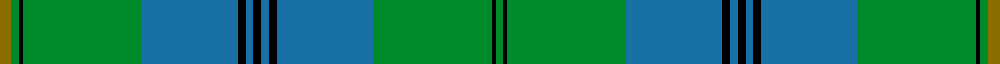

This page is one **sett** — a single exact thread-count. It belongs to the [tartan](/setts/y3g2k1g30t24k2t2k2/)
(the same proportion at any scale), whose colour order is pattern [GGKGBKBKBKBGKG](/stripes/ggkgbkbkbkbgkg/).

Part of the [Johnston](/tartans/johnston/) tartan — the named design grouping this sett with its other cloths.

Sourced from register-of-tartans.  It is a [14 stripe tartan](/stripes/stripes14/).

Original link https://www.tartanregister.gov.uk/tartanDetails.aspx?ref=1899

## Register references

External register numbers recorded for this tartan.

- Scottish Register of Tartans: [1899](https://www.tartanregister.gov.uk/tartanDetails.aspx?ref=1899)
- Scottish Tartans Authority (ITI): 1063
- Scottish Tartans World Register: 1063

## Thread count
Y/6 G4 K2 G60 T48 K4 T4 K4 T4 K4 T48 G60 K2 G/4

One full sett is **498 threads**.

## Palette
<table><thead><tr><th>Colour</th><th>Shade</th><th>OKLCh</th></tr></thead><tbody><tr><td>B</td><td><code style="background-color:#1474B4;">#1474B4</code> <small style="color:#888">#1474B4</small></td><td><small style="color:#888">oklch(54.0% 0.129 245.1)</small></td></tr><tr><td>Ba</td><td><code style="background-color:#1870A4;">#1870A4</code> <small style="color:#888">#1870A4</small></td><td><small style="color:#888">oklch(52.2% 0.113 241.2)</small></td></tr><tr><td>DB</td><td><code style="background-color:#082077;">#082077</code> <small style="color:#888">#082077</small></td><td><small style="color:#888">oklch(30.0% 0.149 265.1)</small></td></tr><tr><td>DY</td><td><code style="background-color:#FF9C34;">#FF9C34</code> <small style="color:#888">#FF9C34</small></td><td><small style="color:#888">oklch(77.9% 0.161 61.8)</small></td></tr><tr><td>G</td><td><code style="background-color:#008B2A;">#008B2A</code> <small style="color:#888">#008B2A</small></td><td><small style="color:#888">oklch(55.4% 0.170 145.9)</small></td></tr><tr><td>K</td><td><code style="background-color:#000000;">#000000</code> <small style="color:#888">#000000</small></td><td><small style="color:#888">oklch(0.0% 0.000 0.0)</small></td></tr><tr><td>Y</td><td><code style="background-color:#8B6E00;">#8B6E00</code> <small style="color:#888">#8B6E00</small></td><td><small style="color:#888">oklch(55.1% 0.113 90.4)</small></td></tr></tbody></table>

# Sample pattern

ID: /variants/s8/y3g2k1g30t24k2t2k2~x2~t2105244/
