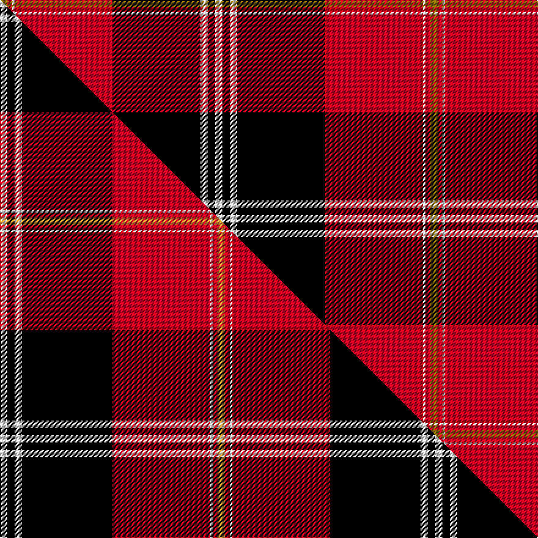

This page is one **sett** — a single exact thread-count. It belongs to the [tartan](/setts/y3r2w1r40k36w3k3w3/)
(the same proportion at any scale), whose colour order is pattern [GRWRKWKW](/stripes/grwrkwkw/).

Part of the [Marjoribanks](/tartans/marjoribanks/) tartan — the named design grouping this sett with its other cloths.

Sourced from weddslist.  It is a [8 stripe tartan](/stripes/stripes8/).

Original link http://www.weddslist.com/cgi-bin/tartans/pg.pl?source=sts

## Thread count
Y/6 R4 W2 R80 K72 W6 K6 W/6

One full sett is **352 threads**.

## Palette
<table><thead><tr><th>Colour</th><th>Shade</th><th>OKLCh</th></tr></thead><tbody><tr><td>K</td><td><code style="background-color:#000000;">#000000</code> <small style="color:#888">#000000</small></td><td><small style="color:#888">oklch(0.0% 0.000 0.0)</small></td></tr><tr><td>W</td><td><code style="background-color:#F7F7F7;">#F7F7F7</code> <small style="color:#888">#F7F7F7</small></td><td><small style="color:#888">oklch(97.6% 0.000 89.9)</small></td></tr><tr><td>R</td><td><code style="background-color:#D60020;">#D60020</code> <small style="color:#888">#D60020</small></td><td><small style="color:#888">oklch(55.2% 0.224 25.5)</small></td></tr><tr><td>Y</td><td><code style="background-color:#8B6E00;">#8B6E00</code> <small style="color:#888">#8B6E00</small></td><td><small style="color:#888">oklch(55.1% 0.113 90.4)</small></td></tr></tbody></table>

# Sample pattern

## Compared to the master

This cloth is one sett of its design; the master sett (the exemplar the design is anchored on) is below for comparison.

Its **ΔTartan distance** from the master is **0.07** — the same measure the nearest-tartans table ranks by (0 is identical; a re-scale of the same cloth is near 0, a recolour or a different proportion further).

<figure class="master-compare" style="margin:0">

this sett
master sett ★

<figcaption style="color:#888;font-size:smaller">One weave of this sett against the <a href="/setts/w3k3w3k37r40w1r2lo3/">master sett ★</a>, split on the diagonal: a shared proportion runs seamlessly across it with only the shades shifting; a different proportion breaks on it.</figcaption>
</figure>

## Nearest variants

The nearest existing variants by ΔTartan distance, with this cloth at the top so the swatches line up against it.

ΔTartan

Threads

Variant

Sett

—

352

<a href="/variants/s8/y3r2w1r40k36w3k3w3~x2/">Marjoribanks</a>

<a href="/ttd/edit/#slug=w3k3w3k37r40w1r2lo3~x2&amp;base=y3r2w1r40k36w3k3w3~x2" title="compare in the TTD">0.33</a>

356

<a href="/variants/s8/w3k3w3k37r40w1r2lo3~x2/">Marjoribanks (Clan)</a>

<a href="/ttd/edit/#slug=k4w2k28r30b1r3~x2&amp;base=y3r2w1r40k36w3k3w3~x2" title="compare in the TTD">1.52</a>

258

<a href="/variants/s6/k4w2k28r30b1r3~x2/">Ramsay</a>

<a href="/ttd/edit/#slug=k4w2k28r30db1r3~x2&amp;base=y3r2w1r40k36w3k3w3~x2" title="compare in the TTD">1.52</a>

258

<a href="/variants/s6/k4w2k28r30db1r3~x2/">Ramsay</a>

<a href="/ttd/edit/#slug=k4w1k28r30dp1r3~x2&amp;base=y3r2w1r40k36w3k3w3~x2" title="compare in the TTD">1.52</a>

254

<a href="/variants/s6/k4w1k28r30dp1r3~x2/">Ramsay (Red)</a>

<a href="/ttd/edit/#slug=k3r1k30r28db1r1w3~x2&amp;base=y3r2w1r40k36w3k3w3~x2" title="compare in the TTD">1.97</a>

256

<a href="/variants/s7/k3r1k30r28db1r1w3~x2/">Cunningham #3</a>

<a href="/ttd/edit/#slug=k4w2k28r30k1r3~x2&amp;base=y3r2w1r40k36w3k3w3~x2" title="compare in the TTD">2.24</a>

258

<a href="/variants/s6/k4w2k28r30k1r3~x2/">Ramsay of Dalhousie</a>

<a href="/ttd/edit/#slug=r26w2ly1k3ly4r8k32w1k1w3~x2&amp;base=y3r2w1r40k36w3k3w3~x2" title="compare in the TTD">2.51</a>

266

<a href="/variants/s10/r26w2ly1k3ly4r8k32w1k1w3~x2/">Sens (Corporate)</a>

<a href="/ttd/edit/#slug=r26w2y1k3y4r8k32w1k1w3~x2&amp;base=y3r2w1r40k36w3k3w3~x2" title="compare in the TTD">2.51</a>

266

<a href="/variants/s10/r26w2y1k3y4r8k32w1k1w3~x2/">Sens</a>

<a href="/ttd/edit/#slug=w6k2w2k31r41k2r2k4~x2&amp;base=y3r2w1r40k36w3k3w3~x2" title="compare in the TTD">2.61</a>

340

<a href="/variants/s8/w6k2w2k31r41k2r2k4~x2/">University of Nebraska Alumni Association</a>

<a href="/ttd/edit/#slug=dg5k1r2k4r36k23w4y2~x2&amp;base=y3r2w1r40k36w3k3w3~x2" title="compare in the TTD">2.63</a>

294

<a href="/variants/s8/dg5k1r2k4r36k23w4y2~x2/">Aberdeen F.C.</a>

## Neighbour map

Every grey dot is one of 13620 variants placed by the first two principal components of the ΔTartan feature space (42% of its variance). Red is this tartan; blue dots are its nearest — click one to open its page.

<svg viewBox="0 0 640 380" role="img" style="max-width:100%;height:auto;border:1px solid #e0e0e0;border-radius:4px;display:block" xmlns="http://www.w3.org/2000/svg"><image href="/nn/cloud.v1.png" width="640" height="380"/><a href="/variants/s8/w3k3w3k37r40w1r2lo3~x2/"><circle cx="276.2" cy="78.6" r="4" fill="#3465a4"><title>Marjoribanks (Clan)</title></circle></a><a href="/variants/s6/k4w2k28r30b1r3~x2/"><circle cx="293.9" cy="114.4" r="4" fill="#3465a4"><title>Ramsay</title></circle></a><a href="/variants/s6/k4w2k28r30db1r3~x2/"><circle cx="294.2" cy="114.4" r="4" fill="#3465a4"><title>Ramsay</title></circle></a><a href="/variants/s6/k4w1k28r30dp1r3~x2/"><circle cx="304.7" cy="112.7" r="4" fill="#3465a4"><title>Ramsay (Red)</title></circle></a><a href="/variants/s7/k3r1k30r28db1r1w3~x2/"><circle cx="292.7" cy="96.3" r="4" fill="#3465a4"><title>Cunningham #3</title></circle></a><a href="/variants/s6/k4w2k28r30k1r3~x2/"><circle cx="313.5" cy="126.6" r="4" fill="#3465a4"><title>Ramsay of Dalhousie</title></circle></a><a href="/variants/s10/r26w2ly1k3ly4r8k32w1k1w3~x2/"><circle cx="248.7" cy="80.4" r="4" fill="#3465a4"><title>Sens (Corporate)</title></circle></a><a href="/variants/s10/r26w2y1k3y4r8k32w1k1w3~x2/"><circle cx="250.0" cy="80.2" r="4" fill="#3465a4"><title>Sens</title></circle></a><a href="/variants/s8/w6k2w2k31r41k2r2k4~x2/"><circle cx="279.8" cy="117.3" r="4" fill="#3465a4"><title>University of Nebraska Alumni Association</title></circle></a><a href="/variants/s8/dg5k1r2k4r36k23w4y2~x2/"><circle cx="257.8" cy="73.9" r="4" fill="#3465a4"><title>Aberdeen F.C.</title></circle></a><circle cx="278.2" cy="79.0" r="5" fill="#c00000"/><text x="320" y="376" text-anchor="middle" font-size="11" fill="#999">ground</text><text x="11" y="190" text-anchor="middle" font-size="11" fill="#999" transform="rotate(-90 11 190)">complexity</text></svg>

ID: /variants/s8/y3r2w1r40k36w3k3w3~x2/
