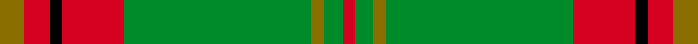

This is one **variant** — a specific cloth: this exact thread count and colourway, with its own
provenance below. It is one weaving of the [sett](/tartans/b/be/beard/) (the scale-free proportion — the
same cloth at any scale or shade), whose colour order is pattern [GRKRGGGR](/stripes/grkrgggr/).

Part of the [Beard](/tartans/b/be/beard/) tartan — the named design grouping this sett with its other cloths.

Sourced from register-of-tartans.  It is a [8 stripe tartan](/stripes/stripes8/).

Original link [https://www.tartanregister.gov.uk/tartanDetails.aspx?ref=4890](https://www.tartanregister.gov.uk/tartanDetails.aspx?ref=4890)

Dataset <small>— provenance for this record, inherited from the source manifest</small>

<dl class="dataset-prov">
<dt>source</dt><dd><a href="/sources/register-of-tartans/">Scottish Register of Tartans</a></dd>
<dt>data captured from</dt><dd><a href="https://github.com/thetartan/tartan-database/blob/master/data/register-of-tartans/data.csv">https://github.com/thetartan/tartan-database/blob/master/data/register-of-tartans/data.csv</a></dd>
<dt>data date</dt><dd>pre 1996 <small>(this record)</small></dd>
<dt>licence</dt><dd><a href="https://www.tartanregister.gov.uk/copyright">Crown copyright</a></dd>
</dl>

Capture chain <small>— the hands this data passed through, oldest first; each capture carries its own licence</small>

<ol class="capture-chain">
<li><a href="https://www.tartanregister.gov.uk/">Scottish Register of Tartans</a> · <a href="https://www.tartanregister.gov.uk/copyright">Crown copyright</a> <small>the living register — still published by National Records of Scotland</small></li>
<li><a href="https://github.com/thetartan/tartan-database">thetartan/tartan-database</a> <small>2016-2017</small> · <a href="https://creativecommons.org/licenses/by-nc-nd/4.0/">CC BY-NC-ND 4.0</a> <small>Levko Kravets's frozen compilation — the capture we vendored, and where its CC licence text came from</small></li>
<li>this dictionary <small>captured 2026-06-10 · commit 5bf86c7566</small> <small>each re-capture is a git commit to data/sources</small></li>
</ol>

## Register references

External register numbers recorded for this tartan.

- Scottish Register of Tartans: [4890](https://www.tartanregister.gov.uk/tartanDetails.aspx?ref=4890)
- Scottish Tartans Authority (ITI): 3666

## Thread count
Y/8 R8 K4 R20 G60 Y4 G6 R/4

One full sett is **216 threads**.

## Palette
<table><thead><tr><th>Colour</th><th>Shade</th><th>OKLCh</th></tr></thead><tbody><tr><td>LB</td><td><code style="background-color:#B5BBDE;">#B5BBDE</code> <small style="color:#888">#B5BBDE</small></td><td><small style="color:#888">oklch(79.9% 0.050 277.6)</small></td></tr><tr><td>DB</td><td><code style="background-color:#082077;">#082077</code> <small style="color:#888">#082077</small></td><td><small style="color:#888">oklch(30.0% 0.149 265.1)</small></td></tr><tr><td>R</td><td><code style="background-color:#D60020;">#D60020</code> <small style="color:#888">#D60020</small></td><td><small style="color:#888">oklch(55.2% 0.224 25.5)</small></td></tr><tr><td>Y</td><td><code style="background-color:#8B6E00;">#8B6E00</code> <small style="color:#888">#8B6E00</small></td><td><small style="color:#888">oklch(55.1% 0.113 90.4)</small></td></tr><tr><td>G</td><td><code style="background-color:#008B2A;">#008B2A</code> <small style="color:#888">#008B2A</small></td><td><small style="color:#888">oklch(55.4% 0.170 145.9)</small></td></tr><tr><td>K</td><td><code style="background-color:#000000;">#000000</code> <small style="color:#888">#000000</small></td><td><small style="color:#888">oklch(0.0% 0.000 0.0)</small></td></tr><tr><td>W</td><td><code style="background-color:#F7F7F7;">#F7F7F7</code> <small style="color:#888">#F7F7F7</small></td><td><small style="color:#888">oklch(97.6% 0.000 89.9)</small></td></tr><tr><td>DP</td><td><code style="background-color:#4B0B4F;">#4B0B4F</code> <small style="color:#888">#4B0B4F</small></td><td><small style="color:#888">oklch(30.1% 0.125 325.4)</small></td></tr></tbody></table>

# Sample pattern

## Nearest tartan variants

The nearest existing variants by ΔTartan distance, with this cloth at the top so the swatches line up against it.

ΔTartan

Threads

Variant

Sett

—

216

<a href="/variants/s8/y4r4k2r10g30y2g3r2~x2/">Beard</a>

<a href="/ttd/edit/#slug=r3g19dy3g19r3g3r21lb3~x2&amp;base=y4r4k2r10g30y2g3r2~x2" title="compare in the TTD">2.01</a>

284

<a href="/variants/s8/r3g19dy3g19r3g3r21lb3~x2/">Burnett of Powis (Personal)</a>

<a href="/ttd/edit/#slug=r16k3r16g44k3g8k3y20k4~x2&amp;base=y4r4k2r10g30y2g3r2~x2" title="compare in the TTD">2.05</a>

428

<a href="/variants/s9/r16k3r16g44k3g8k3y20k4~x2/">MacMillan, Society of Glasgow</a>

<a href="/ttd/edit/#slug=r3g9w1g9r3g6r18k2~x2&amp;base=y4r4k2r10g30y2g3r2~x2" title="compare in the TTD">2.27</a>

194

<a href="/variants/s8/r3g9w1g9r3g6r18k2~x2/">Cumming #2</a>

<a href="/ttd/edit/#slug=g18lb3y1r2y1r3y1r10~x4&amp;base=y4r4k2r10g30y2g3r2~x2" title="compare in the TTD">2.31</a>

200

<a href="/variants/s8/g18lb3y1r2y1r3y1r10~x4/">Brisbane (Artefact)</a>

<a href="/ttd/edit/#slug=g18w3y1r2y1r3y1r10~x4&amp;base=y4r4k2r10g30y2g3r2~x2" title="compare in the TTD">2.32</a>

200

<a href="/variants/s8/g18w3y1r2y1r3y1r10~x4/">Brisbane (Artefact)</a>

<a href="/ttd/edit/#slug=k2r2k1r18g24k1g2lo2~x2&amp;base=y4r4k2r10g30y2g3r2~x2" title="compare in the TTD">2.38</a>

200

<a href="/variants/s8/k2r2k1r18g24k1g2lo2~x2/">Gleneil (Spoof)</a>

<a href="/ttd/edit/#slug=k2r2k2r24g31k1g2y2~x2&amp;base=y4r4k2r10g30y2g3r2~x2" title="compare in the TTD">2.50</a>

256

<a href="/variants/s8/k2r2k2r24g31k1g2y2~x2/">Gleneil</a>

<a href="/ttd/edit/#slug=y28k2y28k2y2k2dy29k2r2k2~x2&amp;base=y4r4k2r10g30y2g3r2~x2" title="compare in the TTD">2.52</a>

336

<a href="/variants/s10/y28k2y28k2y2k2dy29k2r2k2~x2/">Ulster (Peat) (District</a>

<a href="/ttd/edit/#slug=db3g16y1r1w1r6g3r1g3w1~x4~db1406275-r2109032-w4000000&amp;base=y4r4k2r10g30y2g3r2~x2" title="compare in the TTD">2.63</a>

272

<a href="/variants/s10/db3g16y1r1w1r6g3r1g3w1~x4~db1406275-r2109032-w4000000/">Canadian Caledonian</a>

<a href="/ttd/edit/#slug=db3g16y1r1w1r6g3r1g3w1~x4&amp;base=y4r4k2r10g30y2g3r2~x2" title="compare in the TTD">2.64</a>

272

<a href="/variants/s10/db3g16y1r1w1r6g3r1g3w1~x4/">Canadian Caledonian (Universal)</a>

## Neighbour map

Every grey dot is one of 13656 variants placed by the first two principal components of the ΔTartan feature space (42% of its variance). Red is this tartan; blue dots are its nearest — click one to open its page. The map is a flat projection of a many-dimensional space — [how to read it](/posts/neighbourhood-maps/).

<svg viewBox="0 0 640 380" role="img" style="max-width:100%;height:auto;border:1px solid #e0e0e0;border-radius:4px;display:block" xmlns="http://www.w3.org/2000/svg"><image href="/nn/cloud.v1.png" width="640" height="380"/><a href="/variants/s8/r3g19dy3g19r3g3r21lb3~x2/"><circle cx="323.8" cy="219.3" r="4" fill="#3465a4"><title>Burnett of Powis (Personal)</title></circle></a><a href="/variants/s9/r16k3r16g44k3g8k3y20k4~x2/"><circle cx="219.1" cy="157.7" r="4" fill="#3465a4"><title>MacMillan, Society of Glasgow</title></circle></a><a href="/variants/s8/r3g9w1g9r3g6r18k2~x2/"><circle cx="280.6" cy="164.7" r="4" fill="#3465a4"><title>Cumming #2</title></circle></a><a href="/variants/s8/g18lb3y1r2y1r3y1r10~x4/"><circle cx="328.1" cy="168.5" r="4" fill="#3465a4"><title>Brisbane (Artefact)</title></circle></a><a href="/variants/s8/g18w3y1r2y1r3y1r10~x4/"><circle cx="308.4" cy="161.9" r="4" fill="#3465a4"><title>Brisbane (Artefact)</title></circle></a><a href="/variants/s8/k2r2k1r18g24k1g2lo2~x2/"><circle cx="298.7" cy="117.6" r="4" fill="#3465a4"><title>Gleneil (Spoof)</title></circle></a><a href="/variants/s8/k2r2k2r24g31k1g2y2~x2/"><circle cx="315.3" cy="106.8" r="4" fill="#3465a4"><title>Gleneil</title></circle></a><a href="/variants/s10/y28k2y28k2y2k2dy29k2r2k2~x2/"><circle cx="340.7" cy="140.1" r="4" fill="#3465a4"><title>Ulster (Peat) (District</title></circle></a><a href="/variants/s10/db3g16y1r1w1r6g3r1g3w1~x4~db1406275-r2109032-w4000000/"><circle cx="345.7" cy="141.6" r="4" fill="#3465a4"><title>Canadian Caledonian</title></circle></a><a href="/variants/s10/db3g16y1r1w1r6g3r1g3w1~x4/"><circle cx="339.8" cy="139.6" r="4" fill="#3465a4"><title>Canadian Caledonian (Universal)</title></circle></a><circle cx="346.5" cy="152.0" r="5" fill="#c00000"/><text x="320" y="376" text-anchor="middle" font-size="11" fill="#999">ground</text><text x="11" y="190" text-anchor="middle" font-size="11" fill="#999" transform="rotate(-90 11 190)">complexity</text></svg>

ID: /variants/s8/y4r4k2r10g30y2g3r2~x2/
