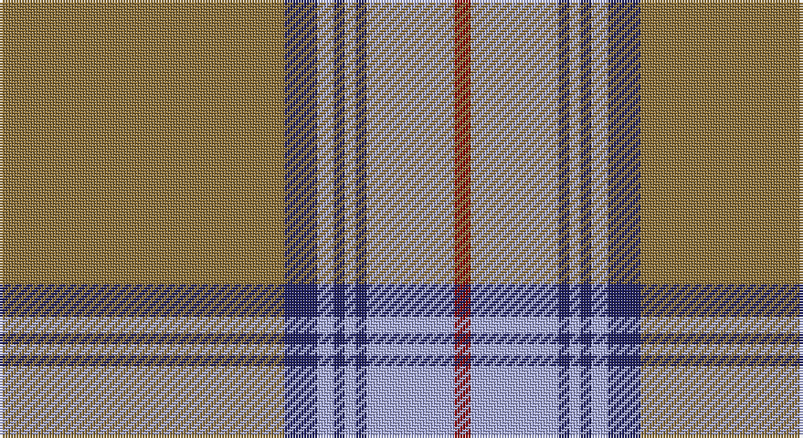

This page is one **sett** — a single exact thread-count. It belongs to the [tartan](/setts/y52db6lb3db2lb2db2lb16r3/)
(the same proportion at any scale), whose colour order is pattern [GBWBWBWR](/stripes/gbwbwbwr/).

Part of the [Scotch House](/tartans/scotch-house/) tartan — the named design grouping this sett with its other cloths.

Sourced from tartans-authority.  It is a [8 stripe tartan](/stripes/stripes8/).

Original link http://www.tartansauthority.com/tartan-ferret/display/5382/

## Register references

External register numbers recorded for this tartan.

- Scottish Tartans Authority (ITI): 5382

## Thread count
LT/104 DB12 LP6 DB4 LP4 DB4 LP32 DR/6

One full sett is **234 threads**.

## Palette

Palette: <strong>Tartan Register</strong>
<table><thead><tr><th>Colour</th><th>Threads</th><th>Shade</th><th>Base</th><th>OKLCh</th></tr></thead><tbody><tr><td>LT/</td><td style="text-align:right;font-variant-numeric:tabular-nums">104</td><td><code style="background-color:#8C7038;">#8C7038</code> <small style="color:#888">#8C7038</small></td><td>G <code style="background-color:#006100;">#006100</code></td><td><small style="color:#888">oklch(56.0% 0.082 83.0)</small></td></tr><tr><td>DB</td><td style="text-align:right;font-variant-numeric:tabular-nums">12</td><td><code style="background-color:#202060;">#202060</code> <small style="color:#888">#202060</small></td><td>B <code style="background-color:#2A418A;">#2A418A</code></td><td><small style="color:#888">oklch(28.9% 0.111 276.9)</small></td></tr><tr><td>LP</td><td style="text-align:right;font-variant-numeric:tabular-nums">6</td><td><code style="background-color:#A8ACE8;">#A8ACE8</code> <small style="color:#888">#A8ACE8</small></td><td>W <code style="background-color:#F7F7F7;">#F7F7F7</code></td><td><small style="color:#888">oklch(76.3% 0.086 281.2)</small></td></tr><tr><td>DB</td><td style="text-align:right;font-variant-numeric:tabular-nums">4</td><td><code style="background-color:#202060;">#202060</code> <small style="color:#888">#202060</small></td><td>B <code style="background-color:#2A418A;">#2A418A</code></td><td><small style="color:#888">oklch(28.9% 0.111 276.9)</small></td></tr><tr><td>LP</td><td style="text-align:right;font-variant-numeric:tabular-nums">4</td><td><code style="background-color:#A8ACE8;">#A8ACE8</code> <small style="color:#888">#A8ACE8</small></td><td>W <code style="background-color:#F7F7F7;">#F7F7F7</code></td><td><small style="color:#888">oklch(76.3% 0.086 281.2)</small></td></tr><tr><td>DB</td><td style="text-align:right;font-variant-numeric:tabular-nums">4</td><td><code style="background-color:#202060;">#202060</code> <small style="color:#888">#202060</small></td><td>B <code style="background-color:#2A418A;">#2A418A</code></td><td><small style="color:#888">oklch(28.9% 0.111 276.9)</small></td></tr><tr><td>LP</td><td style="text-align:right;font-variant-numeric:tabular-nums">32</td><td><code style="background-color:#A8ACE8;">#A8ACE8</code> <small style="color:#888">#A8ACE8</small></td><td>W <code style="background-color:#F7F7F7;">#F7F7F7</code></td><td><small style="color:#888">oklch(76.3% 0.086 281.2)</small></td></tr><tr><td>DR/</td><td style="text-align:right;font-variant-numeric:tabular-nums">6</td><td><code style="background-color:#880000;">#880000</code> <small style="color:#888">#880000</small></td><td>R <code style="background-color:#CC0000;">#CC0000</code></td><td><small style="color:#888">oklch(39.4% 0.162 29.2)</small></td></tr></tbody></table>

# Sample pattern

## Compared to the master

This cloth is one sett of its design; the master sett (the exemplar the design is anchored on) is below for comparison.

<figure style="margin:0"><figcaption style="color:#888;font-size:smaller">this sett</figcaption></figure>
<figure style="margin:0"><figcaption style="color:#888;font-size:smaller"><a href="/setts/dg4lb3db3lb3dg12k6db4k3db4k3db12r3/">master sett →</a></figcaption></figure>

## Nearest tartans

The nearest existing variants by ΔTartan distance, with this tartan at the top so the swatches line up against it.

ΔTartan

Tartan

Sett

—

<a href="/ttd/edit/#slug=y52db6lb3db2lb2db2lb16r3~x2">Scotch House (Corporate)</a> <a class="nn-out" href="/variants/s8/y52db6lb3db2lb2db2lb16r3~x2/" title="open its dictionary page">↗</a>

1.02

<a href="/ttd/edit/#slug=n83k7w6n10r7k3r20w3~x2&amp;base=y52db6lb3db2lb2db2lb16r3~x2">President High School</a> <a class="nn-out" href="/variants/s8/n83k7w6n10r7k3r20w3~x2/" title="open its dictionary page">↗</a>

1.12

<a href="/ttd/edit/#slug=o19dy2do3w1do1w1do1dy6o3do1o3w1~x4&amp;base=y52db6lb3db2lb2db2lb16r3~x2">Glen Moy #2</a> <a class="nn-out" href="/variants/s12/o19dy2do3w1do1w1do1dy6o3do1o3w1~x4/" title="open its dictionary page">↗</a>

1.16

<a href="/ttd/edit/#slug=r2b4lb18n2lb2n41w2~x2&amp;base=y52db6lb3db2lb2db2lb16r3~x2">Haddrell (2013)</a> <a class="nn-out" href="/variants/s7/r2b4lb18n2lb2n41w2~x2/" title="open its dictionary page">↗</a>

1.16

<a href="/ttd/edit/#slug=o10t11k2t3k2t2k8o40w4~x2&amp;base=y52db6lb3db2lb2db2lb16r3~x2">Doune (District)</a> <a class="nn-out" href="/variants/s9/o10t11k2t3k2t2k8o40w4~x2/" title="open its dictionary page">↗</a>

1.17

<a href="/ttd/edit/#slug=o66m3g3m3g16dr8g3dr3mi4~x2&amp;base=y52db6lb3db2lb2db2lb16r3~x2">Scottish National Htg (Fashion)</a> <a class="nn-out" href="/variants/s9/o66m3g3m3g16dr8g3dr3mi4~x2/" title="open its dictionary page">↗</a>

1.31

<a href="/ttd/edit/#slug=y65p3g3p3g16dr8g3dr3dri4~x2&amp;base=y52db6lb3db2lb2db2lb16r3~x2">Scottish National (hunting)</a> <a class="nn-out" href="/variants/s9/y65p3g3p3g16dr8g3dr3dri4~x2/" title="open its dictionary page">↗</a>

1.34

<a href="/variants/s9/o10t11ki2t3ki2t2ki8o40k4~x2/">Doune District Tartan</a>

1.36

<a href="/ttd/edit/#slug=o40dt10yi2dt2w2dt3y8o6dt2o4w2~x2&amp;base=y52db6lb3db2lb2db2lb16r3~x2">Cavalier, Brown</a> <a class="nn-out" href="/variants/s11/o40dt10yi2dt2w2dt3y8o6dt2o4w2~x2/" title="open its dictionary page">↗</a>

1.42

<a href="/ttd/edit/#slug=o40dt10y2dt2w2dt3r8o6dt2o4w2~x2&amp;base=y52db6lb3db2lb2db2lb16r3~x2">Cavalier, Red</a> <a class="nn-out" href="/variants/s11/o40dt10y2dt2w2dt3r8o6dt2o4w2~x2/" title="open its dictionary page">↗</a>

1.53

<a href="/ttd/edit/#slug=lo3y40db12lo3k2lb4k2lo3~x2&amp;base=y52db6lb3db2lb2db2lb16r3~x2">Tunes of Glory (Film)</a> <a class="nn-out" href="/variants/s8/lo3y40db12lo3k2lb4k2lo3~x2/" title="open its dictionary page">↗</a>

## Neighbour map

Every grey dot is one of 14360 variants placed by the first two principal components of the ΔTartan feature space (44% of its variance). Red is this tartan; blue dots are its nearest — click one to open its page.

<svg viewBox="0 0 640 380" role="img" style="max-width:100%;height:auto;border:1px solid #e0e0e0;border-radius:4px;display:block" xmlns="http://www.w3.org/2000/svg"><image href="/nn/cloud.v1.png" width="640" height="380"/><a href="/variants/s8/n83k7w6n10r7k3r20w3~x2/"><circle cx="453.5" cy="130.4" r="4" fill="#3465a4"><title>President High School</title></circle></a><a href="/variants/s12/o19dy2do3w1do1w1do1dy6o3do1o3w1~x4/"><circle cx="362.3" cy="121.0" r="4" fill="#3465a4"><title>Glen Moy #2</title></circle></a><a href="/variants/s7/r2b4lb18n2lb2n41w2~x2/"><circle cx="380.4" cy="134.1" r="4" fill="#3465a4"><title>Haddrell (2013)</title></circle></a><a href="/variants/s9/o10t11k2t3k2t2k8o40w4~x2/"><circle cx="374.5" cy="145.4" r="4" fill="#3465a4"><title>Doune (District)</title></circle></a><a href="/variants/s9/o66m3g3m3g16dr8g3dr3mi4~x2/"><circle cx="400.0" cy="120.5" r="4" fill="#3465a4"><title>Scottish National Htg (Fashion)</title></circle></a><a href="/variants/s9/y65p3g3p3g16dr8g3dr3dri4~x2/"><circle cx="396.7" cy="124.0" r="4" fill="#3465a4"><title>Scottish National (hunting)</title></circle></a><a href="/variants/s9/o10t11ki2t3ki2t2ki8o40k4~x2/"><circle cx="366.2" cy="143.0" r="4" fill="#3465a4"><title>Doune District Tartan</title></circle></a><a href="/variants/s11/o40dt10yi2dt2w2dt3y8o6dt2o4w2~x2/"><circle cx="371.9" cy="108.3" r="4" fill="#3465a4"><title>Cavalier, Brown</title></circle></a><a href="/variants/s11/o40dt10y2dt2w2dt3r8o6dt2o4w2~x2/"><circle cx="369.7" cy="104.0" r="4" fill="#3465a4"><title>Cavalier, Red</title></circle></a><a href="/variants/s8/lo3y40db12lo3k2lb4k2lo3~x2/"><circle cx="356.0" cy="126.3" r="4" fill="#3465a4"><title>Tunes of Glory (Film)</title></circle></a><circle cx="412.8" cy="127.7" r="5" fill="#c00000"/></svg>

ID: /variants/s8/y52db6lb3db2lb2db2lb16r3~x2/
