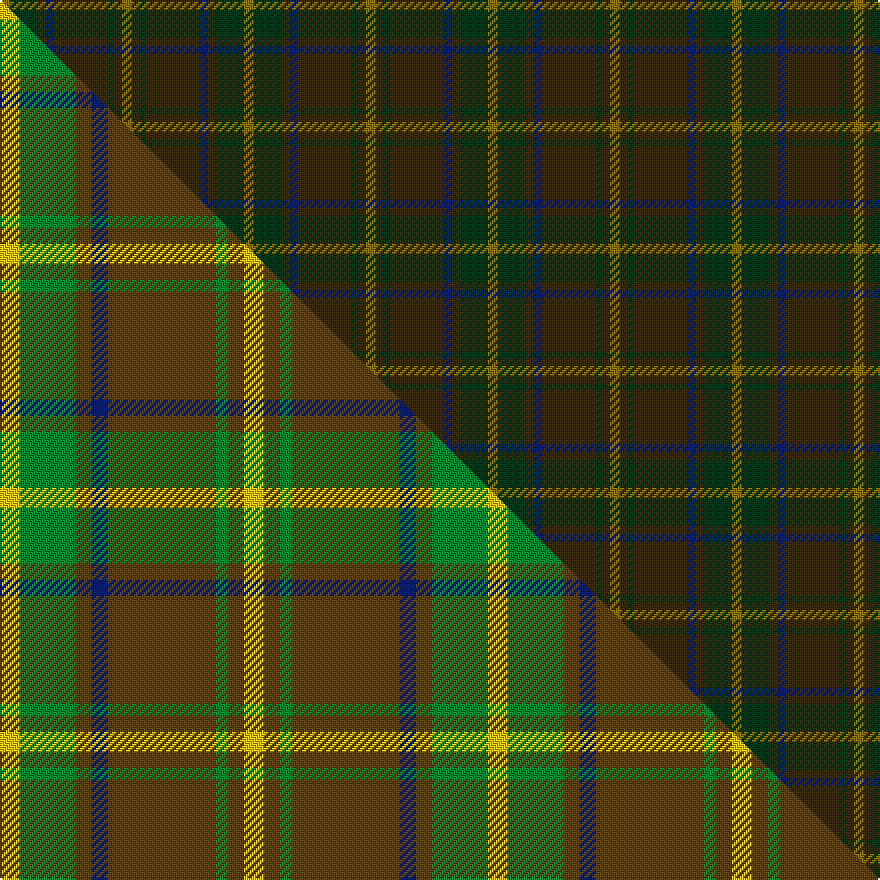

This is one **variant** — a specific cloth: this exact thread count and colourway, with its own
provenance below. It is one weaving of the [sett](/tartans/i/in/invertere-4/) (the scale-free proportion — the
same cloth at any scale or shade), whose colour order is pattern [GGGBGGGG](/stripes/gggbgggg/).

Part of the [Invertere](/tartans/i/in/invertere-4/) tartan — the named design grouping this sett with its other cloths.

Sourced from house-of-tartan.  It is a [8 stripe tartan](/stripes/stripes8/).

Original link [http://www.house-of-tartan.scotland.net/house/TartanViewjs.asp?colr=Def&tnam=1882](http://www.house-of-tartan.scotland.net/house/TartanViewjs.asp?colr=Def&tnam=1882)

## Provenance

Earliest known date: 1988 Overstripes are yellow in warp

Dataset <small>— provenance for this record, inherited from the source manifest</small>

<dl class="dataset-prov">
<dt>source</dt><dd><a href="/sources/house-of-tartan/">House of Tartan</a></dd>
<dt>data captured from</dt><dd><a href="https://github.com/thetartan/tartan-database/blob/master/data/house-of-tartan/data.csv">https://github.com/thetartan/tartan-database/blob/master/data/house-of-tartan/data.csv</a></dd>
<dt>data date</dt><dd>1988 <small>(this record)</small></dd>
<dt>licence</dt><dd><a href="https://creativecommons.org/licenses/by-nc-nd/4.0/">CC BY-NC-ND 4.0</a></dd>
</dl>

Capture chain <small>— the hands this data passed through, oldest first; each capture carries its own licence</small>

<ol class="capture-chain">
<li><a href="http://www.house-of-tartan.scotland.net/">House of Tartan</a> <small>the weaver/retailer's database — the site is now offline; the URL is kept as the ultimate source's identity</small></li>
<li><a href="https://github.com/thetartan/tartan-database">thetartan/tartan-database</a> <small>2016-2017</small> · <a href="https://creativecommons.org/licenses/by-nc-nd/4.0/">CC BY-NC-ND 4.0</a> <small>Levko Kravets's frozen compilation — the capture we vendored, and where its CC licence text came from</small></li>
<li>this dictionary <small>captured 2026-06-10 · commit 5bf86c7566</small> <small>each re-capture is a git commit to data/sources</small></li>
</ol>

## Thread count
Y/5 DG14 DY4 DB4 DY27 DG3 DY4 Y/5

One full sett is **122 threads**.

## Palette
<table><thead><tr><th>Colour</th><th>Shade</th><th>OKLCh</th></tr></thead><tbody><tr><td>DB</td><td><code style="background-color:#082077;">#082077</code> <small style="color:#888">#082077</small></td><td><small style="color:#888">oklch(30.0% 0.149 265.1)</small></td></tr><tr><td>DG</td><td><code style="background-color:#053819;">#053819</code> <small style="color:#888">#053819</small></td><td><small style="color:#888">oklch(30.0% 0.075 151.3)</small></td></tr><tr><td>DY</td><td><code style="background-color:#3A2B0D;">#3A2B0D</code> <small style="color:#888">#3A2B0D</small></td><td><small style="color:#888">oklch(30.0% 0.049 82.0)</small></td></tr><tr><td>Y</td><td><code style="background-color:#8B6E00;">#8B6E00</code> <small style="color:#888">#8B6E00</small></td><td><small style="color:#888">oklch(55.1% 0.113 90.4)</small></td></tr></tbody></table>

# Sample pattern

## Compared to the master

This cloth is one sett of its design; the master sett (the exemplar the design is anchored on) is below for comparison.

Its **ΔTartan distance** from the master is **9.82** — the same measure the nearest-tartans table ranks by (0 is identical; a re-scale of the same cloth is near 0, a recolour or a different proportion further).

<figure class="master-compare" style="margin:0">

this sett
master sett ★

<figcaption style="color:#888;font-size:smaller">One weave of this sett against the <a href="/setts/ly5g14dy4db4dy27g3dy4ly5/">master sett ★</a>, split on the diagonal: a shared proportion runs seamlessly across it with only the shades shifting; a different proportion breaks on it.</figcaption>
</figure>

## Nearest tartan variants

The nearest existing variants by ΔTartan distance, with this cloth at the top so the swatches line up against it.

ΔTartan

Threads

Variant

Sett

—

122

<a href="/variants/s8/y5dg14dy4db4dy27dg3dy4y5/">Invertere Corporate Tartan</a>

<a href="/ttd/edit/#slug=dgi4ly2dgi17dg2dr4dg2dgi3dg11dgi2~x2~dgi1603171&amp;base=y5dg14dy4db4dy27dg3dy4y5" title="compare in the TTD">2.42</a>

176

<a href="/variants/s9/dgi4ly2dgi17dg2dr4dg2dgi3dg11dgi2~x2~dgi1603171/">Armagh, County</a>

<a href="/ttd/edit/#slug=do2n4dg12n3do6t2n24do2n2dg2~x2&amp;base=y5dg14dy4db4dy27dg3dy4y5" title="compare in the TTD">3.28</a>

228

<a href="/variants/s10/do2n4dg12n3do6t2n24do2n2dg2~x2/">Wicklow Irish County Tartan</a>

<a href="/ttd/edit/#slug=n3dg1n10dg4dy10n2~x4&amp;base=y5dg14dy4db4dy27dg3dy4y5" title="compare in the TTD">3.28</a>

220

<a href="/variants/s6/n3dg1n10dg4dy10n2~x4/">Rob Roy (Film) (Corporate)</a>

<a href="/ttd/edit/#slug=dg8dr2dg2dr3dg8db12dg2dy2~x2&amp;base=y5dg14dy4db4dy27dg3dy4y5" title="compare in the TTD">3.53</a>

136

<a href="/variants/s8/dg8dr2dg2dr3dg8db12dg2dy2~x2/">Glen Nevis #1</a>

<a href="/ttd/edit/#slug=do6lg3do18dy2do2dy10g28dr2g4~x2~lg3002138-g1903114&amp;base=y5dg14dy4db4dy27dg3dy4y5" title="compare in the TTD">3.57</a>

280

<a href="/variants/s9/do6lg3do18dy2do2dy10g28dr2g4~x2~lg3002138-g1903114/">Scottish Crofting Foundation</a>

<a href="/ttd/edit/#slug=dr2lr1dg12n1dg1n1dg3n4dr3n4b2~x4~lr3103019-dg1601120&amp;base=y5dg14dy4db4dy27dg3dy4y5" title="compare in the TTD">3.70</a>

256

<a href="/variants/s11/dr2lr1dg12n1dg1n1dg3n4dr3n4b2~x4~lr3103019-dg1601120/">Tasmanian</a>

<a href="/ttd/edit/#slug=dp3n24dt10n2g11n8lb3~x2~n1900000-dt1700000&amp;base=y5dg14dy4db4dy27dg3dy4y5" title="compare in the TTD">3.72</a>

232

<a href="/variants/s7/dp3ni24n10ni2g11ni8lb3~x2~ni1900000-n1700000/">Hesco</a>

<a href="/ttd/edit/#slug=dy8n29dy8y3dy8n8y3~x2&amp;base=y5dg14dy4db4dy27dg3dy4y5" title="compare in the TTD">3.78</a>

246

<a href="/variants/s7/dy8n29dy8y3dy8n8y3~x2/">Lister (Misty Mountain)</a>

<a href="/ttd/edit/#slug=do9dy9n9r1db1dy9db1r1~x4&amp;base=y5dg14dy4db4dy27dg3dy4y5" title="compare in the TTD">3.92</a>

280

<a href="/variants/s8/do9dy9n9r1db1dy9db1r1~x4/">Jardine of Castlemilk Family Tartan</a>

<a href="/ttd/edit/#slug=r2do15dg12do2db12do2dg12do15ly2~x4~db0803284&amp;base=y5dg14dy4db4dy27dg3dy4y5" title="compare in the TTD">3.99</a>

576

<a href="/variants/s9/r2do15dg12do2dt12do2dg12do15ly2~x4~dt0803284/">Amazing Union (Personal)</a>

## Neighbour map

Every grey dot is one of 13656 variants placed by the first two principal components of the ΔTartan feature space (42% of its variance). Red is this tartan; blue dots are its nearest — click one to open its page. The map is a flat projection of a many-dimensional space — [how to read it](/posts/neighbourhood-maps/).

<svg viewBox="0 0 640 380" role="img" style="max-width:100%;height:auto;border:1px solid #e0e0e0;border-radius:4px;display:block" xmlns="http://www.w3.org/2000/svg"><image href="/nn/cloud.v1.png" width="640" height="380"/><a href="/variants/s9/dgi4ly2dgi17dg2dr4dg2dgi3dg11dgi2~x2~dgi1603171/"><circle cx="472.3" cy="270.0" r="4" fill="#3465a4"><title>Armagh, County</title></circle></a><a href="/variants/s10/do2n4dg12n3do6t2n24do2n2dg2~x2/"><circle cx="485.2" cy="233.6" r="4" fill="#3465a4"><title>Wicklow Irish County Tartan</title></circle></a><a href="/variants/s6/n3dg1n10dg4dy10n2~x4/"><circle cx="470.5" cy="308.5" r="4" fill="#3465a4"><title>Rob Roy (Film) (Corporate)</title></circle></a><a href="/variants/s8/dg8dr2dg2dr3dg8db12dg2dy2~x2/"><circle cx="445.2" cy="306.5" r="4" fill="#3465a4"><title>Glen Nevis #1</title></circle></a><a href="/variants/s9/do6lg3do18dy2do2dy10g28dr2g4~x2~lg3002138-g1903114/"><circle cx="396.4" cy="225.1" r="4" fill="#3465a4"><title>Scottish Crofting Foundation</title></circle></a><a href="/variants/s11/dr2lr1dg12n1dg1n1dg3n4dr3n4b2~x4~lr3103019-dg1601120/"><circle cx="434.5" cy="239.2" r="4" fill="#3465a4"><title>Tasmanian</title></circle></a><a href="/variants/s7/dp3ni24n10ni2g11ni8lb3~x2~ni1900000-n1700000/"><circle cx="450.8" cy="262.6" r="4" fill="#3465a4"><title>Hesco</title></circle></a><a href="/variants/s7/dy8n29dy8y3dy8n8y3~x2/"><circle cx="498.3" cy="285.0" r="4" fill="#3465a4"><title>Lister (Misty Mountain)</title></circle></a><a href="/variants/s8/do9dy9n9r1db1dy9db1r1~x4/"><circle cx="380.2" cy="258.8" r="4" fill="#3465a4"><title>Jardine of Castlemilk Family Tartan</title></circle></a><a href="/variants/s9/r2do15dg12do2dt12do2dg12do15ly2~x4~dt0803284/"><circle cx="358.7" cy="266.4" r="4" fill="#3465a4"><title>Amazing Union (Personal)</title></circle></a><circle cx="465.0" cy="270.5" r="5" fill="#c00000"/><text x="320" y="376" text-anchor="middle" font-size="11" fill="#999">ground</text><text x="11" y="190" text-anchor="middle" font-size="11" fill="#999" transform="rotate(-90 11 190)">complexity</text></svg>

ID: /variants/s8/y5dg14dy4db4dy27dg3dy4y5/
