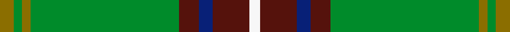

This is one **variant** — a specific cloth: this exact thread count and colourway, with its own
provenance below. It is one weaving of the [sett](/setts/y5g3y3g53dr7db5dr13w4/) (the scale-free proportion — the
same cloth at any scale or shade), whose colour order is pattern [GGGGBBBW](/stripes/ggggbbbw/).

Sourced from tartans-authority.  It is a [8 stripe tartan](/stripes/stripes8/).

Original link [https://www.tartanregister.gov.uk/tartanDetails.aspx?ref=2619](https://www.tartanregister.gov.uk/tartanDetails.aspx?ref=2619)

Dataset <small>— provenance for this record, inherited from the source manifest</small>

<dl class="dataset-prov">
<dt>source</dt><dd><a href="/sources/tartans-authority/">Scottish Tartans Authority</a></dd>
<dt>data captured from</dt><dd><a href="https://github.com/thetartan/tartan-database/blob/master/data/tartans-authority/data.csv">https://github.com/thetartan/tartan-database/blob/master/data/tartans-authority/data.csv</a></dd>
<dt>data date</dt><dd>pre 2005 <small>(this record)</small></dd>
<dt>licence</dt><dd><a href="https://creativecommons.org/licenses/by-nc-nd/4.0/">CC BY-NC-ND 4.0</a></dd>
</dl>

Capture chain <small>— the hands this data passed through, oldest first; each capture carries its own licence</small>

<ol class="capture-chain">
<li><a href="https://www.tartansauthority.com/">Scottish Tartans Authority</a> <small>the heritage body's archive — its tartan-ferret record browser is retired (links repaired to the SRT, above)</small></li>
<li><a href="https://github.com/thetartan/tartan-database">thetartan/tartan-database</a> <small>2016-2017</small> · <a href="https://creativecommons.org/licenses/by-nc-nd/4.0/">CC BY-NC-ND 4.0</a> <small>Levko Kravets's frozen compilation — the capture we vendored, and where its CC licence text came from</small></li>
<li>this dictionary <small>captured 2026-06-10 · commit 5bf86c7566</small> <small>each re-capture is a git commit to data/sources</small></li>
</ol>

## Register references

External register numbers recorded for this tartan.

- Scottish Tartans Authority (ITI): 2619

## Thread count
Y/10 G6 Y6 G106 DR14 DB10 DR26 W/8

One full sett is **354 threads**.

## Palette
<table><thead><tr><th>Colour</th><th>Shade</th><th>OKLCh</th></tr></thead><tbody><tr><td>DB</td><td><code style="background-color:#082077;">#082077</code> <small style="color:#888">#082077</small></td><td><small style="color:#888">oklch(30.0% 0.149 265.1)</small></td></tr><tr><td>DR</td><td><code style="background-color:#55120C;">#55120C</code> <small style="color:#888">#55120C</small></td><td><small style="color:#888">oklch(30.0% 0.099 29.3)</small></td></tr><tr><td>G</td><td><code style="background-color:#008B2A;">#008B2A</code> <small style="color:#888">#008B2A</small></td><td><small style="color:#888">oklch(55.4% 0.170 145.9)</small></td></tr><tr><td>W</td><td><code style="background-color:#F7F7F7;">#F7F7F7</code> <small style="color:#888">#F7F7F7</small></td><td><small style="color:#888">oklch(97.6% 0.000 89.9)</small></td></tr><tr><td>Y</td><td><code style="background-color:#8B6E00;">#8B6E00</code> <small style="color:#888">#8B6E00</small></td><td><small style="color:#888">oklch(55.1% 0.113 90.4)</small></td></tr></tbody></table>

# Sample pattern

## Nearest tartan variants

The nearest existing variants by ΔTartan distance, with this cloth at the top so the swatches line up against it.

ΔTartan

Threads

Variant

Sett

—

354

<a href="/variants/s8/y5g3y3g53dr7db5dr13w4~x2/">Hall (P.I.E.) (Personal)</a>

<a href="/ttd/edit/#slug=y3g6dg32r4y2r2dp7dg2w2~x2&amp;base=y5g3y3g53dr7db5dr13w4~x2" title="compare in the TTD">1.96</a>

230

<a href="/variants/s9/y3g6dg32r4y2r2dp7dg2w2~x2/">Pienaar (Personal)</a>

<a href="/ttd/edit/#slug=g55dbi7dr24g12db4dy3db4~x2~dbi1406275-db1404245&amp;base=y5g3y3g53dr7db5dr13w4~x2" title="compare in the TTD">2.55</a>

318

<a href="/variants/s7/g55dbi7dr24g12db4dy3db4~x2~dbi1406275-db1404245/">Crieff &amp; Strathearn #1</a>

<a href="/ttd/edit/#slug=g4r1g15t5r1w5g4r1~x4&amp;base=y5g3y3g53dr7db5dr13w4~x2" title="compare in the TTD">2.57</a>

268

<a href="/variants/s8/g4r1g15t5r1w5g4r1~x4/">McGirr (Letterkenny) David, (Pers.)</a>

<a href="/ttd/edit/#slug=g55y4db15w3dr3w5~x2&amp;base=y5g3y3g53dr7db5dr13w4~x2" title="compare in the TTD">2.81</a>

220

<a href="/variants/s6/g55y4db15w3dr3w5~x2/">Spencer (2013)</a>

<a href="/ttd/edit/#slug=g40dt10o2dt2w2dt3r8g6dt2g4w2~x2&amp;base=y5g3y3g53dr7db5dr13w4~x2" title="compare in the TTD">2.91</a>

240

<a href="/variants/s11/g40dt10o2dt2w2dt3r8g6dt2g4w2~x2/">Cavalier, Green</a>

<a href="/ttd/edit/#slug=y2dr6g1dg2g12lb1g1lb2~x4&amp;base=y5g3y3g53dr7db5dr13w4~x2" title="compare in the TTD">2.92</a>

200

<a href="/variants/s8/y2dr6g1dg2g12lb1g1lb2~x4/">Manitoba District Tartan</a>

<a href="/ttd/edit/#slug=g10r3g30n10w2db15r4~x2&amp;base=y5g3y3g53dr7db5dr13w4~x2" title="compare in the TTD">2.94</a>

268

<a href="/variants/s7/g10r3g30n10w2db15r4~x2/">Sinclair</a>

<a href="/ttd/edit/#slug=dr4db15w2n15g30dr2g4~x2&amp;base=y5g3y3g53dr7db5dr13w4~x2" title="compare in the TTD">2.97</a>

272

<a href="/variants/s7/dr4db15w2n15g30dr2g4~x2/">Sinclair Green (Personal)</a>

<a href="/ttd/edit/#slug=g55y4db15w3r3w5~x2&amp;base=y5g3y3g53dr7db5dr13w4~x2" title="compare in the TTD">3.00</a>

220

<a href="/variants/s6/g55y4db15w3r3w5~x2/">Spencer (2013)</a>

<a href="/ttd/edit/#slug=g55dp7r24g12db4y3db4~x2&amp;base=y5g3y3g53dr7db5dr13w4~x2" title="compare in the TTD">3.00</a>

318

<a href="/variants/s7/g55dp7r24g12db4y3db4~x2/">Crieff and Strathearn District Tartan</a>

## Neighbour map

Every grey dot is one of 13621 variants placed by the first two principal components of the ΔTartan feature space (42% of its variance). Red is this tartan; blue dots are its nearest — click one to open its page.

<svg viewBox="0 0 640 380" role="img" style="max-width:100%;height:auto;border:1px solid #e0e0e0;border-radius:4px;display:block" xmlns="http://www.w3.org/2000/svg"><image href="/nn/cloud.v1.png" width="640" height="380"/><a href="/variants/s9/y3g6dg32r4y2r2dp7dg2w2~x2/"><circle cx="309.8" cy="124.9" r="4" fill="#3465a4"><title>Pienaar (Personal)</title></circle></a><a href="/variants/s7/g55dbi7dr24g12db4dy3db4~x2~dbi1406275-db1404245/"><circle cx="404.5" cy="183.7" r="4" fill="#3465a4"><title>Crieff &amp; Strathearn #1</title></circle></a><a href="/variants/s8/g4r1g15t5r1w5g4r1~x4/"><circle cx="369.6" cy="190.8" r="4" fill="#3465a4"><title>McGirr (Letterkenny) David, (Pers.)</title></circle></a><a href="/variants/s6/g55y4db15w3dr3w5~x2/"><circle cx="390.6" cy="164.6" r="4" fill="#3465a4"><title>Spencer (2013)</title></circle></a><a href="/variants/s11/g40dt10o2dt2w2dt3r8g6dt2g4w2~x2/"><circle cx="366.3" cy="123.2" r="4" fill="#3465a4"><title>Cavalier, Green</title></circle></a><a href="/variants/s8/y2dr6g1dg2g12lb1g1lb2~x4/"><circle cx="305.5" cy="192.2" r="4" fill="#3465a4"><title>Manitoba District Tartan</title></circle></a><a href="/variants/s7/g10r3g30n10w2db15r4~x2/"><circle cx="289.7" cy="189.5" r="4" fill="#3465a4"><title>Sinclair</title></circle></a><a href="/variants/s7/dr4db15w2n15g30dr2g4~x2/"><circle cx="294.0" cy="204.5" r="4" fill="#3465a4"><title>Sinclair Green (Personal)</title></circle></a><a href="/variants/s6/g55y4db15w3r3w5~x2/"><circle cx="379.9" cy="157.0" r="4" fill="#3465a4"><title>Spencer (2013)</title></circle></a><a href="/variants/s7/g55dp7r24g12db4y3db4~x2/"><circle cx="364.6" cy="159.3" r="4" fill="#3465a4"><title>Crieff and Strathearn District Tartan</title></circle></a><circle cx="379.0" cy="157.2" r="5" fill="#c00000"/><text x="320" y="376" text-anchor="middle" font-size="11" fill="#999">ground</text><text x="11" y="190" text-anchor="middle" font-size="11" fill="#999" transform="rotate(-90 11 190)">complexity</text></svg>

ID: /variants/s8/y5g3y3g53dr7db5dr13w4~x2/
