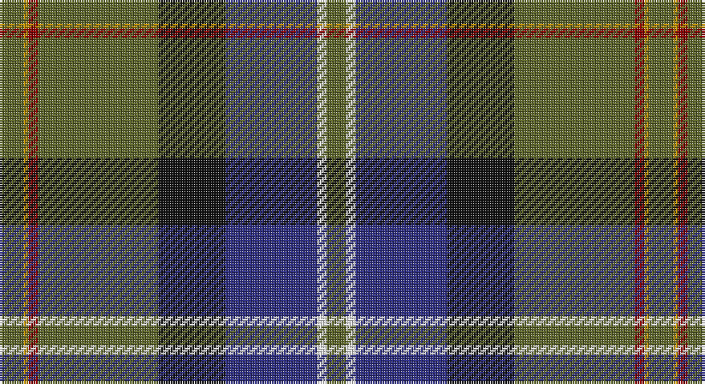

This page is one **sett** — a single exact thread-count. It belongs to the [tartan](/setts/y5lo1r2y25k14db19w2y4/)
(the same proportion at any scale), whose colour order is pattern [GWBKGRYG](/stripes/gwbkgryg/).

Part of the [Tooth](/tartans/tooth/) tartan — the named design grouping this sett with its other cloths.

Sourced from register-of-tartans.  It is a [8 stripe tartan](/stripes/stripes8/).

Original link https://www.tartanregister.gov.uk/tartanDetails.aspx?ref=4138

2 attestations — the source records this cloth was collapsed from (oldest owns this page)

<ul>
<li>01/01/1980 — Tooth (Personal) (register-of-tartans, <a href="https://www.tartanregister.gov.uk/tartanDetails.aspx?ref=4138">record</a>)</li>
<li>pre 1980 — Tooth (Personal) (tartans-authority, <a href="http://www.tartansauthority.com/tartan-ferret/display/922/">record</a>)</li>
</ul>

## Register references

External register numbers recorded for this tartan.

- Scottish Register of Tartans: [4138](https://www.tartanregister.gov.uk/tartanDetails.aspx?ref=4138)
- Scottish Tartans Authority (ITI): 922
- Scottish Tartans World Register: 922

## Thread count
G/10 DY2 DR4 G50 K28 DB38 W4 G/8

One full sett is **270 threads**.

## Palette

Palette: <strong>Tartan Register</strong>
<table><thead><tr><th>Colour</th><th>Threads</th><th>Shade</th><th>Base</th><th>OKLCh</th></tr></thead><tbody><tr><td>G/</td><td style="text-align:right;font-variant-numeric:tabular-nums">10</td><td><code style="background-color:#5C6428;">#5C6428</code> <small style="color:#888">#5C6428</small></td><td>G <code style="background-color:#006100;">#006100</code></td><td><small style="color:#888">oklch(48.3% 0.084 116.0)</small></td></tr><tr><td>DY</td><td style="text-align:right;font-variant-numeric:tabular-nums">2</td><td><code style="background-color:#BC8C00;">#BC8C00</code> <small style="color:#888">#BC8C00</small></td><td>Y <code style="background-color:#F2BF00;">#F2BF00</code></td><td><small style="color:#888">oklch(66.8% 0.137 84.1)</small></td></tr><tr><td>DR</td><td style="text-align:right;font-variant-numeric:tabular-nums">4</td><td><code style="background-color:#880000;">#880000</code> <small style="color:#888">#880000</small></td><td>R <code style="background-color:#CC0000;">#CC0000</code></td><td><small style="color:#888">oklch(39.4% 0.162 29.2)</small></td></tr><tr><td>G</td><td style="text-align:right;font-variant-numeric:tabular-nums">50</td><td><code style="background-color:#5C6428;">#5C6428</code> <small style="color:#888">#5C6428</small></td><td>G <code style="background-color:#006100;">#006100</code></td><td><small style="color:#888">oklch(48.3% 0.084 116.0)</small></td></tr><tr><td>K</td><td style="text-align:right;font-variant-numeric:tabular-nums">28</td><td><code style="background-color:#101010;">#101010</code> <small style="color:#888">#101010</small></td><td>K <code style="background-color:#000000;">#000000</code></td><td><small style="color:#888">oklch(17.3% 0.000 89.9)</small></td></tr><tr><td>DB</td><td style="text-align:right;font-variant-numeric:tabular-nums">38</td><td><code style="background-color:#2C2C80;">#2C2C80</code> <small style="color:#888">#2C2C80</small></td><td>B <code style="background-color:#2A418A;">#2A418A</code></td><td><small style="color:#888">oklch(35.0% 0.138 276.6)</small></td></tr><tr><td>W</td><td style="text-align:right;font-variant-numeric:tabular-nums">4</td><td><code style="background-color:#F8F8F8;">#F8F8F8</code> <small style="color:#888">#F8F8F8</small></td><td>W <code style="background-color:#F7F7F7;">#F7F7F7</code></td><td><small style="color:#888">oklch(97.9% 0.000 89.9)</small></td></tr><tr><td>G/</td><td style="text-align:right;font-variant-numeric:tabular-nums">8</td><td><code style="background-color:#5C6428;">#5C6428</code> <small style="color:#888">#5C6428</small></td><td>G <code style="background-color:#006100;">#006100</code></td><td><small style="color:#888">oklch(48.3% 0.084 116.0)</small></td></tr></tbody></table>

# Sample pattern

## Nearest tartans

The nearest existing variants by ΔTartan distance, with this tartan at the top so the swatches line up against it.

ΔTartan

Tartan

Sett

—

<a href="/ttd/edit/#slug=y5lo1r2y25k14db19w2y4~x2">Tooth (Personal)</a> <a class="nn-out" href="/variants/s8/y5lo1r2y25k14db19w2y4~x2/" title="open its dictionary page">↗</a>

0.74

<a href="/ttd/edit/#slug=lo2dg20db8dp3db2dp2db16w1lg2~x2&amp;base=y5lo1r2y25k14db19w2y4~x2">Scotland’s Golf Coast</a> <a class="nn-out" href="/variants/s9/lo2dg20db8dp3db2dp2db16w1lg2~x2/" title="open its dictionary page">↗</a>

0.99

<a href="/ttd/edit/#slug=r3y13db13ly2dg34w3~x2&amp;base=y5lo1r2y25k14db19w2y4~x2">Glencross, Tynron (Name)</a> <a class="nn-out" href="/variants/s6/r3y13db13ly2dg34w3~x2/" title="open its dictionary page">↗</a>

0.99

<a href="/ttd/edit/#slug=db3t3g30db25dp4r3ly2dp1~x2&amp;base=y5lo1r2y25k14db19w2y4~x2">Young</a> <a class="nn-out" href="/variants/s8/db3t3g30db25dp4r3ly2dp1~x2/" title="open its dictionary page">↗</a>

0.99

<a href="/ttd/edit/#slug=g4r2g20db8k8db4lb1lo2k1~x2&amp;base=y5lo1r2y25k14db19w2y4~x2">Dodd of Branford</a> <a class="nn-out" href="/variants/s9/g4r2g20db8k8db4lb1lo2k1~x2/" title="open its dictionary page">↗</a>

1.01

<a href="/ttd/edit/#slug=dt11dti6dg25r1w2lo1dt25dti5w7~x2&amp;base=y5lo1r2y25k14db19w2y4~x2">Army Ranger</a> <a class="nn-out" href="/variants/s9/dt11dti6dg25r1w2lo1dt25dti5w7~x2/" title="open its dictionary page">↗</a>

1.08

<a href="/ttd/edit/#slug=r4lb1y6g25k8db15lb2~x2&amp;base=y5lo1r2y25k14db19w2y4~x2">Jones (Name)</a> <a class="nn-out" href="/variants/s7/r4lb1y6g25k8db15lb2~x2/" title="open its dictionary page">↗</a>

1.09

<a href="/ttd/edit/#slug=o11k66y32dg11y10db6y10r4&amp;base=y5lo1r2y25k14db19w2y4~x2">Turnbull, Dress Bruce (Personal)</a> <a class="nn-out" href="/variants/s8/o11k66y32dg11y10db6y10r4/" title="open its dictionary page">↗</a>

1.10

<a href="/ttd/edit/#slug=w1dt16lo1r3lo1dg6y2dg6w1~x2&amp;base=y5lo1r2y25k14db19w2y4~x2">Kleto, Susan (Personal)</a> <a class="nn-out" href="/variants/s9/w1dt16lo1r3lo1dg6y2dg6w1~x2/" title="open its dictionary page">↗</a>

1.12

<a href="/ttd/edit/#slug=lo3k2o15k10dt23r2dt1w2~x2&amp;base=y5lo1r2y25k14db19w2y4~x2">Vienna Highlander (Fashion)</a> <a class="nn-out" href="/variants/s8/lo3k2o15k10dt23r2dt1w2~x2/" title="open its dictionary page">↗</a>

1.13

<a href="/ttd/edit/#slug=w1k6b9r12k12g32k6ly1~x2&amp;base=y5lo1r2y25k14db19w2y4~x2">McGeachie (Personal)</a> <a class="nn-out" href="/variants/s8/w1k6b9r12k12g32k6ly1~x2/" title="open its dictionary page">↗</a>

## Neighbour map

Every grey dot is one of 14360 variants placed by the first two principal components of the ΔTartan feature space (44% of its variance). Red is this tartan; blue dots are its nearest — click one to open its page.

<svg viewBox="0 0 640 380" role="img" style="max-width:100%;height:auto;border:1px solid #e0e0e0;border-radius:4px;display:block" xmlns="http://www.w3.org/2000/svg"><image href="/nn/cloud.v1.png" width="640" height="380"/><a href="/variants/s9/lo2dg20db8dp3db2dp2db16w1lg2~x2/"><circle cx="258.4" cy="136.2" r="4" fill="#3465a4"><title>Scotland’s Golf Coast</title></circle></a><a href="/variants/s6/r3y13db13ly2dg34w3~x2/"><circle cx="259.2" cy="165.3" r="4" fill="#3465a4"><title>Glencross, Tynron (Name)</title></circle></a><a href="/variants/s8/db3t3g30db25dp4r3ly2dp1~x2/"><circle cx="268.4" cy="117.6" r="4" fill="#3465a4"><title>Young</title></circle></a><a href="/variants/s9/g4r2g20db8k8db4lb1lo2k1~x2/"><circle cx="240.2" cy="136.7" r="4" fill="#3465a4"><title>Dodd of Branford</title></circle></a><a href="/variants/s9/dt11dti6dg25r1w2lo1dt25dti5w7~x2/"><circle cx="228.6" cy="135.6" r="4" fill="#3465a4"><title>Army Ranger</title></circle></a><a href="/variants/s7/r4lb1y6g25k8db15lb2~x2/"><circle cx="209.4" cy="147.6" r="4" fill="#3465a4"><title>Jones (Name)</title></circle></a><a href="/variants/s8/o11k66y32dg11y10db6y10r4/"><circle cx="218.5" cy="134.3" r="4" fill="#3465a4"><title>Turnbull, Dress Bruce (Personal)</title></circle></a><a href="/variants/s9/w1dt16lo1r3lo1dg6y2dg6w1~x2/"><circle cx="218.2" cy="135.4" r="4" fill="#3465a4"><title>Kleto, Susan (Personal)</title></circle></a><a href="/variants/s8/lo3k2o15k10dt23r2dt1w2~x2/"><circle cx="201.4" cy="119.9" r="4" fill="#3465a4"><title>Vienna Highlander (Fashion)</title></circle></a><a href="/variants/s8/w1k6b9r12k12g32k6ly1~x2/"><circle cx="211.7" cy="120.3" r="4" fill="#3465a4"><title>McGeachie (Personal)</title></circle></a><circle cx="257.3" cy="138.0" r="5" fill="#c00000"/></svg>

ID: /variants/s8/y5lo1r2y25k14db19w2y4~x2/
