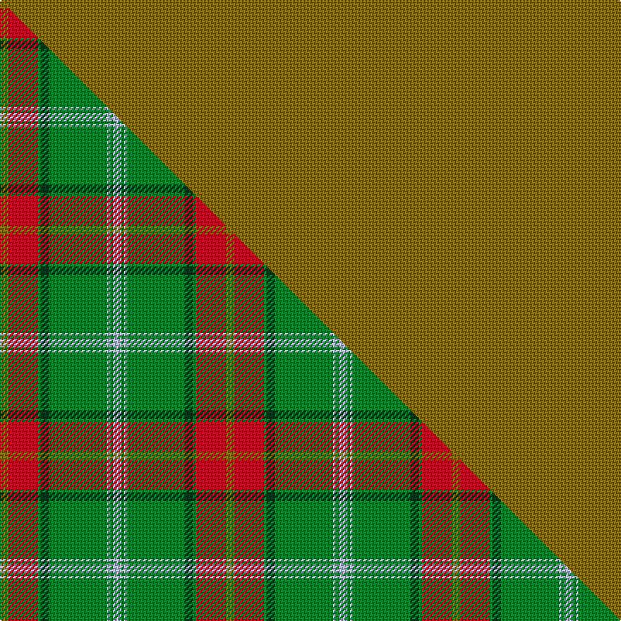

This page is one **sett** — a single exact thread-count. It belongs to the [tartan](/setts/y622r21g2dg6g41lb2g2lb6/)
(the same proportion at any scale), whose colour order is pattern [GRGGGWGW](/stripes/grgggwgw/).

Part of the [Manitoba](/tartans/manitoba/) tartan — the named design grouping this sett with its other cloths.

Sourced from house-of-tartan.  It is a [8 stripe tartan](/stripes/stripes8/).

Original link http://www.house-of-tartan.scotland.net/house/TartanViewjs.asp?colr=Def&tnam=145

## Provenance

Earliest known date: 1962 A slight modification of the original sett.

## Thread count
Y/622 R21 G2 DG6 G41 LB2 G2 LB/6

One full sett is **776 threads**.

## Palette
<table><thead><tr><th>Colour</th><th>Shade</th><th>OKLCh</th></tr></thead><tbody><tr><td>LB</td><td><code style="background-color:#B5BBDE;">#B5BBDE</code> <small style="color:#888">#B5BBDE</small></td><td><small style="color:#888">oklch(79.9% 0.050 277.6)</small></td></tr><tr><td>DG</td><td><code style="background-color:#053819;">#053819</code> <small style="color:#888">#053819</small></td><td><small style="color:#888">oklch(30.0% 0.075 151.3)</small></td></tr><tr><td>G</td><td><code style="background-color:#008B2A;">#008B2A</code> <small style="color:#888">#008B2A</small></td><td><small style="color:#888">oklch(55.4% 0.170 145.9)</small></td></tr><tr><td>R</td><td><code style="background-color:#D60020;">#D60020</code> <small style="color:#888">#D60020</small></td><td><small style="color:#888">oklch(55.2% 0.224 25.5)</small></td></tr><tr><td>Y</td><td><code style="background-color:#8B6E00;">#8B6E00</code> <small style="color:#888">#8B6E00</small></td><td><small style="color:#888">oklch(55.1% 0.113 90.4)</small></td></tr></tbody></table>

# Sample pattern

## Compared to the master

This cloth is one sett of its design; the master sett (the exemplar the design is anchored on) is below for comparison.

Its **ΔTartan distance** from the master is **0.47** — the same measure the nearest-tartans table ranks by (0 is identical; a re-scale of the same cloth is near 0, a recolour or a different proportion further).

<figure class="master-compare" style="margin:0">

this sett
master sett ★

<figcaption style="color:#888;font-size:smaller">One weave of this sett against the <a href="/setts/y6r21g2dg6g41lb2g2lb6/">master sett ★</a>, split on the diagonal: a shared proportion runs seamlessly across it with only the shades shifting; a different proportion breaks on it.</figcaption>
</figure>

## Nearest tartan variants

The nearest existing variants by ΔTartan distance, with this cloth at the top so the swatches line up against it.

ΔTartan

Threads

Variant

Sett

—

776

<a href="/variants/s8/y622r21g2dg6g41lb2g2lb6/">Manitoba District Tartan</a>

<a href="/ttd/edit/#slug=r1y60t1~x2&amp;base=y622r21g2dg6g41lb2g2lb6" title="compare in the TTD">2.13</a>

244

<a href="/variants/s3/r1y60t1~x2/">Nutwood</a>

<a href="/ttd/edit/#slug=dy45lb2r4y1dp2n2~x4&amp;base=y622r21g2dg6g41lb2g2lb6" title="compare in the TTD">3.31</a>

260

<a href="/variants/s6/dy45lb2r4y1dp2n2~x4/">Windy Meadows (Fashion)</a>

<a href="/ttd/edit/#slug=o81dg6ly8dg8~x2~o2503076-ly2705081&amp;base=y622r21g2dg6g41lb2g2lb6" title="compare in the TTD">3.39</a>

234

<a href="/variants/s4/ly81dg6lyi8dg8~x2~ly2503076-lyi2705081/">Young in Australia (Name)</a>

<a href="/ttd/edit/#slug=db5dy1dg7dr1db45dr5dy3db4dy3~x2&amp;base=y622r21g2dg6g41lb2g2lb6" title="compare in the TTD">3.96</a>

280

<a href="/variants/s9/db5dy1dg7dr1db45dr5dy3db4dy3~x2/">Brooks Brothers Signature</a>

<a href="/ttd/edit/#slug=db1dy9db2dy9r1~x4&amp;base=y622r21g2dg6g41lb2g2lb6" title="compare in the TTD">3.98</a>

168

<a href="/variants/s5/db1dy9db2dy9r1~x4/">Brooks Brothers Tattersall Camel</a>

## Neighbour map

Every grey dot is one of 13620 variants placed by the first two principal components of the ΔTartan feature space (42% of its variance). Red is this tartan; blue dots are its nearest — click one to open its page.

<svg viewBox="0 0 640 380" role="img" style="max-width:100%;height:auto;border:1px solid #e0e0e0;border-radius:4px;display:block" xmlns="http://www.w3.org/2000/svg"><image href="/nn/cloud.v1.png" width="640" height="380"/><a href="/variants/s3/r1y60t1~x2/"><circle cx="626.0" cy="245.1" r="4" fill="#3465a4"><title>Nutwood</title></circle></a><a href="/variants/s6/dy45lb2r4y1dp2n2~x4/"><circle cx="593.2" cy="94.4" r="4" fill="#3465a4"><title>Windy Meadows (Fashion)</title></circle></a><a href="/variants/s4/ly81dg6lyi8dg8~x2~ly2503076-lyi2705081/"><circle cx="626.0" cy="249.3" r="4" fill="#3465a4"><title>Young in Australia (Name)</title></circle></a><a href="/variants/s9/db5dy1dg7dr1db45dr5dy3db4dy3~x2/"><circle cx="626.0" cy="166.2" r="4" fill="#3465a4"><title>Brooks Brothers Signature</title></circle></a><a href="/variants/s5/db1dy9db2dy9r1~x4/"><circle cx="626.0" cy="273.6" r="4" fill="#3465a4"><title>Brooks Brothers Tattersall Camel</title></circle></a><circle cx="626.0" cy="129.7" r="5" fill="#c00000"/><text x="320" y="376" text-anchor="middle" font-size="11" fill="#999">ground</text><text x="11" y="190" text-anchor="middle" font-size="11" fill="#999" transform="rotate(-90 11 190)">complexity</text></svg>

ID: /variants/s8/y622r21g2dg6g41lb2g2lb6/
