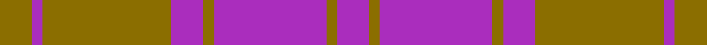

This page is one **sett** — a single exact thread-count. It belongs to the [tartan](/setts/y6p2y24p6y2p21y2p6/)
(the same proportion at any scale), whose colour order is pattern [BGBGBGBG](/stripes/bgbgbgbg/).

Sourced from register-of-tartans.  It is a [8 stripe tartan](/stripes/stripes8/).

Original link https://www.tartanregister.gov.uk/tartanDetails.aspx?ref=2586

## Register references

External register numbers recorded for this tartan.

- Scottish Register of Tartans: [2586](https://www.tartanregister.gov.uk/tartanDetails.aspx?ref=2586)
- Scottish Tartans Authority (ITI): 6272

## Thread count
Y/12 P4 Y48 P12 Y4 P42 Y4 P/12

One full sett is **252 threads**.

## Palette
<table><thead><tr><th>Colour</th><th>Shade</th><th>OKLCh</th></tr></thead><tbody><tr><td>P</td><td><code style="background-color:#AA2DBD;">#AA2DBD</code> <small style="color:#888">#AA2DBD</small></td><td><small style="color:#888">oklch(55.0% 0.225 322.0)</small></td></tr><tr><td>Y</td><td><code style="background-color:#8B6E00;">#8B6E00</code> <small style="color:#888">#8B6E00</small></td><td><small style="color:#888">oklch(55.1% 0.113 90.4)</small></td></tr></tbody></table>

# Sample pattern

## Nearest tartan variants

The nearest existing variants by ΔTartan distance, with this cloth at the top so the swatches line up against it.

ΔTartan

Threads

Variant

Sett

—

252

<a href="/variants/s8/y6p2y24p6y2p21y2p6~x2/">MacLachlan (Chief's Dress) Blue</a>

<a href="/ttd/edit/#slug=dp6o2dp29o29dp2o6~x2&amp;base=y6p2y24p6y2p21y2p6~x2" title="compare in the TTD">3.79</a>

272

<a href="/variants/s6/dp6o2dp29o29dp2o6~x2/">Harmony, 11</a>

<a href="/ttd/edit/#slug=b10r24b4r3b24w2r6b6~x2&amp;base=y6p2y24p6y2p21y2p6~x2" title="compare in the TTD">3.80</a>

284

<a href="/variants/s8/b10r24b4r3b24w2r6b6~x2/">Embrace, The</a>

<a href="/ttd/edit/#slug=r1b14r1b1r14b1w1~x2&amp;base=y6p2y24p6y2p21y2p6~x2" title="compare in the TTD">3.99</a>

128

<a href="/variants/s7/r1b14r1b1r14b1w1~x2/">MacKintosh, Fragment</a>

## Neighbour map

Every grey dot is one of 13620 variants placed by the first two principal components of the ΔTartan feature space (42% of its variance). Red is this tartan; blue dots are its nearest — click one to open its page.

<svg viewBox="0 0 640 380" role="img" style="max-width:100%;height:auto;border:1px solid #e0e0e0;border-radius:4px;display:block" xmlns="http://www.w3.org/2000/svg"><image href="/nn/cloud.v1.png" width="640" height="380"/><a href="/variants/s6/dp6o2dp29o29dp2o6~x2/"><circle cx="432.7" cy="227.3" r="4" fill="#3465a4"><title>Harmony, 11</title></circle></a><a href="/variants/s8/b10r24b4r3b24w2r6b6~x2/"><circle cx="386.1" cy="212.0" r="4" fill="#3465a4"><title>Embrace, The</title></circle></a><a href="/variants/s7/r1b14r1b1r14b1w1~x2/"><circle cx="387.4" cy="183.9" r="4" fill="#3465a4"><title>MacKintosh, Fragment</title></circle></a><circle cx="442.6" cy="238.4" r="5" fill="#c00000"/><text x="320" y="376" text-anchor="middle" font-size="11" fill="#999">ground</text><text x="11" y="190" text-anchor="middle" font-size="11" fill="#999" transform="rotate(-90 11 190)">complexity</text></svg>

ID: /variants/s8/y6p2y24p6y2p21y2p6~x2/
