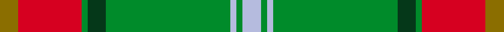

This page is one **sett** — a single exact thread-count. It belongs to the [tartan](/setts/y6r21g2dg6g41lb2g2lb6/)
(the same proportion at any scale), whose colour order is pattern [GRGGGWGW](/stripes/grgggwgw/).

Part of the [Manitoba](/tartans/manitoba/) tartan — the named design grouping this sett with its other cloths.

Sourced from register-of-tartans.  It is a [8 stripe tartan](/stripes/stripes8/).

Original link https://www.tartanregister.gov.uk/tartanDetails.aspx?ref=2805

## Register references

External register numbers recorded for this tartan.

- Scottish Register of Tartans: [2805](https://www.tartanregister.gov.uk/tartanDetails.aspx?ref=2805)
- Scottish Tartans World Register: 145

## Thread count
Y/6 R21 G2 DG6 G41 LB2 G2 LB/6

One full sett is **160 threads**.

## Palette
<table><thead><tr><th>Colour</th><th>Shade</th><th>OKLCh</th></tr></thead><tbody><tr><td>LB</td><td><code style="background-color:#B5BBDE;">#B5BBDE</code> <small style="color:#888">#B5BBDE</small></td><td><small style="color:#888">oklch(79.9% 0.050 277.6)</small></td></tr><tr><td>DG</td><td><code style="background-color:#053819;">#053819</code> <small style="color:#888">#053819</small></td><td><small style="color:#888">oklch(30.0% 0.075 151.3)</small></td></tr><tr><td>G</td><td><code style="background-color:#008B2A;">#008B2A</code> <small style="color:#888">#008B2A</small></td><td><small style="color:#888">oklch(55.4% 0.170 145.9)</small></td></tr><tr><td>R</td><td><code style="background-color:#D60020;">#D60020</code> <small style="color:#888">#D60020</small></td><td><small style="color:#888">oklch(55.2% 0.224 25.5)</small></td></tr><tr><td>Y</td><td><code style="background-color:#8B6E00;">#8B6E00</code> <small style="color:#888">#8B6E00</small></td><td><small style="color:#888">oklch(55.1% 0.113 90.4)</small></td></tr></tbody></table>

# Sample pattern

## Nearest tartan variants

The nearest existing variants by ΔTartan distance, with this cloth at the top so the swatches line up against it.

ΔTartan

Threads

Variant

Sett

—

160

<a href="/variants/s8/y6r21g2dg6g41lb2g2lb6/">Manitoba</a>

<a href="/ttd/edit/#slug=y2dr6g1dg2g12lb1g1lb2~x4&amp;base=y6r21g2dg6g41lb2g2lb6" title="compare in the TTD">0.52</a>

200

<a href="/variants/s8/y2dr6g1dg2g12lb1g1lb2~x4/">Manitoba</a>

<a href="/ttd/edit/#slug=y2r6g1ri2g12lb1g1lb2~x2~r1707016-ri2209032&amp;base=y6r21g2dg6g41lb2g2lb6" title="compare in the TTD">1.92</a>

100

<a href="/variants/s8/y2r6g1ri2g12lb1g1lb2~x2~r1707016-ri2209032/">Manitoba Red</a>

<a href="/ttd/edit/#slug=y2r6g1ri2g12lb1g1lb2~x2~r1707016-ri2008029&amp;base=y6r21g2dg6g41lb2g2lb6" title="compare in the TTD">1.95</a>

100

<a href="/variants/s8/y2r6g1ri2g12lb1g1lb2~x2~r1707016-ri2008029/">Manitoba</a>

<a href="/ttd/edit/#slug=y2r6g1ri2g12lb1g1lb2~x2~r1807008-ri2109032&amp;base=y6r21g2dg6g41lb2g2lb6" title="compare in the TTD">2.03</a>

100

<a href="/variants/s8/y2r6g1ri2g12lb1g1lb2~x2~r1807008-ri2109032/">Manitoba District Tartan</a>

<a href="/ttd/edit/#slug=o6w1o24db6g2db1g2db1g12r1~x2&amp;base=y6r21g2dg6g41lb2g2lb6" title="compare in the TTD">2.14</a>

210

<a href="/variants/s10/o6w1o24db6g2db1g2db1g12r1~x2/">Chisholm hunting</a>

<a href="/ttd/edit/#slug=r4db10g2db2g24o2g2o16g2w1~x2&amp;base=y6r21g2dg6g41lb2g2lb6" title="compare in the TTD">2.16</a>

250

<a href="/variants/s10/r4db10g2db2g24o2g2o16g2w1~x2/">Kinfauns Castle</a>

<a href="/ttd/edit/#slug=g4n4g2ly36n14ly2lb4g7r5ly3~x2&amp;base=y6r21g2dg6g41lb2g2lb6" title="compare in the TTD">2.44</a>

310

<a href="/variants/s10/g4n4g2ly36n14ly2lb4g7r5ly3~x2/">Rikaco Eve (Fashion)</a>

<a href="/ttd/edit/#slug=g15y3g27r2g2r33t2w1t4~x2&amp;base=y6r21g2dg6g41lb2g2lb6" title="compare in the TTD">2.47</a>

318

<a href="/variants/s9/g15y3g27r2g2r33t2w1t4~x2/">Longmore (Name)</a>

<a href="/ttd/edit/#slug=r2w2y27g14y2db14y2~x2&amp;base=y6r21g2dg6g41lb2g2lb6" title="compare in the TTD">2.50</a>

244

<a href="/variants/s7/r2w2y27g14y2db14y2~x2/">Fraser Yellow</a>

<a href="/ttd/edit/#slug=g55dp7r24g12db4y3db4~x2&amp;base=y6r21g2dg6g41lb2g2lb6" title="compare in the TTD">2.68</a>

318

<a href="/variants/s7/g55dp7r24g12db4y3db4~x2/">Crieff, and Strathearn</a>

## Neighbour map

Every grey dot is one of 13620 variants placed by the first two principal components of the ΔTartan feature space (42% of its variance). Red is this tartan; blue dots are its nearest — click one to open its page.

<svg viewBox="0 0 640 380" role="img" style="max-width:100%;height:auto;border:1px solid #e0e0e0;border-radius:4px;display:block" xmlns="http://www.w3.org/2000/svg"><image href="/nn/cloud.v1.png" width="640" height="380"/><a href="/variants/s8/y2dr6g1dg2g12lb1g1lb2~x4/"><circle cx="305.4" cy="192.0" r="4" fill="#3465a4"><title>Manitoba</title></circle></a><a href="/variants/s8/y2r6g1ri2g12lb1g1lb2~x2~r1707016-ri2209032/"><circle cx="296.8" cy="178.3" r="4" fill="#3465a4"><title>Manitoba Red</title></circle></a><a href="/variants/s8/y2r6g1ri2g12lb1g1lb2~x2~r1707016-ri2008029/"><circle cx="296.6" cy="178.5" r="4" fill="#3465a4"><title>Manitoba</title></circle></a><a href="/variants/s8/y2r6g1ri2g12lb1g1lb2~x2~r1807008-ri2109032/"><circle cx="296.2" cy="177.8" r="4" fill="#3465a4"><title>Manitoba District Tartan</title></circle></a><a href="/variants/s10/o6w1o24db6g2db1g2db1g12r1~x2/"><circle cx="352.9" cy="132.5" r="4" fill="#3465a4"><title>Chisholm hunting</title></circle></a><a href="/variants/s10/r4db10g2db2g24o2g2o16g2w1~x2/"><circle cx="287.9" cy="140.6" r="4" fill="#3465a4"><title>Kinfauns Castle</title></circle></a><a href="/variants/s10/g4n4g2ly36n14ly2lb4g7r5ly3~x2/"><circle cx="315.5" cy="150.1" r="4" fill="#3465a4"><title>Rikaco Eve (Fashion)</title></circle></a><a href="/variants/s9/g15y3g27r2g2r33t2w1t4~x2/"><circle cx="348.0" cy="128.6" r="4" fill="#3465a4"><title>Longmore (Name)</title></circle></a><a href="/variants/s7/r2w2y27g14y2db14y2~x2/"><circle cx="288.1" cy="184.1" r="4" fill="#3465a4"><title>Fraser Yellow</title></circle></a><a href="/variants/s7/g55dp7r24g12db4y3db4~x2/"><circle cx="364.6" cy="159.1" r="4" fill="#3465a4"><title>Crieff, and Strathearn</title></circle></a><circle cx="321.4" cy="150.5" r="5" fill="#c00000"/><text x="320" y="376" text-anchor="middle" font-size="11" fill="#999">ground</text><text x="11" y="190" text-anchor="middle" font-size="11" fill="#999" transform="rotate(-90 11 190)">complexity</text></svg>

ID: /variants/s8/y6r21g2dg6g41lb2g2lb6/
