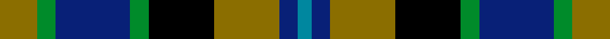

This page is one **sett** — a single exact thread-count. It belongs to the [tartan](/setts/y8g4db16g4k14y14db4t3/)
(the same proportion at any scale), whose colour order is pattern [BBGKGBGG](/stripes/bbgkgbgg/).

Sourced from tartans-authority.  It is a [8 stripe tartan](/stripes/stripes8/).

Original link http://www.tartansauthority.com/tartan-ferret/display/5200/

## Register references

External register numbers recorded for this tartan.

- Scottish Tartans Authority (ITI): 5200

## Thread count
Y/16 G8 DB32 G8 K28 Y28 DB8 T/6

One full sett is **246 threads**.

## Palette
<table><thead><tr><th>Colour</th><th>Shade</th><th>OKLCh</th></tr></thead><tbody><tr><td>B</td><td><code style="background-color:#00879F;">#00879F</code> <small style="color:#888">#00879F</small></td><td><small style="color:#888">oklch(57.4% 0.102 216.1)</small></td></tr><tr><td>DB</td><td><code style="background-color:#082077;">#082077</code> <small style="color:#888">#082077</small></td><td><small style="color:#888">oklch(30.0% 0.149 265.1)</small></td></tr><tr><td>G</td><td><code style="background-color:#008B2A;">#008B2A</code> <small style="color:#888">#008B2A</small></td><td><small style="color:#888">oklch(55.4% 0.170 145.9)</small></td></tr><tr><td>K</td><td><code style="background-color:#000000;">#000000</code> <small style="color:#888">#000000</small></td><td><small style="color:#888">oklch(0.0% 0.000 0.0)</small></td></tr><tr><td>LT</td><td><code style="background-color:#8B6E00;">#8B6E00</code> <small style="color:#888">#8B6E00</small></td><td><small style="color:#888">oklch(55.1% 0.113 90.4)</small></td></tr></tbody></table>

# Sample pattern

## Nearest variants

The nearest existing variants by ΔTartan distance, with this cloth at the top so the swatches line up against it.

ΔTartan

Threads

Variant

Sett

—

246

<a href="/variants/s8/y8g4db16g4k14y14db4t3~x2/">Hinnigan (Personal)</a>

<a href="/ttd/edit/#slug=g3db9g3k4g8y2db2y2r2&amp;base=y8g4db16g4k14y14db4t3~x2" title="compare in the TTD">2.50</a>

65

<a href="/variants/s9/g3db9g3k4g8y2db2y2r2/">Maitland</a>

<a href="/ttd/edit/#slug=k7db11k3db11dy11g22db3~x2~db1605267&amp;base=y8g4db16g4k14y14db4t3~x2" title="compare in the TTD">2.86</a>

252

<a href="/variants/s7/k7db11k3db11dy11g22db3~x2~db1605267/">Scottish Odyssey Commemorative Tartan</a>

## Neighbour map

Every grey dot is one of 13620 variants placed by the first two principal components of the ΔTartan feature space (42% of its variance). Red is this tartan; blue dots are its nearest — click one to open its page.

<svg viewBox="0 0 640 380" role="img" style="max-width:100%;height:auto;border:1px solid #e0e0e0;border-radius:4px;display:block" xmlns="http://www.w3.org/2000/svg"><image href="/nn/cloud.v1.png" width="640" height="380"/><a href="/variants/s9/g3db9g3k4g8y2db2y2r2/"><circle cx="116.8" cy="220.8" r="4" fill="#3465a4"><title>Maitland</title></circle></a><a href="/variants/s7/k7db11k3db11dy11g22db3~x2~db1605267/"><circle cx="140.9" cy="224.3" r="4" fill="#3465a4"><title>Scottish Odyssey Commemorative Tartan</title></circle></a><circle cx="86.2" cy="222.2" r="5" fill="#c00000"/><text x="320" y="376" text-anchor="middle" font-size="11" fill="#999">ground</text><text x="11" y="190" text-anchor="middle" font-size="11" fill="#999" transform="rotate(-90 11 190)">complexity</text></svg>

ID: /variants/s8/y8g4db16g4k14y14db4t3~x2/
