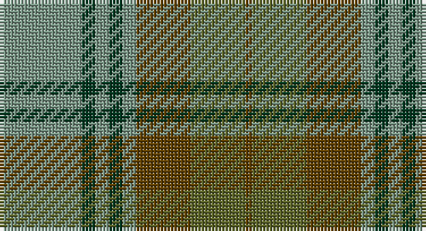

This page is one **sett** — a single exact thread-count. It belongs to the [tartan](/setts/yi12dg2yi2dg2yi2dy8y8dy1/)
(the same proportion at any scale), whose colour order is pattern [GGGGGGGG](/stripes/gggggggg/).

Part of the [Universal](/tartans/universal/) tartan — the named design grouping this sett with its other cloths.

Sourced from tartans-authority.  It is a [8 stripe tartan](/stripes/stripes8/).

Original link http://www.tartansauthority.com/tartan-ferret/display/136/

## Also known as

This cloth is also recorded under:

- Ancient Universal
- Universal Ancient
- Universal Ancient International
- Universal, Ancient

## Register references

External register numbers recorded for this tartan.

- Scottish Tartans Authority (ITI): 136

## Thread count
LG/24 DG4 LG4 DG4 LG4 T16 G16 T/2

One full sett is **122 threads**.

## Palette

Palette: <strong>Tartan Register</strong>
<table><thead><tr><th>Colour</th><th>Threads</th><th>Shade</th><th>Base</th><th>OKLCh</th></tr></thead><tbody><tr><td>LG/</td><td style="text-align:right;font-variant-numeric:tabular-nums">24</td><td><code style="background-color:#789484;">#789484</code> <small style="color:#888">#789484</small></td><td>G <code style="background-color:#006100;">#006100</code></td><td><small style="color:#888">oklch(64.0% 0.040 160.0)</small></td></tr><tr><td>DG</td><td style="text-align:right;font-variant-numeric:tabular-nums">4</td><td><code style="background-color:#003820;">#003820</code> <small style="color:#888">#003820</small></td><td>G <code style="background-color:#006100;">#006100</code></td><td><small style="color:#888">oklch(30.0% 0.070 158.3)</small></td></tr><tr><td>LG</td><td style="text-align:right;font-variant-numeric:tabular-nums">4</td><td><code style="background-color:#789484;">#789484</code> <small style="color:#888">#789484</small></td><td>G <code style="background-color:#006100;">#006100</code></td><td><small style="color:#888">oklch(64.0% 0.040 160.0)</small></td></tr><tr><td>DG</td><td style="text-align:right;font-variant-numeric:tabular-nums">4</td><td><code style="background-color:#003820;">#003820</code> <small style="color:#888">#003820</small></td><td>G <code style="background-color:#006100;">#006100</code></td><td><small style="color:#888">oklch(30.0% 0.070 158.3)</small></td></tr><tr><td>LG</td><td style="text-align:right;font-variant-numeric:tabular-nums">4</td><td><code style="background-color:#789484;">#789484</code> <small style="color:#888">#789484</small></td><td>G <code style="background-color:#006100;">#006100</code></td><td><small style="color:#888">oklch(64.0% 0.040 160.0)</small></td></tr><tr><td>T</td><td style="text-align:right;font-variant-numeric:tabular-nums">16</td><td><code style="background-color:#604000;">#604000</code> <small style="color:#888">#604000</small></td><td>G <code style="background-color:#006100;">#006100</code></td><td><small style="color:#888">oklch(39.8% 0.083 76.8)</small></td></tr><tr><td>G</td><td style="text-align:right;font-variant-numeric:tabular-nums">16</td><td><code style="background-color:#5C6428;">#5C6428</code> <small style="color:#888">#5C6428</small></td><td>G <code style="background-color:#006100;">#006100</code></td><td><small style="color:#888">oklch(48.3% 0.084 116.0)</small></td></tr><tr><td>T/</td><td style="text-align:right;font-variant-numeric:tabular-nums">2</td><td><code style="background-color:#604000;">#604000</code> <small style="color:#888">#604000</small></td><td>G <code style="background-color:#006100;">#006100</code></td><td><small style="color:#888">oklch(39.8% 0.083 76.8)</small></td></tr></tbody></table>

# Sample pattern

## Compared to the master

This cloth is one sett of its design; the master sett (the exemplar the design is anchored on) is below for comparison.

<figure style="margin:0"><figcaption style="color:#888;font-size:smaller">this sett</figcaption></figure>
<figure style="margin:0"><figcaption style="color:#888;font-size:smaller"><a href="/setts/t12dg2t2dg2t2dy8g8dy1/">master sett →</a></figcaption></figure>

## Nearest tartans

The nearest existing variants by ΔTartan distance, with this tartan at the top so the swatches line up against it.

ΔTartan

Tartan

Sett

—

<a href="/ttd/edit/#slug=yi12dg2yi2dg2yi2dy8y8dy1~x2">Ancient Universal (Fashion?)</a> <a class="nn-out" href="/variants/s8/yi12dg2yi2dg2yi2dy8y8dy1~x2/" title="open its dictionary page">↗</a>

0.96

<a href="/ttd/edit/#slug=t12gi2t2gi2t2dy8g8dy1~x2&amp;base=yi12dg2yi2dg2yi2dy8y8dy1~x2">Universal Ancient International Tartan</a> <a class="nn-out" href="/variants/s8/t12gi2t2gi2t2dy8g8dy1~x2/" title="open its dictionary page">↗</a>

1.13

<a href="/ttd/edit/#slug=t12g2t2g2t2o8gi8o1~x2&amp;base=yi12dg2yi2dg2yi2dy8y8dy1~x2">Universal, Ancient</a> <a class="nn-out" href="/variants/s8/t12g2t2g2t2o8gi8o1~x2/" title="open its dictionary page">↗</a>

1.14

<a href="/ttd/edit/#slug=dy28g2dy4db18g23db2g3lo4~x2&amp;base=yi12dg2yi2dg2yi2dy8y8dy1~x2">Eastern Western Motor Group, Dalbraith</a> <a class="nn-out" href="/variants/s8/dy28g2dy4db18g23db2g3lo4~x2/" title="open its dictionary page">↗</a>

1.24

<a href="/ttd/edit/#slug=db4o7ly3o12g15o5db20o5g4o2~x2&amp;base=yi12dg2yi2dg2yi2dy8y8dy1~x2">Tupper., Sir Charles..</a> <a class="nn-out" href="/variants/s10/db4o7ly3o12g15o5db20o5g4o2~x2/" title="open its dictionary page">↗</a>

1.25

<a href="/ttd/edit/#slug=g32o7g7o16db32ly3o8~x2&amp;base=yi12dg2yi2dg2yi2dy8y8dy1~x2">Strange Of Balcaskie</a> <a class="nn-out" href="/variants/s7/g32o7g7o16db32ly3o8~x2/" title="open its dictionary page">↗</a>

1.34

<a href="/ttd/edit/#slug=dt1dy1dt7dy5y7lr1~x4&amp;base=yi12dg2yi2dg2yi2dy8y8dy1~x2">Dewar (WCWM)</a> <a class="nn-out" href="/variants/s6/dt1dy1dt7dy5y7lr1~x4/" title="open its dictionary page">↗</a>

1.37

<a href="/ttd/edit/#slug=g4r1db2r1g10y5r3y10ly1~x4&amp;base=yi12dg2yi2dg2yi2dy8y8dy1~x2">Moncton, City of</a> <a class="nn-out" href="/variants/s9/g4r1db2r1g10y5r3y10ly1~x4/" title="open its dictionary page">↗</a>

1.37

<a href="/ttd/edit/#slug=g5k2g28k10dy26db4g4~x2&amp;base=yi12dg2yi2dg2yi2dy8y8dy1~x2">John Telfar Dunbar/Hunting Tartan</a> <a class="nn-out" href="/variants/s7/g5k2g28k10dy26db4g4~x2/" title="open its dictionary page">↗</a>

1.40

<a href="/ttd/edit/#slug=t32r3t3r3t3r10g24ri3~x2&amp;base=yi12dg2yi2dg2yi2dy8y8dy1~x2">Gammell (Personal)</a> <a class="nn-out" href="/variants/s8/t32r3t3r3t3r10g24ri3~x2/" title="open its dictionary page">↗</a>

1.40

<a href="/ttd/edit/#slug=t12dg2t2dg2t2dy8g8dy1~x2&amp;base=yi12dg2yi2dg2yi2dy8y8dy1~x2">Universal Ancient</a> <a class="nn-out" href="/variants/s8/t12dg2t2dg2t2dy8g8dy1~x2/" title="open its dictionary page">↗</a>

## Neighbour map

Every grey dot is one of 14360 variants placed by the first two principal components of the ΔTartan feature space (44% of its variance). Red is this tartan; blue dots are its nearest — click one to open its page.

<svg viewBox="0 0 640 380" role="img" style="max-width:100%;height:auto;border:1px solid #e0e0e0;border-radius:4px;display:block" xmlns="http://www.w3.org/2000/svg"><image href="/nn/cloud.v1.png" width="640" height="380"/><a href="/variants/s8/t12gi2t2gi2t2dy8g8dy1~x2/"><circle cx="264.9" cy="222.1" r="4" fill="#3465a4"><title>Universal Ancient International Tartan</title></circle></a><a href="/variants/s8/t12g2t2g2t2o8gi8o1~x2/"><circle cx="290.1" cy="235.2" r="4" fill="#3465a4"><title>Universal, Ancient</title></circle></a><a href="/variants/s8/dy28g2dy4db18g23db2g3lo4~x2/"><circle cx="289.5" cy="219.4" r="4" fill="#3465a4"><title>Eastern Western Motor Group, Dalbraith</title></circle></a><a href="/variants/s10/db4o7ly3o12g15o5db20o5g4o2~x2/"><circle cx="241.9" cy="224.5" r="4" fill="#3465a4"><title>Tupper., Sir Charles..</title></circle></a><a href="/variants/s7/g32o7g7o16db32ly3o8~x2/"><circle cx="237.9" cy="236.3" r="4" fill="#3465a4"><title>Strange Of Balcaskie</title></circle></a><a href="/variants/s6/dt1dy1dt7dy5y7lr1~x4/"><circle cx="256.3" cy="273.3" r="4" fill="#3465a4"><title>Dewar (WCWM)</title></circle></a><a href="/variants/s9/g4r1db2r1g10y5r3y10ly1~x4/"><circle cx="256.7" cy="209.1" r="4" fill="#3465a4"><title>Moncton, City of</title></circle></a><a href="/variants/s7/g5k2g28k10dy26db4g4~x2/"><circle cx="333.4" cy="234.6" r="4" fill="#3465a4"><title>John Telfar Dunbar/Hunting Tartan</title></circle></a><a href="/variants/s8/t32r3t3r3t3r10g24ri3~x2/"><circle cx="303.4" cy="202.2" r="4" fill="#3465a4"><title>Gammell (Personal)</title></circle></a><a href="/variants/s8/t12dg2t2dg2t2dy8g8dy1~x2/"><circle cx="254.5" cy="219.5" r="4" fill="#3465a4"><title>Universal Ancient</title></circle></a><circle cx="283.4" cy="227.7" r="5" fill="#c00000"/></svg>

ID: /variants/s8/yi12dg2yi2dg2yi2dy8y8dy1~x2/
