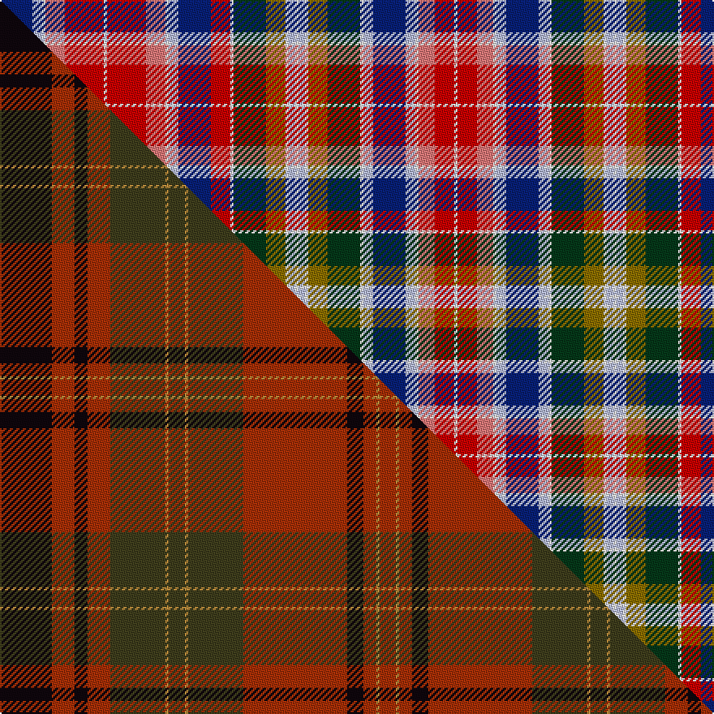

This is one **variant** — a specific cloth: this exact thread count and colourway, with its own
provenance below. It is one weaving of the [sett](/tartans/d/du/duke-of-perth-1739/) (the scale-free proportion — the
same cloth at any scale or shade), whose colour order is pattern [BWWRRWRRWWBRWGGWWWWWGGWWBWWRRWRRWWBWWGGWWWWWGGWRBWWRRWRRWWBRRWGGWWWWWGGWWBWWRRWRRW](/stripes/bwwrrwrrwwbrwggwwwwwggwwbwwrrwrrwwbwwggwwwwwggwrbwwrrwrrwwbrrwggwwwwwggwwbwwrrwrrw/).

Part of the [Duke of Perth 1739](/tartans/d/du/duke-of-perth-1739/) tartan — the named design grouping this sett with its other cloths.

Sourced from register-of-tartans.  It is a [82 stripe tartan](/stripes/stripes82/).

> ⚠ **This record is withdrawn** — kept as a historical reading, not a current registration.

Original link [https://www.tartanregister.gov.uk/tartanDetails.aspx?ref=4414](https://www.tartanregister.gov.uk/tartanDetails.aspx?ref=4414)

## Provenance

SRT 4414 has been withdrawn from the Scottish Register of Tartans. The reading — from James Cant's thread-count book (98 colour changes) — is one of several attempts to size the plaid in Domenico Duprà's 1739 portrait of Lord John Drummond; it is kept as a historical reading under the Duke of Perth 1739 tartan.

Dataset <small>— provenance for this record, inherited from the source manifest</small>

<dl class="dataset-prov">
<dt>source</dt><dd><a href="/sources/register-of-tartans/">Scottish Register of Tartans</a></dd>
<dt>data captured from</dt><dd><a href="https://github.com/thetartan/tartan-database/blob/master/data/register-of-tartans/data.csv">https://github.com/thetartan/tartan-database/blob/master/data/register-of-tartans/data.csv</a></dd>
<dt>data date</dt><dd>1799 <small>(this record)</small></dd>
<dt>licence</dt><dd><a href="https://www.tartanregister.gov.uk/copyright">Crown copyright</a></dd>
</dl>

Capture chain <small>— the hands this data passed through, oldest first; each capture carries its own licence</small>

<ol class="capture-chain">
<li><a href="https://www.tartanregister.gov.uk/">Scottish Register of Tartans</a> · <a href="https://www.tartanregister.gov.uk/copyright">Crown copyright</a> <small>the living register — still published by National Records of Scotland</small></li>
<li><a href="https://github.com/thetartan/tartan-database">thetartan/tartan-database</a> <small>2016-2017</small> · <a href="https://creativecommons.org/licenses/by-nc-nd/4.0/">CC BY-NC-ND 4.0</a> <small>Levko Kravets's frozen compilation — the capture we vendored, and where its CC licence text came from</small></li>
<li>this dictionary <small>captured 2026-06-10 · commit 5bf86c7566</small> <small>each re-capture is a git commit to data/sources</small></li>
</ol>

## Register references

External register numbers recorded for this tartan.

- Scottish Register of Tartans: [4414](https://www.tartanregister.gov.uk/tartanDetails.aspx?ref=4414)
- Scottish Tartans Authority (ITI): 5724

## Thread count
DB/20 LB6 W2 Ri12 R24 W2 R24 Ri12 W2 LB6 DB20 R12 W2 DG20 Y12 W2 LB4 W2 LB4 W2 Y12 DG20 W2 LB6 DB20 LB6 W2 Ri10 R12 W2 R12 Ri10 W2 LB6 DB20 LB6 W2 DG20 Y12 W2 LB4 W2 LB4 W2 Y12 DG20 W2 R12 DB20 LB6 W2 Ri12 R24 W2 R24 Ri12 W2 LB6 DB20 R12 Ri10 W2 DG20 Y12 W2 LB4 W2 LB4 W2 Y12 DG20 W2 LB6 DB20 LB6 W2 Ri10 R12 W2 R12 Ri10 W/2

One full sett is **1474 threads**.

## Palette
<table><thead><tr><th>Colour</th><th>Shade</th><th>OKLCh</th></tr></thead><tbody><tr><td>LB</td><td><code style="background-color:#B5BBDE;">#B5BBDE</code> <small style="color:#888">#B5BBDE</small></td><td><small style="color:#888">oklch(79.9% 0.050 277.6)</small></td></tr><tr><td>DB</td><td><code style="background-color:#082077;">#082077</code> <small style="color:#888">#082077</small></td><td><small style="color:#888">oklch(30.0% 0.149 265.1)</small></td></tr><tr><td>DG</td><td><code style="background-color:#053819;">#053819</code> <small style="color:#888">#053819</small></td><td><small style="color:#888">oklch(30.0% 0.075 151.3)</small></td></tr><tr><td>W</td><td><code style="background-color:#F7F7F7;">#F7F7F7</code> <small style="color:#888">#F7F7F7</small></td><td><small style="color:#888">oklch(97.6% 0.000 89.9)</small></td></tr><tr><td>R</td><td><code style="background-color:#E87878;">#E87878</code> <small style="color:#888">#E87878</small></td><td><small style="color:#888">oklch(70.0% 0.139 21.2)</small></td></tr><tr><td>R</td><td><code style="background-color:#C80000;">#C80000</code> <small style="color:#888">#C80000</small></td><td><small style="color:#888">oklch(52.3% 0.215 29.2)</small></td></tr><tr><td>Y</td><td><code style="background-color:#8B6E00;">#8B6E00</code> <small style="color:#888">#8B6E00</small></td><td><small style="color:#888">oklch(55.1% 0.113 90.4)</small></td></tr></tbody></table>

# Sample pattern

## Compared to the master

This cloth is one sett of its design; the master sett (the exemplar the design is anchored on) is below for comparison.

Its **ΔTartan distance** from the master is **12.76** — the same measure the nearest-tartans table ranks by (0 is identical; a re-scale of the same cloth is near 0, a recolour or a different proportion further).

<figure class="master-compare" style="margin:0">

this sett
master sett ★

<figcaption style="color:#888;font-size:smaller">One weave of this sett against the <a href="/setts/k16r7k4r7dg17ly1dg5ly1dg17r32k5r4ly1r5/">master sett ★</a>, split on the diagonal: a shared proportion runs seamlessly across it with only the shades shifting; a different proportion breaks on it.</figcaption>
</figure>

## Nearest tartan variants

The nearest existing variants by ΔTartan distance, with this cloth at the top so the swatches line up against it.

ΔTartan

Threads

Variant

Sett

—

1474

<a href="/variants/s82/db10lb3w1ri6r12w1r12ri6w1lb3db10r6w1dg10y6w1lb2w1lb2w1y6dg10w1lb3db10lb3w1ri5r6w1r6ri5w1lb3db10lb3w1dg10y6w1lb2w1lb2w1y6dg10w1r6db10lb3w1ri6r12w1r12ri6w1lb3db10r6ri5w1dg10y6w1lb2w1lb2w1y6dg10w1lb3db10-h7a0400a6fa8b0740/">Unnamed C18th - Cant Counts</a>

2.36

—

<a href="/variants/s81/r11w1ri4w1r11ri2w1y2dp6w1dp6y2w2dg6g2ly2w1ly2g2dg6w2ri2r11w1ri4w1r11ri2w2dg6g2ly2w1ly2g2dg6w2y2dp6w1dp6y2w1ri2r11w1ri4w1r11ri2w2y2dp6w1dp6y2w2dg10g4w2g4dg10w2g4ly4w1dp5w1ly4g4w2dp11y4w2y4dp11w2ri2r11w-he5ea0b16df2f69d5/">Waggrall</a>

<a href="/ttd/edit/#slug=ri4w1r11ri2w2dp11lb4w2lb4dp11w2g4dy4w1dp5w1dy4g4w2dg10g4w2g4dg10w2lb2dp6w1dp6lb2w2ri2r11w1ri4w1r11ri2w2lb2dp6w1dp6lb2w2dg6g2dy2w1dy2g2dg6w2ri2r11w1ri4~x2~ri5321009-r5221030&amp;base=db10lb3w1ri6r12w1r12ri6w1lb3db10r6w1dg10y6w1lb2w1lb2w1y6dg10w1lb3db10lb3w1ri5r6w1r6ri5w1lb3db10lb3w1dg10y6w1lb2w1lb2w1y6dg10w1r6db10lb3w1ri6r12w1r12ri6w1lb3db10r6ri5w1dg10y6w1lb2w1lb2w1y6dg10w1lb3db10lb3w1ri5r6w1r6ri5w1~x2~ri6914021-r5221030" title="compare in the TTD">2.52</a>

880

<a href="/variants/s57/ri4w1r11ri2w2dp11lb4w2lb4dp11w2g4dy4w1dp5w1dy4g4w2dg10g4w2g4dg10w2lb2dp6w1dp6lb2w2ri2r11w1ri4w1r11ri2w2lb2dp6w1dp6lb2w2dg6g2dy2w1dy2g2dg6w2ri2r11w1ri4~x2~ri5321009-r5221030/">Waggrall (Clan)</a>

2.74

—

<a href="/variants/s66/r30ri4y6ly4ri4r16w2ri4w2ly4db18y6lyi3w2ly4w2lyi3y6db18ly4w2ri4r12y2r12ri3w2g10w2g2lyi4g2w2y8w4y8w2g2lyi4g2w2g10w2ri4r12y2r12ri4w2g10ly4w4ly4g10w2y6w2db12w2db12w2y6w2ri4r12w2~x2~r5221021-ri6016021-y630-h0e1733fd1d4be6ab/">Hunter (1775)</a>

3.04

—

<a href="/variants/s66/r30ri4y6ly4ri4r16lr2ri4lr2ly4db18y6lyi3lr2ly4lr2lyi3y6db18ly4lr2ri4r12y2r12ri3lr2g10lr2g2lyi4g2lr2y8lr4y8lr2g2lyi4g2lr2g10lr2ri4r12y2r12ri4lr2g10ly4lr4ly4g10lr2y6lr2db12lr2db12lr2y6lr2ri4r12lr2~x2~r52-h98e0c2446f3fc129/">Hunter Portrait/Artefact Tartan</a>

3.53

—

<a href="/variants/s81/ri14w3ri4w3ri14w2r4db2w2db2r4w2dbi3dg2w2dg2dbi3w2ri10w3ri10w2dbi3dg2w2dg2dbi3w2r4db2w2db2r4w2ri14w3ri4w3ri14w2r4db2w2db2r4w2dbi11dg4w2dg4dbi11w2dg4w2r4w2dg4w2r9db4w2db4r9w2ri11w2ri11w2r9db4w2db4r9w2dg-h1bbecf30173bc2e4/">Unidentified Cant #04</a>

## Neighbour map

Every grey dot is one of 13662 variants placed by the first two principal components of the ΔTartan feature space (42% of its variance). Red is this tartan; blue dots are its nearest — click one to open its page. The map is a flat projection of a many-dimensional space — [how to read it](/posts/neighbourhood-maps/).

<svg viewBox="0 0 640 380" role="img" style="max-width:100%;height:auto;border:1px solid #e0e0e0;border-radius:4px;display:block" xmlns="http://www.w3.org/2000/svg"><image href="/nn/cloud.v1.png" width="640" height="380"/><a href="/variants/s81/r11w1ri4w1r11ri2w1y2dp6w1dp6y2w2dg6g2ly2w1ly2g2dg6w2ri2r11w1ri4w1r11ri2w2dg6g2ly2w1ly2g2dg6w2y2dp6w1dp6y2w1ri2r11w1ri4w1r11ri2w2y2dp6w1dp6y2w2dg10g4w2g4dg10w2g4ly4w1dp5w1ly4g4w2dp11y4w2y4dp11w2ri2r11w-he5ea0b16df2f69d5/"><circle cx="14.0" cy="52.2" r="4" fill="#3465a4"><title>Waggrall</title></circle></a><a href="/variants/s57/ri4w1r11ri2w2dp11lb4w2lb4dp11w2g4dy4w1dp5w1dy4g4w2dg10g4w2g4dg10w2lb2dp6w1dp6lb2w2ri2r11w1ri4w1r11ri2w2lb2dp6w1dp6lb2w2dg6g2dy2w1dy2g2dg6w2ri2r11w1ri4~x2~ri5321009-r5221030/"><circle cx="14.0" cy="67.6" r="4" fill="#3465a4"><title>Waggrall (Clan)</title></circle></a><a href="/variants/s66/r30ri4y6ly4ri4r16w2ri4w2ly4db18y6lyi3w2ly4w2lyi3y6db18ly4w2ri4r12y2r12ri3w2g10w2g2lyi4g2w2y8w4y8w2g2lyi4g2w2g10w2ri4r12y2r12ri4w2g10ly4w4ly4g10w2y6w2db12w2db12w2y6w2ri4r12w2~x2~r5221021-ri6016021-y630-h0e1733fd1d4be6ab/"><circle cx="20.7" cy="44.4" r="4" fill="#3465a4"><title>Hunter (1775)</title></circle></a><a href="/variants/s66/r30ri4y6ly4ri4r16lr2ri4lr2ly4db18y6lyi3lr2ly4lr2lyi3y6db18ly4lr2ri4r12y2r12ri3lr2g10lr2g2lyi4g2lr2y8lr4y8lr2g2lyi4g2lr2g10lr2ri4r12y2r12ri4lr2g10ly4lr4ly4g10lr2y6lr2db12lr2db12lr2y6lr2ri4r12lr2~x2~r52-h98e0c2446f3fc129/"><circle cx="40.6" cy="49.6" r="4" fill="#3465a4"><title>Hunter Portrait/Artefact Tartan</title></circle></a><a href="/variants/s81/ri14w3ri4w3ri14w2r4db2w2db2r4w2dbi3dg2w2dg2dbi3w2ri10w3ri10w2dbi3dg2w2dg2dbi3w2r4db2w2db2r4w2ri14w3ri4w3ri14w2r4db2w2db2r4w2dbi11dg4w2dg4dbi11w2dg4w2r4w2dg4w2r9db4w2db4r9w2ri11w2ri11w2r9db4w2db4r9w2dg-h1bbecf30173bc2e4/"><circle cx="38.3" cy="95.3" r="4" fill="#3465a4"><title>Unidentified Cant #04</title></circle></a><circle cx="14.0" cy="67.2" r="5" fill="#c00000"/><text x="320" y="376" text-anchor="middle" font-size="11" fill="#999">ground</text><text x="11" y="190" text-anchor="middle" font-size="11" fill="#999" transform="rotate(-90 11 190)">complexity</text></svg>

ID: /variants/s82/db10lb3w1ri6r12w1r12ri6w1lb3db10r6w1dg10y6w1lb2w1lb2w1y6dg10w1lb3db10lb3w1ri5r6w1r6ri5w1lb3db10lb3w1dg10y6w1lb2w1lb2w1y6dg10w1r6db10lb3w1ri6r12w1r12ri6w1lb3db10r6ri5w1dg10y6w1lb2w1lb2w1y6dg10w1lb3db10-h7a0400a6fa8b0740/
